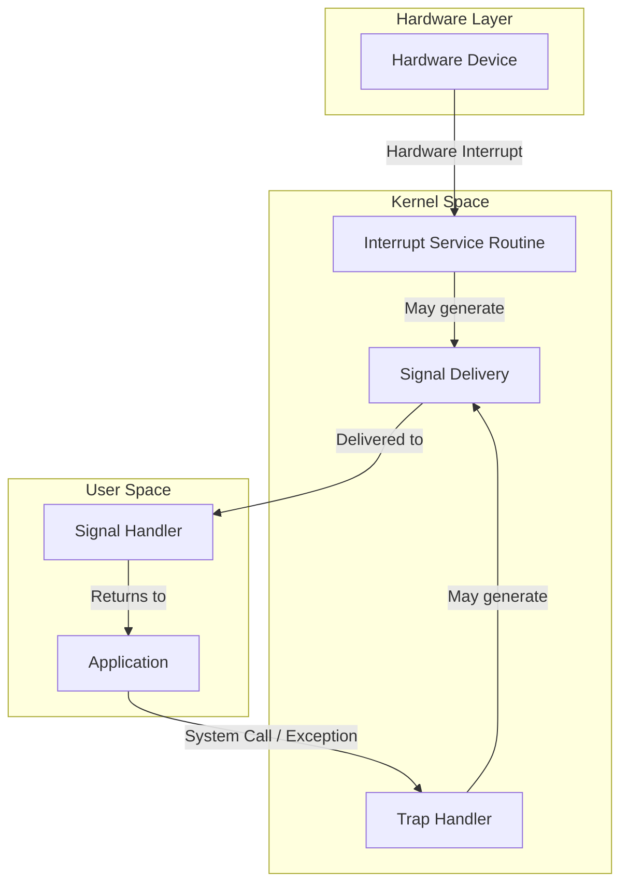
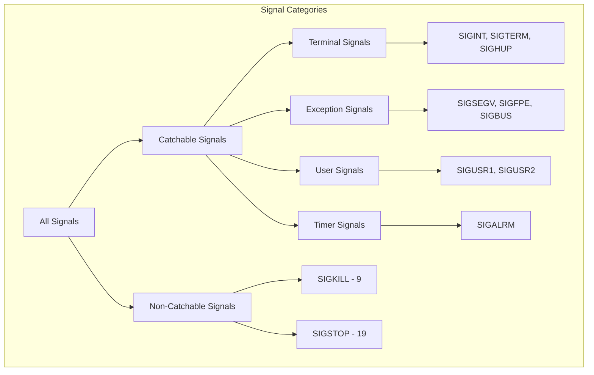
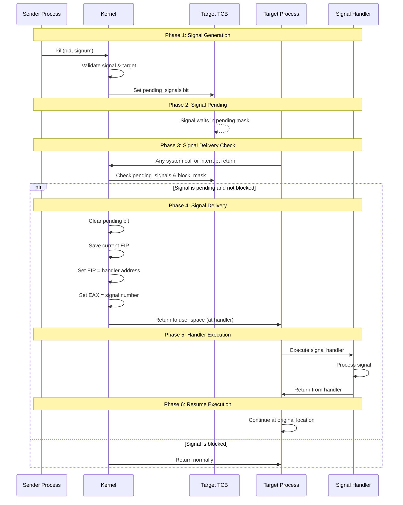
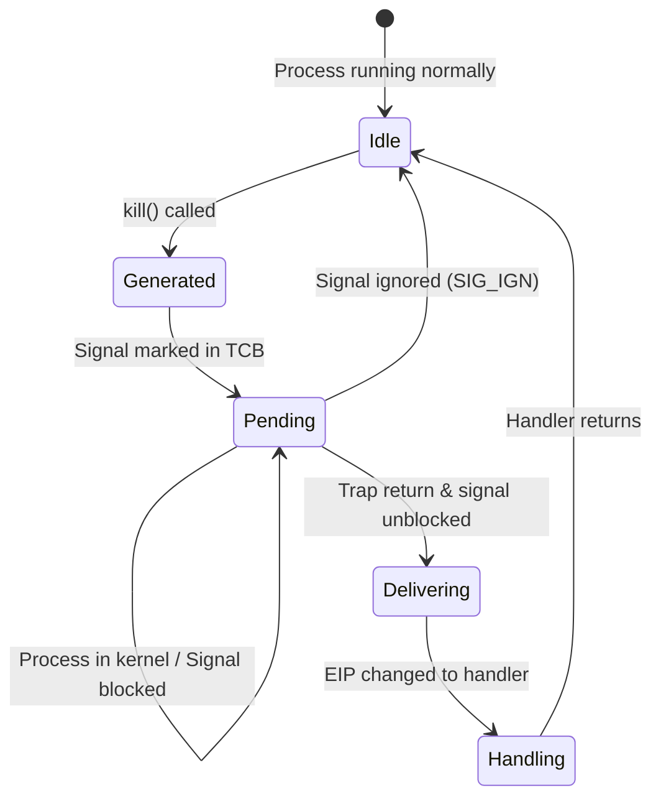

# POSIX Signals Fundamentals

## Table of Contents
1. [What is a Signal?](#what-is-a-signal)
2. [Signals vs Interrupts vs Traps](#signals-vs-interrupts-vs-traps)
3. [Signal Types and Categories](#signal-types-and-categories)
4. [Signal Lifecycle](#signal-lifecycle)

---

## What is a Signal?

A **signal** is a software mechanism for inter-process communication (IPC) in POSIX-compliant operating systems. It allows the kernel to notify a process that a specific event has occurred. Think of signals as **asynchronous notifications** - they can arrive at any time during program execution.

### Key Characteristics

| Property | Description |
|----------|-------------|
| **Asynchronous** | Signals can arrive at any point during program execution |
| **Limited Information** | A signal carries only a signal number (and optionally some metadata) |
| **Predefined Set** | POSIX defines a standard set of signals (1-31 for standard signals) |
| **Customizable Response** | Processes can define custom handlers for most signals |
| **Kernel-Mediated** | The kernel is responsible for signal delivery |

### Real-World Analogy

Think of signals like phone notifications:
- You're working on something (running your program)
- A notification arrives (signal is delivered)
- You can ignore it, handle it with a default action, or take a custom action
- After handling, you resume what you were doing

---

## Signals vs Interrupts vs Traps

These three mechanisms are often confused but serve different purposes:



### Detailed Comparison

| Aspect | Interrupt | Trap | Signal |
|--------|-----------|------|--------|
| **Origin** | Hardware device | Software (intentional or exception) | Kernel to process |
| **Trigger** | External hardware event | CPU instruction or exception | `kill()` syscall, kernel event |
| **Handler Location** | Kernel space only | Kernel space | User space (signal handler) |
| **Synchronous?** | Asynchronous | Synchronous | Asynchronous |
| **Target** | CPU/Kernel | Kernel | Specific process |
| **Example** | Timer tick, keyboard press | `int 0x80` (syscall), division by zero | SIGINT, SIGKILL |

### Interrupt (Hardware Interrupt)

**What**: External hardware devices notify the CPU that they need attention.

**How it works in mCertikOS**:
```
1. Hardware device (timer, keyboard) signals the CPU via interrupt line
2. CPU saves current state and jumps to IDT entry
3. Kernel's Interrupt Service Routine (ISR) handles the event
4. ISR calls intr_eoi() to acknowledge the interrupt
5. CPU resumes previous execution
```

**In the codebase**: See [kern/trap/TTrapHandler/TTrapHandler.c](../kern/trap/TTrapHandler/TTrapHandler.c) - `interrupt_handler()` function.

### Trap (Software Interrupt / Exception)

**What**: CPU-generated events caused by executing instructions.

**Types**:
1. **Intentional Traps**: System calls (`int 0x30` in mCertikOS)
2. **Exceptions**: Page faults, division by zero, invalid instructions

**How it works**:
```
1. CPU executes an instruction that causes a trap
2. CPU pushes state onto kernel stack (EIP, CS, EFLAGS, ESP, SS)
3. CPU jumps to appropriate IDT entry
4. Kernel handles the trap
5. Kernel returns to user space (possibly at a different location)
```

**In the codebase**: System call trap number is `T_SYSCALL = 48`.

### Signal (Software Signal)

**What**: Kernel-to-process notification mechanism.

**How it works**:
```
1. Signal is generated (by kernel, another process, or self)
2. Signal is marked as "pending" in target process's TCB
3. Before returning to user space, kernel checks for pending signals
4. If pending signal exists and not blocked:
   a. Kernel modifies user's execution context
   b. User resumes execution at signal handler (not original location)
5. After handler returns, execution resumes at original location
```

---

## Signal Types and Categories

### Standard POSIX Signals in mCertikOS

The implementation defines signals in [kern/lib/signal.h](../kern/lib/signal.h):

```c
#define NSIG 32  // Maximum number of signals

// Signal numbers (POSIX standard)
#define SIGHUP    1   // Hangup
#define SIGINT    2   // Interrupt (Ctrl+C)
#define SIGQUIT   3   // Quit (Ctrl+\)
#define SIGILL    4   // Illegal instruction
#define SIGTRAP   5   // Trace/breakpoint trap
#define SIGABRT   6   // Abort
#define SIGBUS    7   // Bus error
#define SIGFPE    8   // Floating-point exception
#define SIGKILL   9   // Kill (cannot be caught or ignored)
#define SIGUSR1   10  // User-defined signal 1
#define SIGSEGV   11  // Segmentation fault
#define SIGUSR2   12  // User-defined signal 2
#define SIGPIPE   13  // Broken pipe
#define SIGALRM   14  // Alarm clock
#define SIGTERM   15  // Termination
#define SIGCHLD   17  // Child status changed
#define SIGCONT   18  // Continue if stopped
#define SIGSTOP   19  // Stop (cannot be caught or ignored)
#define SIGTSTP   20  // Terminal stop (Ctrl+Z)
```

### Signal Categories



### Focus Signals for This Implementation

| Signal | Number | Default Action | Description | Catchable? |
|--------|--------|----------------|-------------|------------|
| **SIGKILL** | 9 | Terminate | Force kill process | ❌ No |
| **SIGINT** | 2 | Terminate | Interrupt from terminal (Ctrl+C) | ✅ Yes |
| **SIGSEGV** | 11 | Terminate + Core | Segmentation violation | ✅ Yes |
| **SIGALRM** | 14 | Terminate | Timer alarm | ✅ Yes |

---

## Signal Lifecycle

The complete lifecycle of a signal from generation to handling:



### State Machine



### Key Data Structures

The signal state is stored per-thread in the TCB:

```c
struct sig_state {
    struct sigaction sigactions[NSIG];  // Array of handlers for each signal
    uint32_t pending_signals;           // Bitmask of pending signals
    int signal_block_mask;              // Bitmask of blocked signals
};
```

Each `sigaction` structure defines how to handle a specific signal:

```c
struct sigaction {
    sighandler_t sa_handler;           // Handler function pointer
    void (*sa_sigaction)(int, void*, void*);  // Extended handler (with siginfo)
    int sa_flags;                      // Behavior flags
    void (*sa_restorer)(void);         // Restorer function (for returning)
    uint32_t sa_mask;                  // Signals to block during handler
};
```

---

## Summary

| Concept | Key Point |
|---------|-----------|
| **Signal** | Asynchronous notification from kernel to process |
| **vs Interrupt** | Interrupts are hardware-to-kernel; signals are kernel-to-process |
| **vs Trap** | Traps are synchronous CPU events; signals are asynchronous |
| **Pending** | A signal waiting to be delivered |
| **Blocked** | A signal that won't be delivered until unblocked |
| **Handler** | User-defined function executed when signal is delivered |

---

**Next**: [02_signal_architecture.md](02_signal_architecture.md) - Deep dive into the mCertikOS signal architecture
