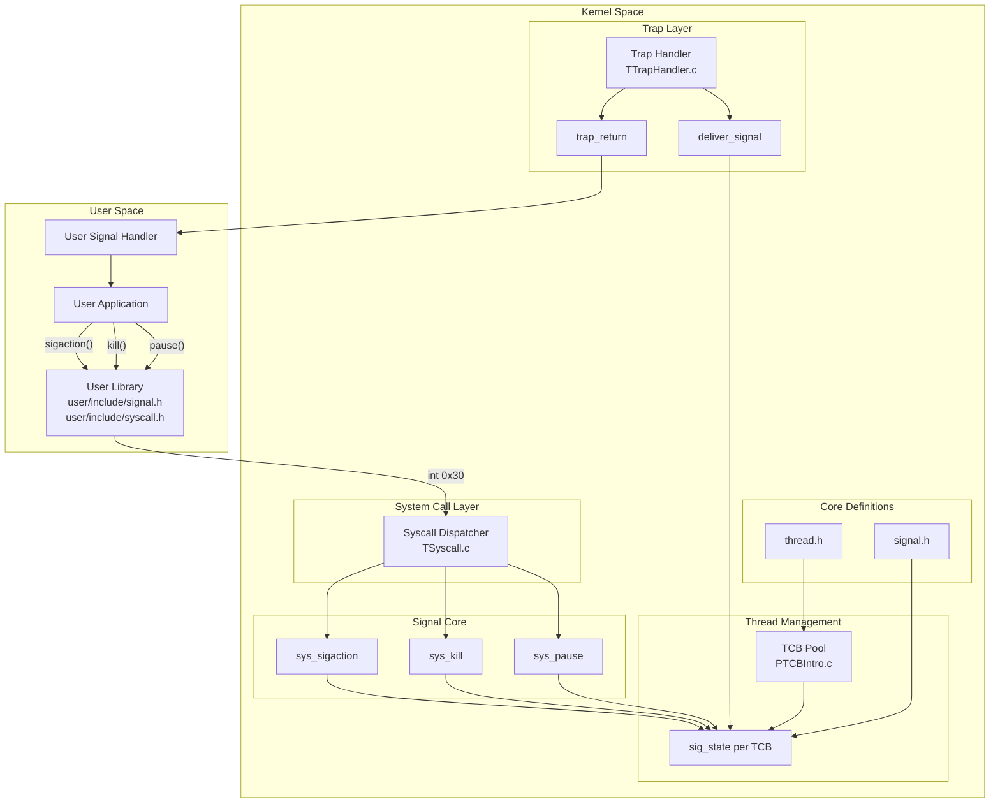
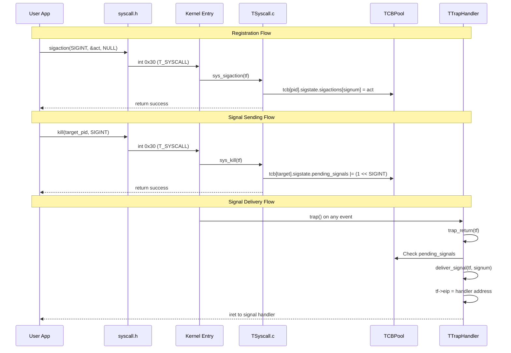
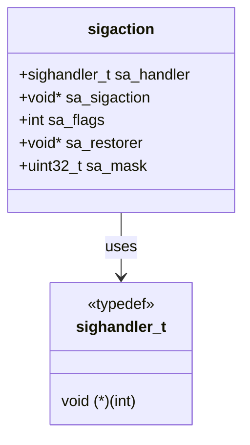
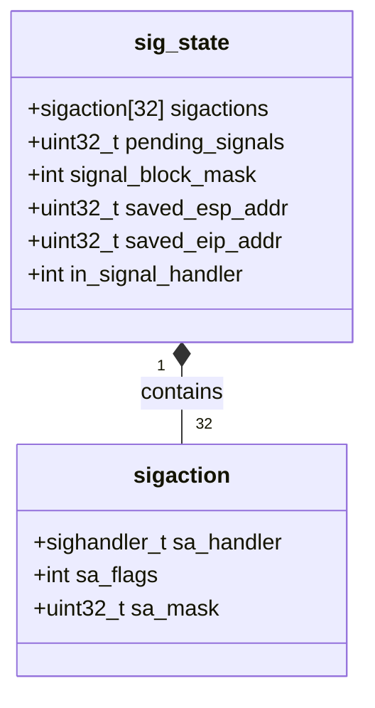
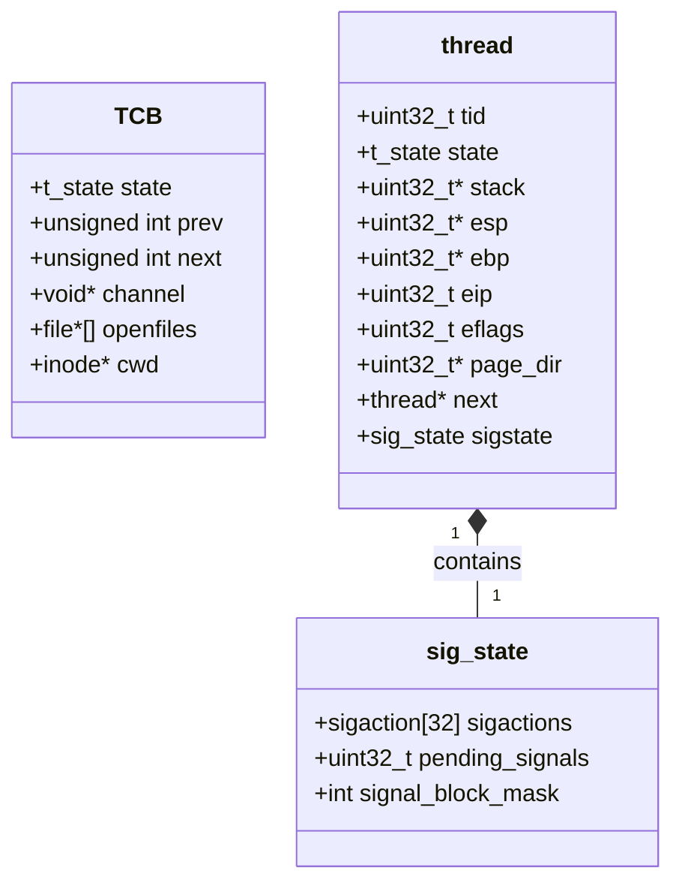
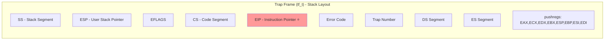
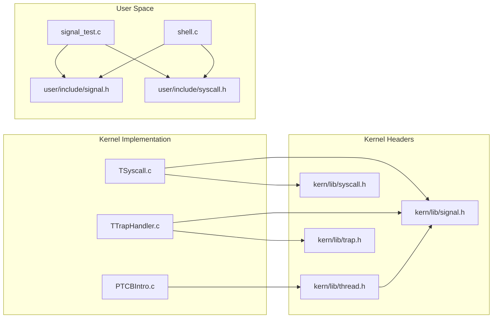
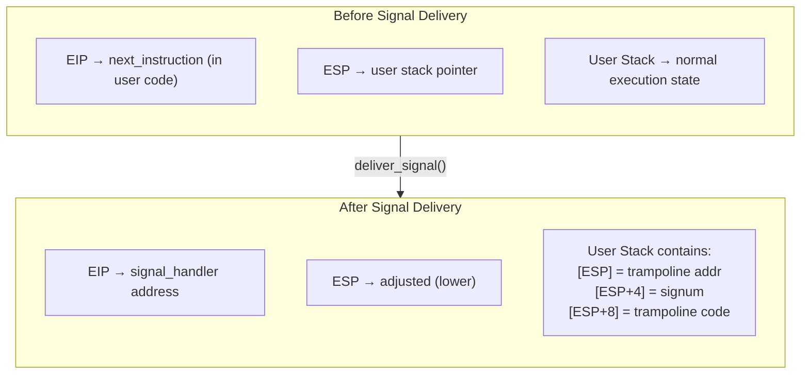

# Signal Architecture in mCertikOS

## Table of Contents
1. [System Overview](#system-overview)
2. [Component Architecture](#component-architecture)
3. [Data Structures](#data-structures)
4. [File Organization](#file-organization)
5. [Memory Layout](#memory-layout)

---

## System Overview

The mCertikOS signal implementation follows a layered architecture that cleanly separates user-space interfaces from kernel implementation.



---

## Component Architecture

### Layer Responsibilities

| Layer | Component | Responsibility |
|-------|-----------|----------------|
| **User Space** | Application | Registers handlers, sends signals |
| **User Space** | signal.h | Defines signal constants and structures |
| **User Space** | syscall.h | Provides syscall wrappers |
| **Kernel** | TSyscall.c | Handles signal-related system calls |
| **Kernel** | TTrapHandler.c | Delivers signals on trap return |
| **Kernel** | PTCBIntro.c | Manages per-thread signal state |
| **Kernel** | signal.h | Kernel signal definitions |
| **Kernel** | thread.h | Thread structure with signal state |

### Detailed Component Interaction



---

## Data Structures

### Core Signal Structures

#### `struct sigaction` (Signal Action)

Defines how a specific signal should be handled:

```c
struct sigaction {
    sighandler_t sa_handler;           // Pointer to handler function
    void (*sa_sigaction)(int, void*, void*);  // Extended handler (unused)
    int sa_flags;                      // Behavior flags
    void (*sa_restorer)(void);         // For stack restoration (unused)
    uint32_t sa_mask;                  // Signals blocked during handler
};
```



#### `struct sig_state` (Per-Thread Signal State)

Each thread maintains its own signal state:

```c
struct sig_state {
    struct sigaction sigactions[NSIG];  // 32 slots for signal handlers
    uint32_t pending_signals;           // Bitmask: bit N = signal N pending
    int signal_block_mask;              // Bitmask: bit N = signal N blocked

    // Context saved during signal delivery (for sigreturn)
    uint32_t saved_esp_addr;            // Original ESP before handler
    uint32_t saved_eip_addr;            // Original EIP (return point)
    int in_signal_handler;              // Non-zero if currently handling
};
```

> **Implementation Note**: The `saved_esp_addr`, `saved_eip_addr`, and `in_signal_handler` fields were added to support the sigreturn mechanism. See [10_implementation_debug_log.md](10_implementation_debug_log.md) for details.



#### Bitmask Operations

The `pending_signals` and `signal_block_mask` use bitmask operations:

```
Signal Number:  1   2   3   4   5   6   7   8   9  10  11  ... 31
Bit Position:   1   2   3   4   5   6   7   8   9  10  11  ... 31

pending_signals = 0b00000000000000000000010000000100
                                          ^         ^
                                          |         |
                                     SIGUSR1(10)  SIGINT(2)

Operations:
- Set pending:    pending_signals |= (1 << signum)
- Clear pending:  pending_signals &= ~(1 << signum)
- Check pending:  pending_signals & (1 << signum)
```

### Thread Control Block (TCB)

The TCB is extended to include signal state:

```c
// In kern/thread/PTCBIntro/PTCBIntro.c
struct TCB {
    t_state state;           // Thread state (READY, RUN, SLEEP, DEAD)
    unsigned int prev;       // Previous TCB in list
    unsigned int next;       // Next TCB in list
    void *channel;           // Sleep channel
    struct file *openfiles[NOFILE];  // Open files
    struct inode *cwd;       // Current working directory
    // Signal state would be added here (currently defined separately)
};
```



### Trap Frame Structure

When a trap occurs, the CPU saves state in this structure:

```c
typedef struct tf_t {
    pushregs regs;           // General purpose registers
    uint16_t es, ds;         // Segment registers
    uint32_t trapno;         // Trap number
    uint32_t err;            // Error code
    uintptr_t eip;           // Instruction pointer (KEY for signal delivery)
    uint16_t cs;             // Code segment
    uint32_t eflags;         // Flags register
    uintptr_t esp;           // Stack pointer
    uint16_t ss;             // Stack segment
} tf_t;
```



The **EIP** field is critical for signal delivery - by modifying it, the kernel redirects execution to the signal handler.

---

## File Organization

### Kernel Signal Files

```
kern/
├── lib/
│   ├── signal.h          # Signal constants, structures, flags
│   ├── thread.h          # Thread structure with sig_state
│   ├── syscall.h         # Syscall numbers (SYS_sigaction, SYS_kill, SYS_pause)
│   └── trap.h            # Trap frame definition
├── trap/
│   ├── TSyscall/
│   │   └── TSyscall.c    # sys_sigaction, sys_kill, sys_pause implementations
│   └── TTrapHandler/
│       └── TTrapHandler.c # deliver_signal, trap_return
└── thread/
    └── PTCBIntro/
        └── PTCBIntro.c   # TCB pool management
```

### User Space Signal Files

```
user/
├── include/
│   ├── signal.h          # User-visible signal definitions
│   └── syscall.h         # Syscall wrappers (inline assembly)
├── signal_test.c         # Signal test program
└── shell/
    └── shell.c           # kill and trap commands
```

### Dependency Graph



---

## Memory Layout

### Signal Handler Execution Context

When a signal is delivered, the execution context changes:



> **Note**: The signal number is passed on the stack as the handler's first argument (cdecl convention), not in EAX.

### Address Space Layout

```
+---------------------------+ 0xFFFFFFFF
|    Kernel Space          |
|    (not accessible)      |
+---------------------------+ 0xF0000000 (VM_USERHI)
|                          |
|    User Stack            |
|    (grows down)          |
|         ↓                |
+---------------------------+
|                          |
|    (unmapped space)      |
|                          |
+---------------------------+
|         ↑                |
|    User Heap             |
|    (grows up)            |
+---------------------------+
|    User Data (.data)     |
+---------------------------+
|    User Code (.text)     |
|    - main()              |
|    - signal_handler()    | ← Handler must be in user space
+---------------------------+ 0x40000000 (VM_USERLO)
|    (not accessible)      |
+---------------------------+ 0x00000000
```

### Signal State in TCB Pool

```
TCBPool Array (NUM_IDS entries)
+--------+--------+--------+--------+--------+
| TCB[0] | TCB[1] | TCB[2] | TCB[3] | ...    |
+--------+--------+--------+--------+--------+
    |
    v
+------------------------------------------+
| state: TSTATE_RUN                        |
| prev: NUM_IDS                            |
| next: 2                                  |
| channel: NULL                            |
| openfiles[]: ...                         |
| cwd: ...                                 |
| sigstate:                                |
|   +------------------------------------+ |
|   | sigactions[0..31]:                 | |
|   |   [SIGINT]: handler=0x40001234     | |
|   |   [SIGKILL]: handler=NULL          | |
|   |   ...                              | |
|   | pending_signals: 0x00000004        | |
|   |   (SIGINT pending)                 | |
|   | signal_block_mask: 0x00000000      | |
|   +------------------------------------+ |
+------------------------------------------+
```

---

## System Call Numbers

The signal-related system calls are registered in the syscall table:

```c
// kern/lib/syscall.h
enum __syscall_nr {
    // ... other syscalls ...
    SYS_sigaction,    // Register signal handler
    SYS_kill,         // Send signal to process
    SYS_pause,        // Wait for signal
    MAX_SYSCALL_NR
};
```

---

**Next**: [03_signal_delivery.md](03_signal_delivery.md) - How signals are delivered to processes
