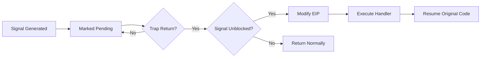
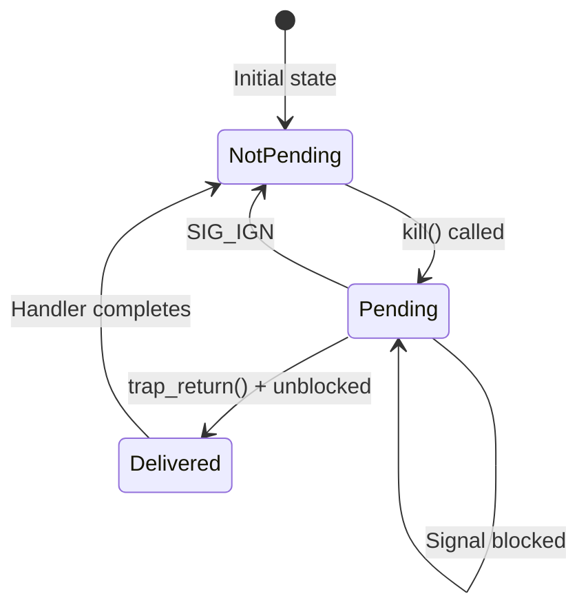
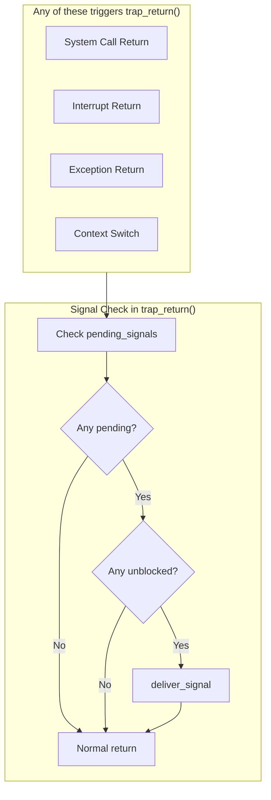
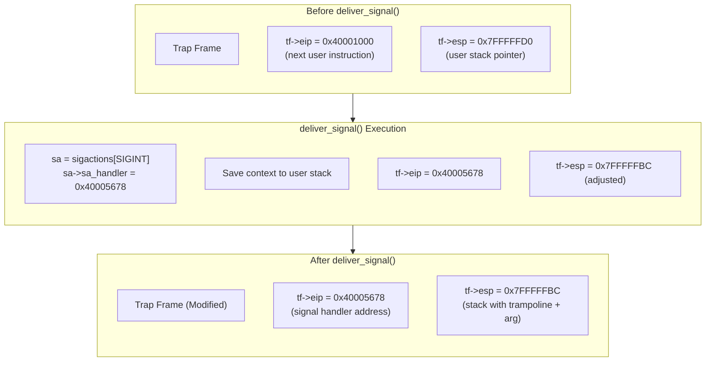
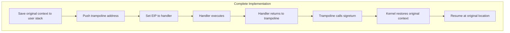
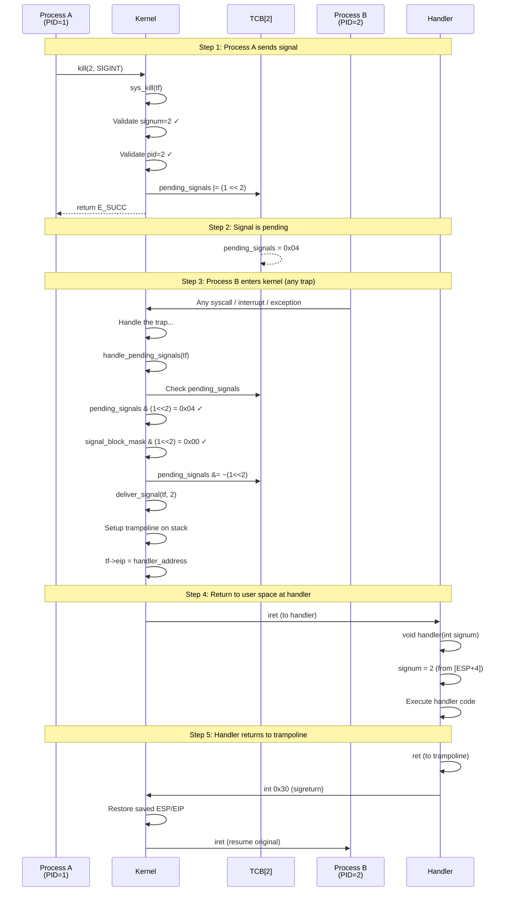

# Signal Delivery Mechanism

## Table of Contents
1. [Overview](#overview)
2. [Signal Generation](#signal-generation)
3. [Signal Pending State](#signal-pending-state)
4. [Signal Delivery Process](#signal-delivery-process)
5. [Context Hijacking Explained](#context-hijacking-explained)
6. [Handler Execution and Return](#handler-execution-and-return)
7. [Complete Flow Walkthrough](#complete-flow-walkthrough)

---

## Overview

Signal delivery is the process by which the kernel redirects a process's execution from its current location to a signal handler function. This is one of the most interesting aspects of operating systems because it involves **hijacking the program counter (EIP)** to redirect execution flow.



---

## Signal Generation

### How Signals Are Generated

Signals can be generated through several mechanisms:

```mermaid
flowchart TB
    subgraph Sources["Signal Sources"]
        US[User: kill command]
        PR[Process: kill() syscall]
        KE[Kernel: exceptions]
        TM[Timer: SIGALRM]
        HW[Hardware events]
    end

    subgraph Kernel["Kernel Processing"]
        SK[sys_kill syscall]
        EH[Exception Handler]
    end

    subgraph Target["Target TCB"]
        PS[pending_signals]
    end

    US --> SK
    PR --> SK
    KE --> EH
    TM --> EH
    HW --> EH

    SK --> PS
    EH --> PS
```

### sys_kill Implementation

The `sys_kill` system call in [kern/trap/TSyscall/TSyscall.c](../kern/trap/TSyscall/TSyscall.c):

```c
void sys_kill(tf_t *tf)
{
    int pid = syscall_get_arg2(tf);      // Target process ID
    int signum = syscall_get_arg3(tf);   // Signal number
    struct TCB *target_tcb = (struct TCB *)tcb_get_entry(pid);

    // Validate signal number (must be 1-31)
    if (signum < 1 || signum >= NSIG) {
        syscall_set_errno(tf, E_INVAL_SIGNUM);
        return;
    }

    // Validate target process exists
    if (pid < 0 || pid >= NUM_IDS || target_tcb == NULL) {
        syscall_set_errno(tf, E_INVAL_PID);
        return;
    }

    // KEY OPERATION: Set the signal bit in pending_signals
    target_tcb->sigstate.pending_signals |= (1 << signum);

    // Wake up sleeping processes so they can handle the signal
    if (target_tcb->state == TSTATE_SLEEP) {
        thread_wakeup(target_tcb);
    }

    syscall_set_errno(tf, E_SUCC);
}
```

### Bit Manipulation Explained

```
Before kill(pid, SIGINT):
pending_signals = 0b00000000000000000000000000000000


After kill(pid, SIGINT):  // SIGINT = 2
pending_signals |= (1 << 2)
pending_signals = 0b00000000000000000000000000000100
                                                ^
                                            bit 2 set

If another kill(pid, SIGUSR1):  // SIGUSR1 = 10
pending_signals |= (1 << 10)
pending_signals = 0b00000000000000000000010000000100
                                          ^      ^
                                       bit 10  bit 2
```

---

## Signal Pending State

### When Is a Signal Pending?

A signal remains pending until:
1. It is delivered to the process (handler executed or default action taken)
2. It is explicitly ignored (handler set to SIG_IGN)



### Blocking Signals

Signals can be blocked using the `signal_block_mask`:

```c
// Check if signal is blocked
if (cur_thread->sigstate.signal_block_mask & (1 << signum)) {
    // Signal is blocked - don't deliver
    continue;
}
```

The `sa_mask` field in `sigaction` can also block signals during handler execution.

---

## Signal Delivery Process

### The Critical Moment: trap_return()

Signal delivery happens in `trap_return()` in [kern/trap/TTrapHandler/TTrapHandler.c](../kern/trap/TTrapHandler/TTrapHandler.c):

```c
void trap_return(void *tf)
{
    struct thread *cur_thread = tcb_get_entry(get_curid());
    uint32_t pending_signals = cur_thread->sigstate.pending_signals;

    // Check for pending signals that aren't blocked
    if (pending_signals != 0) {
        for (int signum = 1; signum < NSIG; signum++) {
            // Check if this signal is pending AND not blocked
            if ((pending_signals & (1 << signum)) &&
                !(cur_thread->sigstate.signal_block_mask & (1 << signum))) {

                // Clear the pending signal bit
                cur_thread->sigstate.pending_signals &= ~(1 << signum);

                // Deliver the signal (modify trap frame)
                deliver_signal((tf_t *)tf, signum);
                break;  // Only deliver one signal at a time
            }
        }
    }

    // Return to user space (either at handler or original location)
    asm volatile("movl %0, %%esp\n"
                 "popal\n"
                 "popl %%es\n"
                 "popl %%ds\n"
                 "addl $0x8, %%esp\n"
                 "iret"
                 : : "g" (tf) : "memory");
}
```

### Why trap_return()?



The kernel checks for pending signals at **every** return to user space because:
1. Signals are asynchronous - they can arrive at any time
2. The kernel has full control at trap return
3. The trap frame is accessible and modifiable
4. This is the safest point to redirect execution

---

## Context Hijacking Explained

### The deliver_signal Function

> **Note**: This is a simplified view. The actual implementation saves context and sets up a trampoline for proper return handling. See [10_implementation_debug_log.md](10_implementation_debug_log.md) for the complete code.

```c
static void deliver_signal(tf_t *tf, int signum)
{
    unsigned int cur_pid = get_curid();
    struct sigaction *sa = get_sigaction(cur_pid, signum);

    if (sa->sa_handler != NULL && sa->sa_handler != SIG_IGN) {
        // Save original context for sigreturn
        uintptr_t user_esp = tf->esp;
        user_esp -= 4; pt_copyout(&tf->eip, cur_pid, user_esp, 4);  // saved EIP
        user_esp -= 4; pt_copyout(&tf->esp, cur_pid, user_esp, 4);  // saved ESP

        // Write trampoline code (mov eax, SYS_sigreturn; int 0x30; jmp $)
        user_esp -= 8;
        uint8_t trampoline[] = {0xB8, 0x42, 0, 0, 0, 0xCD, 0x30, 0xEB, 0xFE};
        pt_copyout(trampoline, cur_pid, user_esp, sizeof(trampoline));
        uint32_t trampoline_addr = user_esp;

        // Push signal number (cdecl first argument)
        user_esp -= 4; pt_copyout(&signum, cur_pid, user_esp, 4);

        // Push trampoline as return address
        user_esp -= 4; pt_copyout(&trampoline_addr, cur_pid, user_esp, 4);

        tf->esp = user_esp;
        tf->eip = (uint32_t)sa->sa_handler;  // THE KEY HIJACK
    }
}
```

### Visual Explanation of EIP Hijacking



### What Happens at IRET

The `iret` (interrupt return) instruction pops values from the trap frame:

```
Stack (before iret):         CPU Registers (after iret):
+------------------+
| SS               | --> SS register
+------------------+
| ESP              | --> ESP register (user stack pointer)
+------------------+
| EFLAGS           | --> EFLAGS register
+------------------+
| CS               | --> CS register (user code segment)
+------------------+
| EIP (MODIFIED!)  | --> EIP register (NOW POINTS TO HANDLER!)
+------------------+

Result: CPU starts executing at handler address, not original location!
```

### Memory View of the Hijack

```
User Code Memory:

0x40001000:  main:
0x40001000:    push ebp           ; Where process was
0x40001001:    mov ebp, esp       ; about to execute
0x40001003:    sub esp, 16        ; (original EIP pointed here)
             ...

0x40005678:  signal_handler:      ; <-- NEW EIP points here!
0x40005678:    push ebp           ; Handler will execute
0x40005679:    mov ebp, esp       ;
0x4000567B:    sub esp, 8
0x4000567E:    mov eax, [ebp+8]   ; Get signum from stack
0x40005681:    push eax           ; Push for printf
0x40005682:    push fmt
0x40005684:    call printf
             ...
0x400056A0:    ret                ; Returns to trampoline on stack

User Stack (after deliver_signal):

  [ESP]   = 0x7FFFFFC4    ; Return address (points to trampoline)
  [ESP+4] = 2              ; Signal number (handler argument)
  [ESP+8] = B8 42 00 00... ; Trampoline code
```


---

## Handler Execution and Return

### Signal Handler Prototype

```c
typedef void (*sighandler_t)(int);

// Handler receives signal number as argument
void my_handler(int signum) {
    // Handle the signal
    printf("Received signal %d\n", signum);
}
```

### How the Argument is Passed

In the x86 cdecl calling convention, the first argument is on the stack at `[ESP+4]` (after the return address at `[ESP]`):

```c
// Stack layout when handler starts:
// [ESP]   = return address (trampoline)
// [ESP+4] = signum (first argument)

user_esp -= 4; pt_copyout(&signum, cur_pid, user_esp, 4);      // Push argument
user_esp -= 4; pt_copyout(&trampoline_addr, cur_pid, user_esp, 4); // Push return addr
```

### Handler Return via Trampoline

When the handler executes `ret`, it returns to the trampoline code on the user stack:

```asm
; Trampoline code (9 bytes)
mov eax, SYS_sigreturn   ; 0xB8 0x42 0x00 0x00 0x00
int 0x30                 ; 0xCD 0x30
jmp $                    ; 0xEB 0xFE (infinite loop, never reached)
```

The `sigreturn` syscall then restores the saved ESP/EIP and resumes execution at the original location.

```mermaid
flowchart TB
    subgraph Current["mCertikOS Implementation (Updated)"]
        A[Save ESP/EIP to user stack]
        B[Write trampoline code to stack]
        C[Push signum argument]
        D[Push trampoline as return addr]
        E[Modify EIP to handler]
        F[Handler executes]
        G[Handler returns to trampoline]
        H[Trampoline calls sigreturn]
        I[Kernel restores ESP/EIP]
        J[Resume at original location]
    end

    A --> B --> C --> D --> E --> F --> G --> H --> I --> J
```





> **Note**: The trampoline and sigreturn mechanism has been fully implemented. See [10_implementation_debug_log.md](10_implementation_debug_log.md) for implementation details.

---

## Complete Flow Walkthrough

Let's trace a complete signal delivery from start to finish:

### Scenario

Process A (PID=1) sends SIGINT to Process B (PID=2), which has registered a handler.



### Detailed State Changes

```
=== Initial State (Process B) ===
TCB[2].sigstate:
  sigactions[2] = { sa_handler = 0x40005678, ... }
  pending_signals = 0x00000000
  signal_block_mask = 0x00000000

Process B executing at: EIP = 0x40001000


=== After kill(2, SIGINT) ===
TCB[2].sigstate:
  pending_signals = 0x00000004  // Bit 2 set
  (no other changes)


=== At trap_return() - Before deliver_signal() ===
tf->eip = 0x40001000    // Where B would resume
tf->regs.eax = ???      // Some value from syscall
TCB[2].pending_signals = 0x00000004


=== After deliver_signal() ===
tf->eip = 0x40005678    // Handler address!
tf->esp = <adjusted>    // Stack has trampoline + args
TCB[2].pending_signals = 0x00000000  // Cleared

User stack now contains:
  [ESP]   = trampoline_addr  // Return address
  [ESP+4] = 2                 // Signal number
  [ESP+8] = trampoline code   // mov eax,66; int 0x30; jmp $
  [ESP+17] = saved ESP
  [ESP+21] = saved EIP


=== After iret ===
CPU.EIP = 0x40005678    // Executing handler!
Handler reads signum from [ESP+4] = 2
User is now in handler, not original code
```

---

## Signal Priority

When multiple signals are pending, they are delivered in order of signal number (lowest first in this implementation):

```c
for (int signum = 1; signum < NSIG; signum++) {
    if ((pending_signals & (1 << signum)) &&
        !(cur_thread->sigstate.signal_block_mask & (1 << signum))) {
        // Deliver lowest-numbered unblocked signal first
        ...
        break;  // Only one signal per trap return
    }
}
```

This means:
- SIGHUP (1) is checked before SIGINT (2)
- SIGINT (2) is checked before SIGKILL (9)
- Only one signal is delivered per kernel-to-user transition

---

**Next**: [04_signal_handlers.md](04_signal_handlers.md) - Registering and executing signal handlers
