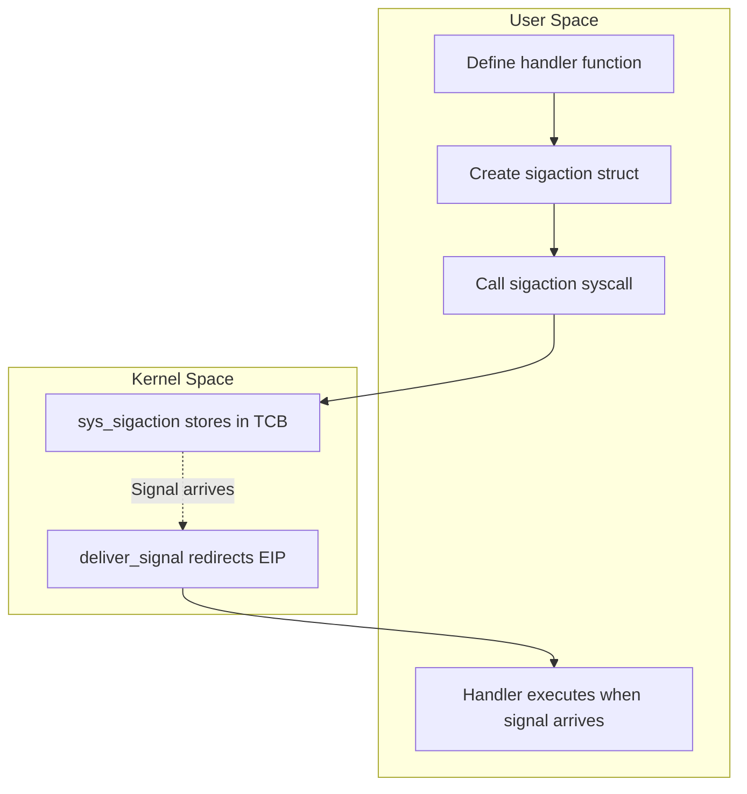
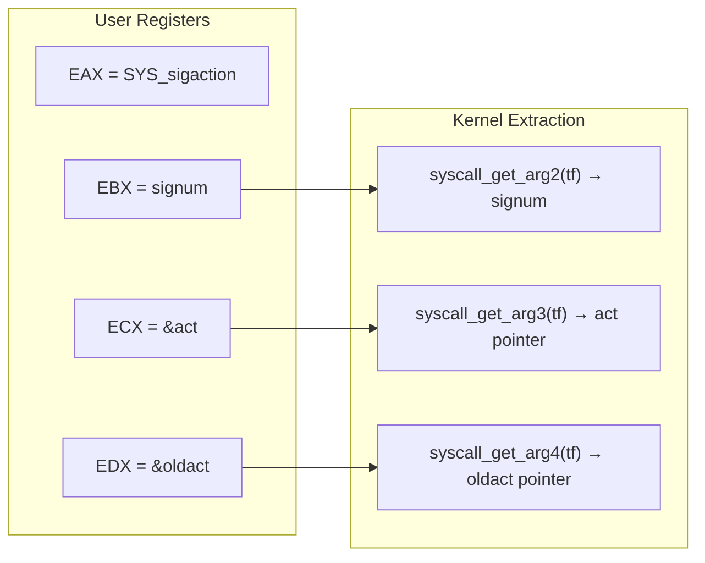
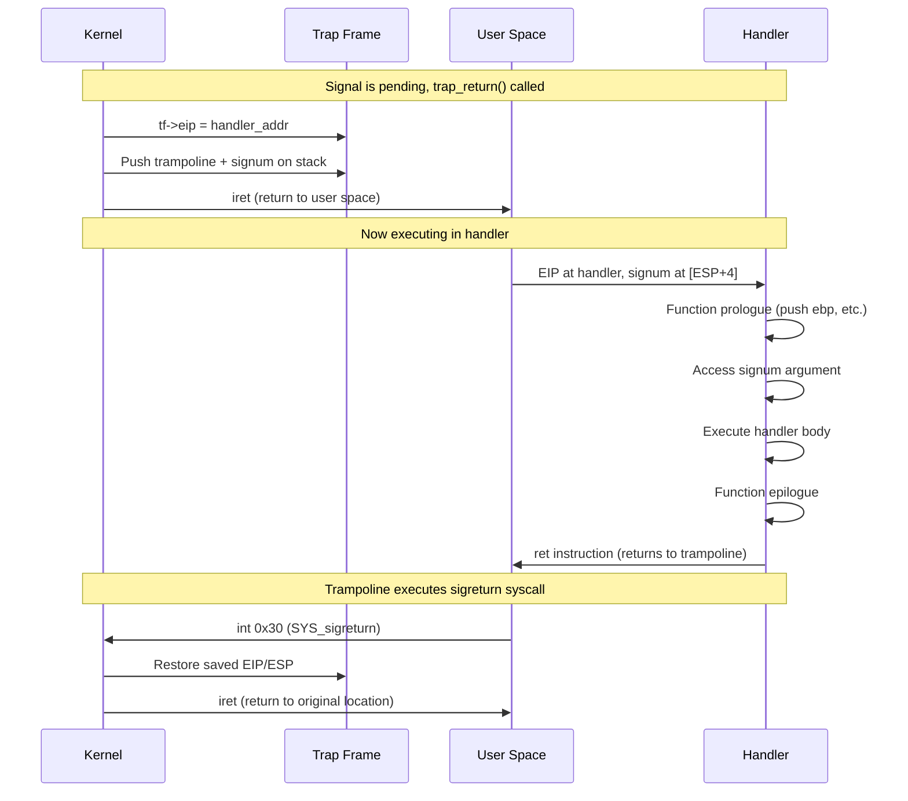
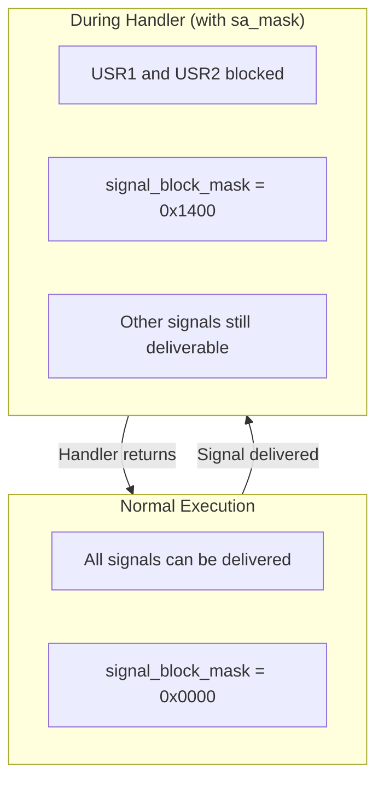
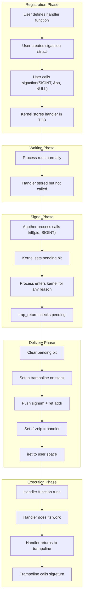

# Signal Handler Registration and Execution

## Table of Contents
1. [Handler Registration](#handler-registration)
2. [The sigaction System Call](#the-sigaction-system-call)
3. [User-Space API](#user-space-api)
4. [Handler Execution](#handler-execution)
5. [Signal Flags and Masks](#signal-flags-and-masks)
6. [Special Signals](#special-signals)

---

## Handler Registration

### Overview

Signal handlers are user-defined functions that the kernel calls when a signal is delivered. Registration involves:

1. User creates a `sigaction` structure with handler details
2. User calls `sigaction()` system call
3. Kernel stores the handler in the thread's signal state
4. When signal is delivered, kernel redirects execution to handler



---

## The sigaction System Call

### Kernel Implementation

From [kern/trap/TSyscall/TSyscall.c](../kern/trap/TSyscall/TSyscall.c):

```c
void sys_sigaction(tf_t *tf)
{
    // Extract arguments from trap frame
    int signum = syscall_get_arg2(tf);
    struct sigaction *act = (struct sigaction *)syscall_get_arg3(tf);
    struct sigaction *oldact = (struct sigaction *)syscall_get_arg4(tf);

    // Get current thread's control block
    struct TCB *cur_tcb = (struct TCB *)tcb_get_entry(get_curid());

    // Validate signal number (must be 1-31)
    if (signum < 1 || signum >= NSIG) {
        syscall_set_errno(tf, E_INVAL_SIGNUM);
        return;
    }

    // Save old handler if caller wants it
    if (oldact != NULL) {
        *oldact = cur_tcb->sigstate.sigactions[signum];
    }

    // Set new handler if provided
    if (act != NULL) {
        cur_tcb->sigstate.sigactions[signum] = *act;
    }

    syscall_set_errno(tf, E_SUCC);
}
```

### Argument Passing

The system call receives three arguments via registers:

| Register | Argument | Description |
|----------|----------|-------------|
| EBX | `signum` | Signal number (1-31) |
| ECX | `act` | Pointer to new sigaction (or NULL) |
| EDX | `oldact` | Pointer to store old sigaction (or NULL) |



### State Change in TCB

```
Before sigaction(SIGINT, &new_act, &old_act):
+----------------------------------------+
| TCB.sigstate.sigactions[2]:            |
|   sa_handler = NULL (default)          |
|   sa_flags = 0                         |
|   sa_mask = 0                          |
+----------------------------------------+

After sigaction():
+----------------------------------------+
| TCB.sigstate.sigactions[2]:            |
|   sa_handler = 0x40005678 (user func)  |
|   sa_flags = 0                         |
|   sa_mask = 0                          |
+----------------------------------------+
| old_act (user memory):                 |
|   sa_handler = NULL (saved old value)  |
+----------------------------------------+
```

---

## User-Space API

### User Signal Header

From [user/include/signal.h](../user/include/signal.h):

```c
#ifndef _USER_SIGNAL_H_
#define _USER_SIGNAL_H_

#include <types.h>

#define NSIG 32  // max number of signals

typedef void (*sighandler_t)(int);

struct sigaction {
    sighandler_t sa_handler;           // Handler function
    void (*sa_sigaction)(int, void*, void*);  // Extended handler
    int sa_flags;                      // Behavior flags
    void (*sa_restorer)(void);         // Restorer (unused)
    uint32_t sa_mask;                  // Signals to block during handler
};

// Signal numbers (same as kernel)
#define SIGINT    2
#define SIGKILL   9
#define SIGUSR1   10
#define SIGSEGV   11
#define SIGALRM   14
// ... etc

// Function declarations
int sigaction(int signum, const struct sigaction *act,
              struct sigaction *oldact);
int kill(int pid, int signum);
int pause(void);

#endif
```

### Using sigaction in User Code

Example from [user/signal_test.c](../user/signal_test.c):

```c
#include "signal.h"

// 1. Define the handler function
void sigint_handler(int signum)
{
    printf("Received SIGINT (%d)\n", signum);
}

int main(int argc, char **argv)
{
    struct sigaction sa;

    // 2. Fill in the sigaction structure
    sa.sa_handler = sigint_handler;  // Our handler function
    sa.sa_flags = 0;                 // No special flags
    sa.sa_mask = 0;                  // Don't block other signals

    // 3. Register the handler
    if (sigaction(SIGINT, &sa, NULL) < 0) {
        printf("Failed to register handler\n");
        return -1;
    }

    // 4. Now SIGINT will invoke our handler
    printf("Handler registered. Waiting...\n");

    while (1) {
        pause();  // Sleep until signal arrives
    }

    return 0;
}
```

### Shell kill and trap Commands

From [user/shell/shell.c](../user/shell/shell.c):

```c
// Send signal: kill <signal> <pid>
int shell_kill(int argc, char **argv)
{
    if (argc != 3) {
        printf("Usage: kill <signal> <pid>\n");
        return -1;
    }

    int signum = atoi(argv[1]);
    int pid = atoi(argv[2]);

    if (signum < 1 || signum >= NSIG) {
        printf("Invalid signal number\n");
        return -1;
    }

    if (kill(pid, signum) < 0) {
        printf("Failed to send signal\n");
        return -1;
    }

    return 0;
}

// Register handler: trap <signum> <handler>
int shell_trap(int argc, char **argv)
{
    if (argc != 3) {
        printf("Usage: trap <signum> <handler>\n");
        return -1;
    }

    int signum = atoi(argv[1]);
    void (*handler)(int) = (void (*)(int))strtoul(argv[2], NULL, 0);

    struct sigaction sa;
    sa.sa_handler = handler;
    sa.sa_flags = 0;
    sa.sa_mask = 0;

    if (sigaction(signum, &sa, NULL) < 0) {
        printf("Failed to register handler\n");
        return -1;
    }

    return 0;
}
```

---

## Handler Execution

### What Happens When Handler Runs



> **Note**: Trampoline and sigreturn are now fully implemented. See [10_implementation_debug_log.md](10_implementation_debug_log.md) for details.

### Handler Stack Frame

When the handler executes, it has a proper function call stack frame with trampoline return:

```
User Stack (during handler execution):
+---------------------------+ High Address
|   (previous stack data)   |
+---------------------------+
|   Saved EIP (for restore) | ← Original return point
+---------------------------+
|   Saved ESP (for restore) | ← Original stack pointer
+---------------------------+
|   Signal number           | ← Handler's first argument [ESP+4]
+---------------------------+
|   Trampoline code         | ← Return address points here
|   mov eax, SYS_sigreturn  |
|   int 0x30                |
|   jmp $                   |
+---------------------------+ Low Address (ESP)
```

### Accessing the Signal Number

The signal number is passed on the stack per cdecl calling convention:

```c
// Handler receives signum as parameter
void my_handler(int signum) {
    // In cdecl, arguments are on stack:
    // [ESP]   = return address (trampoline)
    // [ESP+4] = first argument (signum)

    if (signum == SIGINT) {
        printf("Got interrupt!\n");
    }
}
```

> **Implementation Note**: The signal number is pushed on the stack ABOVE the return address, following the cdecl calling convention. See the [implementation debug log](10_implementation_debug_log.md) for how this was verified.

---

## Signal Flags and Masks

### sigaction Flags

Defined in [kern/lib/signal.h](../kern/lib/signal.h):

```c
#define SA_NOCLDSTOP 0x00000001  // Don't notify on child stop
#define SA_NOCLDWAIT 0x00000002  // Don't create zombie children
#define SA_SIGINFO   0x00000004  // Use sa_sigaction instead of sa_handler
#define SA_ONSTACK   0x08000000  // Use alternate signal stack
#define SA_RESTART   0x10000000  // Restart interrupted syscalls
#define SA_NODEFER   0x40000000  // Don't block signal during handler
#define SA_RESETHAND 0x80000000  // Reset handler to default after delivery
```

**Note**: These flags are defined but not fully implemented in mCertikOS.

### Signal Mask (sa_mask)

The `sa_mask` field specifies signals to block during handler execution:

```c
struct sigaction sa;
sa.sa_handler = my_handler;
sa.sa_mask = (1 << SIGUSR1) | (1 << SIGUSR2);  // Block USR1 and USR2

// During my_handler execution:
// - SIGUSR1 and SIGUSR2 are blocked
// - Other signals can still be delivered
```



---

## Special Signals

### Non-Catchable Signals

Two signals cannot have custom handlers:

| Signal | Number | Behavior |
|--------|--------|----------|
| SIGKILL | 9 | Always terminates process |
| SIGSTOP | 19 | Always stops process |

```c
// This will fail or be ignored:
struct sigaction sa;
sa.sa_handler = my_handler;
sigaction(SIGKILL, &sa, NULL);  // Cannot catch SIGKILL!
```

In a complete implementation, `sys_sigaction` would reject these:

```c
void sys_sigaction(tf_t *tf) {
    int signum = syscall_get_arg2(tf);

    // SIGKILL and SIGSTOP cannot be caught
    if (signum == SIGKILL || signum == SIGSTOP) {
        syscall_set_errno(tf, E_INVAL_SIGNUM);
        return;
    }
    // ...
}
```

### Default Signal Actions

If no handler is registered, signals have default actions:

| Default Action | Signals |
|----------------|---------|
| **Terminate** | SIGHUP, SIGINT, SIGKILL, SIGTERM, SIGUSR1, SIGUSR2 |
| **Terminate + Core** | SIGQUIT, SIGILL, SIGABRT, SIGFPE, SIGSEGV, SIGBUS |
| **Ignore** | SIGCHLD, SIGURG |
| **Stop** | SIGSTOP, SIGTSTP, SIGTTIN, SIGTTOU |
| **Continue** | SIGCONT |

### Special Handler Values

POSIX defines special handler values:

```c
#define SIG_DFL ((sighandler_t)0)   // Default action
#define SIG_IGN ((sighandler_t)1)   // Ignore signal
```

Usage:
```c
struct sigaction sa;

// Ignore SIGINT
sa.sa_handler = SIG_IGN;
sigaction(SIGINT, &sa, NULL);

// Reset to default
sa.sa_handler = SIG_DFL;
sigaction(SIGINT, &sa, NULL);
```

---

## Handler Best Practices

### 1. Keep Handlers Simple

Signal handlers should be minimal:

```c
// Good: Set a flag
volatile sig_atomic_t got_signal = 0;

void handler(int signum) {
    got_signal = 1;  // Just set flag
}

// Main code checks flag
while (!got_signal) {
    do_work();
}
```

### 2. Async-Signal-Safe Functions

Only certain functions are safe to call from handlers:

```c
// SAFE in handlers:
write()
_exit()
signal()

// UNSAFE in handlers (can cause deadlock):
printf()
malloc()
free()
```

### 3. Volatile Variables

Variables accessed in handlers must be volatile:

```c
// Correct
volatile sig_atomic_t flag = 0;

// Incorrect (may be optimized away)
int flag = 0;
```

---

## Visualization: Complete Handler Flow



---

**Next**: [05_user_kernel_transition.md](05_user_kernel_transition.md) - Deep dive into user-kernel mode transitions
