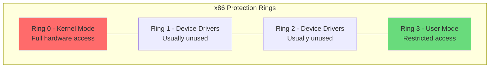
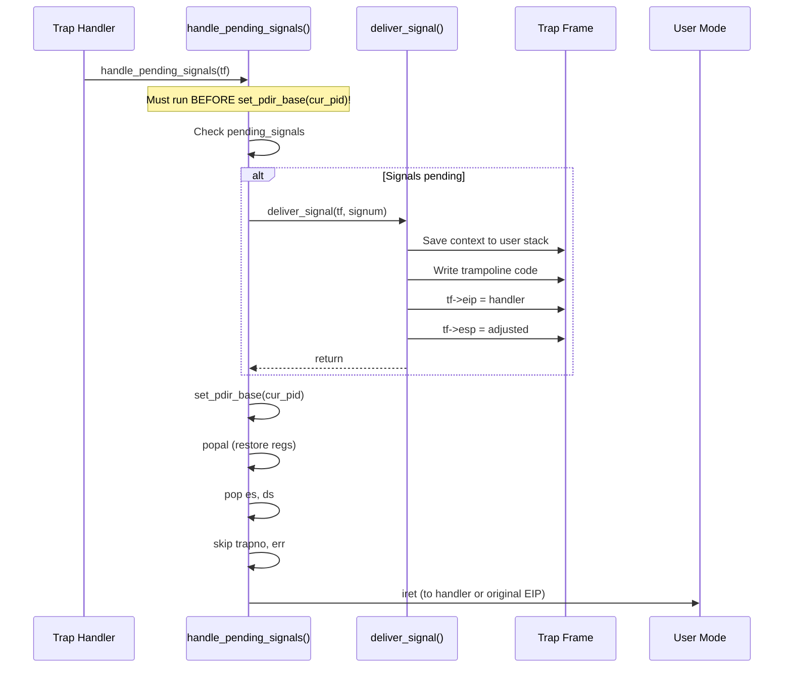
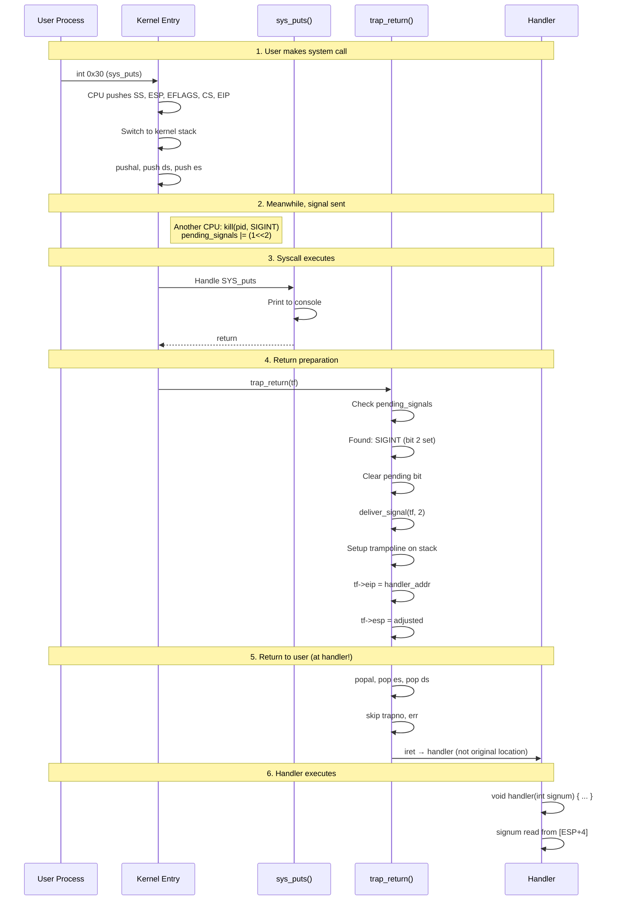
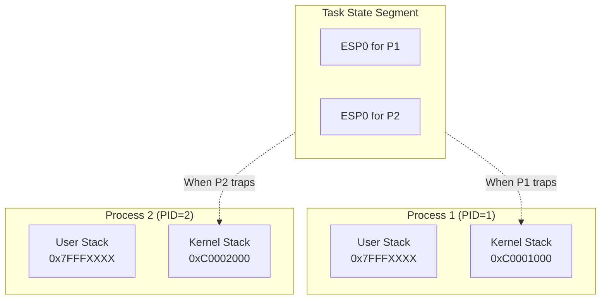

# User-Kernel Transition and Context Switching

## Table of Contents
1. [CPU Privilege Levels](#cpu-privilege-levels)
2. [Entering Kernel Mode](#entering-kernel-mode)
3. [The Trap Frame](#the-trap-frame)
4. [Returning to User Mode](#returning-to-user-mode)
5. [Signal Delivery During Transition](#signal-delivery-during-transition)
6. [Complete Transition Walkthrough](#complete-transition-walkthrough)

---

## CPU Privilege Levels

### x86 Protection Rings

The x86 architecture defines four privilege levels (rings):



mCertikOS uses only Ring 0 (kernel) and Ring 3 (user):

| Aspect | Ring 0 (Kernel) | Ring 3 (User) |
|--------|-----------------|---------------|
| **Privilege** | Full access | Restricted |
| **I/O Access** | Direct hardware access | Must use syscalls |
| **Memory Access** | All memory | Only user space (0x40000000-0xF0000000) |
| **Instructions** | All instructions | Limited (no cli/sti, in/out, etc.) |
| **Code Segment** | CS & 0x3 == 0 | CS & 0x3 == 3 |

### Segment Selectors

From [kern/lib/trap.h](../kern/lib/trap.h):

```c
#define CPU_GDT_UCODE  0x18  // User text segment (ring 3)
#define CPU_GDT_UDATA  0x20  // User data segment (ring 3)
```

The lowest 2 bits of CS indicate the Current Privilege Level (CPL):
- `CS = 0x08` → Kernel mode (CPL = 0)
- `CS = 0x1B` → User mode (CPL = 3)

---

## Entering Kernel Mode

### Three Ways to Enter Kernel Mode

```mermaid
flowchart TD
    subgraph User["User Mode (Ring 3)"]
        UP[User Process]
    end

    subgraph Triggers["Kernel Entry Triggers"]
        INT[Hardware Interrupt<br/>Timer, Keyboard, etc.]
        EXC[Exception<br/>Page fault, Div by zero]
        SC[System Call<br/>int 0x30]
    end

    subgraph Kernel["Kernel Mode (Ring 0)"]
        IDT[IDT Lookup]
        ISR[Interrupt/Exception Handler]
        TRAP[trap() function]
    end

    UP --> INT --> IDT
    UP --> EXC --> IDT
    UP --> SC --> IDT
    IDT --> ISR --> TRAP
```

### What Happens on Entry (Hardware Automatic Actions)

When the CPU transitions to kernel mode, it automatically:

1. **Switches stacks**: ESP → kernel stack (from TSS)
2. **Pushes state**: SS, ESP, EFLAGS, CS, EIP → kernel stack
3. **Clears IF**: Disables interrupts (for interrupt gates)
4. **Loads new CS:EIP**: From IDT entry
5. **Changes CPL**: Ring 3 → Ring 0

```
CPU Automatic Stack Push (Ring 3 → Ring 0):

Kernel Stack (after hardware push):
+------------------+ High Address
| User SS          | ← Saved stack segment
+------------------+
| User ESP         | ← Saved stack pointer
+------------------+
| User EFLAGS      | ← Saved flags
+------------------+
| User CS          | ← Saved code segment (with CPL)
+------------------+
| User EIP         | ← Where to resume in user space
+------------------+ ← ESP after automatic push
```

### Software State Saving

After the CPU's automatic push, the kernel saves additional state.

From the trap entry assembly (conceptual):

```asm
; After CPU automatically pushes SS, ESP, EFLAGS, CS, EIP
; Additional error code (for some exceptions):
    push $0              ; Push error code (or 0 if none)
    push trapno          ; Push trap number

; Save segment registers:
    push %ds
    push %es

; Save general-purpose registers:
    pushal               ; Push EAX, ECX, EDX, EBX, ESP, EBP, ESI, EDI

; Now we have a complete trap frame
    movl %esp, %eax      ; tf pointer = ESP
    call trap            ; Call C trap handler
```

---

## The Trap Frame

### Complete Trap Frame Structure

From [kern/lib/trap.h](../kern/lib/trap.h):

```c
typedef struct pushregs {
    uint32_t edi;
    uint32_t esi;
    uint32_t ebp;
    uint32_t oesp;    // Original ESP (not useful)
    uint32_t ebx;
    uint32_t edx;
    uint32_t ecx;
    uint32_t eax;
} pushregs;

typedef struct tf_t {
    pushregs regs;       // General purpose registers
    uint16_t es;         // Extra segment
    uint16_t ds;         // Data segment
    uint32_t trapno;     // Trap number
    uint32_t err;        // Error code
    uintptr_t eip;       // Instruction pointer ← KEY FOR SIGNALS
    uint16_t cs;         // Code segment
    uint32_t eflags;     // Flags register
    uintptr_t esp;       // Stack pointer
    uint16_t ss;         // Stack segment
} tf_t;
```

### Visual Memory Layout

```
Kernel Stack (complete trap frame):

+------------------+ High Address
| SS (user)        | ← tf->ss      (CPU pushed)
+------------------+
| ESP (user)       | ← tf->esp     (CPU pushed)
+------------------+
| EFLAGS           | ← tf->eflags  (CPU pushed)
+------------------+
| CS (user)        | ← tf->cs      (CPU pushed)
+------------------+
| EIP (user)       | ← tf->eip     (CPU pushed) ★ SIGNAL HIJACK TARGET
+------------------+
| Error Code       | ← tf->err     (CPU or kernel pushed)
+------------------+
| Trap Number      | ← tf->trapno  (kernel pushed)
+------------------+
| DS               | ← tf->ds      (kernel pushed)
+------------------+
| ES               | ← tf->es      (kernel pushed)
+------------------+
| EAX              | ← tf->regs.eax (pushal)
+------------------+
| ECX              | ← tf->regs.ecx (pushal)
+------------------+
| EDX              | ← tf->regs.edx (pushal)
+------------------+
| EBX              | ← tf->regs.ebx (pushal)
+------------------+
| ESP (original)   | ← tf->regs.oesp (pushal - not useful)
+------------------+
| EBP              | ← tf->regs.ebp (pushal)
+------------------+
| ESI              | ← tf->regs.esi (pushal)
+------------------+
| EDI              | ← tf->regs.edi (pushal) ← ESP points here
+------------------+ Low Address
```

---

## Returning to User Mode

### The trap_return Function

From [kern/trap/TTrapHandler/TTrapHandler.c](../kern/trap/TTrapHandler/TTrapHandler.c):

```c
void trap_return(void *tf)
{
    // Check for signals first (see next section)
    struct thread *cur_thread = tcb_get_entry(get_curid());
    uint32_t pending_signals = cur_thread->sigstate.pending_signals;

    if (pending_signals != 0) {
        // Deliver signal (modifies tf->eip)
        // ...
    }

    // Return to user space using IRET
    asm volatile(
        "movl %0, %%esp\n"      // Point ESP to trap frame
        "popal\n"               // Restore general registers
        "popl %%es\n"           // Restore ES
        "popl %%ds\n"           // Restore DS
        "addl $0x8, %%esp\n"    // Skip trapno and err
        "iret"                   // Return to user mode
        : : "g" (tf) : "memory"
    );
}
```

### IRET Instruction

The `iret` instruction reverses the CPU's automatic entry push:

```mermaid
flowchart LR
    subgraph Before["Stack Before IRET"]
        S1["EIP"]
        S2["CS"]
        S3["EFLAGS"]
        S4["ESP"]
        S5["SS"]
    end

    subgraph IRET["IRET Execution"]
        I1["Pop EIP → EIP"]
        I2["Pop CS → CS"]
        I3["Pop EFLAGS → EFLAGS"]
        I4["Pop ESP → ESP"]
        I5["Pop SS → SS"]
    end

    subgraph After["CPU State After"]
        R1["EIP = User instruction"]
        R2["CS = User code segment"]
        R3["CPL = 3 (user mode)"]
        R4["ESP = User stack"]
    end

    Before --> IRET --> After
```



### Register Restoration Sequence

```asm
; trap_return assembly sequence:

movl %0, %%esp        ; ESP now points to start of trap frame (regs.edi)

popal                 ; Restore general registers:
                      ;   EDI ← [ESP+0]
                      ;   ESI ← [ESP+4]
                      ;   EBP ← [ESP+8]
                      ;   ESP ← [ESP+12] (ignored)
                      ;   EBX ← [ESP+16]
                      ;   EDX ← [ESP+20]
                      ;   ECX ← [ESP+24]
                      ;   EAX ← [ESP+28]  ★ Can contain signal number!
                      ; ESP += 32

popl %%es             ; Restore ES segment
                      ; ESP += 4

popl %%ds             ; Restore DS segment
                      ; ESP += 4

addl $0x8, %%esp      ; Skip trapno and err
                      ; ESP += 8

iret                  ; Return to user mode:
                      ;   Pop EIP ← [ESP]    ★ Can be signal handler!
                      ;   Pop CS  ← [ESP+4]
                      ;   Pop EFLAGS ← [ESP+8]
                      ;   Pop ESP ← [ESP+12] (if ring change)
                      ;   Pop SS  ← [ESP+16] (if ring change)
```

---

## Signal Delivery During Transition

### The Critical Point

Signal delivery happens at the transition point, in `handle_pending_signals()`, right before switching to user page table:



### Modification of Trap Frame

> **Note**: The actual implementation sets up a trampoline and passes signum on the stack. See [10_implementation_debug_log.md](10_implementation_debug_log.md) for complete code.

```c
static void deliver_signal(tf_t *tf, int signum)
{
    unsigned int cur_pid = get_curid();
    struct sigaction *sa = get_sigaction(cur_pid, signum);

    if (sa->sa_handler != NULL) {
        // Save context for sigreturn
        uintptr_t user_esp = tf->esp;
        user_esp -= 4; pt_copyout(&tf->eip, cur_pid, user_esp, 4);
        user_esp -= 4; pt_copyout(&tf->esp, cur_pid, user_esp, 4);

        // Write trampoline (mov eax, SYS_sigreturn; int 0x30; jmp $)
        user_esp -= 9;
        uint8_t trampoline[] = {0xB8,0x42,0,0,0, 0xCD,0x30, 0xEB,0xFE};
        pt_copyout(trampoline, cur_pid, user_esp, 9);
        uint32_t trampoline_addr = user_esp;

        // Push signum (cdecl argument) and return address
        user_esp -= 4; pt_copyout(&signum, cur_pid, user_esp, 4);
        user_esp -= 4; pt_copyout(&trampoline_addr, cur_pid, user_esp, 4);

        tf->esp = user_esp;
        tf->eip = (uint32_t)sa->sa_handler;
    }
}
```

### Visual: Before and After Modification

```
BEFORE deliver_signal():                 AFTER deliver_signal():

+------------------+                     +------------------+
| EIP = 0x40001234 | ← Original          | EIP = 0x40005678 | ← HANDLER!
+------------------+   location          +------------------+
| CS = 0x1B        |                     | CS = 0x1B        |
+------------------+                     +------------------+
| EFLAGS           |                     | EFLAGS           |
+------------------+                     +------------------+
| ESP = 0x7FFFFD00 |                     | ESP = 0x7FFFFCE0 | ← ADJUSTED!
+------------------+                     +------------------+
| SS = 0x23        |                     | SS = 0x23        |
+------------------+                     +------------------+

User stack now contains:
  [ESP]   = trampoline_addr (return address)
  [ESP+4] = 2 (signal number - handler's argument)
  [ESP+8] = trampoline code (9 bytes)
  [ESP+17] = saved ESP
  [ESP+21] = saved EIP
```

---

## Complete Transition Walkthrough

### Scenario: User Process Receives SIGINT During System Call



### Detailed State Trace

```
=== State 1: User Process Running ===
CPU: Ring 3
EIP: 0x40001000 (about to call sys_puts)
ESP: 0x7FFFFFD0 (user stack)
CS:  0x1B (user code)


=== State 2: System Call Entry ===
[int 0x30 instruction executes]

CPU: Ring 0 (automatic transition)
ESP: 0xC0002000 (kernel stack from TSS)

Kernel Stack:
+------------------+
| SS = 0x23        |
+------------------+
| ESP = 0x7FFFFFD0 |
+------------------+
| EFLAGS = 0x202   |
+------------------+
| CS = 0x1B        |
+------------------+
| EIP = 0x40001005 | ← Return address (after int instruction)
+------------------+ ← ESP here after CPU push


=== State 3: Full Trap Frame Created ===
[After kernel entry code: pushal, push ds, push es]

Kernel Stack (complete tf_t):
+------------------+
| SS = 0x23        |
| ESP = 0x7FFFFFD0 |
| EFLAGS = 0x202   |
| CS = 0x1B        |
| EIP = 0x40001005 |
| err = 0          |
| trapno = 48      | ← T_SYSCALL
| DS = 0x23        |
| ES = 0x23        |
| EAX = 0          | ← SYS_puts
| ECX = ...        |
| EDX = ...        |
| EBX = ...        |
| ESP (ignored)    |
| EBP = ...        |
| ESI = ...        |
| EDI = ...        | ← tf pointer points here
+------------------+


=== State 4: Signal Sent (by another process) ===
[Another process calls kill(pid, SIGINT)]

TCB.sigstate.pending_signals = 0x00000004 (bit 2 set)


=== State 5: trap_return() - Signal Detected ===
[After syscall handler returns, trap_return() called]

deliver_signal(tf, 2) modifies trap frame:
- tf->eip changed: 0x40001005 → 0x40005678 (handler)
- tf->esp changed: 0x7FFFFFD0 → 0x7FFFFFBC (stack adjusted for trampoline + args)

User Stack now contains:
  [ESP]   = trampoline address (return addr)
  [ESP+4] = 2 (SIGINT - handler argument)
  [ESP+8] = trampoline code
  ...saved context...

Kernel Stack (modified tf_t):
+------------------+
| SS = 0x23        |
| ESP = 0x7FFFFFBC | ← CHANGED (stack adjusted)
| EFLAGS = 0x202   |
| CS = 0x1B        |
| EIP = 0x40005678 | ← CHANGED to handler!
| err = 0          |
| trapno = 48      |
| DS = 0x23        |
| ES = 0x23        |
| ...              |
+------------------+


=== State 6: IRET - Return to Handler ===
[iret instruction pops modified trap frame]

CPU: Ring 3
EIP: 0x40005678 (handler, NOT original location!)
ESP: 0x7FFFFFBC (adjusted user stack)
CS:  0x1B (user code)

Signal number (2) is on stack at [ESP+4]

NOW EXECUTING SIGNAL HANDLER!
```

---

## Kernel Stack Per Process

Each process has its own kernel stack:



This ensures that each process's trap frame is private and can be modified for signal delivery without affecting other processes.

---

**Next**: [06_execution_flow.md](06_execution_flow.md) - Complete execution flow with diagrams
