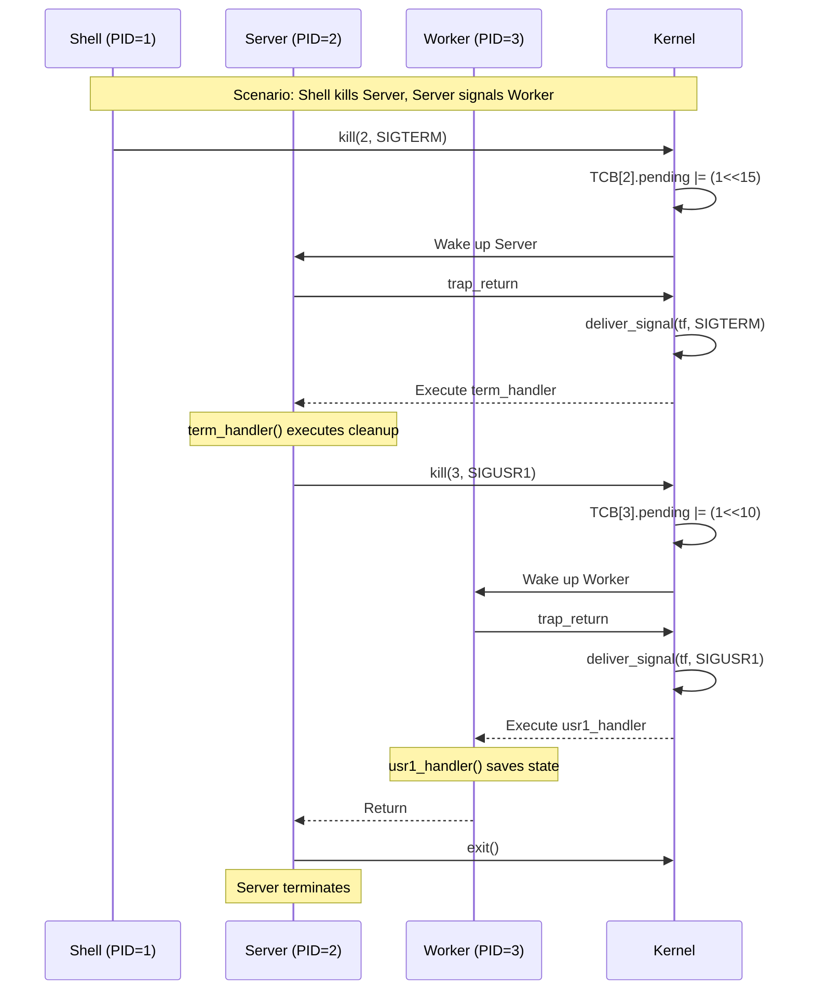
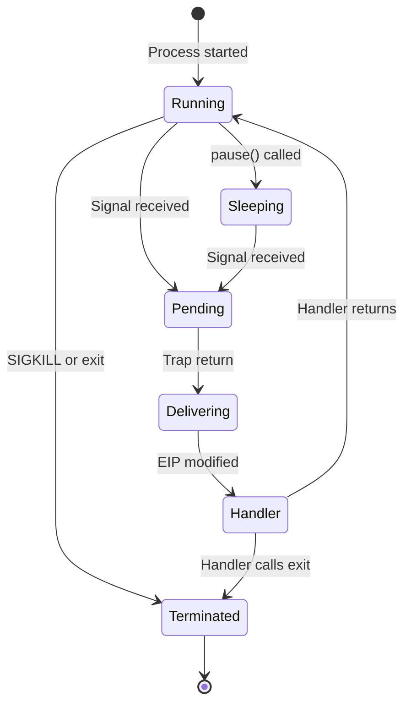
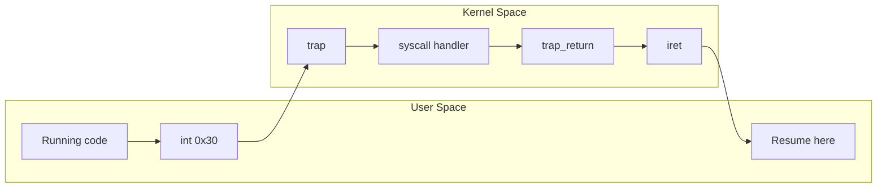
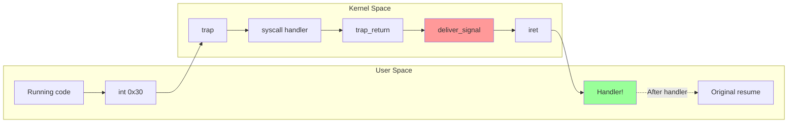
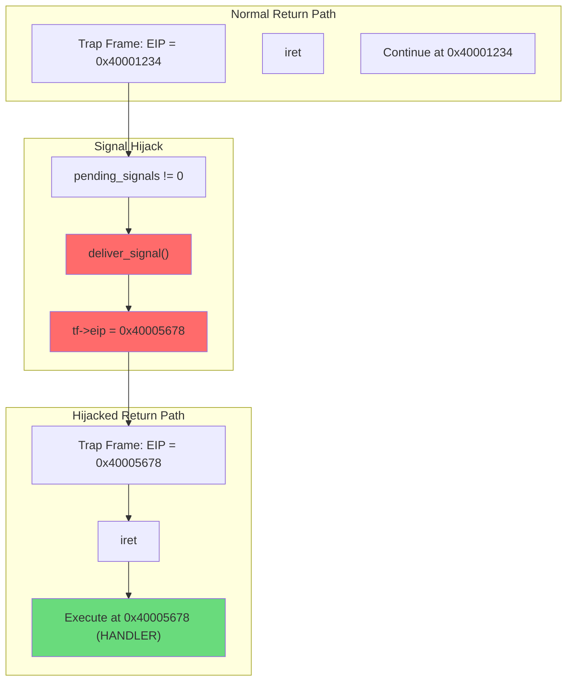

# Complete Execution Flow

## Table of Contents
1. [End-to-End Signal Flow](#end-to-end-signal-flow)
2. [Timeline View](#timeline-view)
3. [Memory State at Each Step](#memory-state-at-each-step)
4. [Practical Example: SIGINT Handling](#practical-example-sigint-handling)
5. [Multi-Process Signal Scenario](#multi-process-signal-scenario)

---

## End-to-End Signal Flow

This document presents the complete execution flow of signal handling, from registration through delivery and handler execution.

```mermaid
flowchart TB
    subgraph Phase1["Phase 1: Registration"]
        R1[User defines handler function]
        R2[User fills sigaction struct]
        R3[User calls sigaction syscall]
        R4[Kernel stores handler in TCB]
    end

    subgraph Phase2["Phase 2: Normal Execution"]
        N1[Process runs normally]
        N2[Handler stored but dormant]
        N3[pending_signals = 0x0]
    end

    subgraph Phase3["Phase 3: Signal Sent"]
        S1[kill syscall invoked]
        S2[Validate signal and target]
        S3[Set pending bit]
        S4[Wake target if sleeping]
    end

    subgraph Phase4["Phase 4: Delivery Check"]
        D1[Target enters kernel]
        D2[trap_return called]
        D3[Check pending_signals]
        D4[Find unblocked signal]
    end

    subgraph Phase5["Phase 5: Context Hijack"]
        H1[Clear pending bit]
        H2[Modify tf->eip to handler]
        H3[Set tf->eax to signum]
        H4[Restore registers + iret]
    end

    subgraph Phase6["Phase 6: Handler Execution"]
        E1[CPU now at handler address]
        E2[Handler receives signal number]
        E3[Handler processes signal]
        E4[Handler returns]
    end

    subgraph Phase7["Phase 7: Resume"]
        F1[Return from handler]
        F2[Continue normal execution]
    end

    R1 --> R2 --> R3 --> R4
    R4 --> N1 --> N2 --> N3
    N3 --> S1 --> S2 --> S3 --> S4
    S4 --> D1 --> D2 --> D3 --> D4
    D4 --> H1 --> H2 --> H3 --> H4
    H4 --> E1 --> E2 --> E3 --> E4
    E4 --> F1 --> F2
```



---

## Timeline View

### Chronological Event Sequence

```mermaid
gantt
    title Signal Lifecycle Timeline
    dateFormat X
    axisFormat %s

    section Registration
    Define handler         :r1, 0, 1
    Create sigaction       :r2, 1, 2
    Syscall sigaction      :r3, 2, 4
    Kernel stores handler  :r4, 4, 5

    section Normal Run
    Process executing      :n1, 5, 20

    section Signal Send
    kill() called          :s1, 15, 16
    Set pending bit        :s2, 16, 17

    section Delivery
    Target traps           :d1, 20, 21
    trap_return checks     :d2, 21, 22
    deliver_signal         :d3, 22, 23
    Modify EIP             :d4, 23, 24

    section Handler
    IRET to handler        :h1, 24, 25
    Handler runs           :h2, 25, 30
    Handler returns        :h3, 30, 31

    section Resume
    Normal execution       :f1, 31, 40
```



### Detailed Event Trace

```
Time    Event                           Location            State Change
────────────────────────────────────────────────────────────────────────────
T0      User defines signal_handler()   User .text          Code exists at 0x40005678
T1      User creates sigaction struct   User stack          sa.sa_handler = 0x40005678
T2      User calls sigaction()          User code           int 0x30
T3      Kernel: sys_sigaction()         Kernel              TCB.sigactions[2] = sa
T4      Return to user                  User code           Handler registered

T10     Process running normally        User code           EIP = 0x40001XXX
T11     [Another process] kill(pid, 2)  Kernel              pending_signals |= 0x04
T12     Target process: timer interrupt Kernel entry        trap(tf)
T13     trap_return(tf)                 Kernel              Check pending
T14     deliver_signal(tf, 2)           Kernel              tf->eip = 0x40005678
T15     iret                            CPU                 EIP ← 0x40005678
T16     Handler executes                User code           "Received signal 2"
T17     Handler ret                     User code           Return (simplified)
```

---

## Memory State at Each Step

### Step 1: After Handler Registration

```
USER SPACE MEMORY:
┌──────────────────────────────────────────────────┐
│ .text section                                     │
│ 0x40001000: main()                               │
│    ...                                            │
│ 0x40005678: signal_handler:                      │
│             push ebp                              │
│             mov ebp, esp                          │
│             ...                                   │
│             ret                                   │
└──────────────────────────────────────────────────┘

KERNEL SPACE (TCB for this process):
┌──────────────────────────────────────────────────┐
│ TCB.sigstate:                                    │
│   sigactions[0]: { handler: NULL, ... }          │
│   sigactions[1]: { handler: NULL, ... }          │
│   sigactions[2]: { handler: 0x40005678, ... } ←  │ SIGINT handler
│   sigactions[3]: { handler: NULL, ... }          │
│   ...                                            │
│   pending_signals: 0x00000000                    │
│   signal_block_mask: 0x00000000                  │
└──────────────────────────────────────────────────┘
```

### Step 2: After kill() - Signal Pending

```
KERNEL SPACE (TCB for target process):
┌──────────────────────────────────────────────────┐
│ TCB.sigstate:                                    │
│   sigactions[2]: { handler: 0x40005678, ... }    │
│   ...                                            │
│   pending_signals: 0x00000004  ← BIT 2 SET       │
│   signal_block_mask: 0x00000000                  │
└──────────────────────────────────────────────────┘

Binary view of pending_signals:
   Bit: 31 30 29 28 ... 4  3  2  1  0
Value:  0  0  0  0 ... 0  0  1  0  0
                           ^
                      SIGINT pending
```

### Step 3: At trap_return() - Before deliver_signal()

```
KERNEL STACK (Trap Frame):
┌──────────────────────────────────────────────────┐
│ High Address                                     │
├──────────────────────────────────────────────────┤
│ SS:     0x23                                     │
│ ESP:    0x7FFFFFD0                               │
│ EFLAGS: 0x00000202                               │
│ CS:     0x1B                                     │
│ EIP:    0x40001234   ← Original return address   │
│ err:    0x00000000                               │
│ trapno: 0x00000030   (T_SYSCALL = 48)            │
│ DS:     0x23                                     │
│ ES:     0x23                                     │
│ EAX:    0x0000002A   (some previous value)       │
│ ECX:    0x........                               │
│ EDX:    0x........                               │
│ EBX:    0x........                               │
│ ESP:    0x........   (ignored)                   │
│ EBP:    0x........                               │
│ ESI:    0x........                               │
│ EDI:    0x........   ← tf pointer                │
├──────────────────────────────────────────────────┤
│ Low Address                                      │
└──────────────────────────────────────────────────┘
```

### Step 4: At trap_return() - After deliver_signal()

```
KERNEL STACK (Trap Frame - MODIFIED):
┌──────────────────────────────────────────────────┐
│ High Address                                     │
├──────────────────────────────────────────────────┤
│ SS:     0x23                                     │
│ ESP:    0x7FFFFFD0                               │
│ EFLAGS: 0x00000202                               │
│ CS:     0x1B                                     │
│ EIP:    0x40005678   ← CHANGED to handler!       │ ★
│ err:    0x00000000                               │
│ trapno: 0x00000030                               │
│ DS:     0x23                                     │
│ ES:     0x23                                     │
│ EAX:    0x00000002   ← CHANGED to SIGINT!        │ ★
│ ECX:    0x........                               │
│ EDX:    0x........                               │
│ EBX:    0x........                               │
│ ESP:    0x........                               │
│ EBP:    0x........                               │
│ ESI:    0x........                               │
│ EDI:    0x........                               │
├──────────────────────────────────────────────────┤
│ Low Address                                      │
└──────────────────────────────────────────────────┘

KERNEL SPACE (TCB updated):
┌──────────────────────────────────────────────────┐
│ TCB.sigstate:                                    │
│   pending_signals: 0x00000000  ← CLEARED         │
└──────────────────────────────────────────────────┘
```

### Step 5: After IRET - Handler Executing

```
CPU REGISTERS:
┌──────────────────────────────────────────────────┐
│ EIP:    0x40005678   (handler code)              │
│ ESP:    0x7FFFFFD0   (user stack)                │
│ EAX:    0x00000002   (signal number = SIGINT)    │
│ CS:     0x1B         (user code, CPL=3)          │
│ SS:     0x23         (user stack segment)        │
│ EFLAGS: 0x00000202   (IF set, interrupts on)     │
└──────────────────────────────────────────────────┘

EXECUTION:
The CPU is now executing instructions at 0x40005678,
which is the signal_handler function!

0x40005678:  push ebp        ; Handler prologue
0x40005679:  mov ebp, esp
0x4000567B:  sub esp, 0x10   ; Local variables
0x4000567E:  mov eax, [ebp+8] ; Get argument (or use EAX directly)
             ...
```

---

## Practical Example: SIGINT Handling

### User Code

```c
// File: signal_test.c
#include <stdio.h>
#include "signal.h"

volatile int signal_received = 0;

void sigint_handler(int signum) {
    printf("Caught SIGINT (%d)!\n", signum);
    signal_received = 1;
}

int main() {
    struct sigaction sa;
    sa.sa_handler = sigint_handler;
    sa.sa_flags = 0;
    sa.sa_mask = 0;

    // Register handler
    if (sigaction(SIGINT, &sa, NULL) < 0) {
        printf("Failed to register handler\n");
        return -1;
    }

    printf("Waiting for SIGINT (press Ctrl+C or use kill)...\n");

    // Wait for signal
    while (!signal_received) {
        pause();
    }

    printf("Signal handled, exiting.\n");
    return 0;
}
```

### Execution Trace

```
┌─────────────────────────────────────────────────────────────────┐
│ Terminal 1 (signal_test)              │ Terminal 2 (shell)      │
├───────────────────────────────────────┼─────────────────────────┤
│ $ ./signal_test                       │                         │
│ Waiting for SIGINT...                 │                         │
│ [process running, PID=5]              │                         │
│                                       │                         │
│ ← Blocked in pause() syscall          │ $ kill 2 5              │
│                                       │ [sends SIGINT to PID 5] │
│                                       │                         │
│ ┌───────────────────────────────┐     │                         │
│ │ Kernel: sys_kill(5, 2)        │     │                         │
│ │   TCB[5].pending |= (1<<2)    │     │                         │
│ │   TCB[5].state = SLEEP        │     │                         │
│ │   thread_wakeup(TCB[5])       │     │                         │
│ └───────────────────────────────┘     │                         │
│                                       │                         │
│ ┌───────────────────────────────┐     │                         │
│ │ Process 5 wakes up            │     │                         │
│ │ trap_return: signal pending!  │     │                         │
│ │ deliver_signal(tf, 2)         │     │                         │
│ │   tf->eip = sigint_handler    │     │                         │
│ │ iret to handler               │     │                         │
│ └───────────────────────────────┘     │                         │
│                                       │                         │
│ Caught SIGINT (2)!                    │                         │
│ Signal handled, exiting.              │                         │
│ $                                     │                         │
└───────────────────────────────────────┴─────────────────────────┘
```

---

## Multi-Process Signal Scenario

### Three-Process Interaction



### State Diagram



---

## Signal vs Normal Execution Flow

### Normal System Call (No Signal)



### System Call with Signal



---

## Key Takeaways

### The Signal Hijack in One Diagram



### Summary Table

| Step | Location | Action | Key Change |
|------|----------|--------|------------|
| 1 | User | `sigaction()` | Handler stored in TCB |
| 2 | Sender | `kill()` | `pending_signals` bit set |
| 3 | Target | Any trap | Enters kernel |
| 4 | Kernel | `trap_return()` | Checks pending signals |
| 5 | Kernel | `deliver_signal()` | Modifies `tf->eip` |
| 6 | Kernel | `iret` | Returns to **handler** |
| 7 | User | Handler | Executes custom code |
| 8 | User | Return | Resumes (simplified) |

---

**Next**: [07_focus_signals.md](07_focus_signals.md) - Deep dive into SIGKILL, SIGINT, SIGSEGV, SIGALRM
