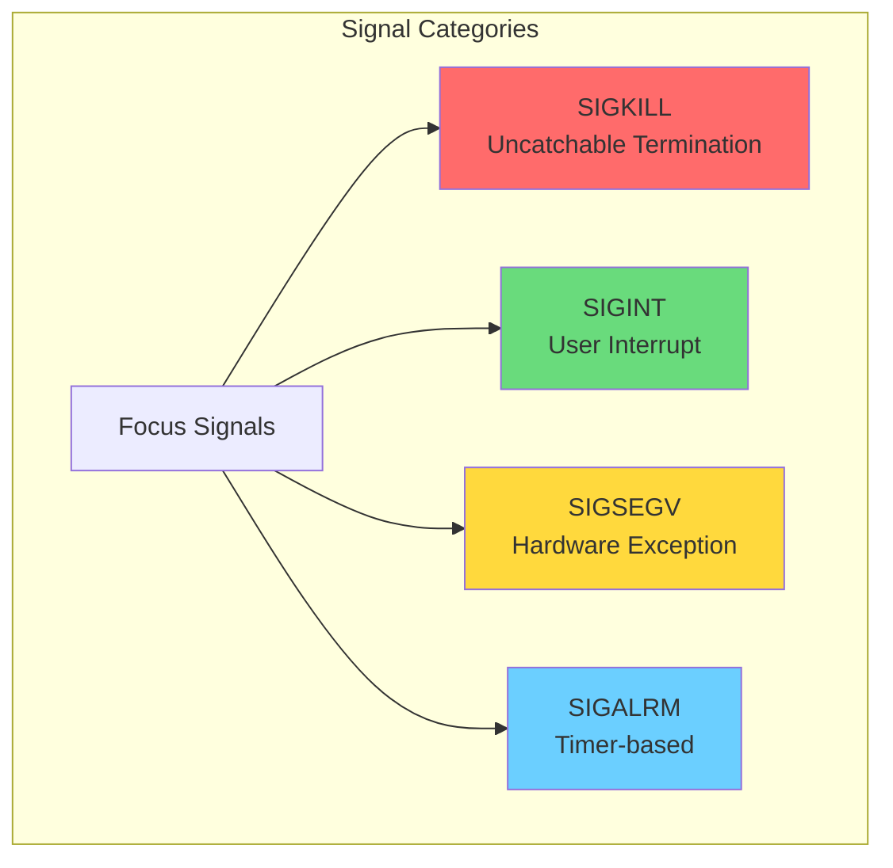
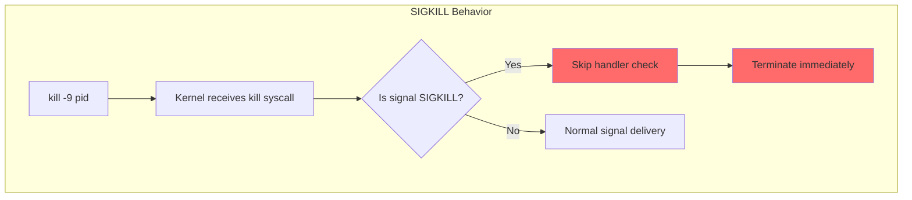
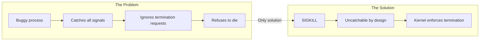
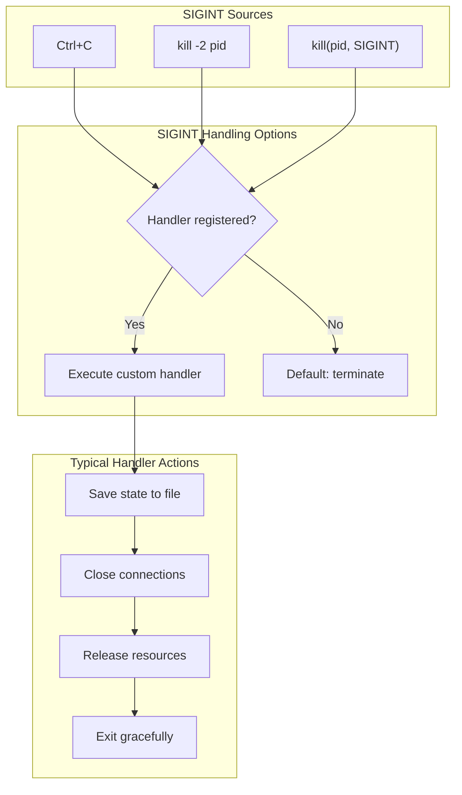
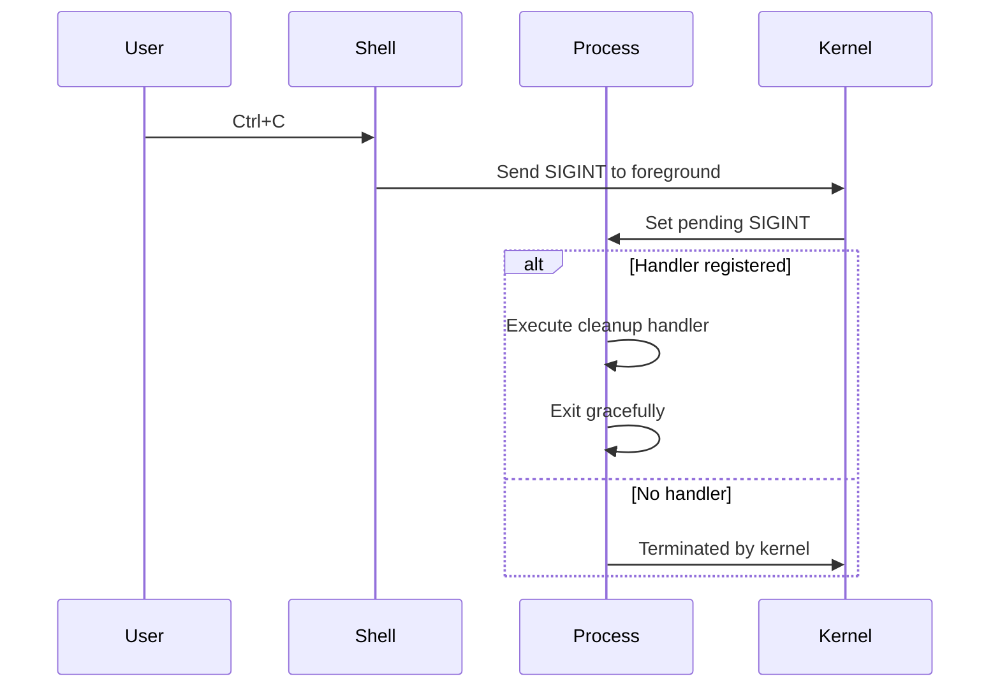
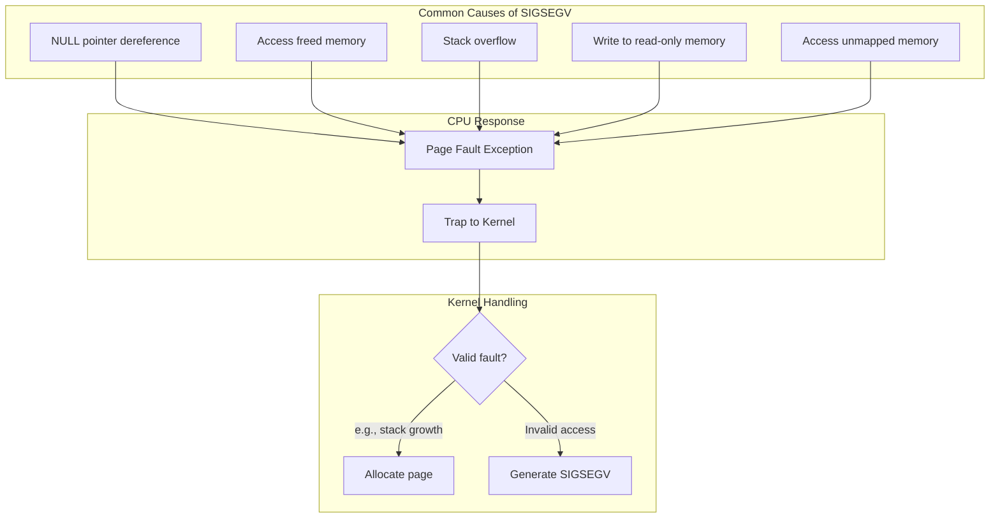
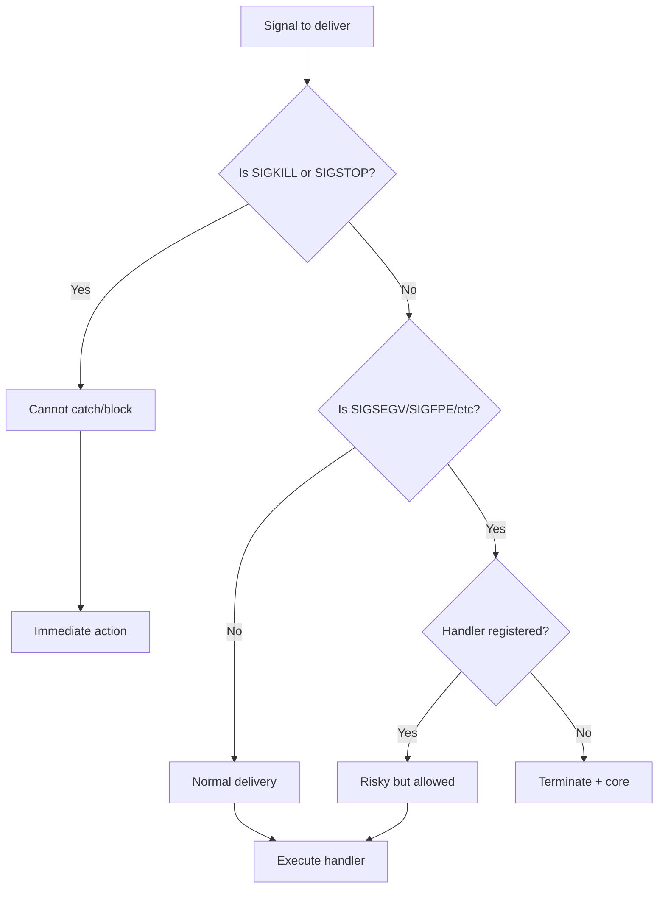

# Focus Signals: SIGKILL, SIGINT, SIGSEGV, SIGALRM

## Table of Contents
1. [Overview of Focus Signals](#overview-of-focus-signals)
2. [SIGKILL (9) - Force Kill](#sigkill-9---force-kill)
3. [SIGINT (2) - Interrupt](#sigint-2---interrupt)
4. [SIGSEGV (11) - Segmentation Violation](#sigsegv-11---segmentation-violation)
5. [SIGALRM (14) - Alarm Timer](#sigalrm-14---alarm-timer)
6. [Implementation Considerations](#implementation-considerations)

---

## Overview of Focus Signals

These four signals represent different categories of signal usage:



| Signal | Number | Category | Catchable | Default Action | Common Source |
|--------|--------|----------|-----------|----------------|---------------|
| **SIGKILL** | 9 | Termination | ❌ No | Terminate | `kill -9`, kernel |
| **SIGINT** | 2 | User Interrupt | ✅ Yes | Terminate | Ctrl+C, `kill -2` |
| **SIGSEGV** | 11 | Exception | ✅ Yes | Terminate+Core | Invalid memory access |
| **SIGALRM** | 14 | Timer | ✅ Yes | Terminate | `alarm()` syscall |

---

## SIGKILL (9) - Force Kill

### Characteristics

SIGKILL is the **nuclear option** for process termination:

- **Cannot be caught** - no custom handler allowed
- **Cannot be ignored** - always terminates
- **Cannot be blocked** - bypasses signal mask
- **Immediate effect** - no cleanup possible



### Implementation Requirement

The kernel should reject attempts to install handlers for SIGKILL:

```c
void sys_sigaction(tf_t *tf) {
    int signum = syscall_get_arg2(tf);

    // SIGKILL cannot have a custom handler
    if (signum == SIGKILL || signum == SIGSTOP) {
        syscall_set_errno(tf, E_INVAL_SIGNUM);
        return;
    }

    // ... rest of implementation
}
```

### SIGKILL Delivery

When delivering SIGKILL, skip the handler mechanism entirely:

```c
void deliver_signal(tf_t *tf, int signum) {
    // SIGKILL: immediate termination, no handler
    if (signum == SIGKILL) {
        // Terminate the process
        proc_terminate(get_curid());
        // Never returns
        return;
    }

    // Normal signal delivery for other signals
    // ...
}
```

### Use Cases

```
# Force kill unresponsive process
$ kill -9 1234

# Kill all processes of a user (admin)
$ kill -9 -1

# Kernel sends SIGKILL for:
# - Out of memory (OOM) killer
# - Security violations
# - Critical resource exhaustion
```

### Why SIGKILL Exists



---

## SIGINT (2) - Interrupt

### Characteristics

SIGINT is the **polite request to terminate**:

- **Catchable** - process can handle gracefully
- **Default action** - terminate process
- **Common source** - Ctrl+C from terminal
- **Purpose** - allow cleanup before exit



### Example Implementation

```c
// User-space signal handler for SIGINT
#include "signal.h"

volatile int running = 1;

void sigint_handler(int signum) {
    printf("\nReceived SIGINT, cleaning up...\n");

    // Perform cleanup
    save_state();
    close_connections();

    // Stop main loop
    running = 0;
}

int main() {
    struct sigaction sa;
    sa.sa_handler = sigint_handler;
    sa.sa_flags = 0;
    sa.sa_mask = 0;
    sigaction(SIGINT, &sa, NULL);

    printf("Server starting (Ctrl+C to stop)...\n");

    while (running) {
        process_requests();
    }

    printf("Server stopped gracefully.\n");
    return 0;
}
```

### SIGINT vs SIGKILL

| Aspect | SIGINT | SIGKILL |
|--------|--------|---------|
| **Politeness** | "Please stop" | "STOP NOW!" |
| **Catchable** | Yes | No |
| **Cleanup** | Allowed | None |
| **Use case** | Normal termination | Force termination |
| **User action** | Ctrl+C | `kill -9` |



---

## SIGSEGV (11) - Segmentation Violation

### Characteristics

SIGSEGV indicates a **memory access violation**:

- **Source** - CPU hardware exception
- **Cause** - Invalid memory access
- **Default** - Terminate + core dump
- **Catchable** - Yes, but dangerous



### How SIGSEGV is Generated

From [kern/trap/TTrapHandler/TTrapHandler.c](../kern/trap/TTrapHandler/TTrapHandler.c):

```c
void pgflt_handler(tf_t *tf) {
    unsigned int cur_pid = get_curid();
    unsigned int errno = tf->err;
    unsigned int fault_va = rcr2();  // Get faulting virtual address

    // Check if it's a protection violation
    if (errno & PFE_PR) {
        // Permission denied - should generate SIGSEGV
        trap_dump(tf);
        KERN_PANIC("Permission denied: va = 0x%08x\n", fault_va);

        // In a complete implementation:
        // generate_signal(cur_pid, SIGSEGV);
        return;
    }

    // Try to allocate the page (e.g., for stack growth)
    if (alloc_page(cur_pid, fault_va, PTE_W | PTE_U | PTE_P) == MagicNumber) {
        // Allocation failed - should generate SIGSEGV
        KERN_PANIC("Page allocation failed: va = 0x%08x\n", fault_va);

        // In a complete implementation:
        // generate_signal(cur_pid, SIGSEGV);
    }
}
```

### Complete SIGSEGV Flow

```mermaid
sequenceDiagram
    participant Code as User Code
    participant CPU as CPU
    participant PF as Page Fault Handler
    participant K as Kernel
    participant H as SIGSEGV Handler

    Code->>Code: int *p = NULL;
    Code->>CPU: *p = 42; (access address 0x0)
    CPU->>CPU: MMU: Invalid address!
    CPU->>PF: Page Fault Exception
    PF->>PF: Check if valid fault
    PF->>K: Invalid access detected
    K->>K: pending_signals |= (1<<11)
    K->>K: trap_return()

    alt Handler registered
        K->>H: deliver_signal(tf, SIGSEGV)
        H->>H: Log error, clean up
        H->>Code: Continue or exit
    else No handler
        K->>K: Terminate + core dump
    end
```

### Catching SIGSEGV (Advanced)

While possible, catching SIGSEGV is **dangerous** and usually wrong:

```c
// Dangerous example - for educational purposes only!

volatile sigjmp_buf jump_buffer;
volatile int segfault_occurred = 0;

void sigsegv_handler(int signum) {
    segfault_occurred = 1;
    siglongjmp(jump_buffer, 1);  // Jump back to safe point
}

int safe_read(int *ptr, int *value) {
    struct sigaction sa;
    sa.sa_handler = sigsegv_handler;
    sigaction(SIGSEGV, &sa, NULL);

    if (sigsetjmp(jump_buffer, 1) == 0) {
        *value = *ptr;  // May cause SIGSEGV
        return 0;       // Success
    } else {
        return -1;      // SIGSEGV occurred
    }
}
```

**Warning**: This pattern has many issues:
- Not async-signal-safe
- May corrupt program state
- The underlying bug remains unfixed
- Better to fix the root cause!

---

## SIGALRM (14) - Alarm Timer

### Characteristics

SIGALRM is used for **timer-based notifications**:

- **Source** - Timer expiration
- **Set via** - `alarm()` system call
- **Default** - Terminate process
- **Use case** - Timeouts, periodic tasks

```mermaid
flowchart TB
    subgraph Setup["Setup Phase"]
        A["alarm(5)"]
        B[Set timer for 5 seconds]
        C[Continue execution]
    end

    subgraph Timer["Timer Running"]
        D[Kernel timer counting]
        E[Process doing work]
    end

    subgraph Expiry["Timer Expiration"]
        F[Timer reaches zero]
        G[Generate SIGALRM]
        H[pending_signals |= (1<<14)]
    end

    subgraph Delivery["Signal Delivery"]
        I[Next kernel exit]
        J[Execute handler]
    end

    A --> B --> C --> D
    D --> E
    E -.-> D
    D --> F --> G --> H --> I --> J
```

### Implementing alarm() System Call

The `alarm()` syscall would need to be added:

```c
// In kern/trap/TSyscall/TSyscall.c

void sys_alarm(tf_t *tf) {
    unsigned int seconds = syscall_get_arg2(tf);
    unsigned int pid = get_curid();

    // Cancel any existing alarm
    unsigned int remaining = cancel_alarm(pid);

    if (seconds > 0) {
        // Set new alarm
        set_alarm(pid, seconds, SIGALRM);
    }

    // Return remaining time from previous alarm
    syscall_set_retval1(tf, remaining);
    syscall_set_errno(tf, E_SUCC);
}
```

### Timer Interrupt Handler Integration

```c
// In timer interrupt handler (simplified)
void timer_intr_handler(void) {
    intr_eoi();

    // Check all process alarms
    for (int pid = 0; pid < NUM_IDS; pid++) {
        if (alarm_expired(pid)) {
            // Generate SIGALRM for this process
            TCBPool[pid].sigstate.pending_signals |= (1 << SIGALRM);

            // Wake up if sleeping
            if (TCBPool[pid].state == TSTATE_SLEEP) {
                thread_wakeup(&TCBPool[pid]);
            }
        }
    }

    sched_update();
}
```

### SIGALRM Use Cases

#### 1. Operation Timeout

```c
volatile int timed_out = 0;

void alarm_handler(int signum) {
    timed_out = 1;
}

int read_with_timeout(int fd, char *buf, int len, int timeout_secs) {
    struct sigaction sa;
    sa.sa_handler = alarm_handler;
    sigaction(SIGALRM, &sa, NULL);

    timed_out = 0;
    alarm(timeout_secs);  // Set timeout

    int bytes = read(fd, buf, len);

    alarm(0);  // Cancel alarm

    if (timed_out) {
        return -1;  // Timeout occurred
    }
    return bytes;
}
```

#### 2. Periodic Task

```c
volatile int tick_count = 0;

void timer_tick(int signum) {
    tick_count++;
    printf("Tick %d\n", tick_count);
    alarm(1);  // Re-arm for next second
}

int main() {
    struct sigaction sa;
    sa.sa_handler = timer_tick;
    sigaction(SIGALRM, &sa, NULL);

    alarm(1);  // Start periodic timer

    while (tick_count < 10) {
        pause();  // Wait for signals
    }

    return 0;
}
```

#### 3. Watchdog Timer

```c
void watchdog_expired(int signum) {
    printf("ERROR: Operation took too long!\n");
    abort();  // Terminate with core dump
}

void long_operation() {
    struct sigaction sa;
    sa.sa_handler = watchdog_expired;
    sigaction(SIGALRM, &sa, NULL);

    alarm(30);  // 30 second watchdog

    // Do potentially slow work
    process_data();

    alarm(0);  // Disable watchdog - we finished in time
}
```

---

## Implementation Considerations

### Signal Priority in mCertikOS

When multiple signals are pending, the current implementation delivers the lowest-numbered signal first:

```c
for (int signum = 1; signum < NSIG; signum++) {
    if ((pending_signals & (1 << signum)) &&
        !(cur_thread->sigstate.signal_block_mask & (1 << signum))) {
        deliver_signal(tf, signum);
        break;
    }
}
```

This means: SIGINT (2) would be delivered before SIGKILL (9) before SIGALRM (14).

### Special Handling Summary



### Default Actions Table

| Signal | Default Action | Notes |
|--------|----------------|-------|
| SIGKILL (9) | Terminate | Cannot change |
| SIGINT (2) | Terminate | Commonly handled |
| SIGSEGV (11) | Terminate + Core | Usually fatal bug |
| SIGALRM (14) | Terminate | Usually handled for timeouts |

### Adding New Signals

To add support for a new signal:

1. **Define the signal number** in `kern/lib/signal.h`:
```c
#define SIGNEW 32  // New signal
```

2. **Add generation logic** (where signal originates):
```c
// In appropriate kernel code
pending_signals |= (1 << SIGNEW);
```

3. **Test with handler**:
```c
void signew_handler(int signum) {
    printf("Got new signal!\n");
}

// Register handler
struct sigaction sa = { .sa_handler = signew_handler };
sigaction(SIGNEW, &sa, NULL);
```

---

## Quick Reference

```
┌─────────────────────────────────────────────────────────────────┐
│                    SIGNAL QUICK REFERENCE                       │
├─────────┬────────┬──────────┬──────────────────────────────────┤
│ Signal  │ Number │ Catch?   │ Typical Use                      │
├─────────┼────────┼──────────┼──────────────────────────────────┤
│ SIGKILL │   9    │ NO       │ Force terminate                  │
│ SIGINT  │   2    │ YES      │ Ctrl+C, graceful shutdown        │
│ SIGSEGV │  11    │ YES*     │ Memory errors (usually fatal)    │
│ SIGALRM │  14    │ YES      │ Timers, timeouts                 │
└─────────┴────────┴──────────┴──────────────────────────────────┘
* Catching SIGSEGV is possible but not recommended
```

---

**Next**: [08_limitations_and_extensions.md](08_limitations_and_extensions.md) - Current limitations and possible extensions
