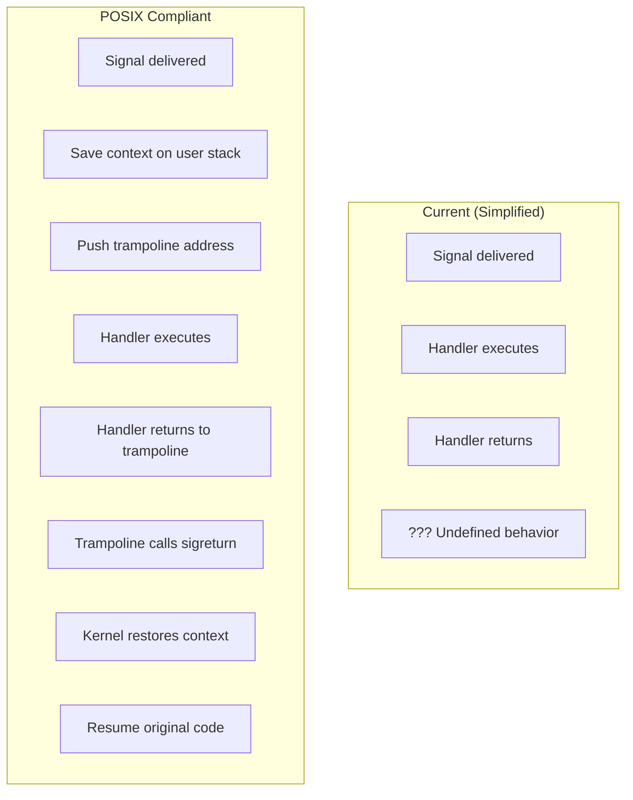
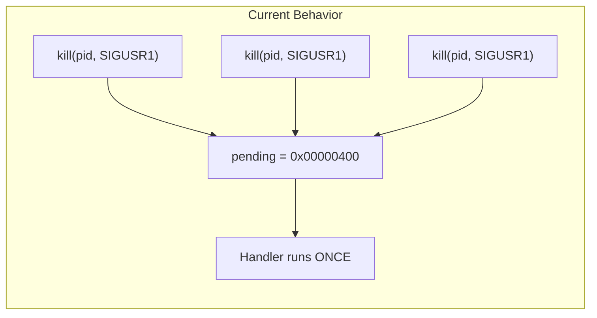
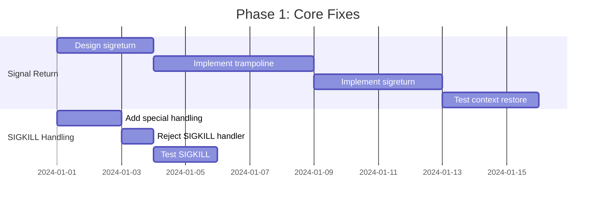
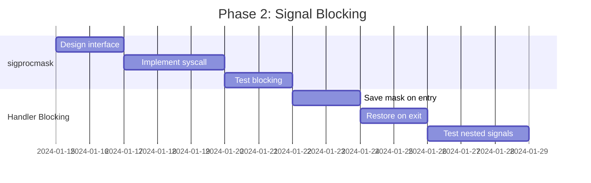
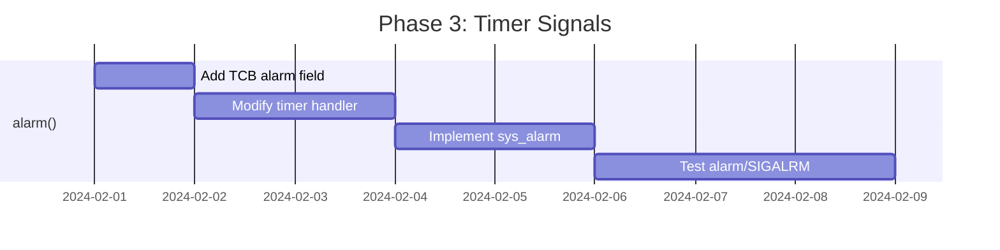
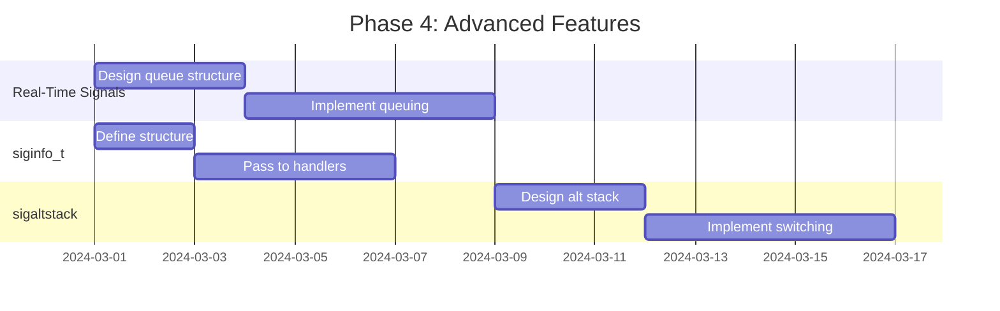

# Limitations and Extensions

## Table of Contents
1. [Current Implementation Limitations](#current-implementation-limitations)
2. [Missing POSIX Features](#missing-posix-features)
3. [Potential Extensions](#potential-extensions)
4. [Implementation Roadmap](#implementation-roadmap)

---

## Current Implementation Limitations

The mCertikOS signal implementation is simplified for educational purposes. Here are the key limitations:

### 1. No Signal Trampoline / Restorer

**Problem**: After a signal handler returns, execution behavior is undefined.



**What's missing**: A signal trampoline that:
1. Saves the original execution context to user stack
2. Provides a return address for the handler
3. Calls `sigreturn()` to restore context

**Impact**: Handlers cannot reliably return to the original execution point.

### 2. No Context Preservation

**Problem**: Original registers are not saved before handler execution.

```c
// Current: Handler clobbers registers
void handler(int signum) {
    // Uses EAX, EBX, etc.
    // Original values lost!
}
```

**What's missing**: Saving and restoring the complete execution context.

### 3. No siginfo_t Support

**Problem**: SA_SIGINFO and extended signal information not implemented.

```c
// POSIX allows this:
void handler(int signum, siginfo_t *info, void *context) {
    printf("Signal from PID %d\n", info->si_pid);
    printf("Fault address: %p\n", info->si_addr);
}

// Current implementation: Only signal number available
void handler(int signum) {
    // No additional info
}
```

### 4. Simplified Blocking

**Problem**: `sa_mask` and signal blocking during handler not fully implemented.

```c
// Expected behavior:
sa.sa_mask = (1 << SIGUSR1);  // Block SIGUSR1 during handler
sigaction(SIGINT, &sa, NULL);

// During SIGINT handler, SIGUSR1 should be blocked
// Current: Not implemented
```

### 5. No Signal Queuing

**Problem**: Multiple instances of the same signal are collapsed.



**Impact**: If three SIGUSR1 signals are sent, only one is delivered.

### 6. No Real-Time Signals

**Problem**: Only standard signals (1-31) supported.

Real-time signals (SIGRTMIN to SIGRTMAX) provide:
- Guaranteed delivery order
- Queue multiple instances
- Additional payload data

### 7. No Alternative Signal Stack

**Problem**: `SA_ONSTACK` and `sigaltstack()` not implemented.

```c
// Useful for handling stack overflow:
stack_t ss;
ss.ss_sp = malloc(SIGSTKSZ);
ss.ss_size = SIGSTKSZ;
sigaltstack(&ss, NULL);

sa.sa_flags = SA_ONSTACK;  // Use alternate stack
sigaction(SIGSEGV, &sa, NULL);  // Can catch stack overflow!
```

### 8. No Process Groups

**Problem**: Cannot send signals to process groups.

```bash
# POSIX allows:
kill -INT -1234  # Send to process group 1234
kill -INT 0      # Send to all in current group
```

---

## Missing POSIX Features

### Complete Feature Matrix

| Feature | POSIX | mCertikOS | Priority |
|---------|-------|-----------|----------|
| Basic signals (1-31) | ✅ | ✅ | - |
| `sigaction()` | ✅ | ⚠️ Partial | High |
| `kill()` | ✅ | ✅ | - |
| `pause()` | ✅ | ⚠️ Basic | Medium |
| Signal handlers | ✅ | ✅ | - |
| Signal blocking | ✅ | ⚠️ Partial | Medium |
| `sigreturn()` | ✅ | ❌ | High |
| `sigprocmask()` | ✅ | ❌ | Medium |
| `sigpending()` | ✅ | ❌ | Low |
| `sigsuspend()` | ✅ | ❌ | Medium |
| `sigqueue()` | ✅ | ❌ | Low |
| Real-time signals | ✅ | ❌ | Low |
| `siginfo_t` | ✅ | ❌ | Medium |
| `sigaltstack()` | ✅ | ❌ | Low |
| Process groups | ✅ | ❌ | Medium |
| `alarm()` | ✅ | ❌ | Medium |
| Signal inheritance | ✅ | ❌ | Medium |

### Legend
- ✅ Fully implemented
- ⚠️ Partially implemented
- ❌ Not implemented

---

## Potential Extensions

### Extension 1: Proper Signal Return (sigreturn)

**Implementation Plan**:

```c
// 1. Define sigreturn syscall
enum __syscall_nr {
    // ...
    SYS_sigreturn,
};

// 2. Modify deliver_signal to save context
void deliver_signal(tf_t *tf, int signum) {
    struct thread *t = tcb_get_entry(get_curid());
    struct sigaction *sa = &t->sigstate.sigactions[signum];

    if (sa->sa_handler != NULL) {
        // Save context on user stack
        uintptr_t user_esp = tf->esp;

        // Push original tf to user stack
        user_esp -= sizeof(tf_t);
        pt_copyout(tf, get_curid(), user_esp, sizeof(tf_t));

        // Push sigreturn trampoline address
        user_esp -= 4;
        uint32_t trampoline = TRAMPOLINE_ADDR;  // Known address
        pt_copyout(&trampoline, get_curid(), user_esp, 4);

        // Update stack pointer
        tf->esp = user_esp;

        // Set up handler call
        tf->regs.eax = signum;
        tf->eip = (uint32_t)sa->sa_handler;
    }
}

// 3. Implement sigreturn syscall
void sys_sigreturn(tf_t *tf) {
    // Restore saved context from user stack
    uintptr_t saved_tf_addr = tf->esp + 4;  // Skip return addr
    tf_t saved_tf;
    pt_copyin(get_curid(), saved_tf_addr, &saved_tf, sizeof(tf_t));

    // Copy back to current trap frame
    *tf = saved_tf;

    // Return will use restored context
}
```

### Extension 2: Complete Signal Blocking

```c
// Add to sig_state
struct sig_state {
    struct sigaction sigactions[NSIG];
    uint32_t pending_signals;
    uint32_t signal_block_mask;  // Already exists
    uint32_t saved_block_mask;   // NEW: saved during handler
};

// Implement sigprocmask syscall
void sys_sigprocmask(tf_t *tf) {
    int how = syscall_get_arg2(tf);
    uint32_t *set = (uint32_t *)syscall_get_arg3(tf);
    uint32_t *oldset = (uint32_t *)syscall_get_arg4(tf);
    struct sig_state *ss = &tcb_get_entry(get_curid())->sigstate;

    if (oldset != NULL) {
        *oldset = ss->signal_block_mask;
    }

    if (set != NULL) {
        switch (how) {
            case SIG_BLOCK:
                ss->signal_block_mask |= *set;
                break;
            case SIG_UNBLOCK:
                ss->signal_block_mask &= ~(*set);
                break;
            case SIG_SETMASK:
                ss->signal_block_mask = *set;
                break;
        }
    }

    syscall_set_errno(tf, E_SUCC);
}
```

### Extension 3: SIGALRM and alarm()

```c
// Add to TCB
struct TCB {
    // ...existing fields...
    uint32_t alarm_ticks;  // Ticks until alarm
};

// Implement alarm syscall
void sys_alarm(tf_t *tf) {
    unsigned int seconds = syscall_get_arg2(tf);
    struct TCB *tcb = tcb_get_entry(get_curid());

    // Return remaining seconds from previous alarm
    unsigned int remaining = tcb->alarm_ticks / TICKS_PER_SEC;

    // Set new alarm
    tcb->alarm_ticks = seconds * TICKS_PER_SEC;

    syscall_set_retval1(tf, remaining);
    syscall_set_errno(tf, E_SUCC);
}

// In timer interrupt handler
void timer_intr_handler(void) {
    intr_eoi();

    // Decrement and check alarms
    for (int i = 0; i < NUM_IDS; i++) {
        if (TCBPool[i].alarm_ticks > 0) {
            TCBPool[i].alarm_ticks--;
            if (TCBPool[i].alarm_ticks == 0) {
                TCBPool[i].sigstate.pending_signals |= (1 << SIGALRM);
            }
        }
    }

    sched_update();
}
```

### Extension 4: SIGSEGV from Page Faults

```c
// Modify page fault handler
void pgflt_handler(tf_t *tf) {
    unsigned int cur_pid = get_curid();
    unsigned int errno = tf->err;
    unsigned int fault_va = rcr2();

    // Check if valid fault (e.g., stack growth)
    if (can_grow_stack(cur_pid, fault_va)) {
        alloc_page(cur_pid, fault_va, PTE_W | PTE_U | PTE_P);
        return;
    }

    // Invalid access - generate SIGSEGV
    struct sig_state *ss = &tcb_get_entry(cur_pid)->sigstate;

    if (ss->sigactions[SIGSEGV].sa_handler != NULL) {
        // User has handler - deliver signal
        ss->pending_signals |= (1 << SIGSEGV);
        // Will be delivered on trap_return
    } else {
        // No handler - terminate with dump
        KERN_INFO("Process %d: Segmentation fault at 0x%08x\n",
                  cur_pid, fault_va);
        proc_terminate(cur_pid);
    }
}
```

---

## Implementation Roadmap

### Phase 1: Core Fixes (High Priority)



### Phase 2: Signal Blocking (Medium Priority)



### Phase 3: Timer Signals (Medium Priority)



### Phase 4: Advanced Features (Low Priority)



---

## Testing Strategy

### Unit Tests

```c
// Test 1: Basic signal delivery
void test_basic_signal() {
    signal_received = 0;
    sa.sa_handler = test_handler;
    sigaction(SIGUSR1, &sa, NULL);
    kill(getpid(), SIGUSR1);
    assert(signal_received == 1);
}

// Test 2: SIGKILL is not catchable
void test_sigkill_uncatchable() {
    sa.sa_handler = test_handler;
    int result = sigaction(SIGKILL, &sa, NULL);
    assert(result == -1);  // Should fail
}

// Test 3: Signal blocking
void test_signal_blocking() {
    uint32_t mask = (1 << SIGUSR1);
    sigprocmask(SIG_BLOCK, &mask, NULL);
    kill(getpid(), SIGUSR1);
    // Signal should be pending but not delivered
    sigprocmask(SIG_UNBLOCK, &mask, NULL);
    // Now signal should be delivered
}
```

### Integration Tests

```bash
# Test shell kill command
$ ./signal_test &
[1] 5
$ kill 2 5
Received SIGINT (2)!

# Test SIGKILL
$ ./infinite_loop &
[1] 6
$ kill 9 6
[1]+  Killed

# Test alarm
$ ./alarm_test
Setting 3 second alarm...
...waiting...
ALARM! 3 seconds passed.
```

---

## Conclusion

The current mCertikOS signal implementation provides:

✅ **Basic signal infrastructure**
- Signal registration via `sigaction()`
- Signal sending via `kill()`
- Signal delivery via `trap_return()`
- Handler execution

⚠️ **Limitations requiring attention**
- No proper context save/restore
- No signal trampoline
- Incomplete blocking
- No SIGKILL special handling

📋 **Future work**
- Implement `sigreturn()` for proper handler return
- Add `alarm()` for SIGALRM
- Improve SIGSEGV generation from page faults
- Complete signal blocking implementation

The implementation serves as an excellent educational foundation for understanding POSIX signals while leaving room for enhancement to achieve full POSIX compliance.

---

**Back to**: [README](./README.md) - Documentation Index
