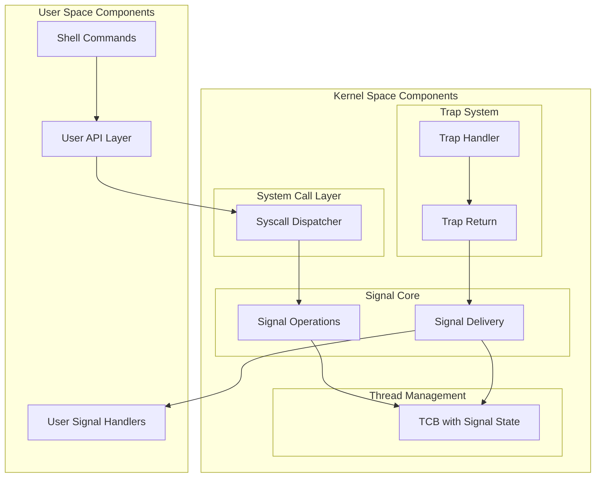
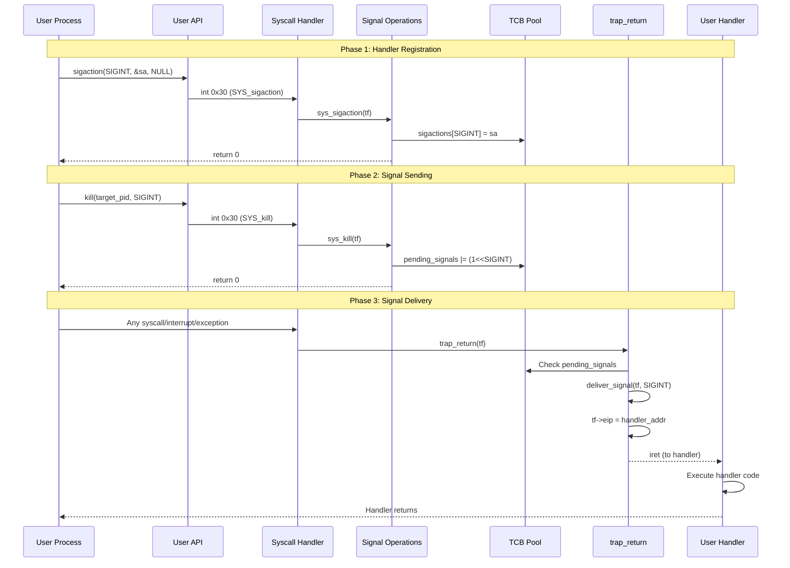
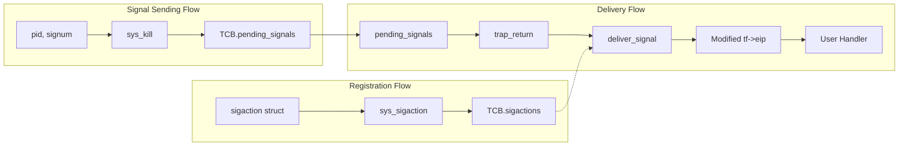

# Signal Implementation Plan

## Table of Contents

1. [High-Level Architecture](#high-level-architecture)
2. [Component Overview](#component-overview)
3. [Component Interactions](#component-interactions)
4. [Low-Level Implementation](#low-level-implementation)
5. [Data Structures](#data-structures)
6. [Function Specifications](#function-specifications)
7. [System Call Interface](#system-call-interface)
8. [Implementation Checklist](#implementation-checklist)

---

# Part 1: High-Level Architecture

## System Overview

The signal mechanism consists of four major subsystems that work together:



---

## Component Overview

### Component 1: Signal State Storage (Kernel)

**Purpose**: Store per-process signal configuration and pending signals

**Location**: `kern/lib/signal.h`, integrated into TCB

**Responsibilities**:
- Store registered signal handlers for each signal (1-31)
- Track pending signals via bitmask
- Track blocked signals via bitmask
- Store signal flags and masks

```
┌─────────────────────────────────────────────────────────┐
│                    Signal State Storage                 │
├─────────────────────────────────────────────────────────┤
│  sigactions[32]     - Handler configuration per signal  │
│  pending_signals    - Bitmask of pending signals        │
│  signal_block_mask  - Bitmask of blocked signals        │
│  saved_context      - Saved execution context (future)  │
└─────────────────────────────────────────────────────────┘
```

---

### Component 2: Signal Registration (Kernel)

**Purpose**: Allow processes to register custom signal handlers

**Location**: `kern/trap/TSyscall/TSyscall.c` - `sys_sigaction()`

**Responsibilities**:
- Validate signal numbers (1-31, not SIGKILL/SIGSTOP)
- Store new handler configuration in TCB
- Return old handler configuration if requested
- Validate handler addresses are in user space

```
┌─────────────────────────────────────────────────────────┐
│                   Signal Registration                   │
├─────────────────────────────────────────────────────────┤
│  Input:  signum, new sigaction, old sigaction pointer   │
│  Output: Success/error, old sigaction (if requested)    │
│  Modify: TCB.sigstate.sigactions[signum]                │
└─────────────────────────────────────────────────────────┘
```

---

### Component 3: Signal Generation (Kernel)

**Purpose**: Mark signals as pending for target processes

**Location**: `kern/trap/TSyscall/TSyscall.c` - `sys_kill()`

**Responsibilities**:
- Validate signal number and target process
- Set pending bit in target's signal state
- Wake sleeping processes to allow signal delivery
- Handle special signals (SIGKILL, SIGSTOP)

```
┌─────────────────────────────────────────────────────────┐
│                    Signal Generation                    │
├─────────────────────────────────────────────────────────┤
│  Input:  target_pid, signum                             │
│  Output: Success/error                                  │
│  Modify: target_TCB.sigstate.pending_signals            │
│          target_TCB.state (if sleeping)                 │
└─────────────────────────────────────────────────────────┘
```

---

### Component 4: Signal Delivery (Kernel)

**Purpose**: Redirect process execution to signal handler

**Location**: `kern/trap/TTrapHandler/TTrapHandler.c`

**Responsibilities**:
- Check for pending, unblocked signals at trap return
- Save current execution context (for proper implementation)
- Modify trap frame EIP to point to handler
- Pass signal number to handler
- Clear pending bit after delivery

```
┌─────────────────────────────────────────────────────────┐
│                    Signal Delivery                      │
├─────────────────────────────────────────────────────────┤
│  Input:  trap_frame, pending signals                    │
│  Output: Modified trap frame                            │
│  Modify: tf->eip, tf->regs.eax, tf->esp (context save)  │
│          TCB.sigstate.pending_signals                   │
└─────────────────────────────────────────────────────────┘
```

---

### Component 5: Signal Waiting (Kernel)

**Purpose**: Allow processes to wait for signals

**Location**: `kern/trap/TSyscall/TSyscall.c` - `sys_pause()`

**Responsibilities**:
- Block process until signal is delivered
- Check for already pending signals
- Integrate with scheduler

```
┌─────────────────────────────────────────────────────────┐
│                     Signal Waiting                      │
├─────────────────────────────────────────────────────────┤
│  Input:  None                                           │
│  Output: Returns when signal delivered                  │
│  Modify: TCB.state (to SLEEP, then back to READY)       │
└─────────────────────────────────────────────────────────┘
```

---

### Component 6: User API Layer

**Purpose**: Provide user-space interface for signal operations

**Location**: `user/include/signal.h`, `user/include/syscall.h`

**Responsibilities**:
- Wrap system calls with C functions
- Define signal constants and structures
- Provide type-safe interface

```
┌─────────────────────────────────────────────────────────┐
│                     User API Layer                      │
├─────────────────────────────────────────────────────────┤
│  sigaction(signum, act, oldact) → int                   │
│  kill(pid, signum) → int                                │
│  pause() → int                                          │
│  alarm(seconds) → unsigned int (future)                 │
└─────────────────────────────────────────────────────────┘
```

---

## Component Interactions

### Interaction Diagram



### Data Flow Diagram



---

# Part 2: Low-Level Implementation

## Data Structures

### Structure 1: `sighandler_t` (Function Pointer Type)

**File**: `kern/lib/signal.h`

```c
typedef void (*sighandler_t)(int);
```

| Field | Type | Description |
|-------|------|-------------|
| (function pointer) | `void (*)(int)` | Pointer to handler function taking signal number |

**Usage**: Defines the signature for signal handler functions.

---

### Structure 2: `struct sigaction`

**File**: `kern/lib/signal.h`

```c
struct sigaction {
    sighandler_t sa_handler;                    // Offset: 0
    void (*sa_sigaction)(int, void*, void*);    // Offset: 4
    int sa_flags;                               // Offset: 8
    void (*sa_restorer)(void);                  // Offset: 12
    uint32_t sa_mask;                           // Offset: 16
};  // Total size: 20 bytes
```

| Field | Type | Size | Description |
|-------|------|------|-------------|
| `sa_handler` | `sighandler_t` | 4 bytes | Pointer to handler function, or SIG_DFL/SIG_IGN |
| `sa_sigaction` | function pointer | 4 bytes | Extended handler (for SA_SIGINFO) - not implemented |
| `sa_flags` | `int` | 4 bytes | Behavior flags (SA_RESTART, SA_NODEFER, etc.) |
| `sa_restorer` | function pointer | 4 bytes | Signal trampoline function - not implemented |
| `sa_mask` | `uint32_t` | 4 bytes | Signals to block during handler execution |

**Special Values for sa_handler**:
```c
#define SIG_DFL ((sighandler_t)0)   // Default action
#define SIG_IGN ((sighandler_t)1)   // Ignore signal
```

---

### Structure 3: `struct sig_state`

**File**: `kern/lib/signal.h`

```c
struct sig_state {
    struct sigaction sigactions[NSIG];   // Offset: 0, Size: 32 * 20 = 640 bytes
    uint32_t pending_signals;            // Offset: 640, Size: 4 bytes
    int signal_block_mask;               // Offset: 644, Size: 4 bytes
};  // Total size: 648 bytes
```

| Field | Type | Size | Description |
|-------|------|------|-------------|
| `sigactions[NSIG]` | `struct sigaction[32]` | 640 bytes | Handler config for each signal |
| `pending_signals` | `uint32_t` | 4 bytes | Bitmask: bit N = signal N pending |
| `signal_block_mask` | `int` | 4 bytes | Bitmask: bit N = signal N blocked |

**Bit Operations**:
```c
// Set signal as pending
pending_signals |= (1 << signum);

// Clear pending signal
pending_signals &= ~(1 << signum);

// Check if pending
if (pending_signals & (1 << signum)) { ... }

// Check if blocked
if (signal_block_mask & (1 << signum)) { ... }

// Check if deliverable (pending AND not blocked)
if ((pending_signals & (1 << signum)) &&
    !(signal_block_mask & (1 << signum))) { ... }
```

---

### Structure 4: `struct thread` (Modified)

**File**: `kern/lib/thread.h`

```c
struct thread {
    uint32_t tid;                    // Thread ID
    t_state state;                   // TSTATE_READY, TSTATE_RUN, TSTATE_SLEEP, TSTATE_DEAD
    uint32_t *stack;                 // Stack pointer
    uint32_t *esp;                   // Saved stack pointer
    uint32_t *ebp;                   // Saved base pointer
    uint32_t eip;                    // Saved instruction pointer
    uint32_t eflags;                 // Saved flags
    uint32_t *page_dir;              // Page directory
    struct thread *next;             // Next thread in list
    struct sig_state sigstate;       // Signal state (NEW)
};
```

---

### Structure 5: `struct TCB` (Thread Control Block)

**File**: `kern/thread/PTCBIntro/PTCBIntro.c`

```c
struct TCB {
    t_state state;                   // Thread state
    unsigned int prev;               // Previous TCB index
    unsigned int next;               // Next TCB index
    void *channel;                   // Sleep channel
    struct file *openfiles[NOFILE];  // Open files
    struct inode *cwd;               // Current working directory
    struct sig_state sigstate;       // Signal state (NEEDS TO BE ADDED)
};
```

**Note**: The TCB structure needs to be extended to include `sig_state`.

---

### Structure 6: `tf_t` (Trap Frame)

**File**: `kern/lib/trap.h`

```c
typedef struct pushregs {
    uint32_t edi;      // Offset: 0
    uint32_t esi;      // Offset: 4
    uint32_t ebp;      // Offset: 8
    uint32_t oesp;     // Offset: 12 (original ESP, not useful)
    uint32_t ebx;      // Offset: 16
    uint32_t edx;      // Offset: 20
    uint32_t ecx;      // Offset: 24
    uint32_t eax;      // Offset: 28
} pushregs;

typedef struct tf_t {
    pushregs regs;     // Offset: 0, Size: 32 bytes
    uint16_t es;       // Offset: 32
    uint16_t ds;       // Offset: 36
    uint32_t trapno;   // Offset: 40
    uint32_t err;      // Offset: 44
    uintptr_t eip;     // Offset: 48 ← KEY FOR SIGNAL DELIVERY
    uint16_t cs;       // Offset: 52
    uint32_t eflags;   // Offset: 56
    uintptr_t esp;     // Offset: 60 ← User stack pointer
    uint16_t ss;       // Offset: 64
} tf_t;
```

**Critical Fields for Signals**:
- `tf->eip`: Modified to point to handler address
- `tf->regs.eax`: Set to signal number (handler argument)
- `tf->esp`: May be modified for context saving (advanced)

---

### Constants and Macros

**File**: `kern/lib/signal.h`

```c
// Maximum number of signals
#define NSIG 32

// Signal numbers (POSIX standard)
#define SIGHUP    1    // Hangup
#define SIGINT    2    // Interrupt (Ctrl+C)
#define SIGQUIT   3    // Quit
#define SIGILL    4    // Illegal instruction
#define SIGTRAP   5    // Trace trap
#define SIGABRT   6    // Abort
#define SIGBUS    7    // Bus error
#define SIGFPE    8    // Floating point exception
#define SIGKILL   9    // Kill (uncatchable)
#define SIGUSR1   10   // User signal 1
#define SIGSEGV   11   // Segmentation fault
#define SIGUSR2   12   // User signal 2
#define SIGPIPE   13   // Broken pipe
#define SIGALRM   14   // Alarm
#define SIGTERM   15   // Termination
#define SIGCHLD   17   // Child status changed
#define SIGCONT   18   // Continue
#define SIGSTOP   19   // Stop (uncatchable)
#define SIGTSTP   20   // Terminal stop

// Signal handler special values
#define SIG_DFL ((sighandler_t)0)
#define SIG_IGN ((sighandler_t)1)

// Signal action flags
#define SA_NOCLDSTOP 0x00000001
#define SA_NOCLDWAIT 0x00000002
#define SA_SIGINFO   0x00000004
#define SA_ONSTACK   0x08000000
#define SA_RESTART   0x10000000
#define SA_NODEFER   0x40000000
#define SA_RESETHAND 0x80000000
```

---

## Function Specifications

### Function 1: `sys_sigaction()`

**File**: `kern/trap/TSyscall/TSyscall.c`

**Purpose**: Register or examine signal handlers

```c
void sys_sigaction(tf_t *tf);
```

**Input Parameters** (from trap frame):
| Parameter | Register | Type | Description |
|-----------|----------|------|-------------|
| signum | EBX (arg2) | int | Signal number (1-31) |
| act | ECX (arg3) | `struct sigaction *` | New action (or NULL) |
| oldact | EDX (arg4) | `struct sigaction *` | Where to store old action (or NULL) |

**Algorithm**:
```
1. Extract arguments from trap frame
2. Validate signum (must be 1 <= signum < NSIG)
3. Reject SIGKILL and SIGSTOP (cannot have handlers)
4. Get current thread's TCB
5. If oldact != NULL:
   a. Copy current sigaction to user memory
6. If act != NULL:
   a. Validate act pointer is in user space
   b. Copy new sigaction from user memory to TCB
7. Set errno to E_SUCC
```

**Data Modified**:
- `TCB.sigstate.sigactions[signum]`: Updated with new action
- `*oldact` (user memory): Filled with old action

**Return**: Sets `tf->regs.eax` (errno) to E_SUCC or error code

**Error Codes**:
- `E_INVAL_SIGNUM`: Invalid signal number or SIGKILL/SIGSTOP
- `E_INVAL_ADDR`: Invalid user pointer

---

### Function 2: `sys_kill()`

**File**: `kern/trap/TSyscall/TSyscall.c`

**Purpose**: Send a signal to a process

```c
void sys_kill(tf_t *tf);
```

**Input Parameters** (from trap frame):
| Parameter | Register | Type | Description |
|-----------|----------|------|-------------|
| pid | EBX (arg2) | int | Target process ID |
| signum | ECX (arg3) | int | Signal number to send |

**Algorithm**:
```
1. Extract pid and signum from trap frame
2. Validate signum (must be 1 <= signum < NSIG)
3. Validate pid (must be 0 <= pid < NUM_IDS)
4. Get target TCB
5. Check target process exists (state != TSTATE_DEAD)
6. Special handling for SIGKILL:
   a. If SIGKILL, terminate process immediately (future)
7. Set pending bit: target_TCB.pending_signals |= (1 << signum)
8. If target is sleeping (TSTATE_SLEEP):
   a. Wake up the target process
9. Set errno to E_SUCC
```

**Data Modified**:
- `target_TCB.sigstate.pending_signals`: Bit set for signum
- `target_TCB.state`: Changed from TSTATE_SLEEP to TSTATE_READY (if applicable)

**Return**: Sets `tf->regs.eax` (errno) to E_SUCC or error code

**Error Codes**:
- `E_INVAL_SIGNUM`: Invalid signal number
- `E_INVAL_PID`: Invalid or non-existent process

---

### Function 3: `sys_pause()`

**File**: `kern/trap/TSyscall/TSyscall.c`

**Purpose**: Suspend process until a signal is delivered

```c
void sys_pause(tf_t *tf);
```

**Input Parameters**: None

**Algorithm**:
```
1. Get current thread's TCB
2. Check if any signals are already pending and unblocked:
   a. deliverable = pending_signals & ~signal_block_mask
   b. If deliverable != 0, return immediately (signal will be delivered)
3. Set thread state to TSTATE_SLEEP
4. Call thread_yield() to switch to another thread
5. When woken up (by signal), set errno to E_SUCC
```

**Data Modified**:
- `TCB.state`: Set to TSTATE_SLEEP, then back to TSTATE_READY

**Return**: Sets `tf->regs.eax` (errno) to E_SUCC

---

### Function 4: `deliver_signal()`

**File**: `kern/trap/TTrapHandler/TTrapHandler.c`

**Purpose**: Modify trap frame to redirect execution to signal handler

```c
static void deliver_signal(tf_t *tf, int signum);
```

**Input Parameters**:
| Parameter | Type | Description |
|-----------|------|-------------|
| tf | `tf_t *` | Pointer to trap frame |
| signum | int | Signal number being delivered |

**Algorithm**:
```
1. Get current thread's TCB
2. Get sigaction for this signal: sa = &TCB.sigstate.sigactions[signum]
3. If sa->sa_handler == SIG_IGN:
   a. Do nothing (ignore signal)
   b. Return
4. If sa->sa_handler == SIG_DFL:
   a. Execute default action (terminate, ignore, stop, etc.)
   b. Return
5. Otherwise (custom handler):
   a. [FUTURE] Save current context on user stack
   b. [FUTURE] Push signal trampoline return address
   c. Set tf->regs.eax = signum (pass as argument)
   d. Set tf->eip = (uint32_t)sa->sa_handler
   e. [FUTURE] Apply sa_mask to signal_block_mask
   f. [FUTURE] Block current signal during handler (unless SA_NODEFER)
```

**Data Modified**:
- `tf->eip`: Set to handler address
- `tf->regs.eax`: Set to signal number
- `tf->esp`: (Future) Adjusted for saved context
- `TCB.sigstate.signal_block_mask`: (Future) Updated during handler

---

### Function 5: `trap_return()`

**File**: `kern/trap/TTrapHandler/TTrapHandler.c`

**Purpose**: Return to user space, delivering signals if pending

```c
void trap_return(void *tf);
```

**Input Parameters**:
| Parameter | Type | Description |
|-----------|------|-------------|
| tf | `void *` | Pointer to trap frame (cast to tf_t *) |

**Algorithm**:
```
1. Get current thread's TCB
2. Get pending signals: pending = TCB.sigstate.pending_signals
3. Get blocked signals: blocked = TCB.sigstate.signal_block_mask
4. Calculate deliverable: deliverable = pending & ~blocked
5. If deliverable != 0:
   a. For signum = 1 to NSIG-1:
      i.  If (deliverable & (1 << signum)):
          - Clear pending bit: pending_signals &= ~(1 << signum)
          - Call deliver_signal(tf, signum)
          - Break (only deliver one signal per return)
6. Execute IRET sequence:
   a. movl tf, %esp    ; Point ESP to trap frame
   b. popal            ; Restore general registers
   c. popl %es         ; Restore ES
   d. popl %ds         ; Restore DS
   e. addl $8, %esp    ; Skip trapno and err
   f. iret             ; Return to user space
```

**Data Modified**:
- `TCB.sigstate.pending_signals`: Pending bit cleared
- CPU registers: All restored from trap frame (potentially modified)

---

### Function 6: `tcb_get_sigstate()` (New Helper)

**File**: `kern/thread/PTCBIntro/PTCBIntro.c`

**Purpose**: Get pointer to a process's signal state

```c
struct sig_state* tcb_get_sigstate(unsigned int pid);
```

**Input Parameters**:
| Parameter | Type | Description |
|-----------|------|-------------|
| pid | unsigned int | Process ID |

**Return**: Pointer to `sig_state` structure for the given process

**Implementation**:
```c
struct sig_state* tcb_get_sigstate(unsigned int pid) {
    return &TCBPool[pid].sigstate;
}
```

---

### Function 7: `sigstate_init()` (New Helper)

**File**: `kern/thread/PTCBIntro/PTCBIntro.c`

**Purpose**: Initialize signal state for a new process

```c
void sigstate_init(unsigned int pid);
```

**Input Parameters**:
| Parameter | Type | Description |
|-----------|------|-------------|
| pid | unsigned int | Process ID |

**Algorithm**:
```
1. Get sigstate for pid
2. Clear all sigactions (set to default)
3. Clear pending_signals = 0
4. Clear signal_block_mask = 0
```

**Implementation**:
```c
void sigstate_init(unsigned int pid) {
    struct sig_state *ss = &TCBPool[pid].sigstate;
    memset(ss->sigactions, 0, sizeof(ss->sigactions));
    ss->pending_signals = 0;
    ss->signal_block_mask = 0;
}
```

**Called by**: `tcb_init_at_id()` during process creation

---

## System Call Interface

### System Call Numbers

**File**: `kern/lib/syscall.h`

```c
enum __syscall_nr {
    // ... existing syscalls ...
    SYS_sigaction,    // Register signal handler
    SYS_kill,         // Send signal to process
    SYS_pause,        // Wait for signal
    SYS_alarm,        // Set alarm timer (future)
    SYS_sigprocmask,  // Modify signal mask (future)
    SYS_sigreturn,    // Return from signal handler (future)
    MAX_SYSCALL_NR
};
```

### Error Codes

**File**: `kern/lib/syscall.h`

```c
enum __error_nr {
    // ... existing error codes ...
    E_INVAL_SIGNUM,   // Invalid signal number
    E_INVAL_HANDLER,  // Invalid signal handler
    MAX_ERROR_NR
};
```

### User-Space Wrappers

**File**: `user/include/syscall.h`

```c
static gcc_inline int
sys_sigaction(int signum, const struct sigaction *act,
              struct sigaction *oldact)
{
    int errno;
    asm volatile("int %1"
                 : "=a" (errno)
                 : "i" (T_SYSCALL),
                   "a" (SYS_sigaction),
                   "b" (signum),
                   "c" (act),
                   "d" (oldact)
                 : "cc", "memory");
    return errno ? -1 : 0;
}

static gcc_inline int
sys_kill(int pid, int signum)
{
    int errno;
    asm volatile("int %1"
                 : "=a" (errno)
                 : "i" (T_SYSCALL),
                   "a" (SYS_kill),
                   "b" (pid),
                   "c" (signum)
                 : "cc", "memory");
    return errno ? -1 : 0;
}

static gcc_inline int
sys_pause(void)
{
    int errno;
    asm volatile("int %1"
                 : "=a" (errno)
                 : "i" (T_SYSCALL),
                   "a" (SYS_pause)
                 : "cc", "memory");
    return errno ? -1 : 0;
}
```

---

## Implementation Checklist

### Phase 1: Core Infrastructure

- [ ] **1.1** Add `sig_state` to TCB structure in `PTCBIntro.c`
- [ ] **1.2** Add `sigstate_init()` function
- [ ] **1.3** Call `sigstate_init()` in `tcb_init_at_id()`
- [ ] **1.4** Add `tcb_get_sigstate()` helper function
- [ ] **1.5** Verify `signal.h` definitions are correct
- [ ] **1.6** Add signal error codes to `syscall.h`

### Phase 2: System Calls

- [ ] **2.1** Implement `sys_sigaction()` in `TSyscall.c`
- [ ] **2.2** Implement `sys_kill()` in `TSyscall.c`
- [ ] **2.3** Implement `sys_pause()` in `TSyscall.c`
- [ ] **2.4** Add syscall dispatch entries
- [ ] **2.5** Add includes for `signal.h` and `thread.h`

### Phase 3: Signal Delivery

- [ ] **3.1** Implement `deliver_signal()` in `TTrapHandler.c`
- [ ] **3.2** Modify `trap_return()` to check pending signals
- [ ] **3.3** Handle SIG_DFL (default actions)
- [ ] **3.4** Handle SIG_IGN (ignore)
- [ ] **3.5** Handle SIGKILL specially (cannot catch)

### Phase 4: User Space

- [ ] **4.1** Create/verify `user/include/signal.h`
- [ ] **4.2** Add syscall wrappers to `user/include/syscall.h`
- [ ] **4.3** Implement `sigaction()` wrapper function
- [ ] **4.4** Implement `kill()` wrapper function
- [ ] **4.5** Implement `pause()` wrapper function

### Phase 5: Shell Integration

- [ ] **5.1** Implement `shell_kill` command
- [ ] **5.2** Implement `shell_trap` command
- [ ] **5.3** Test signal sending between processes

### Phase 6: Testing

- [ ] **6.1** Create `signal_test.c` test program
- [ ] **6.2** Test handler registration
- [ ] **6.3** Test signal delivery
- [ ] **6.4** Test SIGKILL behavior
- [ ] **6.5** Test pause() functionality
- [ ] **6.6** Test blocked signals

### Phase 7: Advanced Features (Future)

- [ ] **7.1** Implement signal context saving
- [ ] **7.2** Implement signal trampoline
- [ ] **7.3** Implement `sigreturn()` syscall
- [ ] **7.4** Implement `alarm()` syscall
- [ ] **7.5** Implement `sigprocmask()` syscall
- [ ] **7.6** Generate SIGSEGV from page faults

---

## File Modification Summary

| File | Action | Changes |
|------|--------|---------|
| `kern/lib/signal.h` | Verify/Create | Signal definitions, structures |
| `kern/lib/thread.h` | Modify | Add sig_state to struct thread |
| `kern/lib/syscall.h` | Modify | Add syscall numbers, error codes |
| `kern/thread/PTCBIntro/PTCBIntro.c` | Modify | Add sig_state to TCB, add helpers |
| `kern/thread/PTCBIntro/export.h` | Modify | Export new functions |
| `kern/trap/TSyscall/TSyscall.c` | Modify | Implement signal syscalls |
| `kern/trap/TTrapHandler/TTrapHandler.c` | Modify | Implement signal delivery |
| `user/include/signal.h` | Verify/Create | User-space signal API |
| `user/include/syscall.h` | Modify | Add syscall wrappers |
| `user/signal_test.c` | Verify/Create | Test program |
| `user/shell/shell.c` | Modify | Add kill/trap commands |

---

## Quick Reference: Key Code Patterns

### Setting a Signal Pending
```c
target_tcb->sigstate.pending_signals |= (1 << signum);
```

### Checking for Deliverable Signals
```c
uint32_t pending = tcb->sigstate.pending_signals;
uint32_t blocked = tcb->sigstate.signal_block_mask;
uint32_t deliverable = pending & ~blocked;
if (deliverable != 0) {
    // Find lowest signal number
    for (int sig = 1; sig < NSIG; sig++) {
        if (deliverable & (1 << sig)) {
            deliver_signal(tf, sig);
            break;
        }
    }
}
```

### Redirecting to Handler
```c
tf->regs.eax = signum;              // Signal number as argument
tf->eip = (uint32_t)sa->sa_handler; // Jump to handler
```

### Clearing Pending Signal
```c
tcb->sigstate.pending_signals &= ~(1 << signum);
```

---

# Part 9: Verified Working Implementation (Added After Debug)

This section contains the **actual working implementation** verified through testing. Use this as the authoritative reference when implementing signals from scratch.

## Critical Implementation Details

### 1. Signal State in TCB

**File**: `kern/lib/signal.h`

```c
#define NSIG 32
#define SIGKILL 9
#define SIGTERM 15

typedef void (*sighandler_t)(int);

struct sigaction {
    sighandler_t sa_handler;
    void (*sa_sigaction)(int, void*, void*);
    int sa_flags;
    void (*sa_restorer)(void);
    uint32_t sa_mask;
};

struct sig_state {
    struct sigaction sigactions[NSIG];
    uint32_t pending_signals;
    uint32_t signal_block_mask;
    uint32_t saved_esp_addr;    // For sigreturn - address on user stack
    uint32_t saved_eip_addr;    // For sigreturn - address on user stack
    int in_signal_handler;
};
```

**File**: `kern/thread/PTCBIntro/PTCBIntro.c` - Add to TCB struct:

```c
struct sig_state sigstate;
```

### 2. TCB Signal Accessor Functions

**File**: `kern/thread/PTCBIntro/PTCBIntro.c`

```c
struct sigaction* tcb_get_sigaction(unsigned int pid, int signum) {
    if (signum < 0 || signum >= NSIG) return NULL;
    return &TCBPool[pid].sigstate.sigactions[signum];
}

void tcb_set_sigaction(unsigned int pid, int signum, struct sigaction *act) {
    if (signum < 0 || signum >= NSIG) return;
    if (act != NULL) {
        TCBPool[pid].sigstate.sigactions[signum] = *act;
    }
}

uint32_t tcb_get_pending_signals(unsigned int pid) {
    return TCBPool[pid].sigstate.pending_signals;
}

void tcb_set_pending_signals(unsigned int pid, uint32_t signals) {
    TCBPool[pid].sigstate.pending_signals = signals;
}

void tcb_add_pending_signal(unsigned int pid, int signum) {
    TCBPool[pid].sigstate.pending_signals |= (1 << signum);
}

void tcb_clear_pending_signal(unsigned int pid, int signum) {
    TCBPool[pid].sigstate.pending_signals &= ~(1 << signum);
}

void tcb_set_signal_context(unsigned int pid, uint32_t saved_esp_addr, uint32_t saved_eip_addr) {
    TCBPool[pid].sigstate.saved_esp_addr = saved_esp_addr;
    TCBPool[pid].sigstate.saved_eip_addr = saved_eip_addr;
    TCBPool[pid].sigstate.in_signal_handler = 1;
}

void tcb_get_signal_context(unsigned int pid, uint32_t *saved_esp_addr, uint32_t *saved_eip_addr) {
    *saved_esp_addr = TCBPool[pid].sigstate.saved_esp_addr;
    *saved_eip_addr = TCBPool[pid].sigstate.saved_eip_addr;
}

void tcb_clear_signal_context(unsigned int pid) {
    TCBPool[pid].sigstate.saved_esp_addr = 0;
    TCBPool[pid].sigstate.saved_eip_addr = 0;
    TCBPool[pid].sigstate.in_signal_handler = 0;
}

int tcb_in_signal_handler(unsigned int pid) {
    return TCBPool[pid].sigstate.in_signal_handler;
}
```

### 3. Syscall Implementations

**File**: `kern/trap/TSyscall/TSyscall.c`

#### sys_sigaction - Register Signal Handler

```c
void sys_sigaction(tf_t *tf) {
    int signum = syscall_get_arg2(tf);
    struct sigaction *user_act = (struct sigaction *)syscall_get_arg3(tf);
    struct sigaction *user_oldact = (struct sigaction *)syscall_get_arg4(tf);
    unsigned int cur_pid = get_curid();
    struct sigaction kern_act;

    if (signum < 1 || signum >= NSIG) {
        syscall_set_errno(tf, E_INVAL_SIGNUM);
        return;
    }

    // Save old handler if requested
    if (user_oldact != NULL) {
        struct sigaction *cur_act = tcb_get_sigaction(cur_pid, signum);
        if (cur_act != NULL) {
            pt_copyout((void*)cur_act, cur_pid, (uintptr_t)user_oldact, sizeof(struct sigaction));
        }
    }

    // Set new handler if provided - MUST USE pt_copyin!
    if (user_act != NULL) {
        pt_copyin(cur_pid, (uintptr_t)user_act, (void*)&kern_act, sizeof(struct sigaction));
        tcb_set_sigaction(cur_pid, signum, &kern_act);
    }

    syscall_set_errno(tf, E_SUCC);
}
```

#### sys_kill - Send Signal

```c
void sys_kill(tf_t *tf) {
    int pid = syscall_get_arg2(tf);
    int signum = syscall_get_arg3(tf);

    if (signum < 1 || signum >= NSIG) {
        syscall_set_errno(tf, E_INVAL_SIGNUM);
        return;
    }

    if (pid < 0 || pid >= NUM_IDS || tcb_get_state(pid) == TSTATE_DEAD) {
        syscall_set_errno(tf, E_INVAL_PID);
        return;
    }

    // SIGKILL is special - terminate IMMEDIATELY
    if (signum == SIGKILL) {
        tcb_set_state(pid, TSTATE_DEAD);
        tqueue_remove(NUM_IDS, pid);
        tcb_set_pending_signals(pid, 0);
        syscall_set_errno(tf, E_SUCC);
        return;
    }

    tcb_add_pending_signal(pid, signum);

    // Wake up sleeping processes
    if (tcb_is_sleeping(pid)) {
        void *chan = tcb_get_channel(pid);
        if (chan != NULL) {
            thread_wakeup(chan);
        }
    }

    syscall_set_errno(tf, E_SUCC);
}
```

#### sys_sigreturn - Return from Handler

```c
void sys_sigreturn(tf_t *tf) {
    unsigned int cur_pid = get_curid();
    uint32_t saved_esp_addr, saved_eip_addr;
    uint32_t saved_esp, saved_eip;

    tcb_get_signal_context(cur_pid, &saved_esp_addr, &saved_eip_addr);

    if (saved_esp_addr == 0 || saved_eip_addr == 0) {
        syscall_set_errno(tf, E_INVAL_ADDR);
        return;
    }

    pt_copyin(cur_pid, saved_esp_addr, &saved_esp, sizeof(uint32_t));
    pt_copyin(cur_pid, saved_eip_addr, &saved_eip, sizeof(uint32_t));

    tcb_clear_signal_context(cur_pid);

    // Restore original execution context
    tf->esp = saved_esp;
    tf->eip = saved_eip;

    syscall_set_errno(tf, E_SUCC);
}
```

### 4. Signal Delivery (The Most Critical Part)

**File**: `kern/trap/TTrapHandler/TTrapHandler.c`

```c
static void deliver_signal(tf_t *tf, int signum) {
    unsigned int cur_pid = get_curid();
    struct sigaction *sa = tcb_get_sigaction(cur_pid, signum);

    if (sa == NULL || sa->sa_handler == NULL) {
        return;  // No handler registered
    }

    // Save original context
    uint32_t orig_esp = tf->esp;
    uint32_t orig_eip = tf->eip;
    uint32_t new_esp = orig_esp;

    // Stack layout (growing DOWN):
    //   saved_eip        <- Address saved for sigreturn
    //   saved_esp        <- Address saved for sigreturn
    //   trampoline[12]   <- Executable code
    //   signum           <- Argument to handler
    //   trampoline_addr  <- Return address
    //   [new ESP]

    // Push saved_eip
    new_esp -= 4;
    pt_copyout(&orig_eip, cur_pid, new_esp, sizeof(uint32_t));
    uint32_t saved_eip_addr = new_esp;

    // Push saved_esp
    new_esp -= 4;
    pt_copyout(&orig_esp, cur_pid, new_esp, sizeof(uint32_t));
    uint32_t saved_esp_addr = new_esp;

    // Push trampoline code
    uint8_t trampoline[12] = {
        0xB8, SYS_sigreturn, 0x00, 0x00, 0x00,  // mov eax, SYS_sigreturn
        0xCD, 0x30,                              // int 0x30
        0xEB, 0xFE,                              // jmp $ (safety loop)
        0x90, 0x90, 0x90                         // nop padding
    };
    new_esp -= 12;
    pt_copyout(trampoline, cur_pid, new_esp, 12);
    uint32_t trampoline_addr = new_esp;

    // Align stack
    new_esp = new_esp & ~3;

    // Push signal number (argument) - BEFORE return address!
    new_esp -= 4;
    uint32_t sig_arg = signum;
    pt_copyout(&sig_arg, cur_pid, new_esp, sizeof(uint32_t));

    // Push return address (trampoline) - ON TOP!
    new_esp -= 4;
    pt_copyout(&trampoline_addr, cur_pid, new_esp, sizeof(uint32_t));

    // Save context addresses in TCB
    tcb_set_signal_context(cur_pid, saved_esp_addr, saved_eip_addr);

    // Redirect execution to handler
    tf->esp = new_esp;
    tf->eip = (uint32_t)sa->sa_handler;
}

static void handle_pending_signals(tf_t *tf) {
    unsigned int cur_pid = get_curid();
    uint32_t pending = tcb_get_pending_signals(cur_pid);

    if (pending != 0) {
        for (int signum = 1; signum < NSIG; signum++) {
            if (pending & (1 << signum)) {
                tcb_clear_pending_signal(cur_pid, signum);

                if (signum == SIGKILL) {
                    tcb_set_state(cur_pid, TSTATE_DEAD);
                    tqueue_remove(NUM_IDS, cur_pid);
                    thread_exit();  // Never returns
                    return;
                }

                deliver_signal(tf, signum);
                break;  // Deliver one signal at a time
            }
        }
    }
}
```

### 5. CRITICAL: Trap Handler Ordering

**File**: `kern/trap/TTrapHandler/TTrapHandler.c`

```c
void trap(tf_t *tf) {
    unsigned int cur_pid = get_curid();

    set_pdir_base(0);  // Switch to KERNEL page table

    // ... handle interrupt/syscall/exception ...

    // ┌─────────────────────────────────────────────────────────────┐
    // │ CRITICAL: Handle signals BEFORE switching to user PT!      │
    // │ The kernel PT has identity mapping for physical memory.    │
    // │ User PT does NOT - pt_copyout() would use wrong addresses! │
    // └─────────────────────────────────────────────────────────────┘
    if (cur_pid != 0) {
        handle_pending_signals(tf);  // MUST be before set_pdir_base(cur_pid)!
    }

    set_pdir_base(cur_pid);  // Switch to USER page table
    // Return to user space with (possibly modified) trapframe
}
```

### 6. Thread Exit for Process Termination

**File**: `kern/thread/PThread/PThread.c`

```c
// thread_exit: Switch away without re-queuing current process
// Used when process is terminated (SIGKILL)
void thread_exit(void) {
    unsigned int old_cur_pid;
    unsigned int new_cur_pid;

    spinlock_acquire(&sched_lk);

    old_cur_pid = get_curid();
    // Do NOT set state to READY or enqueue - process is dead!

    new_cur_pid = tqueue_dequeue(NUM_IDS);
    if (new_cur_pid == NUM_IDS) {
        KERN_PANIC("thread_exit: no threads to switch to!\n");
    }

    tcb_set_state(new_cur_pid, TSTATE_RUN);
    set_curid(new_cur_pid);

    spinlock_release(&sched_lk);
    kctx_switch(old_cur_pid, new_cur_pid);
    // Never returns
}
```

### 7. Syscall Dispatch

**File**: `kern/trap/TDispatch/TDispatch.c`

Add to switch statement:
```c
case SYS_sigaction:
    sys_sigaction(tf);
    break;
case SYS_kill:
    sys_kill(tf);
    break;
case SYS_pause:
    sys_pause(tf);
    break;
case SYS_sigreturn:
    sys_sigreturn(tf);
    break;
```

### 8. User Space Signal Library

**File**: `user/lib/signal.c`

```c
#include <proc.h>
#include <signal.h>
#include <syscall.h>

int sigaction(int signum, const struct sigaction *act, struct sigaction *oldact) {
    return sys_sigaction(signum, act, oldact);
}

int kill(pid_t pid, int sig) {
    return sys_kill(pid, sig);
}

int pause(void) {
    return sys_pause();
}
```

## Common Mistakes to Avoid

### Mistake 1: Direct User Pointer Dereference
```c
// WRONG - accessing user memory directly
tcb_set_sigaction(pid, signum, user_act);

// CORRECT - copy from user space first
struct sigaction kern_act;
pt_copyin(pid, (uintptr_t)user_act, &kern_act, sizeof(struct sigaction));
tcb_set_sigaction(pid, signum, &kern_act);
```

### Mistake 2: Wrong Stack Order (cdecl)
```c
// WRONG - argument before return address
push argument;
push return_address;  // CPU pops return_address expecting it to be first

// CORRECT - return address on top (pushed last)
push argument;        // at [ESP+4] after push of return_address
push return_address;  // at [ESP] - popped by ret instruction
```

### Mistake 3: Signal Handling with User Page Table
```c
// WRONG - using user page table for kernel operations
set_pdir_base(cur_pid);
handle_pending_signals(tf);  // pt_copyout uses wrong addresses!

// CORRECT - use kernel page table for signal delivery
handle_pending_signals(tf);  // kernel PT has identity mapping
set_pdir_base(cur_pid);
```

### Mistake 4: Using thread_yield() for Termination
```c
// WRONG - re-queues the terminated process
terminate_process(pid);
thread_yield();  // Sets DEAD process back to READY!

// CORRECT - use thread_exit() which doesn't re-queue
terminate_process(pid);
thread_exit();  // Switches without re-queuing
```

### Mistake 5: Waiting for SIGKILL Delivery
```c
// WRONG - blocked process never runs to check signals
tcb_add_pending_signal(pid, SIGKILL);
// Process might never run if blocked on IPC!

// CORRECT - terminate immediately in sys_kill
if (signum == SIGKILL) {
    tcb_set_state(pid, TSTATE_DEAD);
    tqueue_remove(NUM_IDS, pid);
    return;
}
```

---

**Back to**: [README.md](README.md) - Documentation Index

