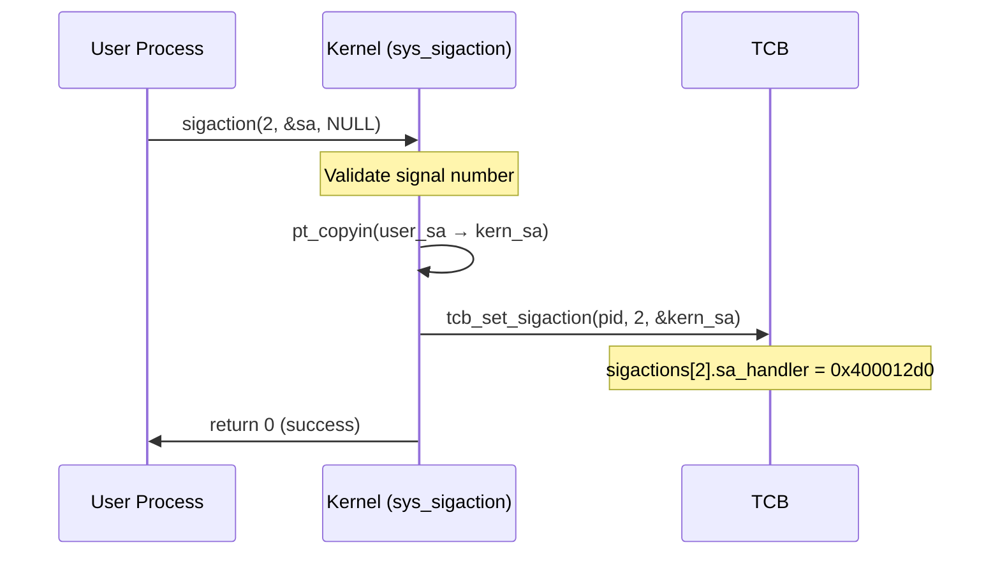
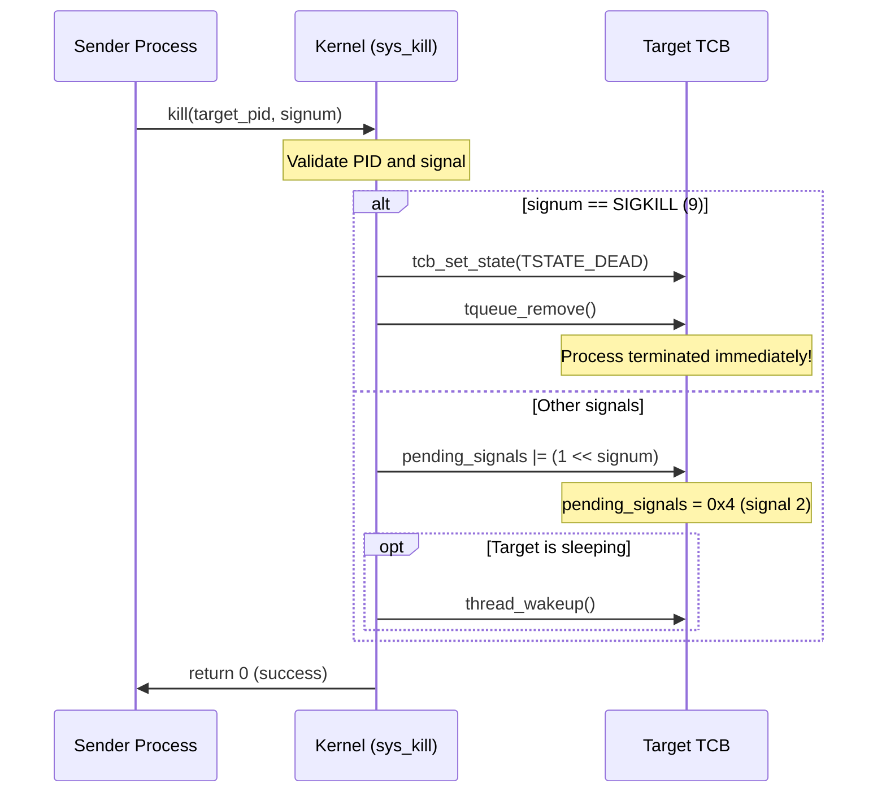
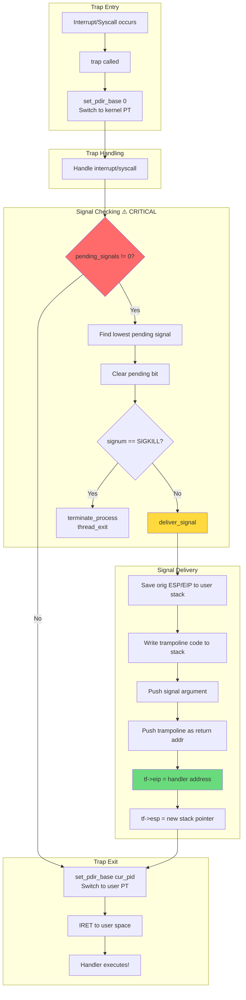
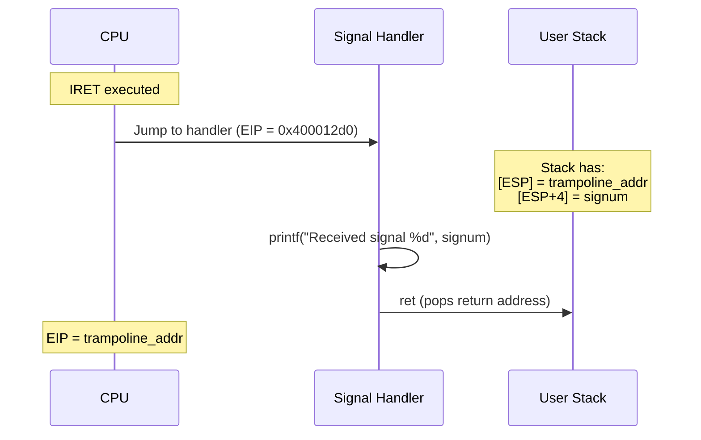
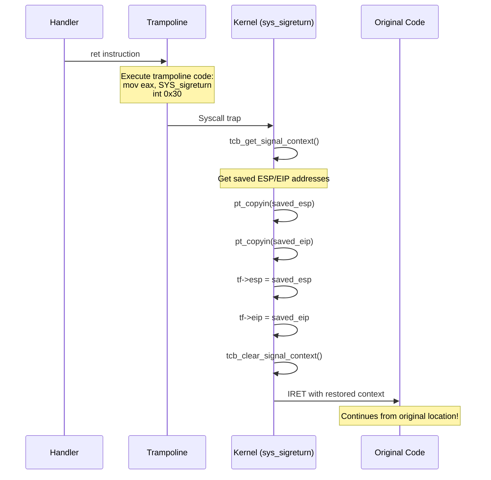
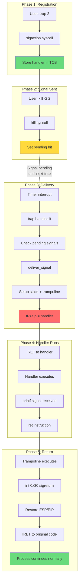

# mCertikOS Signal Mechanism Documentation

## Overview

This documentation provides a comprehensive explanation of the POSIX-compliant signal mechanism implementation in mCertikOS. The documentation is designed for students studying operating systems to understand how signals work at a low level.

## Documentation Structure

```
docs/
├── README.md                      (this file)
├── instructions.md                (project requirements)
├── 01_signal_fundamentals.md      (what signals are, comparison with interrupts/traps)
├── 02_signal_architecture.md      (system architecture and data structures)
├── 03_signal_delivery.md          (how signals are delivered to processes)
├── 04_signal_handlers.md          (handler registration and execution)
├── 05_user_kernel_transition.md   (privilege level transitions)
├── 06_execution_flow.md           (complete flow with diagrams)
├── 07_focus_signals.md            (SIGKILL, SIGINT, SIGSEGV, SIGALRM)
├── 08_limitations_and_extensions.md (current limitations and future work)
├── 09_implementation_plan.md      (detailed implementation plan)
└── 10_implementation_debug_log.md (★ ACTUAL WORKING IMPLEMENTATION ★)
```

## Quick Navigation

| Document | Description | Key Topics |
|----------|-------------|------------|
| [01_signal_fundamentals.md](01_signal_fundamentals.md) | Start here! | What is a signal? Signals vs interrupts vs traps |
| [02_signal_architecture.md](02_signal_architecture.md) | System design | Data structures, file organization |
| [03_signal_delivery.md](03_signal_delivery.md) | Delivery mechanism | kill(), pending signals, trap_return() |
| [04_signal_handlers.md](04_signal_handlers.md) | Handler management | sigaction(), handler execution |
| [05_user_kernel_transition.md](05_user_kernel_transition.md) | Mode switching | Trap frames, privilege levels, IRET |
| [06_execution_flow.md](06_execution_flow.md) | Complete flow | Step-by-step walkthrough |
| [07_focus_signals.md](07_focus_signals.md) | Specific signals | SIGKILL, SIGINT, SIGSEGV, SIGALRM |
| [08_limitations_and_extensions.md](08_limitations_and_extensions.md) | Future work | Missing features, implementation roadmap |
| [09_implementation_plan.md](09_implementation_plan.md) | **Implementation** | Data structures, functions, checklist |
| [10_implementation_debug_log.md](10_implementation_debug_log.md) | **★ DEBUG LOG ★** | Bugs found, fixes applied, working code |

> **⚠️ IMPORTANT**: If implementing signals from scratch, start with [10_implementation_debug_log.md](10_implementation_debug_log.md) - it contains the verified working implementation and documents all the bugs we encountered.

## Reading Order

For the best understanding, read the documents in order:

```mermaid
flowchart LR
    A[01_signal_fundamentals] --> B[02_signal_architecture]
    B --> C[03_signal_delivery]
    C --> D[04_signal_handlers]
    D --> E[05_user_kernel_transition]
    E --> F[06_execution_flow]
    F --> G[07_focus_signals]
    G --> H[08_limitations_and_extensions]
    H --> I[09_implementation_plan]
    I --> J[10_debug_log]

    style A fill:#69db7c
    style J fill:#ff6b6b
    style I fill:#ffd93d
```



## Reading Order for Implementation

If you are **implementing signals from scratch**, follow this order:

1. **[10_implementation_debug_log.md](10_implementation_debug_log.md)** - Start here! Contains the verified working code and all bugs we found.
2. **[09_implementation_plan.md](09_implementation_plan.md)** - Detailed plan with data structures and function specs.
3. **[06_execution_flow.md](06_execution_flow.md)** - Understand the complete signal flow.

## Key Concepts Summary

### What is a Signal?
A signal is an asynchronous notification mechanism that allows the kernel to inform a process about events. Unlike interrupts (hardware-to-kernel), signals are kernel-to-process notifications.

### The Signal Lifecycle


1. **Registration**: Process registers a handler using `sigaction()`
2. **Signal Sent**: Another process (or kernel) calls `kill()`
3. **Pending**: Signal is marked in target's `pending_signals` bitmask
4. **Delivery**: At `trap_return()`, kernel modifies `EIP` to handler
5. **Handler Execution**: Handler runs in user space
6. **Resume**: (Ideally) return to original location

### Key Code Locations

| Component | File | Description |
|-----------|------|-------------|
| Signal definitions | `kern/lib/signal.h` | Signal numbers, structures |
| Thread structure | `kern/lib/thread.h` | sig_state in thread |
| Syscalls | `kern/trap/TSyscall/TSyscall.c` | sys_sigaction, sys_kill, sys_pause |
| Delivery | `kern/trap/TTrapHandler/TTrapHandler.c` | deliver_signal, trap_return |
| User API | `user/include/signal.h` | User-space signal API |
| Test program | `user/signal_test.c` | Signal testing code |
| Shell commands | `user/shell/shell.c` | kill, trap commands |

### The Critical Insight: EIP Hijacking

The kernel delivers signals by modifying the saved `EIP` (instruction pointer) in the trap frame:

```c
// In deliver_signal()
tf->eip = (uint32_t)sa->sa_handler;  // Redirect execution!
tf->regs.eax = signum;               // Pass signal number
```

When `IRET` executes, the CPU jumps to the handler instead of the original location.

## Diagrams

All documents include Mermaid diagrams for visual understanding. Key diagrams:

- **Signal vs Interrupt vs Trap** - Document 1
- **Architecture Overview** - Document 2
- **Delivery Mechanism** - Document 3
- **Trap Frame Structure** - Document 5
- **Complete Execution Flow** - Document 6

## Focus Signals

The implementation focuses on four common signals:

| Signal | Num | Description | Catchable |
|--------|-----|-------------|-----------|
| SIGKILL | 9 | Force terminate | No |
| SIGINT | 2 | Interrupt (Ctrl+C) | Yes |
| SIGSEGV | 11 | Segmentation fault | Yes* |
| SIGALRM | 14 | Timer alarm | Yes |

*Catching SIGSEGV is possible but not recommended

## Current Limitations

The implementation is simplified for educational purposes:

- ❌ No signal trampoline (handler return is undefined)
- ❌ No context save/restore
- ❌ No siginfo_t support
- ⚠️ Incomplete signal blocking
- ❌ No signal queuing
- ❌ No alarm() syscall

See [08_limitations_and_extensions.md](08_limitations_and_extensions.md) for details.

## Related Source Files

```
kern/
├── lib/
│   ├── signal.h          ← Signal definitions
│   ├── thread.h          ← Thread with sig_state
│   ├── syscall.h         ← Syscall numbers
│   └── trap.h            ← Trap frame definition
├── trap/
│   ├── TSyscall/
│   │   └── TSyscall.c    ← Signal syscall implementations
│   └── TTrapHandler/
│       └── TTrapHandler.c ← Signal delivery logic
└── thread/
    └── PTCBIntro/
        └── PTCBIntro.c   ← TCB management

user/
├── include/
│   ├── signal.h          ← User-space signal API
│   └── syscall.h         ← Syscall wrappers
├── signal_test.c         ← Test program
└── shell/
    └── shell.c           ← Shell with kill/trap commands
```

---

## Complete Signal Mechanism Flow

This section provides a complete picture of how the signal mechanism works from start to finish, covering all the components and steps involved.

### High-Level Architecture

```mermaid
flowchart TB
    subgraph UserSpace["👤 User Space"]
        SHELL[Shell Process<br/>PID 2]
        HANDLER[Signal Handler<br/>user function]
        TRAMPOLINE[Trampoline Code<br/>on user stack]
    end

    subgraph KernelSpace["🔒 Kernel Space"]
        subgraph Syscalls["System Calls"]
            SIGACTION[sys_sigaction]
            KILL[sys_kill]
            SIGRETURN[sys_sigreturn]
        end

        subgraph TCB["Thread Control Block"]
            SIGSTATE[sig_state<br/>• sigactions[32]<br/>• pending_signals<br/>• saved_esp/eip]
        end

        subgraph TrapHandler["Trap Handler"]
            TRAP[trap function]
            DELIVER[deliver_signal]
            PENDING[handle_pending_signals]
        end
    end

    SHELL -->|"1. sigaction()"| SIGACTION
    SIGACTION -->|"store handler"| SIGSTATE
    SHELL -->|"2. kill(pid, sig)"| KILL
    KILL -->|"set pending bit"| SIGSTATE
    TRAP -->|"3. check signals"| PENDING
    PENDING -->|"4. setup stack"| DELIVER
    DELIVER -->|"modify tf->eip"| HANDLER
    HANDLER -->|"5. ret instruction"| TRAMPOLINE
    TRAMPOLINE -->|"6. int 0x30"| SIGRETURN
    SIGRETURN -->|"7. restore tf"| SHELL
```

### Phase 1: Signal Handler Registration

When a process wants to handle a signal, it registers a handler using `sigaction()`.



**Steps:**
1. User calls `sigaction(signum, &act, &oldact)` in `user/lib/signal.c`
2. Triggers syscall trap (`int 0x30`) with `SYS_sigaction`
3. Kernel's `sys_sigaction()` validates signal number (1-31)
4. Copies `sigaction` struct from user space using `pt_copyin()`
5. Stores handler address in `TCB[pid].sigstate.sigactions[signum]`
6. Returns success to user

### Phase 2: Signal Generation (Sending)

When a process sends a signal to another (or itself), `kill()` is called.



**Steps:**
1. User calls `kill(pid, signum)` in `user/lib/signal.c`
2. Triggers syscall trap with `SYS_kill`
3. Kernel's `sys_kill()` validates target PID and signal number
4. **For SIGKILL**: Terminate immediately - set state to DEAD, remove from queue
5. **For other signals**: Set pending bit in `TCB[pid].sigstate.pending_signals`
6. If target is sleeping, wake it up
7. Returns success to sender

### Phase 3: Signal Delivery (The Critical Part)

Signals are delivered when the kernel is about to return to user space after a trap.



**Steps:**
1. Any trap occurs (timer interrupt, syscall, etc.)
2. `trap()` switches to kernel page table (`set_pdir_base(0)`)
3. Handle the interrupt/syscall/exception
4. **CRITICAL**: Before switching back to user PT, check for pending signals:
   ```c
   handle_pending_signals(tf);  // MUST be before set_pdir_base(cur_pid)!
   ```
5. If pending signal found:
   - Clear the pending bit
   - If SIGKILL: terminate process immediately
   - Otherwise: call `deliver_signal()`
6. `deliver_signal()` sets up the user stack:
   - Save original ESP and EIP for later restoration
   - Write executable trampoline code to stack
   - Push signal number as argument
   - Push trampoline address as return address
7. Modify trapframe:
   - `tf->eip = handler_address` (redirect execution!)
   - `tf->esp = new_stack_pointer`
8. Switch to user page table
9. `IRET` returns to user space → CPU jumps to handler!

### Phase 4: Handler Execution

The handler runs in user space with the signal number as argument.



**User Stack Layout During Handler:**
```
High Address
┌──────────────────────┐
│    saved_eip         │ ← Original EIP (for sigreturn)
├──────────────────────┤
│    saved_esp         │ ← Original ESP (for sigreturn)
├──────────────────────┤
│  trampoline code     │ ← mov eax, SYS_sigreturn
│  (12 bytes)          │   int 0x30; jmp $
├──────────────────────┤
│    signum (arg)      │ ← Signal number (e.g., 2)
├──────────────────────┤
│  trampoline_addr     │ ← Return address for handler
├──────────────────────┤
│                      │ ← ESP points here
Low Address
```

### Phase 5: Signal Return (sigreturn)

When the handler returns, it executes the trampoline which calls `sigreturn`.



**Steps:**
1. Handler finishes and executes `ret`
2. CPU pops return address from stack → points to trampoline
3. Trampoline executes: `mov eax, SYS_sigreturn; int 0x30`
4. Kernel's `sys_sigreturn()`:
   - Gets saved context addresses from TCB
   - Reads original ESP and EIP from user stack using `pt_copyin()`
   - Restores `tf->esp` and `tf->eip`
   - Clears signal context in TCB
5. `IRET` returns to original code location
6. Process continues as if nothing happened!

### Complete End-to-End Flow Diagram



### Key Data Structures

```
┌─────────────────────────────────────────────────────────────────────┐
│                        TCB (Thread Control Block)                   │
├─────────────────────────────────────────────────────────────────────┤
│  state: TSTATE_RUN                                                  │
│  ...                                                                │
│  ┌─────────────────────────────────────────────────────────────┐    │
│  │                      sig_state                               │    │
│  ├─────────────────────────────────────────────────────────────┤    │
│  │  sigactions[32]     Array of signal handlers                 │    │
│  │    [2].sa_handler = 0x400012d0  ← SIGINT handler            │    │
│  │    [9].sa_handler = NULL        ← SIGKILL (can't catch)     │    │
│  │                                                              │    │
│  │  pending_signals    0x00000004  ← Bit 2 set (SIGINT)        │    │
│  │  signal_block_mask  0x00000000  ← No signals blocked        │    │
│  │  saved_esp_addr     0xeffffb10  ← For sigreturn             │    │
│  │  saved_eip_addr     0xeffffb14  ← For sigreturn             │    │
│  │  in_signal_handler  1           ← Currently in handler      │    │
│  └─────────────────────────────────────────────────────────────┘    │
└─────────────────────────────────────────────────────────────────────┘

┌─────────────────────────────────────────────────────────────────────┐
│                        Trap Frame (tf_t)                            │
├─────────────────────────────────────────────────────────────────────┤
│  Before delivery:              After delivery:                      │
│  ─────────────────             ────────────────                     │
│  eip = 0x40001220              eip = 0x400012d0  ← Handler!         │
│  esp = 0xeffffb18              esp = 0xeffffafc  ← New stack        │
│  ...                           ...                                  │
└─────────────────────────────────────────────────────────────────────┘
```

### Summary: What Makes It Work

| Component | Purpose | Critical Detail |
|-----------|---------|-----------------|
| `sigaction()` | Register handler | Must use `pt_copyin()` to copy from user space |
| `kill()` | Send signal | SIGKILL terminates immediately |
| `handle_pending_signals()` | Check for signals | Must run BEFORE `set_pdir_base(cur_pid)` |
| `deliver_signal()` | Setup handler call | Stack order: return addr on top, arg below |
| Trampoline | Execute sigreturn | Actual x86 machine code on user stack |
| `sigreturn()` | Restore context | Reads saved ESP/EIP from user stack |
| `thread_exit()` | Terminate process | Don't re-queue terminated process |

---

*This documentation was created to help students understand the POSIX signal mechanism implementation in mCertikOS.*
