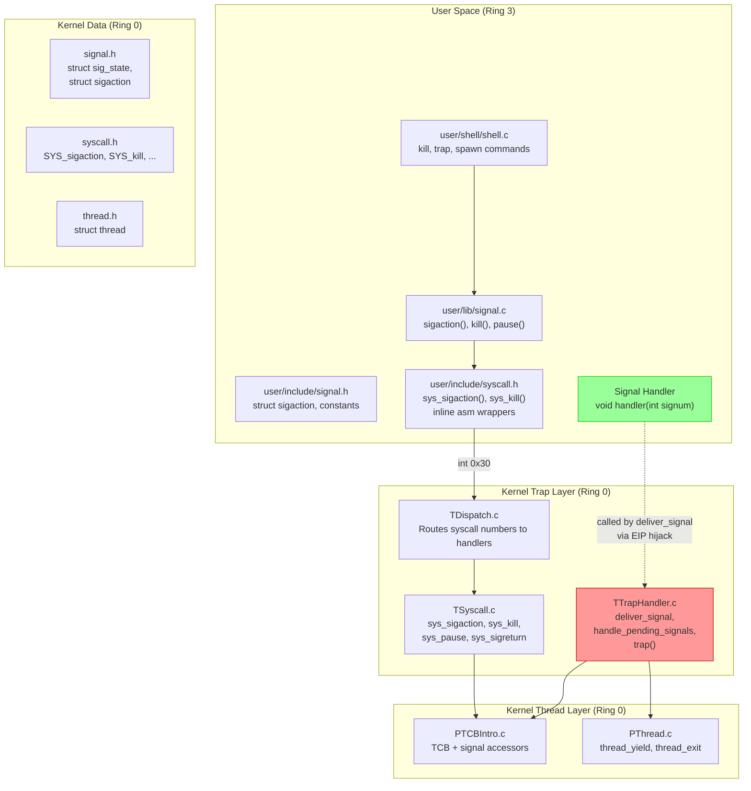
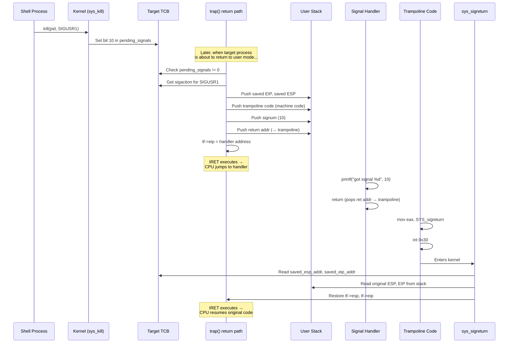
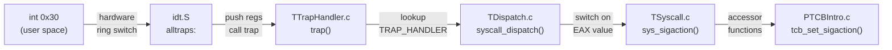
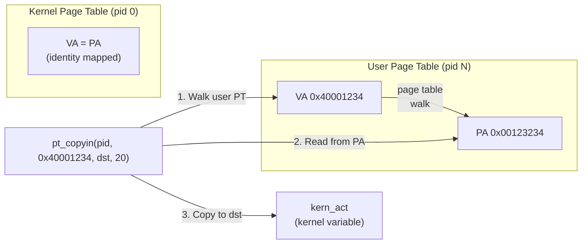
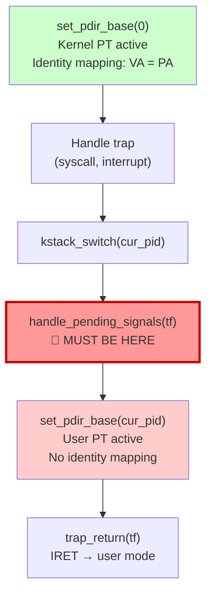
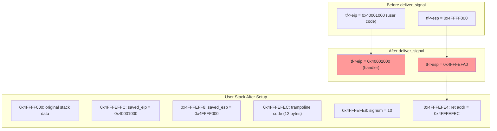
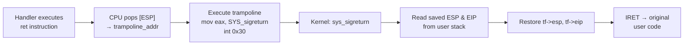
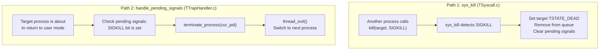
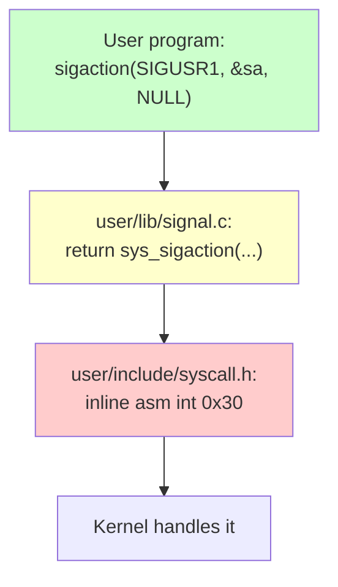
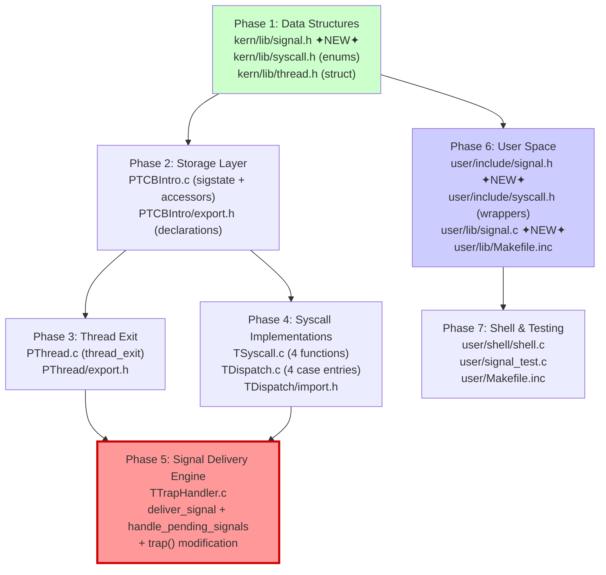

# Signal Implementation — Detailed Explanation & Reasoning

> **Purpose:** This document is the companion to `changes_guide.md`. Where the guide tells you *what* to change, this document tells you *why*, *how it works*, and *what each piece connects to*. Read this alongside the guide to understand every design decision, data structure, and line of assembly.
>
> **Assumes:** You understand signals at a high level — what they are, their POSIX semantics, the concepts of handlers, delivery, and signal numbers. This document focuses on the CertiKOS-specific implementation mechanics.

---

## Table of Contents

1. [Architecture Overview — The Big Picture](#1-architecture-overview)
2. [The Signal Lifecycle in CertiKOS](#2-the-signal-lifecycle)
3. [Data Structures — What We Store and Why](#3-data-structures)
4. [Syscall Plumbing — How User Code Reaches Kernel Code](#4-syscall-plumbing)
5. [Signal Registration — `sys_sigaction`](#5-signal-registration)
6. [Signal Generation — `sys_kill`](#6-signal-generation)
7. [The Trap Return Path — Where Signals Get Delivered](#7-the-trap-return-path)
8. [Signal Delivery — The Context Hijack](#8-signal-delivery)
9. [The Trampoline — Inline Machine Code on the Stack](#9-the-trampoline)
10. [Signal Return — `sys_sigreturn`](#10-signal-return)
11. [Process Termination — SIGKILL and `thread_exit()`](#11-process-termination)
12. [User-Space API Layer](#12-user-space-api-layer)
13. [Shell Integration — Interactive Commands](#13-shell-integration)
14. [Implementation Order — The Dependency Map](#14-implementation-order)

---

## 1. Architecture Overview

The signal system touches 5 distinct layers of the OS. Understanding which layer does what is the key to not getting lost in the implementation.



**Why these layers?**

CertiKOS uses a *layered verification* architecture. Each "module" (PTCBIntro, PThread, TDispatch, etc.) has a well-defined interface (`export.h`/`import.h`). Code in one layer can only call functions declared in its `import.h`. This means:
- **TCB accessors** (PTCBIntro) are the *only* way to touch signal state — no direct struct access from other layers.
- **TSyscall** handles the system-call logic but delegates storage to PTCBIntro.
- **TTrapHandler** is the only place that can intercept the return-to-user path.

---

## 2. The Signal Lifecycle

Every signal goes through these stages. Understanding this flow is essential before touching any code.



**Key insight:** The user-space process *never knows* a signal happened. The kernel transparently redirects execution to the handler, and `sigreturn` restores everything. From the process's perspective, it was "paused" and "resumed" — the handler ran in between, invisible to the main flow.

---

## 3. Data Structures

### 3.1 Why `struct sigaction`?

```c
struct sigaction {
    sighandler_t sa_handler;      // 4 bytes — pointer to handler function
    void (*sa_sigaction)(int, void*, void*);  // 4 bytes — extended handler (unused)
    int sa_flags;                 // 4 bytes — behavior flags (SA_RESTART, etc.)
    void (*sa_restorer)(void);    // 4 bytes — custom restorer (unused)
    uint32_t sa_mask;             // 4 bytes — signals to block during handler
};
// Total: 20 bytes
```

**Why this structure?** It mirrors the POSIX `struct sigaction`. Even though we only use `sa_handler`, `sa_flags`, and `sa_mask`, keeping the full structure means:
1. User-space code looks identical to standard POSIX code.
2. `pt_copyin`/`pt_copyout` copies a fixed 20-byte block — no field-by-field marshalling.
3. Future extensions (like `SA_SIGINFO` with the 3-argument handler) don't require struct changes.

**Only `sa_handler` matters for the basic implementation.** The `sa_flags` and `sa_mask` fields are defined for completeness but not fully enforced in the delivery path.

### 3.2 Why `struct sig_state`?

```c
struct sig_state {
    struct sigaction sigactions[NSIG];  // 32 × 20 = 640 bytes — one handler per signal
    uint32_t pending_signals;          // 4 bytes — bitmask of pending signals
    int signal_block_mask;             // 4 bytes — bitmask of blocked signals
    uint32_t saved_esp_addr;           // 4 bytes — where on user stack we saved ESP
    uint32_t saved_eip_addr;           // 4 bytes — where on user stack we saved EIP
    int in_signal_handler;             // 4 bytes — re-entrancy guard
};
// Total: 656 bytes, embedded in each TCB
```

**Why a bitmask for `pending_signals`?**

Each of the 32 possible signals gets one bit. This is exactly how Linux does it for "standard" signals (non-real-time). The operations are simple:

| Operation | Code | Meaning |
|-----------|------|---------|
| Set signal pending | `pending \|= (1 << signum)` | Turn on bit N |
| Clear signal | `pending &= ~(1 << signum)` | Turn off bit N |
| Check if pending | `pending & (1 << signum)` | Test bit N |
| Any pending? | `pending != 0` | Any bits set? |

**Why store `saved_esp_addr` and `saved_eip_addr` — not the values themselves?**

This is a subtle but critical design choice. We store the *addresses on the user stack* where we pushed the saved values, not the values. The reason: `sys_sigreturn` runs later, potentially after the kernel page table has changed. It uses `pt_copyin` to read from those user-stack addresses. If we stored values directly in the TCB, we'd save 2 fewer `pt_copyin` calls — but the current approach is safer because it doesn't rely on the TCB persisting the exact same values across context switches and it matches how real OS implementations work (the saved context lives on the user stack, the kernel just tracks where it is).

### 3.3 Where does `sig_state` live?

```mermaid
graph LR
    subgraph "TCBPool[pid]"
        A[state: t_state]
        B[prev: uint]
        C[next: uint]
        D[channel: void*]
        E[openfiles: file*[]]
        F[cwd: inode*]
        G["sigstate: struct sig_state<br/>(656 bytes)"]
    end

    G --> H["sigactions[0..31]"]
    G --> I["pending_signals"]
    G --> J["saved_esp_addr"]
    G --> K["saved_eip_addr"]
    G --> L["in_signal_handler"]

    style G fill:#ffcc99
```

It's a **field inside the TCB** (Thread Control Block). Every process gets its own signal state. When `tcb_init_at_id` initializes a new process, it `memset`s the entire `sig_state` to zero — meaning no handlers registered, no signals pending, no saved context.

### 3.4 Why TCB accessor functions instead of direct access?

CertiKOS's layered verification architecture requires that `TCBPool` is only accessed from `PTCBIntro.c`. Other modules must use accessor function like `tcb_get_sigaction()`, `tcb_add_pending_signal()`, etc. This encapsulation:
1. Maintains the verification boundary.
2. Handles bounds checking centrally (validating `signum < NSIG`).
3. Allows the TCB layout to change without breaking callers.

We need **12 accessor functions**. They break into 4 groups:

| Group | Functions | Purpose |
|-------|-----------|---------|
| Handler management | `tcb_get_sigaction`, `tcb_set_sigaction` | Read/write the `sigaction` struct for a signal |
| Pending signals | `tcb_get_pending_signals`, `tcb_set_pending_signals`, `tcb_add_pending_signal`, `tcb_clear_pending_signal` | Manipulate the pending bitmask |
| Signal context | `tcb_set_signal_context`, `tcb_get_signal_context`, `tcb_clear_signal_context`, `tcb_in_signal_handler` | Save/restore the ESP/EIP for sigreturn |
| Process state | `tcb_is_sleeping`, `tcb_get_channel` | Check if process is blocked (for wakeup on signal) |

---

## 4. Syscall Plumbing

Before implementing any signal logic, you need to understand how a user-space function call becomes a kernel function call. This is the same mechanism all other syscalls use.

### 4.1 The syscall calling convention

CertiKOS documents this in `kern/lib/syscall.h`:

```
User-space:                     Kernel-side:
  EAX = syscall number    →     syscall_get_arg1(tf) reads tf->regs.eax
  EBX = argument 1        →     syscall_get_arg2(tf) reads tf->regs.ebx
  ECX = argument 2        →     syscall_get_arg3(tf) reads tf->regs.ecx
  EDX = argument 3        →     syscall_get_arg4(tf) reads tf->regs.edx
  ESI = argument 4        →     syscall_get_arg5(tf) reads tf->regs.esi
  EDI = argument 5        →     syscall_get_arg6(tf) reads tf->regs.edi
```

> **Naming quirk:** `syscall_get_arg1` returns EAX (the syscall number), so the first *actual argument* is `syscall_get_arg2` (EBX). This is a source-of-confusion. Always remember: **arg2 = first user argument**.

### 4.2 The inline assembly in user-space wrappers

Let's dissect the `sys_sigaction` wrapper byte by byte:

```c
static gcc_inline int
sys_sigaction(int signum, const struct sigaction *act, struct sigaction *oldact)
{
    int errno;
    asm volatile ("int %1"
          : "=a" (errno)              // OUTPUT: EAX → errno variable
          : "i" (T_SYSCALL),          // INPUT 1: immediate value 48 (T_SYSCALL = 0x30)
            "a" (SYS_sigaction),      // INPUT 2: EAX ← syscall number
            "b" (signum),             // INPUT 3: EBX ← first argument
            "c" (act),               // INPUT 4: ECX ← second argument (pointer)
            "d" (oldact)             // INPUT 5: EDX ← third argument (pointer)
          : "cc", "memory");          // CLOBBERS: flags and memory
    return errno ? -1 : 0;
}
```

**What this compiles to (approximately):**
```asm
    mov eax, SYS_sigaction   ; syscall number
    mov ebx, [signum]        ; first arg
    mov ecx, [act]           ; second arg (user-space pointer)
    mov edx, [oldact]        ; third arg (user-space pointer)
    int 0x30                 ; software interrupt → trap into kernel
    ; EAX now contains the errno returned by the kernel
```

**Why `int 0x30` (interrupt 48)?**

CertiKOS uses software interrupt `0x30` (decimal 48, defined as `T_SYSCALL`) as its syscall gate. When this instruction executes:
1. CPU switches from Ring 3 to Ring 0.
2. CPU pushes SS, ESP, EFLAGS, CS, EIP onto the *kernel stack* (hardware-automatic).
3. The IDT entry for vector 48 points to the assembly handler in `idt.S`.
4. That handler pushes the remaining registers (`pushal`, `push %ds`, `push %es`) to build a complete `tf_t` (trap frame).
5. It calls `trap(tf)` in C.

**Why `"cc", "memory"` clobbers?**

- `"cc"` tells GCC that the condition flags (EFLAGS) may be modified.
- `"memory"` tells GCC that memory may be modified — this prevents the compiler from caching values in registers across the `int` instruction. Critical because the kernel *does* modify memory (e.g., writing to the `sigaction` structure via `pt_copyout`).

### 4.3 The dispatch chain



When you add a new syscall, you need to add entries at **three levels**:
1. **`kern/lib/syscall.h`** — The enum value (e.g., `SYS_sigaction`)
2. **`TDispatch.c`** — The `case SYS_sigaction: sys_sigaction(tf); break;`
3. **`TSyscall.c`** — The actual implementation function

Missing any one of these causes the syscall to silently fail with `E_INVAL_CALLNR`.

---

## 5. Signal Registration — `sys_sigaction`

### 5.1 Why `pt_copyin` and not direct pointer access?

This is one of the most important things to understand. When `sys_sigaction` runs, the CPU is in kernel mode with the **kernel page table** active (set by `set_pdir_base(0)` at the top of `trap()`). The kernel page table maps physical memory 1:1 (identity mapping), but does **not** map user-space virtual addresses.

The user passes a pointer like `0x40001234` (a user-space virtual address). If the kernel tries to dereference this directly:
```c
// WRONG — will page fault or read garbage
struct sigaction kern_act = *user_act;
```

It would be accessing physical address `0x40001234`, which is NOT where the user's data is. The user's virtual address `0x40001234` maps to some *other* physical address via the user's page table.

**`pt_copyin` solves this** by walking the user's page table to translate the virtual address → physical address, then copying from the physical location:

```c
// CORRECT — translates through user's page table
pt_copyin(cur_pid, (uintptr_t)user_act, (void*)&kern_act, sizeof(struct sigaction));
```



### 5.2 Why save `oldact`?

The third argument allows the user to retrieve the *previous* handler before replacing it. This is standard POSIX behavior — it lets programs restore the original handler later. We use `pt_copyout` (kernel→user) for this:

```c
pt_copyout((void*)cur_act, cur_pid, (uintptr_t)user_oldact, sizeof(struct sigaction));
```

---

## 6. Signal Generation — `sys_kill`

### 6.1 The bitmask operation

When a process sends a signal:
```c
tcb_add_pending_signal(pid, signum);
```

This executes:
```c
TCBPool[pid].sigstate.pending_signals |= (1 << signum);
```

For `SIGUSR1` (signal 10):
```
Before: pending_signals = 0b00000000000000000000000000000000
After:  pending_signals = 0b00000000000000000000010000000000
                                                    ^
                                             bit 10 set
```

The signal is now "pending" — it won't be delivered until the target process is about to return to user mode (see Section 7).

### 6.2 Why wake sleeping processes?

If the target process called `pause()` or is sleeping on a channel, it will never reach the trap return path where signals are checked. So `sys_kill` explicitly wakes it:

```c
if (tcb_is_sleeping(pid)) {
    void *chan = tcb_get_channel(pid);
    if (chan != NULL) {
        thread_wakeup(chan);
    }
}
```

This moves the process from TSTATE_SLEEP back to the ready queue. When it eventually gets scheduled, it will enter `trap()` and the signal delivery check will fire.

### 6.3 SIGKILL special handling

SIGKILL (signal 9) is special even at the `sys_kill` level — it kills the target **immediately** without waiting for a trap return:

```c
if (signum == SIGKILL) {
    tcb_set_state(pid, TSTATE_DEAD);
    tqueue_remove(NUM_IDS, pid);
    tcb_set_pending_signals(pid, 0);
}
```

Why not defer it like other signals? Because SIGKILL must be **uncatchable and unblockable**. If we just set it pending, a malicious process could avoid the trap return path. Instead, we mark it dead right now.

---

## 7. The Trap Return Path — Where Signals Get Delivered

This is the most architecturally significant part of the implementation. Understanding *where* in the kernel's execution flow we check for signals is critical.

### 7.1 The `trap()` function structure

```c
void trap(tf_t *tf)
{
    cur_pid = get_curid();
    set_pdir_base(0);              // [1] Switch to kernel page table

    f = TRAP_HANDLER[...][tf->trapno];
    if (f) f(tf);                  // [2] Handle the trap (syscall, interrupt, etc.)

    kstack_switch(cur_pid);        // [3] Switch kernel stacks

    handle_pending_signals(tf);    // [4] ← SIGNAL DELIVERY HAPPENS HERE

    set_pdir_base(cur_pid);        // [5] Switch to user page table
    trap_return(tf);               // [6] Return to user mode via IRET
}
```

### 7.2 Why between kstack_switch and set_pdir_base?



**The constraint is about page table access:**

`deliver_signal()` calls `pt_copyout()` to write the trampoline code onto the user's stack. `pt_copyout()` needs to:
1. Walk the user's page table to find the physical frame backing the user's stack virtual address.
2. Write to that physical frame.

Both of these operations require **identity-mapped physical memory access** — which is only available under the kernel page table (PID 0). After `set_pdir_base(cur_pid)` switches to the user's page table, the kernel can no longer directly access arbitrary physical addresses.

**This is the single most critical ordering constraint.** Getting it wrong causes a page fault inside the kernel — a hard crash with no useful error message.

### 7.3 What `trap_return` does (assembly)

```asm
trap_return:
    movl  4(%esp), %esp    ; Point ESP at the trap frame
    popal                   ; Restore EDI, ESI, EBP, (skip), EBX, EDX, ECX, EAX
    popl  %es              ; Restore ES
    popl  %ds              ; Restore DS
    addl  $8, %esp         ; Skip trapno and error code
    iret                    ; Pop EIP, CS, EFLAGS, ESP, SS from stack → back to user mode
```

The `iret` instruction is the hardware mechanism that switches from Ring 0 back to Ring 3. It pops `EIP`, `CS`, `EFLAGS`, `ESP`, and `SS` from the kernel stack. **Crucially, the EIP it pops is whatever is in `tf->eip`**. If we've modified `tf->eip` to point to the signal handler, the CPU jumps there instead of the original user code.

This is the fundamental trick: **we don't "call" the signal handler — we trick the CPU into jumping to it.**

---

## 8. Signal Delivery — The Context Hijack

`deliver_signal()` is the most complex function in the entire implementation. Let's trace through it step by step.

### 8.1 The goal

We need to:
1. Save the process's current EIP and ESP so we can restore them later.
2. Arrange the user stack so that when the handler `return`s, execution flows to our trampoline code.
3. Set `tf->eip` to the handler address so IRET jumps there.

### 8.2 The user stack layout

The stack grows downward (toward lower addresses). Here's what we build:

```
       High addresses (original ESP)
       ┌──────────────────────┐
       │   original user      │
       │   stack data          │
       ├──────────────────────┤ ← original tf->esp
       │   saved_eip (4 bytes)│ ← saved_eip_addr (for sigreturn to read)
       ├──────────────────────┤
       │   saved_esp (4 bytes)│ ← saved_esp_addr (for sigreturn to read)
       ├──────────────────────┤
       │   trampoline code    │ ← trampoline_addr
       │   (12 bytes padded)  │
       ├──────────────────────┤
       │   signum (4 bytes)   │ ← handler's first argument [ESP+4]
       ├──────────────────────┤
       │   trampoline_addr    │ ← handler's return address [ESP+0]
       │   (4 bytes)          │
       ├──────────────────────┤ ← new tf->esp
       Low addresses
```

### 8.3 Why this specific order?

**cdecl calling convention** (which GCC uses for all C functions) requires:
- `[ESP]` = return address (where `ret` jumps to)
- `[ESP+4]` = first argument
- `[ESP+8]` = second argument (if any)

When the CPU executes `iret` and jumps to the handler, ESP points to our constructed stack. The handler sees:
- **Return address** = trampoline address (so when it does `ret`, it jumps to the trampoline)
- **First argument** = signal number (available as the `int signum` parameter)

This is why the signal number is NOT in EAX. Many people assume "just put the arg in a register" — but C functions compiled by GCC read arguments from the stack, not registers. **Using the wrong convention was an actual bug we hit during development.**

### 8.4 Step-by-step stack construction

```c
uint32_t orig_esp = tf->esp;
uint32_t orig_eip = tf->eip;
uint32_t new_esp = orig_esp;
```

We snapshot the original values. We'll push items by decrementing `new_esp` and writing to the user stack via `pt_copyout`.

**Step 1 — Push saved_eip:**
```c
new_esp -= 4;
pt_copyout(&orig_eip, cur_pid, new_esp, sizeof(uint32_t));
uint32_t saved_eip_addr = new_esp;
```
We remember *where* we stored it (the address), not the value itself. `sys_sigreturn` will later `pt_copyin` from this address.

**Step 2 — Push saved_esp:**
```c
new_esp -= 4;
pt_copyout(&orig_esp, cur_pid, new_esp, sizeof(uint32_t));
uint32_t saved_esp_addr = new_esp;
```

**Step 3 — Push trampoline code:**
```c
uint8_t trampoline[12] = {
    0xB8, SYS_sigreturn, 0x00, 0x00, 0x00,
    0xCD, 0x30,
    0xEB, 0xFE,
    0x90, 0x90, 0x90
};
new_esp -= 12;
pt_copyout(trampoline, cur_pid, new_esp, 12);
uint32_t trampoline_addr = new_esp;
```
(Details on the trampoline in Section 9.)

**Step 4 — Push signal number (first argument):**
```c
new_esp -= 4;
uint32_t sig_arg = signum;
pt_copyout(&sig_arg, cur_pid, new_esp, sizeof(uint32_t));
```

**Step 5 — Push return address (trampoline):**
```c
new_esp -= 4;
pt_copyout(&trampoline_addr, cur_pid, new_esp, sizeof(uint32_t));
```

**Step 6 — Redirect execution:**
```c
tf->esp = new_esp;  // Handler will see our constructed stack
tf->eip = (uint32_t)sa->sa_handler;  // IRET jumps to handler
```

**Step 7 — Record context in TCB:**
```c
tcb_set_signal_context(cur_pid, saved_esp_addr, saved_eip_addr);
```

### 8.5 Visual trace



---

## 9. The Trampoline — Inline Machine Code on the Stack

### 9.1 What is the trampoline?

When the signal handler function finishes, it executes the `ret` instruction. `ret` pops the return address from `[ESP]` — which we set to point at our trampoline code. The trampoline then invokes `sys_sigreturn` to restore the original context.

The trampoline is **executable x86 machine code** that we write directly onto the user stack. No function call, no library — raw bytes.

### 9.2 Byte-by-byte breakdown

```
Byte(s)    Hex          Assembly              Purpose
─────────────────────────────────────────────────────────────────
[0-4]      B8 XX 00 00 00   mov eax, SYS_sigreturn   Set syscall number
[5-6]      CD 30            int 0x30                  Trap into kernel
[7-8]      EB FE            jmp $                     Safety: infinite loop
[9-11]     90 90 90         nop; nop; nop             Padding to 12 bytes
```

Let's examine each:

**`B8 XX 00 00 00` — `mov eax, imm32`**

The `B8` opcode means "load 32-bit immediate into EAX." The next 4 bytes are the immediate value in little-endian. `SYS_sigreturn` is an enum value (its exact numeric value depends on where it falls in the enum — in our case, it follows `SYS_readline`). The `0x00, 0x00, 0x00` are the upper 3 bytes (the value fits in one byte).

```
If SYS_sigreturn = 0x98 (decimal 152):
  B8 98 00 00 00  →  mov eax, 0x00000098
```

**`CD 30` — `int 0x30`**

This is the software interrupt instruction for CertiKOS's syscall gate. `0xCD` is the `int` opcode, `0x30` is the vector number (decimal 48 = T_SYSCALL). This traps into the kernel, which reads EAX and dispatches to `sys_sigreturn`.

**`EB FE` — `jmp $` (jump to self)**

`0xEB` is a short relative jump. The operand `0xFE` is -2 (signed byte), meaning "jump back 2 bytes" — which is the start of this same instruction. This creates an infinite loop. It's a safety net: if `sys_sigreturn` somehow fails and returns to user space, the process spins instead of executing whatever garbage follows on the stack.

**`90 90 90` — NOP padding**

Three no-operation instructions to round the trampoline to 12 bytes (a multiple of 4) for stack alignment.

### 9.3 Why not use a separate trampoline function?

Alternatives considered:
1. **Fixed-address trampoline in user memory** — requires a reserved page at a known address, adds complexity to the memory layout.
2. **Trampoline function linked into every user binary** — requires the user-space build system to include it, and the kernel to know its address.
3. **Inline machine code on the stack** — self-contained, no dependencies, works for any process.

Option 3 wins because it's the simplest. Linux actually uses a similar approach (though modern Linux uses a VDSO page).

### 9.4 Stack executability

In modern systems, the stack is typically non-executable (NX bit). CertiKOS does **not** set the NX bit on user stack pages, so this approach works. In a production OS, you'd need either a dedicated executable page for the trampoline or a VDSO.

---

## 10. Signal Return — `sys_sigreturn`

### 10.1 What happens when the handler returns



### 10.2 The `sys_sigreturn` implementation explained

```c
void sys_sigreturn(tf_t *tf)
{
    unsigned int cur_pid = get_curid();
    uint32_t saved_esp_addr, saved_eip_addr;
    uint32_t saved_esp, saved_eip;
```

**Step 1 — Retrieve the addresses where we stored the original context:**
```c
    tcb_get_signal_context(cur_pid, &saved_esp_addr, &saved_eip_addr);
```
These are the user-stack addresses that `deliver_signal` recorded in the TCB.

**Step 2 — Read the original ESP from the user stack:**
```c
    pt_copyin(cur_pid, saved_esp_addr, &saved_esp, sizeof(uint32_t));
```
Remember, the kernel page table is active during syscall handling, so we can't just dereference `saved_esp_addr`. We use `pt_copyin` to walk the user's page table and read the value.

**Step 3 — Read the original EIP from the user stack:**
```c
    pt_copyin(cur_pid, saved_eip_addr, &saved_eip, sizeof(uint32_t));
```

**Step 4 — Clear the signal context:**
```c
    tcb_clear_signal_context(cur_pid);
```
Resets `saved_esp_addr`, `saved_eip_addr`, and `in_signal_handler` to 0.

**Step 5 — Restore the trap frame:**
```c
    tf->esp = saved_esp;
    tf->eip = saved_eip;
```

When `trap()` later calls `trap_return(tf)` → `iret`, the CPU will use these restored values. The process resumes exactly where it was before the signal interrupted it.

### 10.3 The full round trip

```
            User Mode                    Kernel Mode
            ─────────                    ───────────
     ┌──→ Original code (EIP=X)
     │         │
     │         ▼
     │    Some trap/interrupt
     │         │                    ┌─ handle trap
     │         │                    │  handle_pending_signals()
     │         │                    │    → deliver_signal()
     │         │                    │       tf->eip = handler
     │         │                    │       tf->esp = new stack
     │         │                    └─ trap_return(tf) → IRET
     │         ▼
     │    Handler runs (EIP=handler)
     │         │
     │         ▼
     │    Handler returns (ret)
     │         │
     │         ▼
     │    Trampoline (EIP=tramp_addr)
     │    mov eax, SYS_sigreturn
     │    int 0x30
     │         │                    ┌─ sys_sigreturn()
     │         │                    │    tf->eip = X (original)
     │         │                    │    tf->esp = original
     │         │                    └─ trap_return(tf) → IRET
     │         ▼
     └──── Resume at EIP=X ◄─────── (seamless!)
```

---

## 11. Process Termination — SIGKILL and `thread_exit()`

### 11.1 Why we need `thread_exit()`

CertiKOS has `thread_yield()` which does:
1. Set current process to TSTATE_READY.
2. **Enqueue** it back into the ready queue.
3. Dequeue the next process and switch to it.

When a process is killed, we do NOT want step 2. A dead process re-entering the ready queue would be scheduled again and attempt to run dead code — an instant crash.

`thread_exit()` does:
1. *(skip setting READY)*
2. *(skip enqueueing)*
3. Dequeue the next process and switch to it.

The terminated process simply vanishes from the scheduler.

### 11.2 Where SIGKILL gets handled

SIGKILL is handled in **two** places, both of which are necessary:



**Path 1** handles the case where a *different* process sends SIGKILL. The target is killed immediately from the sender's context.

**Path 2** handles the case where a process kills *itself* (or if SIGKILL was set pending through some other mechanism). When the process checks its own pending signals in the trap return path, it terminates itself.

---

## 12. User-Space API Layer

### 12.1 The three-layer sandwich



**Why three layers instead of just two?**

- **`user/include/syscall.h`** (inline asm wrappers) — These are the raw syscall stubs. They deal with register loading and the `int` instruction. They return `errno` codes.
- **`user/lib/signal.c`** (library functions) — These present a clean POSIX-like C API (`sigaction()`, `kill()`, `pause()`). They wrap the `sys_*` calls and could add argument validation, `errno` translation, etc.
- **`user/include/signal.h`** (header) — Type definitions and constants. Shared between the library and user programs.

This separation means user programs only `#include <signal.h>` and call `sigaction()` — they never see the inline assembly.

---

## 13. Shell Integration

### 13.1 The `kill` command — Parsing `-N` format

The shell's `kill` command supports the standard unix format `kill -9 2` (signal 9, PID 2). The parsing handles both `-N` and `N` formats:

```c
if (argv[1][0] == '-') {
    sig = str_to_int(&argv[1][1]);  // Skip the '-', parse starting from argv[1][1]
} else {
    sig = str_to_int(argv[1]);
}
```

`&argv[1][1]` is a pointer to the second character of the first argument — skipping the dash. If the user types `kill -10 3`, then `argv[1]` is `"-10"`, and `&argv[1][1]` is `"10"`.

### 13.2 The `trap` command — Interactive handler registration

`trap <signum>` registers the built-in `signal_handler` function for the given signal number. This lets you test signal delivery interactively:

```
>: trap 10               ← Register handler for SIGUSR1
Handler registered successfully.
>: spawn 1               ← Start a process (gets PID 2)
Process spawned with PID 2
>: kill -10 2             ← Send SIGUSR1 to PID 2
```

### 13.3 The `spawn` command — Creating target processes

`spawn <elf_id>` creates a new process using the existing `thread_spawn` mechanism. This gives you a target process to send signals to (since the shell itself has PID 1 and you often want to signal a different process).

### 13.4 `str_to_int` and `getpid` stubs

CertiKOS's user-space doesn't have standard `atoi` with a direct return value — its `atoi` takes an output pointer. The `str_to_int` wrapper provides a cleaner interface:

```c
static int str_to_int(const char *s) {
    int result = 0;
    atoi(s, &result);  // CertiKOS-specific atoi with output parameter
    return result;
}
```

`getpid()` is stubbed to return 1 (the shell's PID). CertiKOS doesn't have a `SYS_getpid` syscall, so this is a known limitation.

---

## 14. Implementation Order — The Dependency Map

Not all changes can be done in any order. Some depend on others. Here's the recommended implementation sequence with a dependency graph:



### Phase-by-phase rationale

| Phase | What | Why This Order |
|-------|------|----------------|
| 1 | Data structures & constants | Everything else includes these headers. Must exist first. |
| 2 | TCB storage + accessors | The syscall implementations call these accessors. Must exist before Phase 4. |
| 3 | `thread_exit()` | Called by `handle_pending_signals()` for SIGKILL. Must exist before Phase 5. |
| 4 | Syscall implementations | The 4 `sys_*` functions. They call Phase 2 accessors and Phase 3's `thread_exit`. |
| 5 | Signal delivery engine | The `trap()` modification and `deliver_signal()`. Depends on all kernel phases. **This is the most complex phase — save it for when everything else compiles.** |
| 6 | User-space API | Headers and library. Independent of kernel phases in terms of compilation, but the syscalls only work if the kernel side exists. |
| 7 | Shell + tests | Integration. Only makes sense once everything else works. |

### Build verification at each phase

After each phase, run `make` to ensure compilation succeeds. You may get *linker* warnings for functions declared but not yet defined — that's expected until all phases are done. But *compiler* errors should be fixed immediately.

---

## Appendix A: The `proc.c` Replacement — Why?

The base template's `kern/proc/proc.c` contains ~80 lines of multi-CPU (`pcpu`) management code. This code:
1. References headers and structures (`pcpu_mp_intro.h`, `struct pcpuinfo`) that may not compile cleanly in all configurations.
2. Is not needed for the single-CPU signal implementation.
3. Causes link conflicts with functions defined elsewhere.

We replace it entirely with a `strncmp` function that the shell needs but is missing from the base template. This is a pragmatic choice — the pcpu code could theoretically coexist, but removing it simplifies the build.

## Appendix B: The `tcb_init_at_id` Signature Change

The original function signature:
```c
void tcb_init_at_id(unsigned int pid)
```

Changes to:
```c
void tcb_init_at_id(unsigned int cpu_idx, unsigned int pid)
```

**Why add `cpu_idx`?** The callers in higher layers pass the CPU index as the first argument (this is part of CertiKOS's multi-CPU initialization flow). The base template's version lacks this parameter, causing a signature mismatch. Even though our single-CPU implementation doesn't use `cpu_idx`, the parameter must be present for the caller to match.

**Other changes in the body:**
- `memzero` → `memset(..., 0, ...)`: Some configurations don't have `memzero`, but `memset` is always available.
- `namei("/")` → `NULL`: The `namei` call tries to open the root inode during TCB initialization. In early boot, the filesystem may not be ready, causing a crash. Setting to `NULL` defers the cwd assignment until the filesystem is actually mounted.
- Added `memset(&sigstate, 0, ...)`: Zero-initializes the new signal state (no handlers, no pending signals).

## Appendix C: The Trap Frame — Register Mapping Quick Reference

When accessing syscall arguments in `TSyscall.c`, remember this mapping:

```
┌─────────────┬────────────┬─────────────────────────────────┐
│ Accessor    │ Register   │ Usage in signal syscalls         │
├─────────────┼────────────┼─────────────────────────────────┤
│ get_arg1    │ EAX        │ Syscall number (SYS_sigaction)  │
│ get_arg2    │ EBX        │ First arg (signum / pid)        │
│ get_arg3    │ ECX        │ Second arg (act* / signum)      │
│ get_arg4    │ EDX        │ Third arg (oldact*)             │
│ get_arg5    │ ESI        │ (unused)                        │
│ get_arg6    │ EDI        │ (unused)                        │
├─────────────┼────────────┼─────────────────────────────────┤
│ set_errno   │ EAX        │ Error code (E_SUCC, etc.)       │
└─────────────┴────────────┴─────────────────────────────────┘
```

The `tf_t` structure lays out in memory exactly as the hardware + software pushes built it:

```
Low address ───────────────────── High address
┌─────┬─────┬─────┬──────┬─────┬─────┬─────┬─────┐
│ EDI │ ESI │ EBP │ oESP │ EBX │ EDX │ ECX │ EAX │  ← pushregs (pushal)
├─────┴─────┴─────┴──────┴─────┴─────┴─────┴─────┤
│  ES   │  DS   │ trapno │  err  │                 │  ← software push
├───────┴───────┴────────┴───────┤                 │
│  EIP  │  CS   │ EFLAGS │  ESP  │  SS  │          │  ← hardware push (iret frame)
└───────┴───────┴────────┴───────┴──────┘

tf->regs.eax  = syscall number (set by user's inline asm)
tf->regs.ebx  = first argument
tf->regs.ecx  = second argument
tf->regs.edx  = third argument
tf->eip       = where to resume (we modify this for signal delivery)
tf->esp       = user stack pointer (we modify this for signal delivery)
```
