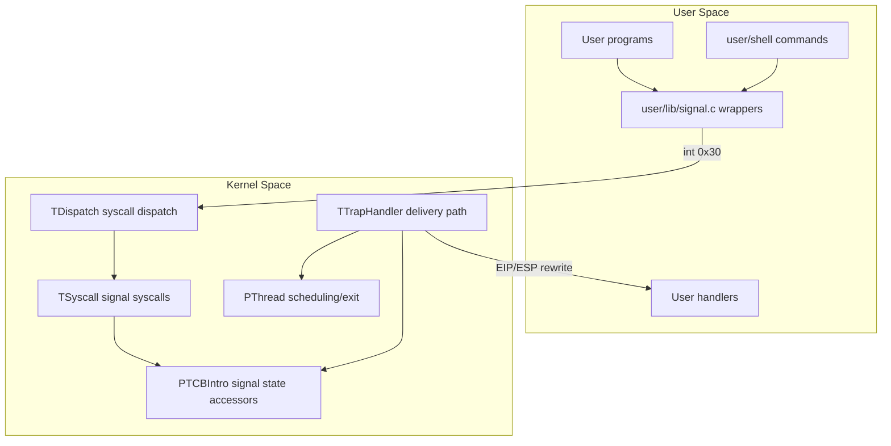
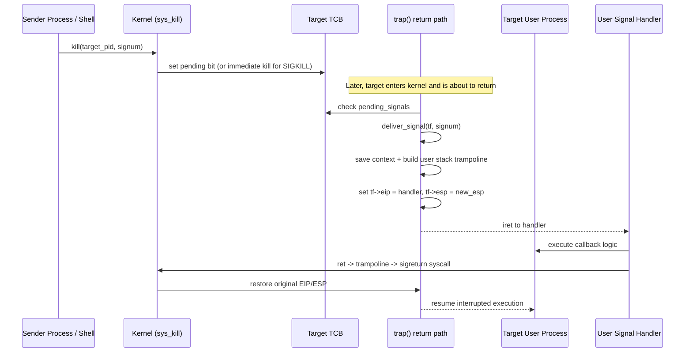

# Final Report: POSIX-Style Signal Mechanism in mCertiKOS

## 1. Project Overview

This project extends the provided mCertiKOS educational operating system with a POSIX-style signal subsystem. The goal was to support asynchronous process notification and control through signal registration, signal delivery, and handler execution, then demonstrate the feature set through shell commands and user-space test programs.

The implementation targets the course requirement of enabling process kill/notification behavior similar to POSIX `signal(7)` semantics, with practical support for interactive use (for example, `kill -num pid`, `trap`, and Ctrl+C behavior).

## 2. Brief Description of the Base (Provided) Project

mCertiKOS is an educational x86 operating system with a layered kernel architecture. Before this project, the base system already provided:

- Process/thread management and a scheduler
- Trap/interrupt/syscall pipeline (`int 0x30` syscall entry)
- Thread control block (TCB) and ready queues
- User/kernel privilege transitions with trap frame (`tf_t`) based return
- A shell from earlier experiments (extended in this project)
- User-space library and syscall wrapper pattern

The signal implementation had to fit this layered model, using module boundaries (`export.h`/`import.h`) and existing memory/protection mechanisms.

## 3. Objectives and Scope

### 3.1 Core objectives

- Implement POSIX-like signal syscalls and runtime behavior
- Allow user processes to register handlers via `sigaction()`
- Allow signal generation via `kill()`
- Deliver pending signals safely on return-to-user path
- Support proper return from handlers (`sigreturn` + trampoline)
- Extend shell with signal-related commands for demonstration

### 3.2 Implemented scope

- Syscalls: `sigaction`, `kill`, `pause`, `sigreturn`
- Signal state per process (`sigactions[]`, pending bitmask, context fields)
- Signal delivery engine in trap layer
- SIGKILL immediate termination semantics
- SIGINT interactive behavior (including Ctrl+C and custom handlers)
- SIGSEGV conversion from user fault scenarios to process-level termination flow
- User-space wrappers and test integration

## 4. Modules and Features Added

The table below summarizes major additions and their contribution.

| Module / Feature | Main Files | What Was Added | Enhancement to Base Project |
|---|---|---|---|
| Signal definitions and state | `kern/lib/signal.h`, `kern/lib/thread.h` | `struct sigaction`, `struct sig_state`, constants (`SIGKILL`, `SIGINT`, `SIGSEGV`, etc.) | Introduced standard signal abstractions and per-process signal bookkeeping |
| Syscall numbers/plumbing | `kern/lib/syscall.h`, `kern/trap/TDispatch/TDispatch.c` | New syscall IDs and dispatch cases | Exposed signal functionality through existing syscall pipeline |
| Signal syscalls | `kern/trap/TSyscall/TSyscall.c` | `sys_sigaction`, `sys_kill`, `sys_pause`, `sys_sigreturn` | Enabled user-space registration, generation, waiting, and return mechanics |
| TCB signal accessors | `kern/thread/PTCBIntro/PTCBIntro.c`, `kern/thread/PTCBIntro/export.h` | Accessors for sigaction table, pending bitmask, saved context, handler-state flags | Preserved layered architecture while adding signal state manipulation |
| Trap delivery engine | `kern/trap/TTrapHandler/TTrapHandler.c` | `handle_pending_signals`, `deliver_signal`, termination path logic | Added asynchronous delivery at safe return boundary; redirects execution to handlers |
| Termination-safe scheduling support | `kern/thread/PThread/PThread.c`, `kern/thread/PThread/export.h` | `thread_exit()` path for non-requeue process termination | Prevented scheduler/queue corruption during kill flows |
| User API | `user/include/signal.h`, `user/lib/signal.c`, `user/include/syscall.h` | User-level prototypes, constants, wrappers | Provided POSIX-like API surface to user programs |
| Shell integration | `user/shell/shell.c` | `kill`, `trap`, `spawn`, foreground Ctrl+C routing behavior | Made features observable and testable from interactive shell |
| Demo/test programs | `user/signal_test.c`, `user/sigint_test/`, `user/sigint_custom_test/`, `user/sigsegv_test/` | Targeted demonstrations | Verified end-to-end correctness of delivery and default/custom actions |

## 5. System Architecture

### 5.1 Layered architecture view



### 5.2 End-to-end signal lifecycle



## 6. Key Implementation Details by Feature

### 6.1 Signal registration (`sigaction`)

- User passes `struct sigaction` pointer.
- Kernel validates signal number and copies user data with `pt_copyin`.
- Handler config stored in target process signal state.
- Old action can be returned through `pt_copyout` when requested.

Enhancement: turns static processes into event-driven processes with user-defined callbacks.

### 6.2 Signal generation (`kill`)

- For regular signals: set bit in `pending_signals` bitmask.
- For sleeping targets: wakeup path ensures eventual delivery.
- For `SIGKILL`: immediate termination path (not deferred).

Enhancement: enables asynchronous inter-process control and shell-driven process management.

### 6.3 Signal delivery at trap return

- Delivery occurs in trap flow before final user return.
- Kernel inspects pending bits, resolves action, and performs default/handler path.
- For catchable signals with registered handlers, kernel rewrites trapframe:
  - saves interrupted context
  - installs trampoline and argument on user stack
  - redirects `EIP` to handler

Enhancement: introduces true asynchronous callback semantics while preserving isolation.

### 6.4 Handler return (`sigreturn` + trampoline)

- Handler `ret` enters trampoline code placed on user stack.
- Trampoline triggers `sigreturn` syscall (`int 0x30`).
- Kernel restores saved `ESP`/`EIP` into trapframe.
- Execution resumes where interrupted.

Enhancement: completes full signal lifecycle with transparent continuation of user execution.

### 6.5 Shell integration

- `kill -N PID`: interactive signal sender
- `trap N`: install shell-side handler for signal `N`
- Ctrl+C forwarding to foreground process with configurable mode:
  - default: force-kill behavior
  - custom: deliver catchable `SIGINT`

Enhancement: made signal implementation demonstrable in realistic workflow, not just unit-level calls.

## 7. Technologies, Frameworks, and Tools Used

### 7.1 System/software stack

- Language: C (kernel + user space), x86 assembly (trap/syscall path + low-level mechanics)
- Build: GNU Make
- Target/runtime: x86 mCertiKOS on QEMU

### 7.2 Development/debug environment

- GCC toolchain (including multilib for 32-bit targets)
- GDB for low-level debugging
- QEMU/KVM virtualization stack for execution and testing
- Python helper scripts from repository build flow

### 7.3 Key architectural techniques

- Trapframe manipulation (`EIP`/`ESP`) for controlled execution redirection
- User memory copy primitives (`pt_copyin`/`pt_copyout`) for safe cross-domain data movement
- Bitmask-based pending signal representation for O(1) set/check/clear operations

## 8. Problems Encountered and Solutions

Major issues came from subtle low-level ordering and scheduler semantics rather than syntax/runtime compilation errors.

| Problem | Symptom | Root Cause | Fix |
|---|---|---|---|
| Page table ordering during delivery | Handler got garbage signal values / wrong stack data | Signal setup executed under wrong page-table context | Move pending-signal handling to run while kernel mapping context is active before switching to user PT |
| Wrong handler stack argument behavior | Handler saw corrupted argument values | Incorrect cdecl stack frame setup order (return addr vs arg) | Push signum and trampoline return address in correct calling-convention layout |
| Missing safe return path from handler | Handler crashed on return | No proper continuation path from handler to interrupted context | Add trampoline machine code + `sys_sigreturn` restoring saved context |
| SIGKILL delayed or ineffective for blocked tasks | Target did not terminate promptly | Treating SIGKILL as deferred pending signal | Special-case immediate kill logic in `sys_kill` and termination path |
| Queue corruption on process termination | Scheduler hang after kill | Removing non-ready/running task from ready queue incorrectly | Add state-aware queue removal guard and `thread_exit` path that avoids requeue |
| Unsafe user pointer dereference in kernel path | NULL/garbage handler registration behavior | Directly dereferencing user pointers in kernel | Replace with `pt_copyin`/`pt_copyout` for all user memory transfer |

## 9. Demonstration and Validation Summary

The implementation was validated through shell and dedicated test programs:

- `trap 2` + `kill -2 <pid>`: confirms custom handler invocation
- `kill -9 <pid>`: confirms forced, non-catchable termination
- `test sigsegv`: confirms faulting process termination while shell/kernel remain alive
- `test sigint`: confirms Ctrl+C default termination path
- `test sigint-custom`: confirms user process catching SIGINT repeatedly

These tests verify registration, pending-set, delivery, handler execution, and context restoration.

## 10. Current Limitations and Future Extensions

Although core project goals are complete, full POSIX parity is intentionally out of scope.

Current limitations:

- No full `siginfo_t`/`SA_SIGINFO` payload support
- Signal blocking/masking not fully enforced (`sa_mask` partial)
- No queued repeated instances of same standard signal
- No real-time signals
- No full process-group signaling
- `alarm()` and timer-driven signal features remain extension work

Future extension opportunities:

- `sigprocmask`, `sigpending`, `sigsuspend`
- richer signal metadata (`siginfo_t`)
- queued real-time signal semantics
- alternative signal stack support (`sigaltstack`)

## 11. Environment Setup, Build, Run, and Full Feature Testing

This section summarizes a practical end-to-end workflow to reproduce the implementation from a clean environment.

### 11.1 Dependency and environment setup (Ubuntu/WSL)

Install required build and virtualization tools:

```bash
sudo apt update
sudo apt install -y build-essential gcc-multilib gdb bear
sudo apt install -y qemu-kvm virt-manager virtinst libvirt-clients bridge-utils libvirt-daemon-system
```

Enable and start libvirtd:

```bash
sudo systemctl enable --now libvirtd
```

Add the current user to virtualization groups:

```bash
sudo usermod -aG libvirt $USER
sudo usermod -aG kvm $USER
```

Log out and log back in so group membership changes apply.

### 11.2 Compile and run

From repository root:

```bash
make
```

Run in QEMU GUI mode:

```bash
make qemu
```

Run in terminal-only mode:

```bash
make qemu-nox
```

After boot, you should see the mCertiKOS shell prompt.

### 11.3 Test matrix for implemented signals and added shell features

The implementation centers on SIGKILL, SIGINT, SIGSEGV and supporting shell features such as trap, kill, spawn, and test.

#### Test A: trap command and catchable signal delivery (SIGINT)

Register a handler on the shell process:

```text
>: trap 2
```

Then send signal 2 to the shell PID (commonly PID 2 in this setup):

```text
>: kill -2 2
```

Expected result:
- Shell-side handler executes and prints received signal message.
- Shell remains alive (no forced termination).

#### Test B: SIGKILL force termination

Spawn a test process and note the returned PID:

```text
>: spawn 1
```

Kill it with SIGKILL:

```text
>: kill -9 <pid>
```

Optionally send SIGKILL again to same PID:

```text
>: kill -9 <pid>
```

Expected result:
- First kill immediately terminates target process.
- Second kill fails because the process is already dead.

#### Test C: SIGSEGV handling path

Run the segfault test program:

```text
>: test sigsegv
```

Expected result:
- Faulting process is terminated via signal path.
- Kernel and shell remain responsive (no full system panic).

#### Test D: SIGINT default Ctrl+C behavior

Run SIGINT default-mode test:

```text
>: test sigint
```

Press Ctrl+C while the foreground test is running.

Expected result:
- Shell forwards termination behavior to foreground process.
- Foreground process exits; shell returns to prompt.

#### Test E: SIGINT custom-handler behavior

Run custom SIGINT test:

```text
>: test sigint-custom
```

Press Ctrl+C one or more times.

Expected result:
- Foreground program catches SIGINT and executes custom handler output.
- Process may continue running depending on handler logic.
- Use kill -9 <pid> to force-stop if needed.

#### Test F: kill command argument validation

Try invalid signals and invalid PID:

```text
>: kill -0 2
>: kill -99 2
>: kill -2 999
```

Expected result:
- Invalid signal and invalid PID are rejected cleanly.

#### Test G: pause/sleep-until-signal behavior

If a program uses pause(), send it a signal via kill.

Expected result:
- Process wakes due to signal delivery path.

### 11.4 What these tests collectively validate

- Handler registration correctness (sigaction)
- Signal generation and pending-bit management (kill)
- Trap-return delivery mechanics (EIP/ESP redirection)
- Handler return and context restoration (sigreturn trampoline)
- Default vs custom signal actions
- Immediate non-catchable termination semantics for SIGKILL
- Shell-level integration of trap/kill/spawn/test workflows

## 12. Conclusion

This project successfully integrated a practical POSIX-style signal subsystem into mCertiKOS while preserving the OS's layered design principles. The final result is a complete signal path from user-space registration (`sigaction`) and generation (`kill`) to kernel-mediated delivery, user handler execution, and controlled restoration (`sigreturn`).

Beyond adding syscalls, the project strengthened process isolation and robustness by preventing whole-system failures on user-level faults and by enabling interactive shell-level process control. The debugging process also highlighted core OS engineering lessons: page-table context correctness, trap return ordering, calling-convention precision, and scheduler invariants.
