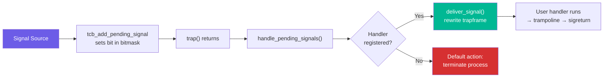
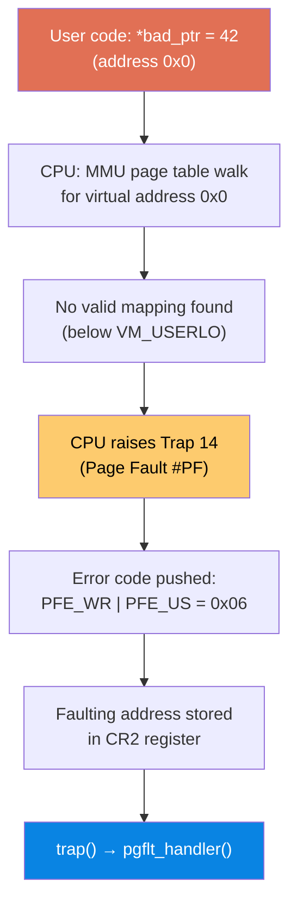
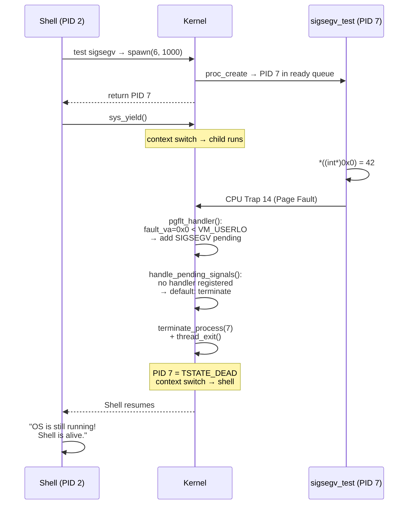
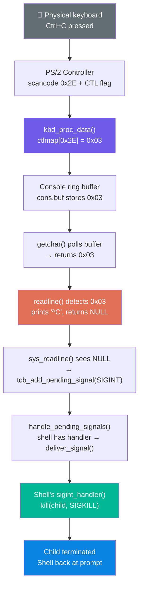
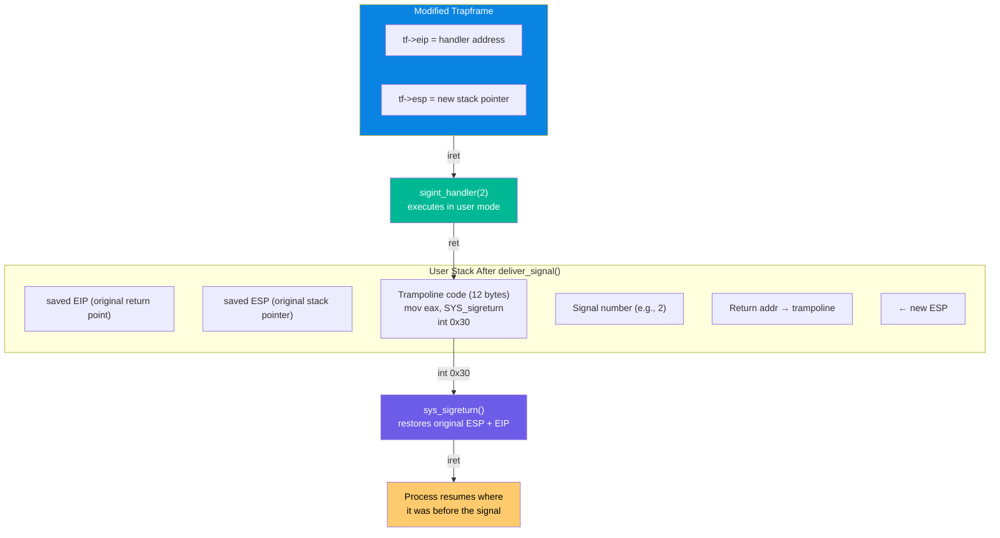
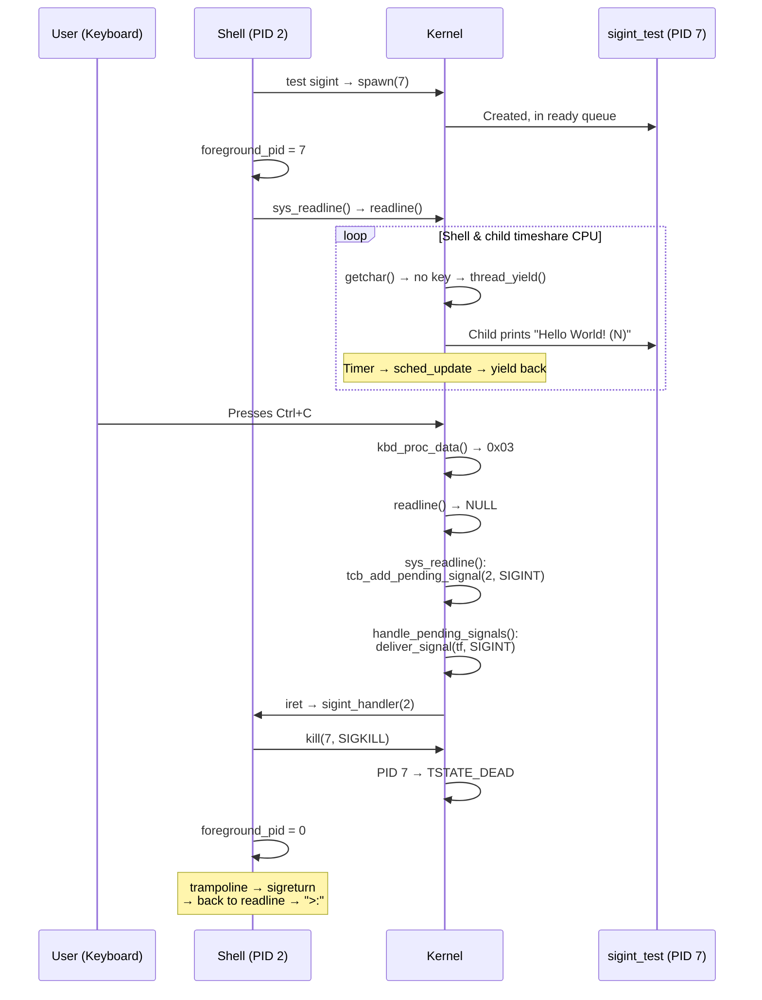
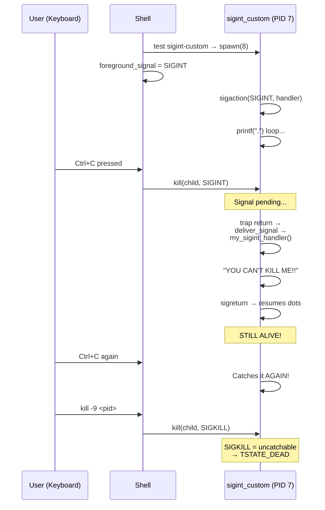
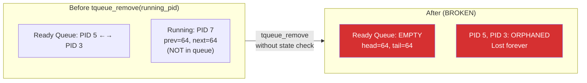

# Expanding the Signal Domain Beyond SIGKILL

*A follow-up to the SIGKILL presentation — introducing SIGSEGV and SIGINT in mCertiKOS*

---

## Slide 1: Title Slide

**Expanding the Signal Domain Beyond SIGKILL**

- Previously: We implemented SIGKILL — a brute-force, uncatchable process terminator
- Now: Two new signals that make our OS smarter and more interactive
  - **SIGSEGV** (Signal 11) — Catching bad memory access
  - **SIGINT** (Signal 2) — Ctrl+C to stop a running process
- These signals are **catchable** — processes can register custom handlers

---

## Slide 2: Why Go Beyond SIGKILL?

**SIGKILL is a hammer. Sometimes you need a scalpel.**

| Capability | SIGKILL Only | With SIGSEGV + SIGINT |
|------------|-------------|----------------------|
| Kill a process forcefully | Yes | Yes |
| Catch bad memory access gracefully | No — kernel panics | Yes — faulting process dies, OS lives |
| Let user press Ctrl+C to stop a program | No | Yes — shell intercepts and kills child |
| Allow process to handle signals | No — always kills | Yes — `sigaction()` registers handlers |
| Signal delivery with context restore | No — one-way trip | Yes — trampoline + `sigreturn` |

- SIGKILL can't be caught or handled — it's always a direct kill
- SIGSEGV and SIGINT go through the **full signal delivery pipeline**

---

## Slide 3: Recap — The Signal Infrastructure We Built

**Shared pipeline used by both SIGSEGV and SIGINT:**

- Each process has a **32-bit pending signal bitmask** in its TCB
- `tcb_add_pending_signal(pid, signum)` → sets the bit
- `handle_pending_signals(tf)` — runs in `trap()` before returning to user space
- `deliver_signal(tf, signum)` — rewrites the trapframe to redirect execution to user handler
- **Trampoline** on user stack → calls `sigreturn` syscall → restores original context



---

# SECTION 1: SIGSEGV

---

## Slide 4: What is SIGSEGV?

**Signal 11 — Segmentation Violation**

- Triggered when a process accesses memory it shouldn't
  - NULL pointer dereference (`*(int*)0 = 42`)
  - Writing to read-only memory
  - Accessing kernel-reserved addresses
- **Default action**: Terminate the faulting process
- **Can be caught**: Yes, via `sigaction()` (useful for custom crash handlers)

**The Problem Before:**

- Any user-space page fault → `KERN_PANIC` → entire OS halts
- One buggy program = reboot the whole system
- No isolation between user mistakes and kernel stability

---

## Slide 5: How SIGSEGV is Triggered — x86 Page Fault

**It starts at the CPU hardware level:**



- **CR2 register**: x86 automatically stores the faulting virtual address here
- **Error code bits**: Tell us *why* the fault happened

| Bit | Name | Set = 1 | Clear = 0 |
|-----|------|---------|-----------|
| 0 | PFE_PR | Protection violation (page exists) | Page not present |
| 1 | PFE_WR | Write access caused fault | Read access |
| 2 | PFE_US | Fault in user mode | Fault in kernel mode |

---

## Slide 6: SIGSEGV Detection Logic in pgflt_handler()

**File**: `kern/trap/TTrapHandler/TTrapHandler.c`

```c
void pgflt_handler(tf_t *tf) {
    unsigned int cur_pid = get_curid();
    unsigned int errno = tf->err;
    unsigned int fault_va = rcr2();        // Read faulting address from CR2

    if (cur_pid > 0) {                     // User process only (not kernel PID 0)
        if ((errno & PFE_PR) || fault_va < VM_USERLO) {
            tcb_add_pending_signal(cur_pid, SIGSEGV);   // Mark SIGSEGV pending
            return;                        // Let handle_pending_signals() do the rest
        }
    }
    // ... original code: kernel panic or demand paging ...
}
```

**Two conditions that trigger SIGSEGV:**

- `errno & PFE_PR` — Page exists but access is **not permitted** (protection violation)
- `fault_va < VM_USERLO` — Address is in **kernel-reserved space** (catches NULL deref, since `0x0 < 0x40000000`)

**Kernel faults (PID 0) still panic** — that's a real kernel bug, not a user mistake

---

## Slide 7: SIGSEGV End-to-End Flow



**Key result**: Faulting process dies cleanly. Shell keeps running. No kernel panic.

---

## Slide 8: The Test — sigsegv_test Process

**What the test process does** (`user/sigsegv_test/sigsegv_test.c`):

```c
int main(int argc, char **argv) {
    printf("[sigsegv_test] Attempting to dereference NULL pointer...\n");

    volatile int *bad_ptr = (volatile int *)0x0;
    *bad_ptr = 42;    // ← This triggers SIGSEGV

    printf("ERROR: Should not reach this line!\n");  // Never prints
    return 0;
}
```

**Before our implementation:**
```
[sigsegv_test] Attempting to dereference NULL pointer...
KERN_PANIC: Permission denied: va=0x00000000
*** SYSTEM HALTED ***          ← entire OS dead
```

**After our implementation:**
```
[sigsegv_test] Attempting to dereference NULL pointer...
[Process 7] Segmentation fault (signal 11)
=== OS is still running! Shell is alive. ===
>:                              ← shell still works!
```

---

# SECTION 2: SIGINT

---

## Slide 9: What is SIGINT?

**Signal 2 — Interrupt (Ctrl+C)**

- Sent when the user presses **Ctrl+C** at the keyboard
- Purpose: Let the user **interactively stop** a running foreground process
- **Default action**: Terminate the process
- **Can be caught**: Yes — our shell catches it to decide *which* process to kill

**The Ctrl+C character:**

| Key Combo | ASCII Value | Name |
|-----------|------------|------|
| Ctrl+C | `0x03` | ETX (End of Text) |

- Keyboard driver uses `ctlmap[]` lookup: `C('C') = 'C' - '@' = 67 - 64 = 3`
- This is a universal terminal convention — same on Linux, macOS, BSD

---

## Slide 10: The Ctrl+C Journey — 6 Layers Deep



---

## Slide 11: Shell's Foreground Process Model

**How the shell tracks what to kill on Ctrl+C:**

```c
static int foreground_pid = 0;        // 0 = no foreground process
static int foreground_signal = SIGKILL; // default signal to send on Ctrl+C
```

**Lifecycle:**

| Step | Action | `foreground_pid` | `foreground_signal` |
|------|--------|-----------------|---------------------|
| Shell starts | — | `0` | `SIGKILL` |
| User runs `test sigint` | `spawn(7)` creates child | Set to child PID | `SIGKILL` (force kill) |
| User runs `test sigint-custom` | `spawn(8)` creates child | Set to child PID | `SIGINT` (catchable) |
| User presses Ctrl+C | `sigint_handler()` runs | Cleared if SIGKILL; kept if SIGINT | — |

**The handler logic:**

```c
void sigint_handler(int signum) {
    if (foreground_pid > 0) {
        kill(foreground_pid, foreground_signal);
        if (foreground_signal == SIGKILL)
            foreground_pid = 0;   // SIGKILL guarantees death
        // SIGINT: keep foreground_pid — child may survive
    } else {
        printf("You pressed Ctrl+C!\n");
    }
}
```

- Registered at shell startup via `sigaction(SIGINT, &sa, 0)`
- `foreground_signal` controls whether the child can catch the signal or not

---

## Slide 12: Signal Delivery — The Trapframe Trick

**How `deliver_signal()` redirects a process to its handler:**

The kernel can't just "call" a user function — it rewrites the **trapframe** so that when the CPU returns to user mode via `iret`, it lands in the handler instead of the original code.



**The trampoline** is actual x86 machine code written onto the user stack:

```nasm
B8 98 00 00 00    mov eax, 152       ; SYS_sigreturn
CD 30             int 0x30           ; syscall trap
EB FE             jmp $              ; safety loop (never reached)
```

---

## Slide 13: SIGINT End-to-End Flow



---

## Slide 14: Demo — The "Unkillable" Process (Catching SIGINT)

**Proof that SIGINT is truly catchable — `test sigint-custom`**

A child process registers its own SIGINT handler and **refuses to die** on Ctrl+C:

```c
/* user/sigint_custom_test/sigint_custom_test.c */
void my_sigint_handler(int signum) {
    printf("\nYOU CAN'T KILL ME!!\n");
}

int main(int argc, char **argv) {
    struct sigaction sa;
    sa.sa_handler = my_sigint_handler;
    sigaction(SIGINT, &sa, 0);         // Register custom handler

    while (1) { printf("."); }         // Print dots forever
}
```

**What happens when the user presses Ctrl+C:**



**Teaching moment**: Only SIGKILL can stop it — demonstrating the POSIX guarantee that SIGKILL and SIGSTOP cannot be caught, blocked, or ignored.

---

## Slide 15: Key Bugs We Found and Fixed

**Three bugs discovered during implementation:**

| # | Bug | Symptom | Root Cause | Fix |
|---|-----|---------|------------|-----|
| 1 | **Ready queue corruption** | OS hangs after killing a process | `tqueue_remove()` called on a RUNNING process (not in queue) wipes the entire ready queue | Added state guard: only call `tqueue_remove` if `state == TSTATE_READY` |
| 2 | **Child process starvation** | Child never prints anything; Ctrl+C doesn't work | `getchar()` spin-waits without yielding — shell hogs CPU in kernel mode forever | Added `thread_yield()` in `getchar()` polling loop |
| 3 | **"Unknown command" after Ctrl+C** | Shell runs stale buffer as command after signal return | `sigreturn` only restores ESP/EIP, not EAX — shell sees errno=0 (success) and processes old buffer data | Clear buffer before readline (`buf[0]='\0'`), guard with `buf[0]!='\0'` |

**Bug #1 visualized — the queue wipe:**



---

## Slide 16: Why These Signals Matter

**What we gain:**

| Advantage | Without | With |
|-----------|---------|------|
| **Process isolation** | One buggy user program crashes the whole OS | Faulting process dies, everything else continues |
| **Interactive control** | No way to stop a runaway process except rebooting | Ctrl+C terminates the foreground process instantly |
| **Catchable signals** | Only SIGKILL (uncatchable, always kills) | Processes can register custom handlers for graceful shutdown, cleanup, or debugging |
| **OS stability** | Kernel panics on every user NULL dereference | Kernel stays stable; only the offending process is removed |
| **POSIX compatibility** | Bare minimum signal support | Closer to real UNIX signal semantics |

**What goes wrong without them:**

- A student's buggy code with a NULL pointer → **entire OS halts**, must reboot QEMU
- Long-running computation with no exit condition → **no way to stop it** except power off
- No distinction between "process made a mistake" and "kernel has a bug"
- OS can't be used as a practical teaching tool — too fragile for experimentation

**Bottom line**: SIGSEGV and SIGINT transform mCertiKOS from a fragile toy into a resilient OS that handles real-world scenarios — bad code and impatient users.

---

*End of slides*
