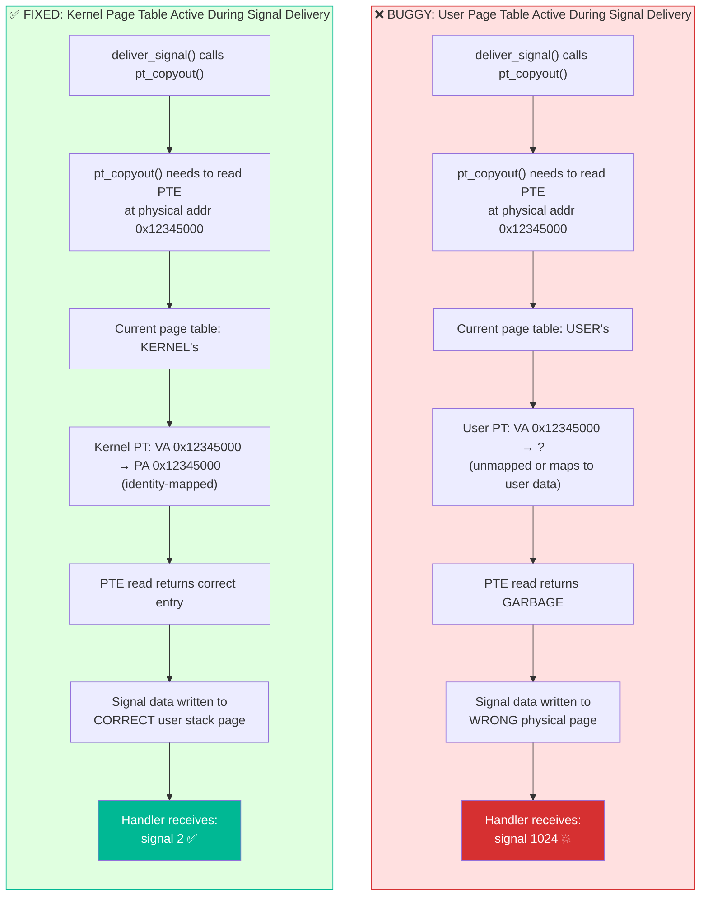
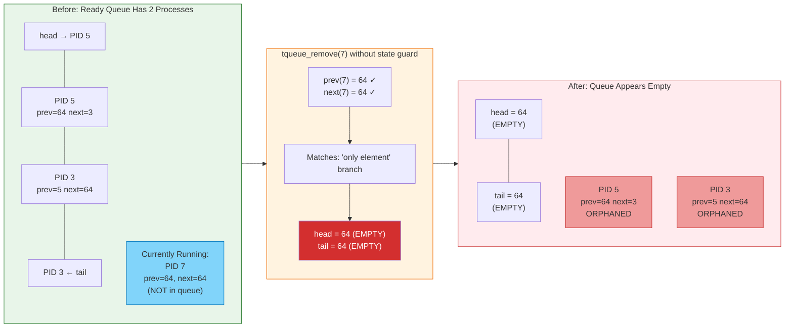

# Implementation Challenges: Debugging Signal Delivery in CertiKOS

*Two critical bugs that broke the kernel — and how we fixed them*

---

## Slide 1: Overview — Two Bugs That Broke Everything

**During signal implementation, two bugs caused complete system failure:**

| # | Bug | Severity | Symptom |
|---|-----|----------|---------|
| 1 | **Page table ordering in `trap()`** | Critical | Signal handler receives garbage arguments; kernel writes to wrong memory |
| 2 | **Ready queue corruption on process kill** | Critical | OS hangs permanently after terminating any process |

- Both bugs passed compilation with zero warnings
- Both produced **silent, cascading failures** — no panics, no error messages, just wrong behavior
- Both required deep understanding of x86 memory management and CertiKOS internals to diagnose

---

## Slide 2: Bug #1 — Page Table Ordering in `trap()`

### The Setup

- `deliver_signal()` uses `pt_copyout()` to write the signal stack frame (trampoline, signal number, return address) onto the **user's stack**
- `pt_copyout()` internally **walks the user's page table** to translate virtual → physical addresses
- The page table walk reads Page Table Entries (PTEs) from physical memory

### What Went Wrong

```c
// BUGGY trap() ordering:
void trap(tf_t *tf) {
    set_pdir_base(0);         // ✅ Switch to kernel page table
    f(tf);                    // Handle syscall/interrupt

    set_pdir_base(cur_pid);   // ❌ Switch to USER page table FIRST
    handle_pending_signals(tf); // ❌ Then try to deliver signals
    trap_return(tf);
}
```

- `pt_copyout()` needs to read PTEs from **physical memory** (e.g., PTE at physical address `0x12345000`)
- Kernel page table: identity-maps physical memory → `VA 0x12345000 = PA 0x12345000` ✅
- User page table: does NOT identity-map kernel/physical addresses → `VA 0x12345000 = ???` ❌
- Result: PTE lookup returns **garbage** → signal data written to **wrong physical page**
- Handler receives corrupted arguments (e.g., `signal 1024` instead of `signal 2`)

### The Fix

```c
// CORRECT trap() ordering:
void trap(tf_t *tf) {
    set_pdir_base(0);           // Switch to kernel page table
    f(tf);                      // Handle syscall/interrupt
    kstack_switch(cur_pid);

    handle_pending_signals(tf); // ✅ Signals BEFORE page table switch
    set_pdir_base(cur_pid);     // ✅ User page table AFTER signals done
    trap_return(tf);
}
```

- Signal delivery now runs with **kernel page table active**
- `pt_copyout()` can correctly resolve physical addresses via identity mapping
- User page table is restored only after all kernel memory operations are complete

---

## Slide 3: Bug #1 — Visual: Why Page Table Order Matters



**Key takeaway:** Any kernel function that walks page tables (`pt_copyout`, `pt_copyin`) must run with the **kernel page table** active — never the user's.

---

## Slide 4: Bug #2 — Ready Queue Corruption on Process Kill

### The Setup

- CertiKOS ready queue is a **doubly-linked list** using TCB `prev`/`next` fields
- `tqueue_remove(pid)` unlinks a process from the queue by patching neighbors' pointers
- A **running** process (state = `TSTATE_RUN`) is NOT in the ready queue
  - Its `prev` and `next` are both `NUM_IDS` (64) — the sentinel "empty" value

### What Went Wrong

- `terminate_process()` called `tqueue_remove(pid)` **without checking process state**
- If the target was currently RUNNING (`prev=64, next=64`), `tqueue_remove` saw the sentinel values and executed the **"only element in queue"** branch:

```c
// tqueue_remove() sees prev=64, next=64:
if (prev == NUM_IDS && next == NUM_IDS) {
    tqueue_set_head(chid, NUM_IDS);  // ← Wipes queue head to EMPTY
    tqueue_set_tail(chid, NUM_IDS);  // ← Wipes queue tail to EMPTY
}
```

- **Result**: Ready queue head/tail reset to `NUM_IDS` (empty)
- All processes that WERE in the queue are now **orphaned** — still linked to each other but unreachable
- Scheduler calls `tqueue_dequeue()` → returns `NUM_IDS` → **no process to run → OS hangs**

### The Fix

```c
// Guard: only remove from queue if actually IN the queue
if (tcb_get_state(pid) == TSTATE_READY) {
    tqueue_remove(NUM_IDS, pid);
}
tcb_set_state(pid, TSTATE_DEAD);
```

- `TSTATE_READY` → process is in the ready queue → safe to remove
- `TSTATE_RUN` → process is executing → NOT in the queue → skip removal
- Applied in both `terminate_process()` and `sys_kill()` SIGKILL fast path

---

## Slide 5: Bug #2 — Visual: The Queue Wipe



**The sentinel confusion:** `tqueue_remove()` uses `prev=64, next=64` to mean "only element in queue" — but a RUNNING process also has `prev=64, next=64` because it was **dequeued** when it started running. The state guard (`TSTATE_READY` check) disambiguates these two cases.

---

*End of challenge slides*
