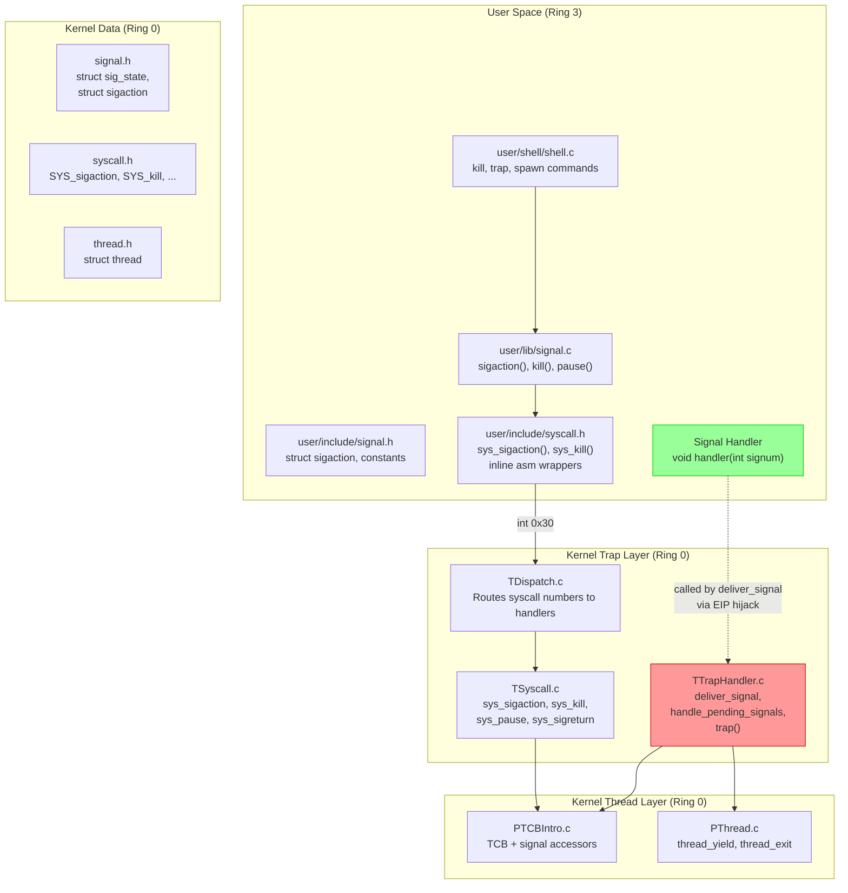
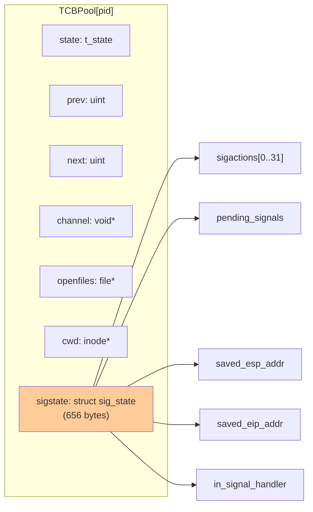
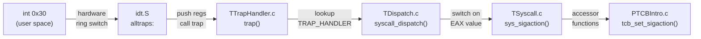
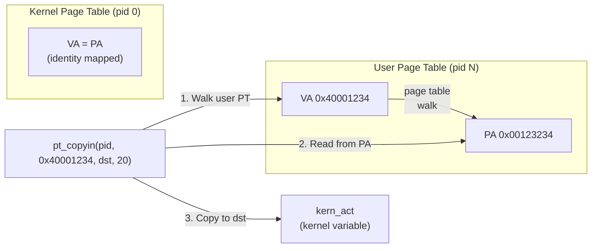
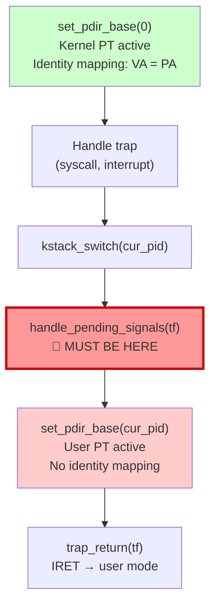
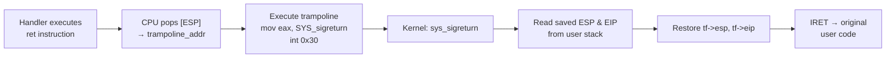
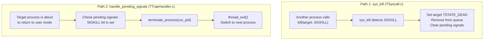
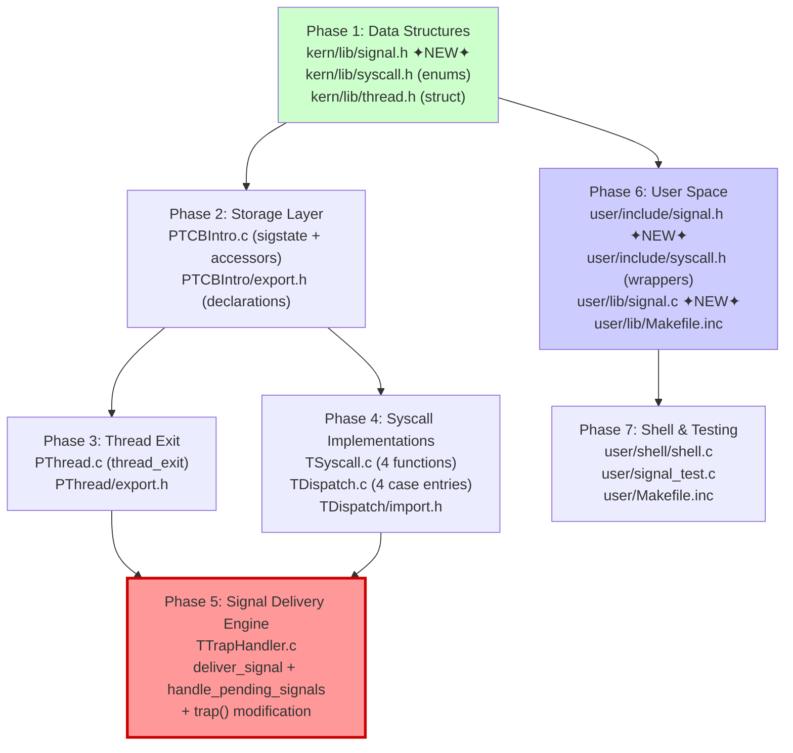
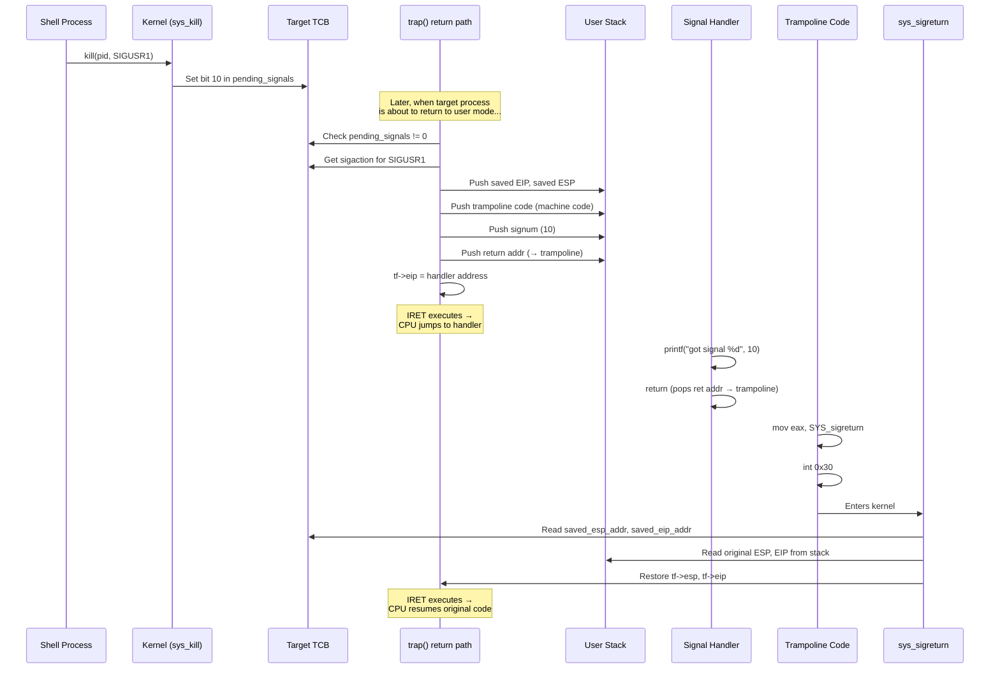

# Planning & Roadmap for Implementing POSIX-Compliant Signal Mechanism on mCertiKOS

> Presentation Slides

---

## Slide 1: Title

### Planning & Roadmap for Implementing POSIX-Compliant Signal Mechanism on mCertiKOS

- **Context:** mCertiKOS — educational x86 OS with layered verification architecture
- **Goal:** Add POSIX-style signal handling (registration, delivery, return) to the existing kernel


---

## Slide 2: What Are We Building?

**A complete signal pipeline — from user `kill()` to handler execution and seamless return**

- **4 new system calls:** `sigaction`, `kill`, `pause`, `sigreturn`
- **Signal delivery engine:** intercepts trap return path, hijacks EIP to redirect execution
- **Inline trampoline:** raw x86 machine code on user stack triggers automatic `sigreturn`
- **User-space API:** POSIX-compatible `sigaction()`, `kill()`, `pause()` wrappers
- **Shell commands:** interactive `kill`, `trap`, `spawn` for testing

**What we are NOT building:**
- Real-time signals, signal queuing, `SA_SIGINFO` extended handlers
- Multi-CPU signal targeting
- Full signal blocking/masking enforcement

---

## Slide 3: Architecture — The 5-Layer View



- CertiKOS enforces **layered isolation** — each module only accesses others via `export.h`/`import.h`
- TCB accessors are the *only* way to read/write signal state from other layers

---

## Slide 4: Data Structures — `struct sigaction`

**Per-signal configuration (20 bytes, mirrors POSIX)**

| Field | Size | Purpose |
|-------|------|---------|
| `sa_handler` | 4B | Pointer to handler function (`void (*)(int)`) |
| `sa_sigaction` | 4B | Extended 3-arg handler (defined, unused) |
| `sa_flags` | 4B | Behavior flags — `SA_RESTART`, `SA_NODEFER`, etc. |
| `sa_restorer` | 4B | Custom restorer (defined, unused) |
| `sa_mask` | 4B | Bitmask of signals to block during handler |

- **Why mirror POSIX?** User code looks identical to standard Linux programs
- **Only `sa_handler` is functionally required** for basic implementation
- Entire struct is copied as a 20-byte block via `pt_copyin`/`pt_copyout` — no per-field marshalling

---

## Slide 5: Data Structures — `struct sig_state` & TCB Integration

**Per-process signal state (656 bytes, embedded in TCB)**

| Field | Size | Purpose |
|-------|------|---------|
| `sigactions[32]` | 640B | One `sigaction` per signal number |
| `pending_signals` | 4B | Bitmask — bit N = signal N is pending |
| `signal_block_mask` | 4B | Bitmask of blocked signals |
| `saved_esp_addr` | 4B | User stack address where original ESP was saved |
| `saved_eip_addr` | 4B | User stack address where original EIP was saved |
| `in_signal_handler` | 4B | Re-entrancy guard flag |



- **Pending bitmask:** `|= (1 << signum)` to set, `&= ~(1 << signum)` to clear
- **Saved addresses (not values):** `sigreturn` reads the original ESP/EIP from the user stack via `pt_copyin`

---

## Slide 6: Syscall Plumbing — How User Code Reaches the Kernel



**CertiKOS syscall calling convention:**
- `EAX` = syscall number, `EBX` = arg1, `ECX` = arg2, `EDX` = arg3
- Return value in `EAX` (error code: `E_SUCC` = 0)
- Kernel reads via `syscall_get_arg2(tf)` → tf→regs.ebx (note: arg1 = EAX = syscall number)

**Adding a new syscall requires changes at 3 levels:**
1. `kern/lib/syscall.h` — add enum entry (`SYS_sigaction`, etc.)
2. `TDispatch.c` — add `case SYS_sigaction: sys_sigaction(tf); break;`
3. `TSyscall.c` — implement the handler function

---

## Slide 7: The User-Space Inline Assembly

**Each syscall wrapper is an inline asm block that loads registers and fires `int 0x30`**

```c
asm volatile ("int %1"
      : "=a" (errno)           // OUTPUT: EAX → errno
      : "i" (T_SYSCALL),       // 48 = int 0x30
        "a" (SYS_sigaction),   // EAX ← syscall number
        "b" (signum),          // EBX ← first argument
        "c" (act),             // ECX ← user pointer to new sigaction
        "d" (oldact)           // EDX ← user pointer to old sigaction
      : "cc", "memory");
```

**Key details:**
- `"=a"` — output constraint binds EAX to `errno` after the interrupt returns
- `"i"` — immediate operand (the interrupt vector number, compile-time constant)
- `"cc", "memory"` — tells GCC: flags and memory may change (prevents unsafe optimizations)
- The kernel **cannot dereference** `act`/`oldact` directly — must use `pt_copyin`/`pt_copyout`

---

## Slide 8: Signal Registration — `sys_sigaction`

**Flow: user fills `struct sigaction` → syscall copies it into kernel TCB**

- **Why `pt_copyin`, not `*user_act`?**
  - Kernel runs under kernel page table (identity-mapped: VA = PA)
  - User pointers are virtual addresses valid only under the *user's* page table
  - Direct dereference accesses wrong physical address → crash or garbage



- `pt_copyin` — user→kernel (reads user's `sigaction` into kernel variable)
- `pt_copyout` — kernel→user (writes old handler back if `oldact` is provided)

---

## Slide 9: Signal Generation — `sys_kill`

**Flow: sender calls `kill(pid, signum)` → kernel sets pending bit on target TCB**

- **Normal signals (not SIGKILL):**
  - Validate `signum` (1–31) and `pid` (alive process)
  - `tcb_add_pending_signal(pid, signum)` — sets bit in 32-bit bitmask
  - If target is sleeping: call `thread_wakeup()` to move it to ready queue

- **SIGKILL (signal 9) — immediate termination:**
  - Cannot be caught, blocked, or ignored
  - `tcb_set_state(pid, TSTATE_DEAD)` + `tqueue_remove(NUM_IDS, pid)` immediately
  - No pending bit — target is dead right now

- **Why wake sleeping processes?**
  - A sleeping process never reaches the trap return path
  - If not woken, the signal remains pending forever
  - Waking moves it to the ready queue → eventually enters `trap()` → signal delivery fires

---

## Slide 10: The Critical Delivery Point — `trap()` Function

**Signal delivery MUST happen at a specific point in the trap return path**



- **Why before `set_pdir_base(cur_pid)`?**
  - `deliver_signal()` calls `pt_copyout()` to write trampoline onto user stack
  - `pt_copyout()` needs identity-mapped physical memory access (kernel PT)
  - After switching to user PT: kernel loses physical address access → **crash**

- **This is the #1 implementation pitfall** — placing the call after `set_pdir_base` causes a kernel page fault with no useful error message

---

## Slide 11: Signal Delivery — The Context Hijack (`deliver_signal`)

**The core trick: modify `tf->eip` so that IRET jumps to the handler instead of the original code**

**User stack layout built by `deliver_signal()`:**

```
       High addresses (original ESP)
       ┌──────────────────────┐
       │   original stack     │
       ├──────────────────────┤ ← original tf->esp
       │   saved_eip (4B)     │   ← sigreturn reads this
       ├──────────────────────┤
       │   saved_esp (4B)     │   ← sigreturn reads this
       ├──────────────────────┤
       │   trampoline (12B)   │   ← executable machine code
       ├──────────────────────┤
       │   signum (4B)        │   ← handler arg [ESP+4]  (cdecl)
       ├──────────────────────┤
       │   ret addr (4B)      │   ← → trampoline [ESP+0] (cdecl)
       ├──────────────────────┤ ← new tf->esp
       Low addresses
```

- Everything is written via `pt_copyout()` — kernel writes into user's address space
- **cdecl convention:** `[ESP]` = return address, `[ESP+4]` = first argument
  - Signal number is on the **stack**, NOT in EAX (common mistake)
- After setup: `tf->eip = handler_address`, `tf->esp = new_esp`
- Saved context addresses stored in TCB for `sigreturn` to retrieve later

---

## Slide 12: The Trampoline — Inline x86 Machine Code

**When the handler `ret`urns, execution lands on our trampoline code — which triggers `sigreturn`**

```
Bytes       Assembly               Purpose
──────────────────────────────────────────────────────────
B8 XX 00    mov eax, SYS_sigreturn  Load syscall number into EAX
00 00
CD 30       int 0x30                Trap into kernel → sys_sigreturn
EB FE       jmp $                   Safety: infinite loop if sigreturn fails
90 90 90    nop; nop; nop           Padding to 12 bytes (alignment)
```

- **Why inline machine code?**
  - Self-contained — no dependency on user-space libraries or fixed addresses
  - Written to user stack by kernel via `pt_copyout`
  - Alternative approaches (VDSO, fixed-address page) are more complex

- **`EB FE` = `jmp $` (jump to self):**
  - Relative jump, operand = -2 → jumps back to start of this instruction
  - Safety net: if `sigreturn` fails, process spins instead of executing stack garbage

- **Stack executability:** CertiKOS does not set NX bit → stack is executable

---

## Slide 13: Signal Return — `sys_sigreturn`

**Restores the original execution context so the process resumes where it was interrupted**



**Steps inside `sys_sigreturn()`:**
1. Read `saved_esp_addr` and `saved_eip_addr` from TCB (set during delivery)
2. `pt_copyin()` from those user-stack addresses to get original ESP and EIP values
3. Clear signal context in TCB (`in_signal_handler = 0`)
4. Write restored values into trap frame: `tf->esp = orig_esp`, `tf->eip = orig_eip`
5. When `trap_return()` executes IRET → process resumes at original code, original stack

**Result:** The process has no idea a signal handler ran — completely transparent redirection

---

## Slide 14: Process Termination — SIGKILL & `thread_exit()`

**Why can't we use `thread_yield()` for killed processes?**

| | `thread_yield()` | `thread_exit()` |
|---|---|---|
| Sets state to READY | Yes | **No** |
| Re-enqueues in ready queue | Yes | **No** |
| Switches to next thread | Yes | Yes |
| **Effect on dead process** | Gets re-scheduled → crash | **Vanishes from scheduler** |

**SIGKILL is handled in two places:**



- **Path 1:** Another process kills the target — immediate from sender's context
- **Path 2:** Self-kill or deferred — when checking pending signals in trap return path

---

## Slide 15: Implementation Roadmap — 7 Phases



- **Phase 5 (red)** is the most complex — save it until all dependencies compile
- **Phases 1→6 are parallelizable** (kernel and user space are independently compilable)
- Run `make` after each phase to catch compiler errors early

---

## Slide 16: Phase Details & File Map

| Phase | Files Modified/Created | Lines | Key Deliverable |
|-------|----------------------|-------|-----------------|
| 1 — Data Structures | `kern/lib/signal.h` ✦, `syscall.h`, `thread.h` | ~85 | Signal types, constants, enums |
| 2 — Storage Layer | `PTCBIntro.c`, `PTCBIntro/export.h` | ~105 | `sig_state` in TCB + 12 accessor functions |
| 3 — Thread Exit | `PThread.c`, `PThread/export.h` | ~30 | `thread_exit()` — exit without re-queuing |
| 4 — Syscall Impl | `TSyscall.c`, `TDispatch.c`, `TDispatch/import.h` | ~180 | `sys_sigaction`, `sys_kill`, `sys_pause`, `sys_sigreturn` |
| 5 — Delivery Engine | `TTrapHandler.c` | ~145 | `deliver_signal`, `handle_pending_signals`, `trap()` mod |
| 6 — User API | `user/include/signal.h` ✦, `syscall.h`, `signal.c` ✦, `Makefile.inc` | ~120 | POSIX wrappers + inline asm stubs |
| 7 — Shell & Test | `shell.c`, `signal_test.c`, `Makefile.inc` | ~240 | `kill`, `trap`, `spawn` commands + test program |

**Total: 3 new files + 16 modified files ≈ 760 lines of new code**

---

## Slide 17: Key Design Decisions & Rationale

| Decision | Why |
|----------|-----|
| **Bitmask for pending signals** | O(1) set/clear/check; matches Linux standard signal model |
| **`pt_copyin`/`pt_copyout` for user data** | Kernel PT ≠ User PT; direct pointer dereference crashes |
| **Inline trampoline on stack** | Self-contained; no fixed addresses or user-lib dependencies |
| **cdecl for handler args** | GCC compiles handlers as normal C functions → args on stack |
| **Signal check before `set_pdir_base`** | `pt_copyout` needs identity-mapped physical memory (kernel PT) |
| **`thread_exit()` for SIGKILL** | `thread_yield()` re-enqueues → dead process gets re-scheduled |
| **Store addresses, not values** | Saved context lives on user stack like real OS implementations |
| **12 TCB accessor functions** | Maintains CertiKOS layered verification boundaries |

---

## Slide 18: End-to-End Signal Lifecycle



---

## Slide 19: Thank You

### Summary

- **7-phase implementation** touching kernel data structures, thread management, trap handling, and user-space API
- **Core mechanism:** Trap frame hijack + inline trampoline + `sigreturn` restoration
- **Critical constraint:** Signal delivery must occur under the kernel page table (before `set_pdir_base`)


---
