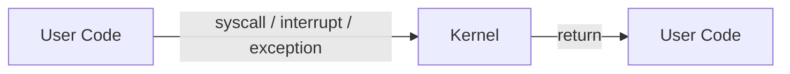
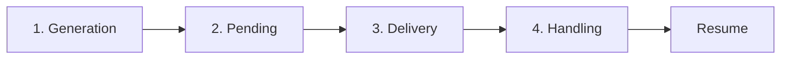
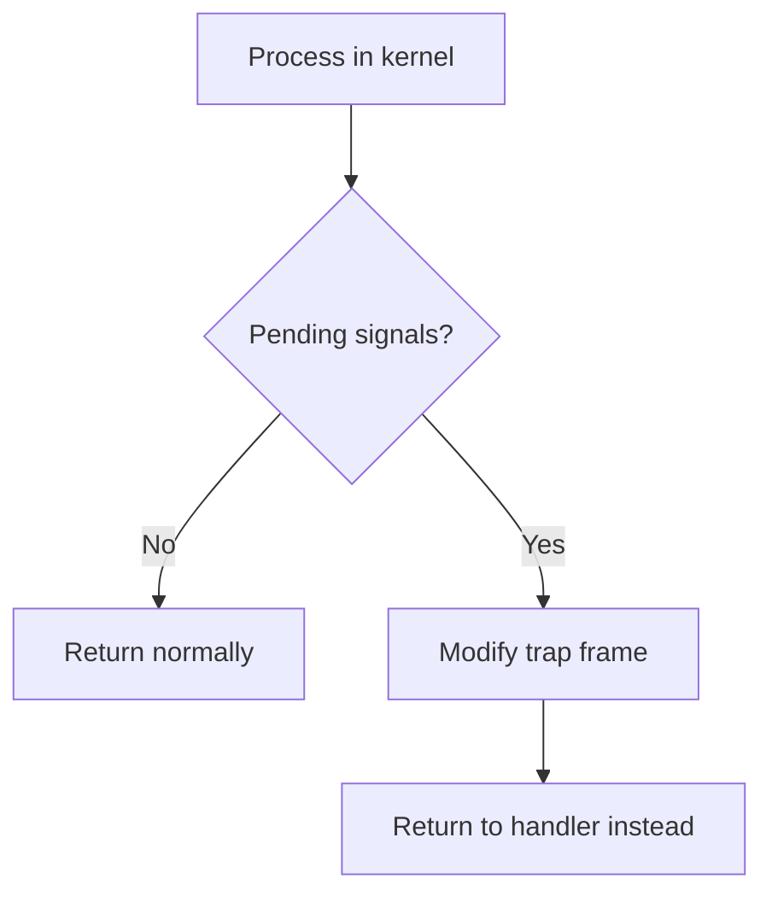
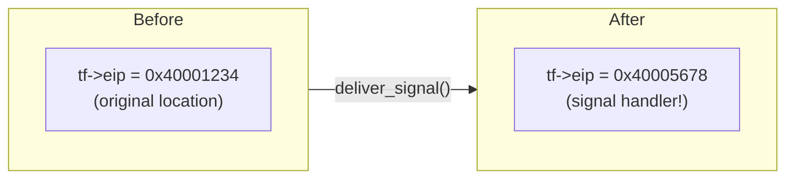
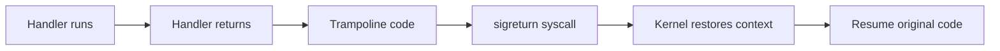
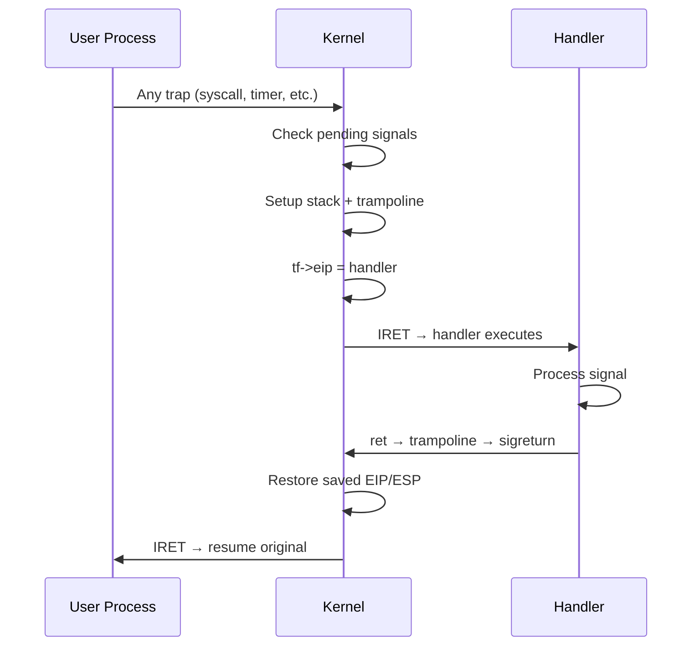
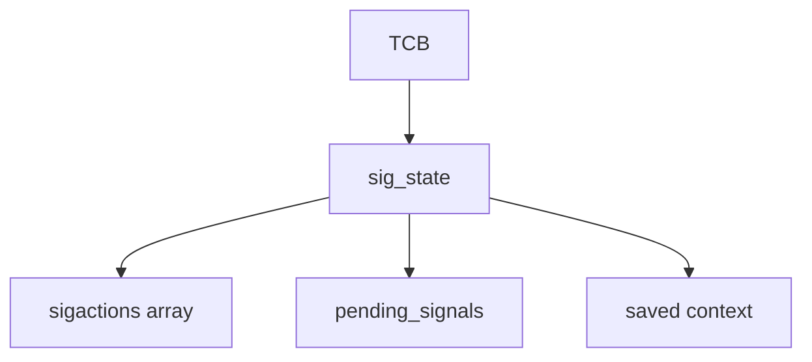

# Signal Implementation in mCertiKOS
## Presentation Slides

---

## Slide 1: Title

# Implementing Signal Mechanism in mCertiKOS

**From Concept to Implementation**

- Building intuition behind signal internals
- Key components and their interactions
- Step-by-step implementation approach

---

## Slide 2: Agenda

# What We'll Cover

1. **Building Intuition** — Why signals work the way they do
2. **The Mechanism** — Key components and their interactions
3. **Applying to mCertiKOS** — Implementation approach
4. **Challenges** — Critical gotchas and how to avoid them

> Goal: Understand the *why* before the *how*

---

## Slide 3: Key Terminology

# Key Terms to Know

| Term | Meaning |
|------|---------|
| **Trap Frame** | Saved CPU state (registers, EIP, ESP) when entering kernel |
| **EIP** | Instruction Pointer — where CPU executes next |
| **ESP** | Stack Pointer — top of the current stack |
| **IRET** | "Interrupt Return" — CPU instruction to return from kernel |
| **Trap** | Any transition from user to kernel (syscall, interrupt, exception) |
| **TCB** | Thread Control Block — per-process kernel data structure |

---

## Slide 4: Key Terminology (cont.)

# More Key Terms

| Term | Meaning |
|------|---------|
| **Pending Signal** | Signal sent but not yet delivered to handler |
| **Signal Handler** | User-defined function to handle a signal |
| **Trampoline** | Small code snippet that helps return from handler |
| **sigreturn** | Syscall to restore context after handler completes |
| **cdecl** | C calling convention — arguments passed on stack |

---

## Slide 5: The Big Question

# The Core Problem

**How do you interrupt a running process to run different code?**

- Process is happily executing at address `0x40001234`
- You want it to suddenly run your signal handler at `0x40005678`
- Then resume exactly where it left off

> This is fundamentally different from a normal function call!

---

## Slide 6: Why Kernel Involvement?

# Why Can't User Space Do This Alone?

- **No self-interruption** — A running process can't stop itself
- **Asynchronous nature** — Signal can arrive at *any* moment
- **Context preservation** — Must save/restore exact CPU state
- **Security** — Can't let processes arbitrarily modify each other

> The kernel is the only entity that can safely hijack execution

---

## Slide 7: The Key Insight

# The Kernel's Opportunity

**When does the kernel have control?**



- Every syscall, interrupt, timer tick → kernel gets control
- Kernel can **modify where to return** before going back

> The return path is where the magic happens!

---

## Slide 8: The Trap Frame

# The Trap Frame — Your Control Panel

When entering kernel, CPU state is saved:

```
┌─────────────────┐
│ EIP (saved)     │ ← Where to resume (WE CAN CHANGE THIS!)
├─────────────────┤
│ ESP (saved)     │ ← User stack pointer (WE CAN CHANGE THIS!)
├─────────────────┤
│ EFLAGS          │
├─────────────────┤
│ Registers       │ ← EAX, EBX, ECX, ...
└─────────────────┘
```

**Key insight**: Modify `EIP` → control where process resumes!

---

## Slide 9: Signal Lifecycle Overview

# Signal Lifecycle — 4 Phases



| Phase | What Happens |
|-------|--------------|
| **Generation** | `kill()` called → signal marked pending |
| **Pending** | Waits until process enters kernel |
| **Delivery** | Kernel modifies trap frame |
| **Handling** | User handler executes |

---

## Slide 10: Phase 1 & 2 — Generation and Pending

# Storing Pending Signals

**Simple bitmask approach:**

```
Signal:  1   2   3   4   5  ...  31
Bit:     1   2   3   4   5  ...  31

pending_signals = 0b00000000000000000000000000000100
                                                  ^
                                              SIGINT (2)
```

- **Set pending**: `pending |= (1 << signum)`
- **Clear pending**: `pending &= ~(1 << signum)`
- **Check pending**: `pending & (1 << signum)`

> One bit per signal type — simple and efficient!

---

## Slide 11: Phase 3 — The Delivery Moment

# When to Deliver?

**At every kernel → user transition!**



Why this moment?
- Trap frame is accessible
- We have full control
- Safe transition point

---

## Slide 12: The EIP Hijack

# The Core Trick — EIP Hijacking



When `IRET` executes:
- CPU pops EIP from trap frame
- Jumps to handler, not original code!

> One assignment changes everything!

---

## Slide 13: But Wait — The Return Problem

# Handler Return — The Tricky Part

**Problem**: When handler does `ret`, where does it go?

```c
void my_handler(int signum) {
    printf("Got signal %d\n", signum);
    return;  // ← Return to WHERE?!
}
```

- Normal function: return address on stack
- Signal handler: kernel changed EIP directly
- No return address was set up!

> Handler would crash or return to garbage!

---

## Slide 14: The Solution — Trampoline

# The Trampoline Pattern

**Solution**: Set up a return path on the stack



Trampoline = small code that calls `sigreturn`

---

## Slide 15: Stack Layout for Signal Delivery

# What Kernel Sets Up

```
User Stack (after signal delivery):
┌─────────────────────┐ High
│ Saved EIP           │ ← Original return point
├─────────────────────┤
│ Saved ESP           │ ← Original stack pointer
├─────────────────────┤
│ Trampoline code     │ ← mov eax, SYS_sigreturn
│ (executable bytes)  │   int 0x30
├─────────────────────┤
│ Signal number       │ ← Handler's argument [ESP+4]
├─────────────────────┤
│ Trampoline addr     │ ← Return address [ESP]
└─────────────────────┘ Low ← ESP points here
```

---

## Slide 16: Complete Signal Flow

# Putting It All Together



---

## Slide 17: Applying to mCertiKOS

# mCertiKOS Implementation Overview

**What we need:**

1. **Data structures** — Store handlers and pending signals per process
2. **Syscalls** — `sigaction`, `kill`, `pause`, `sigreturn`
3. **Delivery logic** — Check and deliver at trap return
4. **Trampoline** — Code to call sigreturn



---

## Slide 18: mCertiKOS Data Structures

# Key Data Structures

```c
struct sig_state {
    struct sigaction sigactions[32];  // Handler per signal
    uint32_t pending_signals;         // Bitmask
    uint32_t saved_esp;               // For sigreturn
    uint32_t saved_eip;               // For sigreturn
    int in_handler;                   // Currently handling?
};
```

```c
struct sigaction {
    void (*sa_handler)(int);  // Handler function pointer
    uint32_t sa_mask;         // Signals to block
    int sa_flags;             // Options
};
```

---

## Slide 19: Implementation Steps

# Step-by-Step Implementation

| Step | Task | Key Function |
|------|------|--------------|
| 1 | Add sig_state to TCB | `PTCBIntro.c` |
| 2 | Implement sigaction syscall | `sys_sigaction()` |
| 3 | Implement kill syscall | `sys_kill()` |
| 4 | Add delivery check | `handle_pending_signals()` |
| 5 | Implement deliver_signal | `deliver_signal()` |
| 6 | Setup trampoline | (inline in deliver_signal) |
| 7 | Implement sigreturn | `sys_sigreturn()` |

---

## Slide 20: Critical Gotcha — Page Table Context

# ⚠️ Critical: Page Table Timing

**Problem discovered during implementation:**

```c
// WRONG ORDER - will fail!
set_pdir_base(cur_pid);       // Switch to user page table
handle_pending_signals(tf);    // Kernel can't write to user stack!

// CORRECT ORDER
handle_pending_signals(tf);    // Use kernel's identity-mapped memory
set_pdir_base(cur_pid);       // Then switch to user page table
```

**Why?**
- Kernel page table has identity mapping (phys addr = virt addr)
- User page table does NOT
- `pt_copyout()` needs kernel's mapping to write to user memory

---

## Slide 21: SIGKILL — Special Case

# Special Handling: SIGKILL

**SIGKILL (signal 9) is different:**

- Cannot be caught or ignored
- Must terminate immediately
- Don't wait for trap return!

```c
void sys_kill(tf_t *tf) {
    // ...
    if (signum == SIGKILL) {
        // Terminate immediately, don't set pending!
        tcb_set_state(pid, TSTATE_DEAD);
        tqueue_remove(NUM_IDS, pid);
        return;
    }
    // Other signals: set pending
    pending_signals |= (1 << signum);
}
```

---

## Slide 22: Summary

# Key Takeaways

1. **Signals hijack the return path** — Modify EIP in trap frame

2. **Trampoline enables clean return** — Handler → trampoline → sigreturn → resume

3. **Timing matters** — Deliver signals BEFORE switching page tables

4. **Bitmask for pending signals** — Simple and efficient

5. **SIGKILL is special** — Terminate immediately, no handler

---

## Slide 23: Questions?

# Questions & Discussion

**Resources:**
- Full implementation: `kern/trap/TTrapHandler/TTrapHandler.c`
- Debug chronicle: `docs/10_implementation_debug_log.md`
- Complete flow: `docs/06_execution_flow.md`

---

## Appendix: Trampoline Code

# Trampoline — Actual Bytes

```asm
; 9 bytes of executable code pushed to user stack
mov eax, 66        ; B8 42 00 00 00  (SYS_sigreturn = 66)
int 0x30           ; CD 30           (syscall interrupt)
jmp $              ; EB FE           (infinite loop, never reached)
```

```c
uint8_t trampoline[] = {
    0xB8, 0x42, 0x00, 0x00, 0x00,  // mov eax, 66
    0xCD, 0x30,                     // int 0x30
    0xEB, 0xFE                      // jmp $ (safety)
};
```

---

## Appendix: Handler Argument Passing

# cdecl Calling Convention

**Handler signature**: `void handler(int signum)`

Stack when handler starts:
```
[ESP]   = return address (→ trampoline)
[ESP+4] = signum (first argument)
```

Handler reads argument from `[EBP+8]` after prologue:
```asm
push ebp          ; [ESP] = old EBP
mov ebp, esp      ; EBP = ESP
; Now [EBP+8] = signum (skipping saved EBP and return addr)
```
