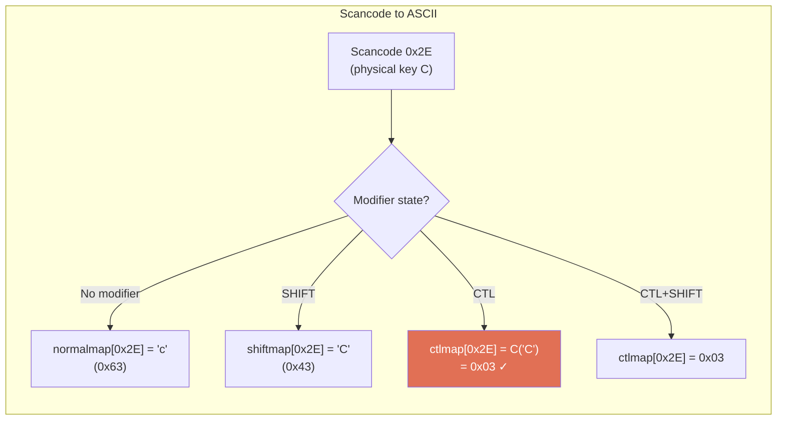
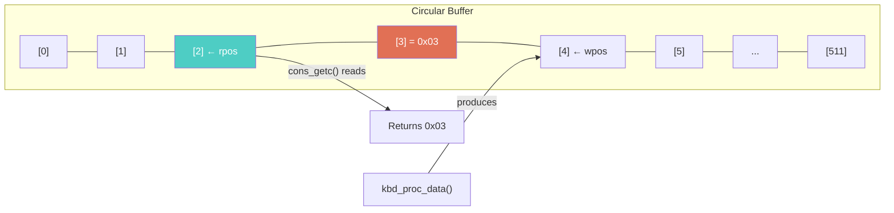
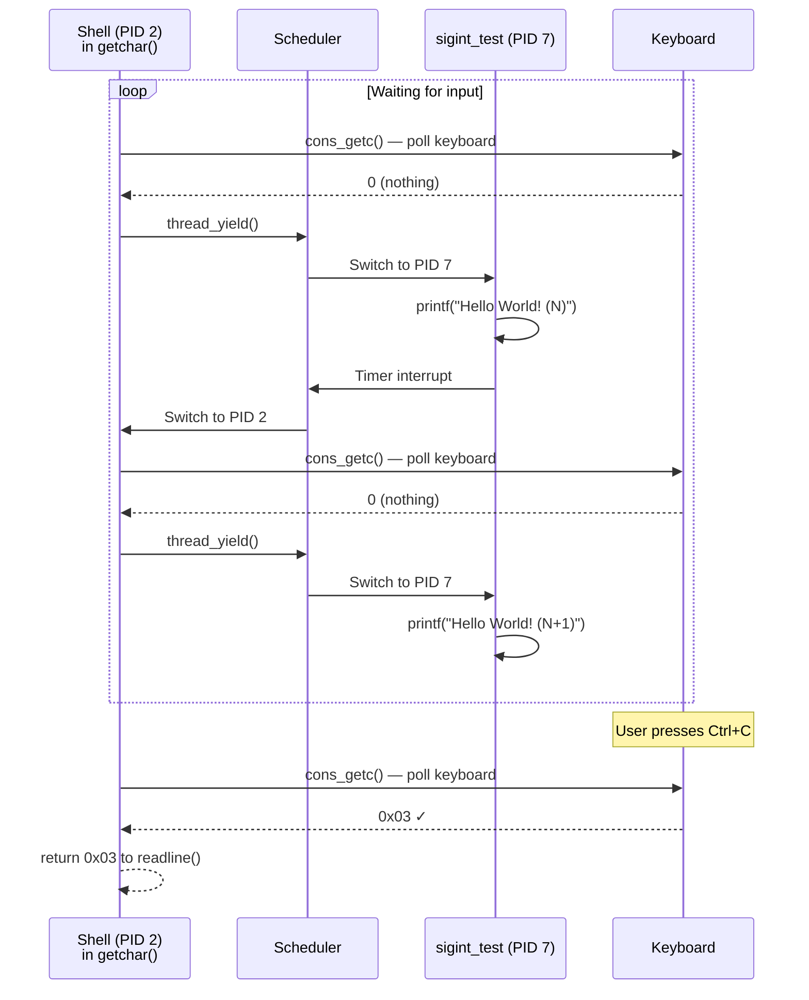
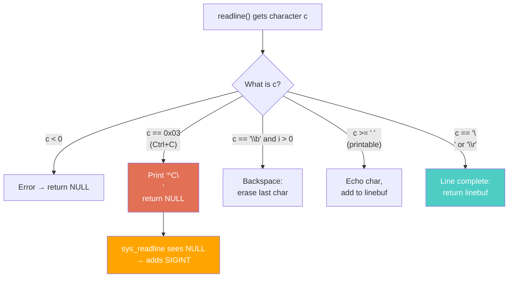
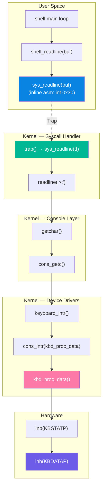
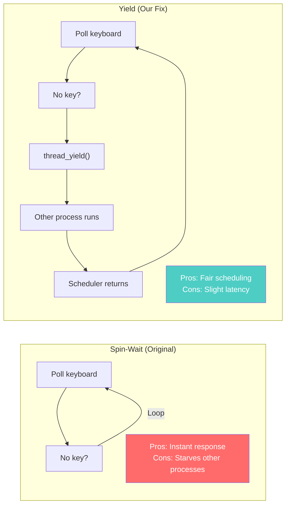

# Shell Ctrl+C Implementation in CertiKOS

## Table of Contents

- [Shell Ctrl+C Implementation in CertiKOS](#shell-ctrlc-implementation-in-certikos)
  - [Table of Contents](#table-of-contents)
  - [Overview](#overview)
  - [The Ctrl+C Journey: From Keypress to Signal](#the-ctrlc-journey-from-keypress-to-signal)
  - [Layer-by-Layer Breakdown](#layer-by-layer-breakdown)
    - [Layer 1: Hardware — Keyboard Scancode](#layer-1-hardware--keyboard-scancode)
    - [Layer 2: Keyboard Driver — Scancode to ASCII](#layer-2-keyboard-driver--scancode-to-ascii)
    - [Layer 3: Console Buffer](#layer-3-console-buffer)
    - [Layer 4: getchar() and thread\_yield()](#layer-4-getchar-and-thread_yield)
    - [Layer 5: readline() — Ctrl+C Detection](#layer-5-readline--ctrlc-detection)
    - [Layer 6: sys\_readline() — Signal Dispatch](#layer-6-sys_readline--signal-dispatch)
    - [Layer 7: Signal Delivery Pipeline](#layer-7-signal-delivery-pipeline)
    - [Layer 8: User Signal Handler](#layer-8-user-signal-handler)
    - [Layer 9: Return via Trampoline + sigreturn](#layer-9-return-via-trampoline--sigreturn)
  - [Complete Data Flow Diagram](#complete-data-flow-diagram)
  - [Files Modified](#files-modified)
  - [The Keyboard Input Stack](#the-keyboard-input-stack)
  - [Ctrl+C vs Normal Keys](#ctrlc-vs-normal-keys)
  - [The Cooperative Scheduling Problem](#the-cooperative-scheduling-problem)
    - [The Problem](#the-problem)
    - [The Solution](#the-solution)
    - [The Tradeoff](#the-tradeoff)
  - [Signal Stack Frame Layout](#signal-stack-frame-layout)
  - [Edge Cases and Robustness](#edge-cases-and-robustness)
    - [What if Ctrl+C is pressed with no foreground process?](#what-if-ctrlc-is-pressed-with-no-foreground-process)
    - [What if Ctrl+C is pressed while typing a command?](#what-if-ctrlc-is-pressed-while-typing-a-command)
    - [What about the "Unknown command" bug?](#what-about-the-unknown-command-bug)
    - [What if the child has already exited when kill() is called?](#what-if-the-child-has-already-exited-when-kill-is-called)
  - [Comparison with Real Systems](#comparison-with-real-systems)

---

## Overview

When you press `Ctrl+C` in a terminal, you expect the running foreground process to stop and the shell to return to a prompt. This seemingly simple interaction involves an intricate chain of events spanning hardware interrupts, keyboard drivers, character buffering, signal infrastructure, and user-space handler execution.

This document traces the complete journey of a `Ctrl+C` keypress through every layer of CertiKOS — from the physical keyboard scancode to the shell printing a message and returning to the prompt.

---

## The Ctrl+C Journey: From Keypress to Signal

```mermaid
flowchart TD
    subgraph "Hardware Layer"
        A["⌨️ User presses Ctrl+C<br/>Physical keys: Ctrl held + C pressed"]
        A --> B["8042 PS/2 Controller<br/>generates scancode 0x2E<br/>(with Ctrl modifier active)"]
    end

    subgraph "Keyboard Driver (keyboard.c)"
        B --> C["kbd_proc_data()"]
        C --> D["shiftcode[0x1D] sets CTL bit<br/>in 'shift' state variable"]
        D --> E["charcode[CTL][0x2E]<br/>= ctlmap[0x2E]<br/>= C('C') = 0x03"]
    end

    subgraph "Console Layer (console.c)"
        E --> F["keyboard_intr() →<br/>cons_intr(kbd_proc_data)"]
        F --> G["Character 0x03 stored<br/>in cons.buf circular buffer"]
        G --> H["getchar() → cons_getc()<br/>reads 0x03 from buffer"]
    end

    subgraph "Readline (console.c)"
        H --> I["readline() receives 0x03"]
        I --> J["Detects c == 0x03:<br/>prints '^C\\n'<br/>returns NULL"]
    end

    subgraph "Syscall Layer (TSyscall.c)"
        J --> K["sys_readline() sees NULL"]
        K --> L["tcb_add_pending_signal<br/>(cur_pid, SIGINT)"]
        L --> M["Returns with error code"]
    end

    subgraph "Signal Delivery (TTrapHandler.c)"
        M --> N["trap() →<br/>handle_pending_signals(tf)"]
        N --> O["deliver_signal(tf, SIGINT)"]
        O --> P["Modify trapframe:<br/>EIP → sigint_handler<br/>Build signal stack frame"]
    end

    subgraph "User Space (shell.c)"
        P --> Q["trap_return(tf) →<br/>sigint_handler(2) runs"]
        Q --> R{"foreground_pid > 0?"}
        R -- Yes --> S["kill(foreground_pid, SIGKILL)<br/>foreground_pid = 0"]
        R -- No --> T["print 'You pressed Ctrl+C!'"]
        S --> U["Handler returns →<br/>trampoline → sigreturn"]
        T --> U
        U --> V["Context restored →<br/>back to readline() →<br/>shell prompt '>:'"]
    end

    style A fill:#6c5ce7,color:#fff
    style E fill:#fd79a8,color:#fff
    style J fill:#fdcb6e,color:#000
    style L fill:#e17055,color:#fff
    style O fill:#00b894,color:#fff
    style V fill:#0984e3,color:#fff
```



---

## Layer-by-Layer Breakdown

### Layer 1: Hardware — Keyboard Scancode

When you press a key on the keyboard, the PS/2 keyboard controller (the 8042 chip) generates a **scancode** — a raw byte identifying which physical key was pressed or released.

For Ctrl+C, two events happen:
1. **Ctrl down**: scancode `0x1D` (key press)
2. **C down**: scancode `0x2E` (key press)

Later (when released):
3. **C up**: scancode `0xAE` (key release = `0x2E | 0x80`)
4. **Ctrl up**: scancode `0x9D` (key release = `0x1D | 0x80`)

The keyboard controller makes the scancode available via I/O port `0x60` (`KBDATAP`).

---

### Layer 2: Keyboard Driver — Scancode to ASCII

**File**: `kern/dev/keyboard.c` — `kbd_proc_data()`

The keyboard driver translates raw scancodes into ASCII characters using lookup tables. It maintains a `shift` state variable with modifier bits:

```c
#define SHIFT   (1<<0)   // Shift key
#define CTL     (1<<1)   // Control key
#define ALT     (1<<2)   // Alt key
```

When Ctrl is held, the driver selects `ctlmap[]` instead of `normalmap[]`:

```c
static uint8_t *charcode[4] = {
    normalmap,   // No modifiers
    shiftmap,    // SHIFT
    ctlmap,      // CTL
    ctlmap       // CTL + SHIFT
};

c = charcode[shift & (CTL | SHIFT)][data];
```

The control map uses the `C(x)` macro to convert letters to control characters:

```c
#define C(x) (x - '@')

static uint8_t ctlmap[256] = {
    // ...
    C('C'),  // position 0x2E → 'C' - '@' = 0x03
    // ...
};
```

`C('C')` = `'C' - '@'` = `67 - 64` = **3** = **0x03** (ETX — End of Text, the ASCII control character for Ctrl+C).



---

### Layer 3: Console Buffer

**File**: `kern/dev/console.c` — `cons_intr()`, `cons_getc()`

The keyboard driver doesn't directly return characters to whoever wants them. Instead, it uses a **producer-consumer** pattern with a circular buffer:

```c
struct {
    char buf[CONSOLE_BUFFER_SIZE];  // 512-byte ring buffer
    uint32_t rpos, wpos;            // read position, write position
} cons;
```

**Producer** — `keyboard_intr()` → `cons_intr(kbd_proc_data)`:
```c
void cons_intr(int (*proc)(void))
{
    spinlock_acquire(&cons_lk);
    while ((c = (*proc)()) != -1) {
        if (c == 0) continue;
        cons.buf[cons.wpos++] = c;
        if (cons.wpos == CONSOLE_BUFFER_SIZE)
            cons.wpos = 0;  // Wrap around
    }
    spinlock_release(&cons_lk);
}
```

**Consumer** — `cons_getc()`:
```c
char cons_getc(void)
{
    serial_intr();      // Poll serial port
    keyboard_intr();    // Poll keyboard

    spinlock_acquire(&cons_lk);
    if (cons.rpos != cons.wpos) {
        c = cons.buf[cons.rpos++];
        if (cons.rpos == CONSOLE_BUFFER_SIZE)
            cons.rpos = 0;
        spinlock_release(&cons_lk);
        return c;
    }
    spinlock_release(&cons_lk);
    return 0;  // Nothing available
}
```

The `spinlock_t cons_lk` ensures thread-safety: multiple processes might be trying to read from the console simultaneously.



---

### Layer 4: getchar() and thread_yield()

**File**: `kern/dev/console.c` — `getchar()`

`getchar()` wraps `cons_getc()` in a loop, waiting until a character is available:

```c
int getchar(void)
{
    int c;
    while ((c = cons_getc()) == 0)
        thread_yield();  /* yield CPU so other processes can run */
    return c;
}
```

**Why `thread_yield()`?** This was a critical fix. Originally, the loop was a pure spin-wait (`/* do nothing */`). But CertiKOS handles syscalls in kernel mode, where timer-based preemption doesn't trigger context switches. The shell process (blocked in `sys_readline` → `readline` → `getchar`) would monopolize the CPU forever, and no child process could run.

By calling `thread_yield()`, the shell voluntarily gives up the CPU each time through the loop, allowing other processes (like `sigint_test`) to be scheduled and print their output.



---

### Layer 5: readline() — Ctrl+C Detection

**File**: `kern/dev/console.c` — `readline()`

The `readline()` function reads characters one at a time, handling editing (backspace) and line termination (Enter). We added Ctrl+C detection:

```c
char *readline(const char *prompt)
{
    int i;
    char c;

    if (prompt != NULL)
        dprintf("%s", prompt);

    i = 0;
    while (1) {
        c = getchar();
        if (c < 0) {
            dprintf("read error: %e\n", c);
            return NULL;
        } else if (c == 0x03) {
            /* Ctrl+C pressed: print ^C, return NULL */
            putchar('^');
            putchar('C');
            putchar('\n');
            return NULL;        // ← Signal interruption to caller
        } else if ((c == '\b' || c == '\x7f') && i > 0) {
            putchar('\b');
            i--;
        } else if (c >= ' ' && i < BUFLEN-1) {
            putchar(c);
            linebuf[i++] = c;
        } else if (c == '\n' || c == '\r') {
            putchar('\n');
            linebuf[i] = 0;
            return linebuf;     // ← Normal line completion
        }
    }
}
```

**Why print `^C`?** This is the traditional UNIX convention. When a control character is "echoed" to the terminal, it's displayed as `^` followed by the corresponding letter. `^C` is immediately recognizable to any UNIX user as "Ctrl+C was pressed."

**Why return NULL?** This distinguishes "interrupted" from "read an empty line" (where we'd return a pointer to a zero-length string). The caller (`sys_readline`) checks for NULL to know that the read was interrupted, not completed.



---

### Layer 6: sys_readline() — Signal Dispatch

**File**: `kern/trap/TSyscall/TSyscall.c` — `sys_readline()`

The syscall handler checks if `readline()` returned NULL (interrupted) and dispatches SIGINT:

```c
void sys_readline(tf_t *tf)
{
    char* kernbuf = (char*)readline(">:");

    /* readline returns NULL when interrupted by Ctrl+C */
    if (kernbuf == NULL) {
        unsigned int cur_pid = get_curid();
        tcb_add_pending_signal(cur_pid, SIGINT);
        syscall_set_errno(tf, E_INVAL_EVENT);
        syscall_set_retval1(tf, -1);
        /* Copy empty string so user buffer is valid */
        char* userbuf = (char*)syscall_get_arg2(tf);
        char empty = '\0';
        pt_copyout((void*)&empty, cur_pid, userbuf, 1);
        return;
    }

    /* Normal path: copy line to user buffer */
    char* userbuf = (char*)syscall_get_arg2(tf);
    int n_len = strnlen(kernbuf, 1000) + 1;
    if (pt_copyout((void*)kernbuf, get_curid(), userbuf, n_len) != n_len) {
        KERN_PANIC("Readline fails!\n");
    }
    syscall_set_errno(tf, E_SUCC);
    syscall_set_retval1(tf, 0);
}
```

**Key decisions:**

1. **`tcb_add_pending_signal(cur_pid, SIGINT)`**: Marks signal 2 as pending in the process's signal bitmask. The actual delivery happens later in `handle_pending_signals()`.

2. **`E_INVAL_EVENT` errno**: Setting a non-zero errno ensures the user-space `sys_readline()` wrapper returns -1, allowing the shell's main loop to detect the interruption.

3. **Copy empty string**: Even though readline was interrupted, we write `'\0'` to the user buffer to prevent the shell from accidentally processing stale data.

---

### Layer 7: Signal Delivery Pipeline

**File**: `kern/trap/TTrapHandler/TTrapHandler.c`

After `sys_readline()` returns, `trap()` calls `handle_pending_signals(tf)` before returning to user space:

```c
void trap(tf_t *tf)
{
    // ... handler dispatch ...

    kstack_switch(cur_pid);
    handle_pending_signals(tf);  // ← Check and deliver signals HERE
    set_pdir_base(cur_pid);
    trap_return(tf);
}
```

`handle_pending_signals()` finds the pending SIGINT:

```c
// pending_signals for PID 2 has bit 2 set (0x4)
// signum = 2 (SIGINT)
// Shell has registered sa->sa_handler = sigint_handler
// → deliver_signal(tf, 2)
```

`deliver_signal()` modifies the trapframe to redirect execution to the user handler:

1. Push original ESP and EIP onto the user stack (for sigreturn)
2. Push trampoline code (machine code for `sigreturn` syscall)
3. Push signal number as argument
4. Push trampoline address as return address
5. Set `tf->eip = sigint_handler` (the user handler address)
6. Set `tf->esp = new_esp` (top of the signal stack frame)

When `trap_return(tf)` executes, it restores the modified trapframe, and the CPU starts executing `sigint_handler()` instead of returning to the original location.

---

### Layer 8: User Signal Handler

**File**: `user/shell/shell.c`

The handler runs in user space with the signal number as its argument:

```c
void sigint_handler(int signum)
{
    if (foreground_pid > 0) {
        printf("\n[SHELL] Ctrl+C: terminating process %d...\n",
               foreground_pid);
        kill(foreground_pid, SIGKILL);
        foreground_pid = 0;
    } else {
        printf("[SHELL] You pressed Ctrl+C!\n");
    }
}
```

If a foreground process exists, the handler sends SIGKILL to terminate it. Otherwise, it just prints a notification.

---

### Layer 9: Return via Trampoline + sigreturn

When `sigint_handler()` returns (via the C `ret` instruction), it pops the return address from the stack — which points to the trampoline code that was placed on the stack by `deliver_signal()`:

```asm
; Trampoline code (placed on user stack)
mov eax, SYS_sigreturn    ; B8 98 00 00 00
int 0x30                  ; CD 30 — syscall trap
jmp $                     ; EB FE — infinite loop (safety net)
```

This triggers `sys_sigreturn()` in the kernel, which:
1. Reads the saved ESP and EIP from the user stack
2. Restores `tf->esp` and `tf->eip` to their original values
3. Returns via `trap_return()`, bringing the shell back to where it was before the signal

```mermaid
flowchart LR
    A["sigint_handler<br/>returns (ret)"] --> B["CPU pops return addr<br/>→ trampoline"]
    B --> C["mov eax, SYS_sigreturn"]
    C --> D["int 0x30"]
    D --> E["sys_sigreturn():<br/>restore saved ESP/EIP"]
    E --> F["trap_return(tf)"]
    F --> G["Shell resumes at<br/>original position<br/>(inside readline loop)"]
    G --> H["readline returns to<br/>sys_readline"]
    H --> I["readline was already done<br/>(returned NULL)"]
    I --> J["Shell main loop:<br/>continue → new readline"]
    J --> K["'>:' prompt displayed"]

    style A fill:#e17055,color:#fff
    style E fill:#ffa500,color:#fff
    style K fill:#4ecdc4,color:#fff
```



---

## Complete Data Flow Diagram

```mermaid
flowchart TD
    subgraph "1. Hardware"
        HW1["Keyboard: Ctrl held"]
        HW2["Keyboard: C pressed"]
        HW3["Scancode 0x2E + CTL modifier"]
        HW1 --> HW3
        HW2 --> HW3
    end

    subgraph "2. Keyboard Driver"
        KBD1["kbd_proc_data()"]
        KBD2["shift |= CTL (from 0x1D)"]
        KBD3["ctlmap[0x2E] = C('C') = 0x03"]
        HW3 --> KBD1
        KBD1 --> KBD2
        KBD2 --> KBD3
    end

    subgraph "3. Console Buffer"
        CON1["cons_intr(kbd_proc_data)"]
        CON2["cons.buf[wpos++] = 0x03"]
        CON3["cons_getc() → reads 0x03"]
        KBD3 --> CON1
        CON1 --> CON2
        CON2 --> CON3
    end

    subgraph "4. Character Reading"
        GC1["getchar() loop"]
        GC2["Returns 0x03"]
        CON3 --> GC1
        GC1 --> GC2
    end

    subgraph "5. Line Reading"
        RL1["readline() receives 0x03"]
        RL2["Prints '^C\\n'"]
        RL3["Returns NULL"]
        GC2 --> RL1
        RL1 --> RL2
        RL2 --> RL3
    end

    subgraph "6. Syscall"
        SC1["sys_readline() sees NULL"]
        SC2["tcb_add_pending_signal(2, SIGINT)"]
        SC3["Set errno, copy empty string"]
        RL3 --> SC1
        SC1 --> SC2
        SC2 --> SC3
    end

    subgraph "7. Signal Processing"
        SIG1["handle_pending_signals(tf)"]
        SIG2["Found: signal 2 (SIGINT)"]
        SIG3["Shell has handler registered"]
        SIG4["deliver_signal(tf, 2)"]
        SIG5["Modify trapframe:<br/>EIP → sigint_handler"]
        SC3 --> SIG1
        SIG1 --> SIG2
        SIG2 --> SIG3
        SIG3 --> SIG4
        SIG4 --> SIG5
    end

    subgraph "8. Handler Execution"
        UH1["trap_return → sigint_handler(2)"]
        UH2["kill(foreground_pid, SIGKILL)"]
        UH3["foreground_pid = 0"]
        SIG5 --> UH1
        UH1 --> UH2
        UH2 --> UH3
    end

    subgraph "9. Return Path"
        RET1["Handler returns → trampoline"]
        RET2["mov eax, SYS_sigreturn; int 0x30"]
        RET3["Restore ESP/EIP"]
        RET4["Shell back at '>:' prompt"]
        UH3 --> RET1
        RET1 --> RET2
        RET2 --> RET3
        RET3 --> RET4
    end

    style HW3 fill:#6c5ce7,color:#fff
    style KBD3 fill:#fd79a8,color:#fff
    style RL3 fill:#fdcb6e,color:#000
    style SC2 fill:#e17055,color:#fff
    style SIG4 fill:#00b894,color:#fff
    style RET4 fill:#0984e3,color:#fff
```



---

## Files Modified

| File | Layer | Change |
|------|-------|--------|
| `kern/dev/keyboard.c` | Keyboard Driver | No changes needed — `ctlmap` already maps Ctrl+C to 0x03 |
| `kern/dev/console.c` | Console | Added `thread_yield()` in `getchar()`, added `0x03` detection in `readline()`, added `extern void thread_yield(void)` |
| `kern/trap/TSyscall/TSyscall.c` | Syscall | Modified `sys_readline()` to detect NULL return and dispatch SIGINT |
| `kern/trap/TTrapHandler/TTrapHandler.c` | Signal Delivery | Uses existing `handle_pending_signals()` → `deliver_signal()` to deliver SIGINT to shell |
| `user/shell/shell.c` | User Space | Added `foreground_pid`, `sigint_handler()`, SIGINT registration in `main()`, `buf[0] = '\0'` safety clear |

---

## The Keyboard Input Stack

The complete call chain for keyboard input in CertiKOS:



---

## Ctrl+C vs Normal Keys

The key difference between Ctrl+C and normal characters lies in how `readline()` processes them:

| Aspect | Normal Key (e.g., 'a') | Ctrl+C (0x03) |
|--------|----------------------|---------------|
| Character value | 0x61 | 0x03 |
| Passes `c >= ' '` check? | Yes (0x61 ≥ 0x20) | No (0x03 < 0x20) |
| Added to `linebuf`? | Yes | No |
| Echoed to screen? | Yes (the letter) | Yes (as `^C\n`) |
| readline() returns? | Continues reading | Returns `NULL` immediately |
| sys_readline() action | Normal: copy buffer to user | Signal: add SIGINT pending |

The `c >= ' '` (0x20) check in `readline()` naturally filters out all control characters. Our `c == 0x03` check intercepts Ctrl+C before it reaches that filtering logic.

---

## The Cooperative Scheduling Problem

The most subtle issue in the entire Ctrl+C implementation was enabling the child process to run *while* the shell waits for keyboard input.

### The Problem

```
Shell enters sys_readline()
  → readline()
    → getchar()
      → while(cons_getc() == 0) { /* spin forever */ }
```

This spin-wait runs in **kernel mode** (inside a syscall handler). CertiKOS's timer interrupt handler calls `sched_update()`, which handles scheduling decisions, but the actual context switch only happens at specific points. Inside a syscall, the timer can fire, but the shell doesn't yield — it just keeps spinning.

Result: the child process is in the ready queue but never gets CPU time.

### The Solution

```c
while ((c = cons_getc()) == 0)
    thread_yield();  // Let other processes run
```

`thread_yield()` saves the current process state, puts it back in the ready queue, and picks the next process to run. This creates a fair alternation between the shell (checking for input) and the child (printing output).

### The Tradeoff



The slight latency is imperceptible in practice — the shell checks the keyboard every time it gets scheduled (every few milliseconds), far faster than human typing speed.

---

## Signal Stack Frame Layout

When `deliver_signal()` sets up the stack for the SIGINT handler, it creates this precise layout on the user stack:

```
Higher addresses (original stack)
┌────────────────────────────────┐
│       Original stack data      │ ← original ESP
├────────────────────────────────┤
│     saved EIP (4 bytes)        │ ← for sigreturn to restore
├────────────────────────────────┤
│     saved ESP (4 bytes)        │ ← for sigreturn to restore
├────────────────────────────────┤
│   Trampoline code (12 bytes)   │
│   B8 98 00 00 00 (mov eax,..) │
│   CD 30          (int 0x30)    │
│   EB FE          (jmp $)       │
│   90 90 90       (nop padding) │
├────────────────────────────────┤
│    Signal number: 2 (4 bytes)  │ ← argument to handler
├────────────────────────────────┤
│   Return address (4 bytes)     │ ← points to trampoline above
├────────────────────────────────┤
│                                │ ← new ESP (handler starts here)
Lower addresses
```

The handler function sees this as a normal function call:
- `[esp]` = return address (trampoline)
- `[esp+4]` = first argument (signal number = 2)

When the handler executes `ret`, it pops the return address and jumps to the trampoline, which calls `sigreturn`.

---

## Edge Cases and Robustness

### What if Ctrl+C is pressed with no foreground process?

The handler prints `[SHELL] You pressed Ctrl+C!` and returns normally. The shell goes back to the prompt.

### What if Ctrl+C is pressed while typing a command?

`readline()` discards whatever has been typed so far (it doesn't save `linebuf`), prints `^C`, and returns NULL. The shell starts a fresh readline on the next iteration. This matches UNIX behavior.

### What about the "Unknown command" bug?

After `sigreturn` restores ESP and EIP but not general registers, the `sys_readline` inline assembly reads garbage from EAX as `errno`. If EAX happens to be 0, the shell thinks readline succeeded. We guard against this by:
1. Setting `buf[0] = '\0'` before each readline
2. Checking `buf[0] != '\0'` before calling `runcmd()`

### What if the child has already exited when kill() is called?

The `sys_kill` syscall checks if the target PID is valid. If the process is already dead (TSTATE_DEAD), the signal add is a no-op. No harm done.

---

## Comparison with Real Systems

| Aspect | Linux/UNIX | CertiKOS |
|--------|-----------|----------|
| Ctrl+C detection | Terminal driver (tty layer) | `readline()` in console.c |
| Signal target | Foreground process group via tty | Calling process (shell) |
| Shell's role | Receives SIGINT, may ignore or handle | Catches SIGINT, manually kills child |
| `getchar` blocking | Sleeps on wait queue, woken by IRQ | Polls + `thread_yield()` |
| Signal stack frame | Uses `sigframe` struct with full register save | Manual stack build with ESP/EIP only |
| `sigreturn` | Restores all registers via `__NR_rt_sigreturn` | Restores ESP and EIP only |
| Process groups | Full PGID/session/tty model | Single `foreground_pid` variable |

In Linux, the terminal driver (tty) detects Ctrl+C at the character-device level and sends SIGINT to the entire foreground process group. CertiKOS doesn't have a tty layer, so we detect Ctrl+C in `readline()` and route it through the syscall return path.

Despite these simplifications, the fundamental mechanism is the same: **hardware scan → control character → signal dispatch → handler execution → context restoration**.
