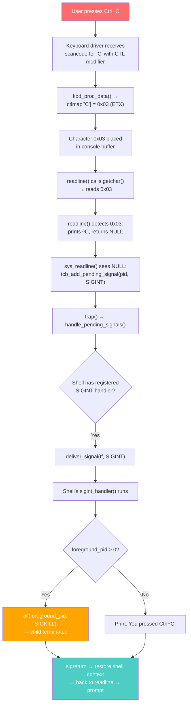
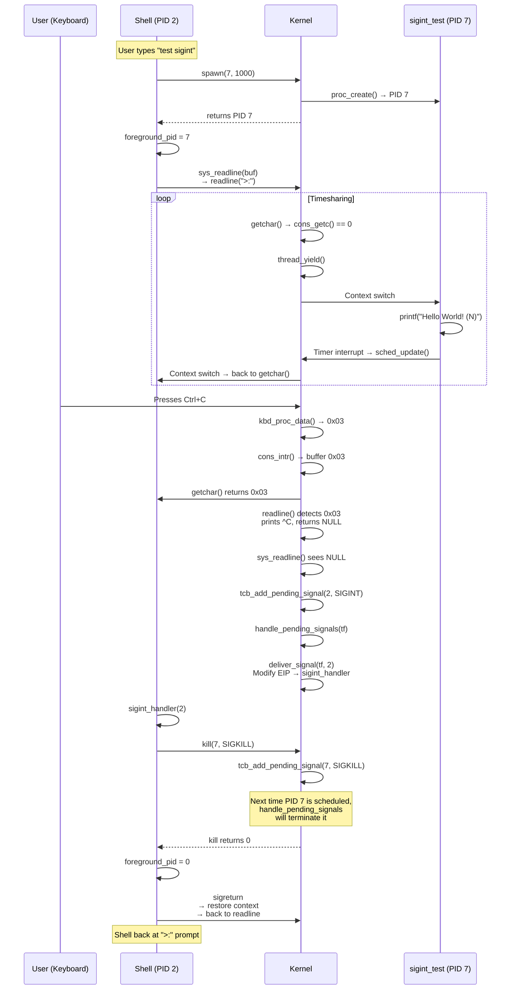
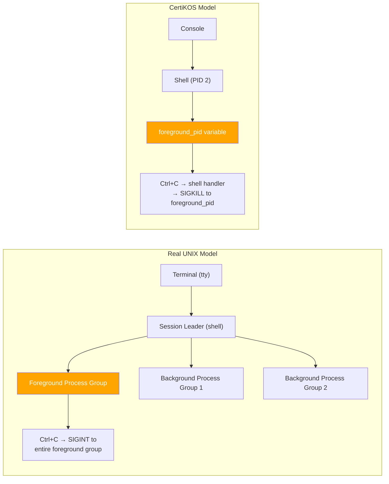
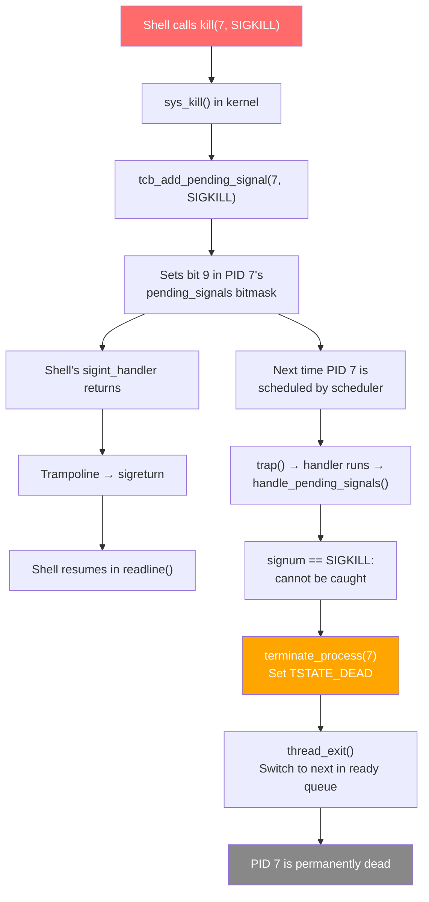
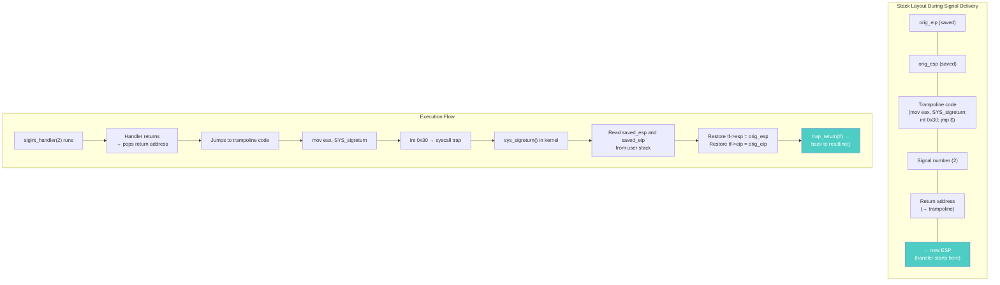

# SIGINT Implementation in CertiKOS

## Table of Contents

- [Overview](#overview)
- [What is SIGINT?](#what-is-sigint)
- [Design Goals](#design-goals)
- [Architecture Overview](#architecture-overview)
- [Implementation Details](#implementation-details)
  - [1. Foreground Process Tracking](#1-foreground-process-tracking)
  - [2. Shell SIGINT Handler](#2-shell-sigint-handler)
  - [3. Test Process: sigint\_test](#3-test-process-sigint_test)
  - [4. Build System Integration](#4-build-system-integration)
  - [5. Shell Command: test sigint](#5-shell-command-test-sigint)
- [Files Modified/Created](#files-modifiedcreated)
- [How It Works: End-to-End Flow](#how-it-works-end-to-end-flow)
- [The Foreground Process Model](#the-foreground-process-model)
- [How the Child Process Dies](#how-the-child-process-dies)
- [Signal Handler Return Path](#signal-handler-return-path)
- [Bug Encountered: Unknown Command After Ctrl+C](#bug-encountered-unknown-command-after-ctrlc)
- [Why This Approach?](#why-this-approach)
- [Demo Output](#demo-output)

---

## Overview

SIGINT (Signal 2 — Interrupt) is the signal sent when a user presses `Ctrl+C` in a terminal. Its most common use is terminating a **foreground** process that is running in the shell. This is a fundamental part of the UNIX process control model — the ability to interactively stop a runaway or unwanted process.

This document details how SIGINT was implemented to allow the shell in CertiKOS to terminate a running foreground child process via Ctrl+C.

---

## What is SIGINT?

| Property | Value |
|----------|-------|
| Signal Number | 2 |
| POSIX Name | `SIGINT` |
| Full Name | Interrupt |
| Default Action | Terminate the process |
| Can Be Caught? | Yes (via `sigaction`) |
| Can Be Blocked? | Yes |
| Common Trigger | User presses Ctrl+C |

---

## Design Goals

1. **Ctrl+C terminates the foreground child process**, not the shell itself
2. **Shell registers a SIGINT handler** so it can decide what to do (kill child vs. print message)
3. **Shell remains alive** after child is terminated — back to the prompt
4. **No foreground process** → Ctrl+C simply prints a notification
5. **Reuse existing signal infrastructure** — `tcb_add_pending_signal`, `deliver_signal`, `sigreturn`

---

## Architecture Overview



---

## Implementation Details

### 1. Foreground Process Tracking

**File**: `user/shell/shell.c`

A simple global variable tracks which child process is currently "in the foreground":

```c
/* Foreground child process PID (0 = none) */
static int foreground_pid = 0;
```

This is set when the shell spawns a test process via `test sigint`:

```c
foreground_pid = pid;  // After spawn(7, 1000)
```

And cleared when the SIGINT handler terminates the child:

```c
foreground_pid = 0;  // After kill(foreground_pid, SIGKILL)
```

This is a simplified model of what real shells (bash, zsh) call "foreground process group". In a full implementation, this would be a process group ID (PGID) and all processes in the group would receive the signal. For CertiKOS's educational scope, tracking a single PID is sufficient.

---

### 2. Shell SIGINT Handler

**File**: `user/shell/shell.c`

The shell registers a SIGINT handler at startup, before entering the command loop:

```c
// In main():
// Register SIGINT handler for Ctrl+C
{
    struct sigaction sa;
    sa.sa_handler = sigint_handler;
    sa.sa_flags = 0;
    sa.sa_mask = 0;
    sigaction(SIGINT, &sa, 0);
}
```

The handler itself:

```c
void sigint_handler(int signum)
{
    if (foreground_pid > 0) {
        printf("\n[SHELL] Ctrl+C: terminating process %d...\n", foreground_pid);
        kill(foreground_pid, SIGKILL);
        foreground_pid = 0;
    } else {
        printf("[SHELL] You pressed Ctrl+C!\n");
    }
}
```

**Why SIGKILL (9) instead of SIGINT (2) to kill the child?**

The test process (`sigint_test`) doesn't register any signal handlers. If we sent SIGINT to it, the default action would terminate it — but that happens in the kernel's trap path when the child is next scheduled. Sending SIGKILL is more direct and guaranteed: it bypasses any handler and immediately terminates the process in the kernel's `handle_pending_signals()`. It's also what real shells do for forceful termination.

---

### 3. Test Process: sigint_test

**File created**: `user/sigint_test/sigint_test.c`

A simple process that prints continuously in an infinite loop:

```c
#include <proc.h>
#include <stdio.h>
#include <syscall.h>
#include <x86.h>

int main(int argc, char **argv)
{
    printf("[sigint_test] Process started. Printing continuously...\n");
    printf("[sigint_test] Press Ctrl+C to terminate.\n");

    int count = 0;
    while (1) {
        printf("[sigint_test] Hello World! (%d)\n", count++);
    }

    /* Should never reach here */
    printf("[sigint_test] ERROR: Should not reach this line!\n");
    return 0;
}
```

This process has no signal handlers. It will only stop when it receives SIGKILL from the shell's SIGINT handler.

**Why an infinite loop printing?** This simulates a long-running "foreground" process — the kind of thing you'd want to Ctrl+C in practice (a large build, a network download, a stuck program). The continuous output also provides visual feedback that the process is running and then stops when terminated.

---

### 4. Build System Integration

**Files created/modified:**

| File | Change |
|------|--------|
| `user/sigint_test/Makefile.inc` | Created — defines build rules, adds to `KERN_BINFILES` |
| `user/Makefile.inc` | Added `include $(USER_DIR)/sigint_test/Makefile.inc` and `sigint_test` to user target |
| `kern/trap/TSyscall/TSyscall.c` | Added `extern` for embedded ELF, `elf_id == 7` in `sys_spawn()` |

```c
extern uint8_t _binary___obj_user_sigint_test_sigint_test_start[];

// In sys_spawn():
} else if (elf_id == 7) {
    elf_addr = _binary___obj_user_sigint_test_sigint_test_start;
}
```

---

### 5. Shell Command: test sigint

**File**: `user/shell/shell.c` — `shell_test_signal()`

```c
if (strcmp(argv[1], "sigint") == 0) {
    printf("=== SIGINT Test ===\n");
    printf("Spawning process that prints continuously...\n");
    printf("Press Ctrl+C to terminate it.\n\n");

    pid_t pid = spawn(7, 1000);  /* elf_id 7 = sigint_test */
    if (pid == -1) {
        printf("Failed to spawn sigint test process\n");
        return -1;
    }
    printf("Test process spawned (PID %d).\n", pid);
    foreground_pid = pid;
    return 0;
}
```

**Why does the command return immediately (not wait)?** After `spawn()`, both the shell and the child are runnable. The shell returns to its main loop and calls `readline()`, which calls `getchar()`, which calls `thread_yield()` in a loop. This means the shell and child alternate: child prints, shell checks for keyboard input, child prints, etc. This is the timesharing effect that makes it look like the child is running "in the foreground" while the shell waits.

---

## Files Modified/Created

| File | Action | Purpose |
|------|--------|---------|
| `user/shell/shell.c` | Modified | Added `foreground_pid` tracking, `sigint_handler()`, SIGINT registration in `main()`, `test sigint` command |
| `user/sigint_test/sigint_test.c` | Created | Test process that prints in an infinite loop |
| `user/sigint_test/Makefile.inc` | Created | Build rules for sigint_test |
| `user/Makefile.inc` | Modified | Include sigint_test in build |
| `kern/trap/TSyscall/TSyscall.c` | Modified | Added `elf_id == 7` for sigint_test |

---

## How It Works: End-to-End Flow



---

## The Foreground Process Model

Real UNIX systems have a sophisticated job control model with process groups, sessions, and controlling terminals. CertiKOS implements a simplified version:



| Feature | Real UNIX | CertiKOS |
|---------|-----------|----------|
| Foreground tracking | Process Group ID (PGID) | Single `foreground_pid` variable |
| Ctrl+C target | All processes in foreground group | One foreground process |
| Signal sent | SIGINT to group | SIGKILL to single PID |
| Job control (bg/fg) | Yes (`&`, `bg`, `fg`) | No |
| Multiple foreground processes | Yes (pipeline) | No |

---

## How the Child Process Dies

When the shell's SIGINT handler calls `kill(foreground_pid, SIGKILL)`:



**Key insight**: The child doesn't die instantly in the `kill()` syscall. Instead, SIGKILL is marked as pending. The child dies the next time the scheduler runs it and `handle_pending_signals()` checks for pending signals. SIGKILL is special — it cannot be caught, blocked, or ignored.

---

## Signal Handler Return Path

After the SIGINT handler finishes, the shell must cleanly return to `readline()`. This uses the trampoline-based sigreturn mechanism:



---

## Bug Encountered: Unknown Command After Ctrl+C

**Symptom**: After Ctrl+C and signal handler execution, the shell printed:
```
Unknown command 'P'
try 'help' to see all supported commands.
```

**Root Cause**: `sigreturn` only restores ESP and EIP, not general-purpose registers (EAX, EBX, etc.). After the signal handler returned via sigreturn, control went back to the point where `sys_readline()` was about to return. But the inline assembly in `sys_readline()` reads EAX as `errno`:

```c
asm volatile("int %2"
     : "=a" (errno),  // <-- reads EAX
       "=b" (ret)     // <-- reads EBX
     : ...);
return errno ? -1 : 0;
```

If EAX happened to be 0 (from signal handler internals), `sys_readline` returned 0 (success). The shell then called `runcmd(buf)` — but `buf` still had garbage from before the syscall, in this case the character 'P'.

**Fix**: Clear `buf[0]` before each `readline` call, and check `buf[0] != '\0'` instead of `buf != NULL`:

```c
while(1)
{
    buf[0] = '\0';
    if (shell_readline(buf) < 0) {
        /* readline was interrupted (e.g., Ctrl+C) */
        continue;
    }
    if (buf[0] != '\0') {
        if (runcmd(buf) < 0)
            break;
    }
}
```

---

## Why This Approach?

### Why does the shell handle SIGINT rather than the child?

In UNIX, Ctrl+C sends SIGINT to the entire foreground process group. But CertiKOS doesn't have process groups or a terminal driver that knows which processes are "foreground". So instead:

1. Ctrl+C is detected in `readline()` (which is running on behalf of the *shell*)
2. SIGINT is sent to the *shell*
3. The shell's handler decides what to do (kill the child)

This is actually how many real terminal multiplexers and custom shells work: they catch SIGINT themselves and relay it to child processes.

### Why was `thread_yield()` needed in `getchar()`?

Originally, `getchar()` busy-looped:
```c
while ((c = cons_getc()) == 0)
    /* do nothing */;
```

This is a **spin-wait** — the CPU cycles between polling the keyboard and doing nothing. But CertiKOS uses cooperative scheduling: processes only context-switch on timer interrupts or explicit `yield()` calls. Since `getchar()` runs in kernel mode (handling the `sys_readline` syscall), timer interrupts don't trigger preemption within the kernel. The child process was completely starved.

Adding `thread_yield()` means: "if there's no keyboard input, give another process a turn." This enables the child to print while the shell waits for input.

```mermaid
flowchart LR
    subgraph "Before Fix (Spin-Wait)"
        A[Shell: getchar()] --> B{Key available?}
        B -- No --> A
        B -- Yes --> C[Process key]
        note1["Child NEVER runs!<br/>Shell monopolizes CPU"]
    end

    subgraph "After Fix (Yield)"
        D[Shell: getchar()] --> E{Key available?}
        E -- No --> F[thread_yield()]
        F --> G[Child runs: prints Hello World]
        G --> H[Timer → back to Shell]
        H --> D
        E -- Yes --> I[Process key]
    end

    style note1 fill:#ff0000,color:#fff
    style G fill:#4ecdc4,color:#fff
```

---

## Demo Output

```
>:test sigint
=== SIGINT Test ===
Spawning process that prints continuously...
Press Ctrl+C to terminate it.

Test process spawned (PID 7).
>:[sigint_test] Hello World! (0)
[sigint_test] Hello World! (1)
[sigint_test] Hello World! (2)
...
[sigint_test] Hello World! (140)
[sigint_test] Hello World! (141)
[sigint_test] Hello World! (142)
[sigint_test] Hello World! (143)
^C

[SHELL] Ctrl+C: terminating process 7...
[SIGNAL] SIGKILL sent to process 7 - terminating immediately
[SIGNAL] Process 7 terminated by SIGKILL
>:
```

The child prints continuously. User presses Ctrl+C. The shell's SIGINT handler fires, kills the child with SIGKILL, and the shell returns to the prompt. The OS continues running normally.
