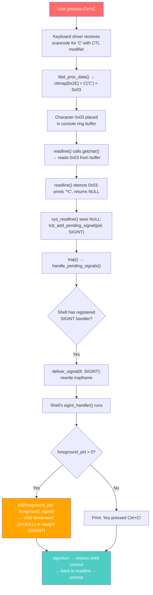
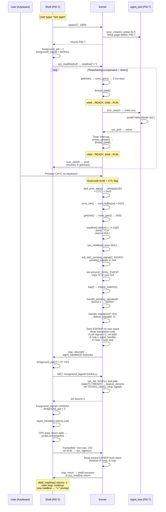

# SIGINT Implementation in CertiKOS — Complete Technical Reference

## Table of Contents

- [SIGINT Implementation in CertiKOS — Complete Technical Reference](#sigint-implementation-in-certikos--complete-technical-reference)
  - [Table of Contents](#table-of-contents)
  - [Overview](#overview)
  - [What is SIGINT?](#what-is-sigint)
  - [Design Goals](#design-goals)
  - [Prerequisites: Understanding the Keyboard Input Stack](#prerequisites-understanding-the-keyboard-input-stack)
    - [PS/2 Keyboard Hardware](#ps2-keyboard-hardware)
    - [Keyboard Driver and Scancode Tables](#keyboard-driver-and-scancode-tables)
    - [Console Buffer: Producer-Consumer Ring Buffer](#console-buffer-producer-consumer-ring-buffer)
    - [getchar() and the Cooperative Scheduling Problem](#getchar-and-the-cooperative-scheduling-problem)
    - [readline() — Line Editing and Ctrl+C Detection](#readline--line-editing-and-ctrlc-detection)
  - [Architecture Overview](#architecture-overview)
  - [Implementation Details](#implementation-details)
    - [1. Foreground Process Tracking](#1-foreground-process-tracking)
    - [2. Shell SIGINT Handler Registration](#2-shell-sigint-handler-registration)
    - [3. Shell SIGINT Handler Logic](#3-shell-sigint-handler-logic)
    - [4. sys\_readline() — NULL Detection and Signal Dispatch](#4-sys_readline--null-detection-and-signal-dispatch)
    - [5. Signal Delivery Pipeline (deliver\_signal)](#5-signal-delivery-pipeline-deliver_signal)
    - [6. Trampoline and sigreturn — Context Restoration](#6-trampoline-and-sigreturn--context-restoration)
    - [7. How SIGKILL Terminates the Child Process](#7-how-sigkill-terminates-the-child-process)
    - [8. Test Process: sigint\_test](#8-test-process-sigint_test)
    - [9. Build System Integration](#9-build-system-integration)
    - [10. Shell Command: test sigint](#10-shell-command-test-sigint)
  - [The Cooperative Scheduling Problem: Why thread\_yield() Was Essential](#the-cooperative-scheduling-problem-why-thread_yield-was-essential)
    - [The Problem](#the-problem)
    - [The Solution](#the-solution)
    - [The Tradeoff](#the-tradeoff)
  - [The Foreground Process Model](#the-foreground-process-model)
  - [Signal Stack Frame Layout in Detail](#signal-stack-frame-layout-in-detail)
  - [Bug Encountered: "Unknown Command" After Ctrl+C](#bug-encountered-unknown-command-after-ctrlc)
  - [Files Modified/Created](#files-modifiedcreated)
  - [Edge Cases and Robustness](#edge-cases-and-robustness)
    - [What if Ctrl+C is pressed with no foreground process?](#what-if-ctrlc-is-pressed-with-no-foreground-process)
    - [What if Ctrl+C is pressed while typing a command?](#what-if-ctrlc-is-pressed-while-typing-a-command)
    - [What if the child has already exited when kill() is called?](#what-if-the-child-has-already-exited-when-kill-is-called)
    - [What if multiple Ctrl+C presses happen before the handler runs?](#what-if-multiple-ctrlc-presses-happen-before-the-handler-runs)
    - [What about keyboard input buffering during the child's execution?](#what-about-keyboard-input-buffering-during-the-childs-execution)
  - [Comparison with Real UNIX Systems](#comparison-with-real-unix-systems)
  - [Demo Output](#demo-output)
  - [Summary of Key Constants and Definitions](#summary-of-key-constants-and-definitions)

---

## Overview

SIGINT (Signal 2 — Interrupt) is the signal sent when a user presses `Ctrl+C` in a terminal. Its most common use is terminating a **foreground** process that is running in the shell. This is a fundamental part of the UNIX process control model — the ability to interactively stop a runaway or unwanted process.

This document details every component involved in implementing Ctrl+C to terminate a foreground child process in CertiKOS — from the PS/2 keyboard hardware scancode, through the keyboard driver, console buffer, readline, syscall handler, signal delivery pipeline, user-space handler execution, and the trampoline-based return path.

---

## What is SIGINT?

| Property | Value |
|----------|-------|
| Signal Number | 2 |
| POSIX Name | `SIGINT` |
| Full Name | Interrupt |
| Default Action | Terminate the process |
| Can Be Caught? | Yes (via `sigaction`) |
| Can Be Blocked? | Yes |
| Common Trigger | User presses Ctrl+C |
| ASCII Character | `0x03` (ETX — End of Text) |

---

## Design Goals

1. **Ctrl+C terminates the foreground child process**, not the shell itself
2. **Shell registers a SIGINT handler** via `sigaction` so it can decide what to do (kill child vs. print message)
3. **Shell remains alive** after child is terminated — returns to the prompt
4. **No foreground process** → Ctrl+C simply prints a notification and continues
5. **Reuse existing signal infrastructure** — `tcb_add_pending_signal`, `deliver_signal`, trampoline, `sigreturn`
6. **Child process uses no signal handlers** — it's killed externally by the shell via SIGKILL (but _can_ register handlers — see `test sigint-custom` in [test_sigint_custom.md](test_sigint_custom.md))

---

## Prerequisites: Understanding the Keyboard Input Stack

The Ctrl+C handling spans 6 layers of the kernel before reaching the signal infrastructure. Understanding each layer is essential.

### PS/2 Keyboard Hardware

The PS/2 keyboard controller (Intel 8042 chip) is the interface between the physical keyboard and the CPU. It communicates via **I/O ports**:

| Port | Name | Purpose |
|------|------|---------|
| `0x64` | `KBSTATP` | Status register — bit 0 indicates data available |
| `0x60` | `KBDATAP` | Data register — read the scancode byte |

When a key is pressed or released, the keyboard controller:
1. Generates a **scancode** — a raw byte identifying the physical key
2. Raises **IRQ 1** (keyboard interrupt) via the PIC/IOAPIC
3. Makes the scancode available at I/O port `0x60`

**For Ctrl+C, two separate key events happen:**

| Event | Scancode | Meaning |
|-------|----------|---------|
| Ctrl down | `0x1D` | Left Control key pressed |
| C down | `0x2E` | Physical key 'C' pressed |
| C up | `0xAE` | Physical key 'C' released (`0x2E | 0x80`) |
| Ctrl up | `0x9D` | Left Control key released (`0x1D | 0x80`) |

The keyboard driver processes both the Ctrl modifier and the C key to produce the final character.

### Keyboard Driver and Scancode Tables

**File**: `kern/dev/keyboard.c` — `kbd_proc_data()`

The keyboard driver maintains a `shift` state variable that tracks modifier keys:

```c
#define SHIFT   (1<<0)   // Shift key is held
#define CTL     (1<<1)   // Control key is held
#define ALT     (1<<2)   // Alt key is held
```

When a key's scancode arrives, the driver:
1. Checks if it's a modifier key (via `shiftcode[]` table). If so, updates `shift`.
2. Uses `shift & (CTL | SHIFT)` as an index into `charcode[]` — an array of character maps:

```c
static uint8_t *charcode[4] = {
    normalmap,   // index 0: no modifiers
    shiftmap,    // index 1: SHIFT
    ctlmap,      // index 2: CTL
    ctlmap       // index 3: CTL + SHIFT (same as CTL)
};

// Select the appropriate map
c = charcode[shift & (CTL | SHIFT)][data];
```

For Ctrl+C:
- `shift` has the `CTL` bit (bit 1) set → index = 2 → `ctlmap`
- `data = 0x2E` (scancode for the C key)
- `ctlmap[0x2E] = C('C')`

**The `C(x)` macro:**

```c
#define C(x) (x - '@')
```

`C('C')` = `'C' - '@'` = `67 - 64` = **3** = **0x03**

This follows the ASCII control character convention: Ctrl+Letter produces the character `Letter - '@'`. This is how terminals work universally:

| Key Combo | ASCII | Value | Name |
|-----------|-------|-------|------|
| Ctrl+A | 0x01 | 1 | SOH (Start of Heading) |
| Ctrl+B | 0x02 | 2 | STX (Start of Text) |
| **Ctrl+C** | **0x03** | **3** | **ETX (End of Text)** |
| Ctrl+D | 0x04 | 4 | EOT (End of Transmission) |
| Ctrl+Z | 0x1A | 26 | SUB (Substitute) |

### Console Buffer: Producer-Consumer Ring Buffer

**File**: `kern/dev/console.c`

The keyboard driver doesn't directly return characters to processes. Instead, it uses a **producer-consumer** pattern with a circular (ring) buffer. This decouples the interrupt-driven keyboard input from the polling-based character reading.

```c
struct {
    char buf[CONSOLE_BUFFER_SIZE];  // 512-byte ring buffer
    uint32_t rpos, wpos;            // read position, write position
} cons;
```

**Producer side** — called from keyboard interrupt:

```c
void cons_intr(int (*proc)(void))
{
    int c;
    spinlock_acquire(&cons_lk);     // Thread-safe: multiple CPUs could interrupt

    while ((c = (*proc)()) != -1) { // (*proc)() = kbd_proc_data()
        if (c == 0) continue;       // Skip null characters
        cons.buf[cons.wpos++] = c;  // Store character
        if (cons.wpos == CONSOLE_BUFFER_SIZE)
            cons.wpos = 0;          // Wrap around to start
    }

    spinlock_release(&cons_lk);
}
```

`cons_intr(kbd_proc_data)` is called from `keyboard_intr()`, which is triggered by the keyboard IRQ handler.

**Consumer side** — called from `getchar()`:

```c
char cons_getc(void)
{
    int c;

    serial_intr();       // Poll serial port for input
    keyboard_intr();     // Poll keyboard for input (important!)

    spinlock_acquire(&cons_lk);
    if (cons.rpos != cons.wpos) {       // Data available?
        c = cons.buf[cons.rpos++];      // Read next character
        if (cons.rpos == CONSOLE_BUFFER_SIZE)
            cons.rpos = 0;              // Wrap around
        spinlock_release(&cons_lk);
        return c;
    }
    spinlock_release(&cons_lk);
    return 0;           // Nothing available
}
```

**Why `cons_getc()` calls `keyboard_intr()` directly:**

CertiKOS uses **polled I/O** for keyboard input, not pure interrupt-driven I/O. While keyboard interrupts do fire and can buffer data, `cons_getc()` also explicitly polls the keyboard controller each time it's called. This ensures input is processed even if interrupts are disabled or the interrupt handler hasn't fired yet. It's a common pattern in educational and embedded operating systems.

**The spinlock `cons_lk`:** Ensures mutual exclusion between the interrupt handler (producer) and the reading code (consumer). Without it, a keyboard interrupt could fire between the `rpos != wpos` check and the actual read, causing lost or duplicate characters.

**Ring buffer visualization:**

```
cons.buf:  [0] [1] [2] [3] [4] [5] ... [511]
                    ↑         ↑
                   rpos      wpos

Characters between rpos and wpos are buffered input.
When rpos == wpos, the buffer is empty.
When wpos wraps around and approaches rpos, the buffer is full (oldest data overwritten).
```

### getchar() and the Cooperative Scheduling Problem

**File**: `kern/dev/console.c`

`getchar()` wraps `cons_getc()` in a polling loop, waiting until a character is available:

```c
extern void thread_yield(void);

int getchar(void)
{
    int c;
    while ((c = cons_getc()) == 0)
        thread_yield();  /* yield CPU so other processes can run */
    return c;
}
```

**The `thread_yield()` call is CRITICAL.** The original code was a pure spin-wait:

```c
// ORIGINAL (BROKEN):
while ((c = cons_getc()) == 0)
    /* do nothing */ ;
```

This created a severe starvation problem. See [The Cooperative Scheduling Problem](#the-cooperative-scheduling-problem-why-thread_yield-was-essential) for the full explanation.

**Why `extern void thread_yield(void)` is declared here:**

`console.c` is in the `kern/dev/` directory (device drivers), which is at a lower layer than the thread subsystem (`kern/thread/`). The device layer doesn't normally include thread headers. We add an `extern` declaration to access `thread_yield()` without creating a circular dependency between the device and thread layers.

### readline() — Line Editing and Ctrl+C Detection

**File**: `kern/dev/console.c`

`readline()` reads characters one at a time, handling line editing (backspace) and special characters. We added Ctrl+C detection to this function:

```c
char *readline(const char *prompt)
{
    int i;
    char c;

    if (prompt != NULL)
        dprintf("%s", prompt);  // Print the prompt (e.g., ">:")

    i = 0;
    while (1) {
        c = getchar();          // Block until a character is available

        if (c < 0) {
            dprintf("read error: %e\n", c);
            return NULL;
        } else if (c == 0x03) {
            // Ctrl+C pressed: print ^C, return NULL to signal interruption
            putchar('^');
            putchar('C');
            putchar('\n');
            return NULL;         // ← Signals interruption to caller
        } else if ((c == '\b' || c == '\x7f') && i > 0) {
            putchar('\b');       // Backspace: erase last character
            i--;
        } else if (c >= ' ' && i < BUFLEN-1) {
            putchar(c);          // Printable character: echo and store
            linebuf[i++] = c;
        } else if (c == '\n' || c == '\r') {
            putchar('\n');       // Enter: complete the line
            linebuf[i] = 0;     // Null-terminate
            return linebuf;      // ← Normal completion
        }
    }
}
```

**Key decision: Why return NULL for Ctrl+C?**

Returning NULL (instead of, say, an empty string) provides a clear, unambiguous signal to the caller that the read was **interrupted**, not that the user entered an empty line. The caller (`sys_readline`) checks for NULL to dispatch SIGINT.

**Why print `^C`?** This is the universal UNIX convention. When a terminal echoes a control character, it's displayed as `^` followed by the corresponding letter. `^C` is immediately recognizable to any UNIX user.

**Ctrl+C vs. normal characters processing:**

| Aspect | Normal Key (e.g., 'a') | Ctrl+C (0x03) |
|--------|----------------------|---------------|
| Character value | 0x61 | 0x03 |
| Passes `c >= ' '` (0x20) check? | Yes — stored in buffer | No — caught by `0x03` check first |
| Added to `linebuf`? | Yes | No |
| Echoed to screen? | Yes (the character itself) | Yes (as `^C\n`) |
| readline() returns? | Continues reading more chars | Returns `NULL` immediately |
| sys_readline() action | Normal: copy buffer to user space | Signal: add SIGINT as pending |

---

## Architecture Overview



---

## Implementation Details

### 1. Foreground Process Tracking

**File**: `user/shell/shell.c`

Two global variables track the foreground child and which signal to send on Ctrl+C:

```c
/* Foreground child process PID (0 = none) */
static int foreground_pid = 0;
static int foreground_signal = SIGKILL;  /* default signal to send on Ctrl+C */
```

**Why two variables?**

- `foreground_pid` tracks _which_ child to signal.
- `foreground_signal` tracks _what_ signal to send. For the basic `test sigint`, this is SIGKILL (uncatchable — immediate death). For `test sigint-custom`, this is SIGINT (catchable — child's handler runs instead). See [test_sigint_custom.md](test_sigint_custom.md) for the catchable signal demo.

**Lifecycle:**

1. **Set** when the shell spawns a test process via `test sigint`:
   ```c
   pid_t pid = spawn(7, 1000);  // Create child
   foreground_pid = pid;         // Track it as foreground
   foreground_signal = SIGKILL;  // Force kill — child has no handler
   ```

2. **Used** when the SIGINT handler fires:
   ```c
   kill(foreground_pid, foreground_signal);  // Send configured signal
   if (foreground_signal == SIGKILL)
       foreground_pid = 0;   // SIGKILL guarantees death
   // For catchable signals, keep foreground_pid — child may survive
   ```

3. **Checked** in the SIGINT handler to decide what to do:
   ```c
   if (foreground_pid > 0) {
       // Signal the foreground child
   } else {
       // Print message — no child to kill
   }
   ```

This is a simplified model of what real shells (bash, zsh) call "foreground process groups." In a full POSIX implementation, this would be a Process Group ID (PGID) tracked by the terminal driver (tty layer), and all processes in the group would receive SIGINT simultaneously. For CertiKOS's educational scope, tracking a single PID is sufficient.

### 2. Shell SIGINT Handler Registration

**File**: `user/shell/shell.c` — `main()`

The shell registers a SIGINT handler at startup, **before** entering the command loop:

```c
int main(int argc, char **argv)
{
    // ... welcome banner ...

    // Register SIGINT handler for Ctrl+C
    {
        struct sigaction sa;
        sa.sa_handler = sigint_handler;  // Function pointer to our handler
        sa.sa_flags = 0;                 // No special flags
        sa.sa_mask = 0;                  // Don't block other signals during handler
        sigaction(SIGINT, &sa, 0);       // Register for signal 2
    }

    // Main command loop
    while (1) {
        buf[0] = '\0';
        if (shell_readline(buf) < 0) {
            continue;  // readline was interrupted
        }
        if (buf[0] != '\0') {
            if (runcmd(buf) < 0)
                break;
        }
    }
}
```

**What `sigaction()` does under the hood:**

1. User calls `sigaction(SIGINT, &sa, NULL)` — a library function
2. Library function does `int 0x30` (syscall trap) with `eax = SYS_sigaction`
3. Kernel's `sys_sigaction()` in `TSyscall.c` runs:
   - Validates `signum` (must be 1..NSIG-1)
   - Copies the `struct sigaction` from user space into the kernel TCB:
     ```c
     pt_copyin(cur_pid, (uintptr_t)user_act, &kern_act, sizeof(struct sigaction));
     tcb_set_sigaction(cur_pid, signum, &kern_act);
     ```
   - Stores the handler pointer in `TCBPool[pid].sigstate.sigactions[SIGINT]`
4. Returns `E_SUCC`

After registration, whenever SIGINT is pending for this process, `handle_pending_signals()` will find a non-NULL handler and call `deliver_signal()` instead of terminating.

### 3. Shell SIGINT Handler Logic

```c
void sigint_handler(int signum)
{
    if (foreground_pid > 0) {
        printf("\n[SHELL] Ctrl+C: sending signal %d to process %d...\n",
               foreground_signal, foreground_pid);
        kill(foreground_pid, foreground_signal);
        if (foreground_signal == SIGKILL) {
            foreground_pid = 0;  /* SIGKILL guarantees death */
        }
        /* For catchable signals (SIGINT), keep foreground_pid set —
         * the child may survive if it has a handler */
    } else {
        printf("[SHELL] You pressed Ctrl+C!\n");
    }
}
```

**Why `foreground_signal` instead of always using SIGKILL?**

- For `test sigint`, where the child has no handler, `foreground_signal = SIGKILL` — the original behavior.
- For `test sigint-custom`, where the child registers a custom SIGINT handler, `foreground_signal = SIGINT` — the child catches it and survives. See [test_sigint_custom.md](test_sigint_custom.md).
- This variable makes the shell flexible: the same `sigint_handler()` function handles both catchable and uncatchable scenarios.

**Why SIGKILL (9) is used for `test sigint`:**

- The test process (`sigint_test`) doesn't register any signal handlers
- If we sent SIGINT to it, the default action would terminate it — but only when the kernel checks pending signals at the next `trap()` return, which requires the child to be **scheduled and run first**
- SIGKILL is **uncatchable** — `handle_pending_signals()` doesn't even check for a handler, it goes straight to `terminate_process()` + `thread_exit()`
- SIGKILL is also what real shells use for forceful termination (`kill -9`)
- Using SIGKILL ensures the child dies immediately when it's next scheduled, regardless of any handler it might register

**Why `foreground_pid` is only cleared for SIGKILL:**

- SIGKILL is uncatchable — the child is guaranteed dead, so we can safely reset `foreground_pid = 0`.
- For SIGINT, the child _might_ have a handler (as in `test sigint-custom`). If we cleared `foreground_pid`, the shell would lose track and couldn't send subsequent Ctrl+C signals to the same child. So we keep it set.

**What `kill()` does:**

1. User-space `kill(pid, SIGKILL)` traps to kernel via `int 0x30`
2. Kernel `sys_kill()` in `TSyscall.c`:
   ```c
   void sys_kill(tf_t *tf)
   {
       int pid = syscall_get_arg2(tf);
       int signum = syscall_get_arg3(tf);

       // For SIGKILL: immediate termination
       if (signum == SIGKILL) {
           if (tcb_get_state(pid) == TSTATE_READY) {
               tqueue_remove(NUM_IDS, pid);  // Remove from ready queue
           }
           tcb_set_state(pid, TSTATE_DEAD);
           tcb_set_pending_signals(pid, 0);
           return;
       }

       // For other signals: mark as pending
       tcb_add_pending_signal(pid, signum);
   }
   ```
3. **Note about SIGKILL in `sys_kill`:** Because SIGKILL terminates the process immediately in the syscall handler, the child doesn't need to be scheduled for `handle_pending_signals()` to run. The `TSTATE_READY` guard prevents the queue corruption bug (same logic as `terminate_process()`).

### 4. sys_readline() — NULL Detection and Signal Dispatch

**File**: `kern/trap/TSyscall/TSyscall.c`

The syscall handler is where `readline()`'s NULL return gets converted into a SIGINT signal:

```c
void sys_readline(tf_t *tf)
{
    char *kernbuf = (char *)readline(">:");

    /* readline returns NULL when interrupted by Ctrl+C */
    if (kernbuf == NULL) {
        unsigned int cur_pid = get_curid();

        /* 1. Mark SIGINT as pending for this process */
        tcb_add_pending_signal(cur_pid, SIGINT);

        /* 2. Set error return values */
        syscall_set_errno(tf, E_INVAL_EVENT);
        syscall_set_retval1(tf, -1);

        /* 3. Copy empty string to user buffer (safety measure) */
        char *userbuf = (char *)syscall_get_arg2(tf);
        char empty = '\0';
        pt_copyout((void *)&empty, cur_pid, userbuf, 1);
        return;
    }

    /* Normal path: copy completed line to user buffer */
    char *userbuf = (char *)syscall_get_arg2(tf);
    int n_len = strnlen(kernbuf, 1000) + 1;
    if (pt_copyout((void *)kernbuf, get_curid(), userbuf, n_len) != n_len) {
        KERN_PANIC("Readline fails!\n");
    }
    syscall_set_errno(tf, E_SUCC);
    syscall_set_retval1(tf, 0);
}
```

**Three important actions on NULL:**

1. **`tcb_add_pending_signal(cur_pid, SIGINT)`**: Sets bit 2 in the process's pending signal bitmask (`pending_signals |= 0x4`). The signal is not delivered yet — it's just marked for later processing by `handle_pending_signals()`.

2. **`E_INVAL_EVENT` errno + `-1` retval**: The user-space `sys_readline()` wrapper uses inline assembly to read EAX as errno. A non-zero errno makes `shell_readline()` return -1, which the shell's main loop catches:
   ```c
   if (shell_readline(buf) < 0) {
       continue;  // Interrupted — go back to top of loop
   }
   ```

3. **Copy empty string to user buffer**: Even though readline was interrupted, we write a `'\0'` to the user buffer. This prevents the shell from accidentally processing stale data that was in the buffer from a previous readline or from uninitialized memory.

**Flow after sys_readline returns:**

```
sys_readline() returns
    ↓
trap() continues:
    kstack_switch(cur_pid)
    handle_pending_signals(tf)    ← finds SIGINT pending
        deliver_signal(tf, 2)     ← rewrites trapframe → sigint_handler
    set_pdir_base(cur_pid)
    trap_return(tf)               ← CPU executes sigint_handler()
```

### 5. Signal Delivery Pipeline (deliver_signal)

**File**: `kern/trap/TTrapHandler/TTrapHandler.c`

When `handle_pending_signals()` finds SIGINT (bit 2) pending and a handler registered for it, it calls `deliver_signal(tf, 2)`:

```c
static void deliver_signal(tf_t *tf, int signum)
{
    unsigned int cur_pid = get_curid();
    struct sigaction *sa = tcb_get_sigaction(cur_pid, signum);

    if (sa != NULL && sa->sa_handler != NULL) {
        uint32_t orig_esp = tf->esp;
        uint32_t orig_eip = tf->eip;
        uint32_t new_esp = orig_esp;

        // 1. Save original EIP on user stack (for sigreturn)
        new_esp -= 4;
        pt_copyout(&orig_eip, cur_pid, new_esp, sizeof(uint32_t));
        uint32_t saved_eip_addr = new_esp;

        // 2. Save original ESP on user stack (for sigreturn)
        new_esp -= 4;
        pt_copyout(&orig_esp, cur_pid, new_esp, sizeof(uint32_t));

        // 3. Write trampoline machine code (12 bytes)
        uint8_t trampoline[12] = {
            0xB8, SYS_sigreturn, 0x00, 0x00, 0x00,  // mov eax, SYS_sigreturn
            0xCD, 0x30,                              // int 0x30 (syscall)
            0xEB, 0xFE,                              // jmp $ (safety: infinite loop)
            0x90, 0x90, 0x90                         // nop nop nop (padding)
        };
        new_esp -= 12;
        pt_copyout(trampoline, cur_pid, new_esp, 12);
        uint32_t trampoline_addr = new_esp;

        new_esp = new_esp & ~3;  // Align to 4-byte boundary

        // 4. Push signal number as function argument
        new_esp -= 4;
        uint32_t sig_arg = signum;
        pt_copyout(&sig_arg, cur_pid, new_esp, sizeof(uint32_t));

        // 5. Push return address (→ trampoline code)
        new_esp -= 4;
        pt_copyout(&trampoline_addr, cur_pid, new_esp, sizeof(uint32_t));

        // 6. Rewrite trapframe
        tf->esp = new_esp;                        // New stack pointer
        tf->eip = (uint32_t)sa->sa_handler;       // Execute handler next

        // 7. Save context locations in TCB for sigreturn
        tcb_set_signal_context(cur_pid, saved_eip_addr - 4, saved_eip_addr);
    }
}
```

**What happens when `trap_return(tf)` executes with the modified trapframe:**

The x86 `iret` instruction restores `EIP`, `CS`, `EFLAGS`, `ESP`, `SS` from the trapframe. Because we modified `tf->eip` and `tf->esp`:
- CPU starts executing at `sa->sa_handler` (= `sigint_handler`)
- The stack pointer is at `new_esp`, which has the signal number and return address set up as a normal C function call frame

The handler sees:
- `[esp]` = return address (points to trampoline code)
- `[esp+4]` = first argument `signum` (= 2 for SIGINT)

### 6. Trampoline and sigreturn — Context Restoration

When `sigint_handler()` executes the C `ret` instruction:

1. **CPU pops return address from stack** → jumps to the trampoline code on the stack

2. **Trampoline executes:**
   ```nasm
   mov eax, 152        ; B8 98 00 00 00 — SYS_sigreturn = 152
   int 0x30            ; CD 30 — trigger syscall trap
   jmp $               ; EB FE — infinite loop (safety net, never reached)
   ```

3. **`sys_sigreturn()` in the kernel** (`kern/trap/TSyscall/TSyscall.c`):
   ```c
   void sys_sigreturn(tf_t *tf)
   {
       unsigned int cur_pid = get_curid();
       uint32_t saved_esp_addr, saved_eip_addr;
       uint32_t saved_esp, saved_eip;

       // Get addresses where ESP and EIP were saved
       tcb_get_signal_context(cur_pid, &saved_esp_addr, &saved_eip_addr);

       // Read saved values from user stack
       pt_copyin(cur_pid, saved_esp_addr, &saved_esp, sizeof(uint32_t));
       pt_copyin(cur_pid, saved_eip_addr, &saved_eip, sizeof(uint32_t));

       // Clear saved context in TCB
       tcb_clear_signal_context(cur_pid);

       // Restore original trapframe values
       tf->esp = saved_esp;   // Original stack pointer
       tf->eip = saved_eip;   // Original instruction pointer

       syscall_set_errno(tf, E_SUCC);
   }
   ```

4. **After `trap_return(tf)`**, the CPU returns to where the shell was **before** the signal — inside the `sys_readline()` syscall return path.

**The full chain:**
```
sigint_handler() returns
    → ret pops trampoline address from stack
    → trampoline executes: mov eax, SYS_sigreturn; int 0x30
    → kernel: sys_sigreturn() restores tf->esp and tf->eip
    → trap_return(tf)
    → CPU resumes at original EIP (inside sys_readline return path)
    → shell's main loop: shell_readline() returns -1
    → continue → new readline() → ">:" prompt
```

### 7. How SIGKILL Terminates the Child Process

When the shell's handler calls `kill(foreground_pid, SIGKILL)`, the child doesn't die instantly — it dies via a two-step process:

**Step 1: `sys_kill()` marks the child for death (in TSyscall.c)**

The `sys_kill()` handler has special fast-path logic for `SIGKILL`:

```c
if (signum == SIGKILL) {
    // Remove from ready queue if queued (with state guard!)
    if (tcb_get_state(pid) == TSTATE_READY) {
        tqueue_remove(NUM_IDS, pid);
    }
    tcb_set_state(pid, TSTATE_DEAD);
    tcb_set_pending_signals(pid, 0);
    return;
}
```

Because the child (PID 7) was in the ready queue (`TSTATE_READY`) when the shell took the CPU (via `thread_yield` in `getchar`), the SIGKILL path:
1. Finds `state == TSTATE_READY` → removes from ready queue
2. Sets `state = TSTATE_DEAD`
3. Clears all pending signals

**Step 2: The child never runs again**

Since the child's state is now `TSTATE_DEAD` and it's been removed from the ready queue, the scheduler will never dequeue it. It effectively ceases to exist. The TCB slot can be reused by a future `proc_create()`.

**Note:** In `handle_pending_signals()`, there's also a SIGKILL fast path:

```c
if (signum == SIGKILL) {
    terminate_process(cur_pid);
    thread_exit();
    return;
}
```

This path would be taken if the signal was merely marked as pending (via `tcb_add_pending_signal`) and the process was then scheduled. The `sys_kill` fast path for SIGKILL avoids this delay by terminating the process immediately in the kill syscall.

### 8. Test Process: sigint_test

**File**: `user/sigint_test/sigint_test.c`

```c
#include <proc.h>
#include <stdio.h>
#include <syscall.h>
#include <x86.h>

int main(int argc, char **argv)
{
    printf("[sigint_test] Process started. Printing continuously...\n");
    printf("[sigint_test] Press Ctrl+C to terminate.\n");

    int count = 0;
    while (1) {
        printf("[sigint_test] Hello World! (%d)\n", count++);
    }

    /* Should never reach here */
    printf("[sigint_test] ERROR: Should not reach this line!\n");
    return 0;
}
```

**Why an infinite loop printing?**

This simulates a long-running "foreground" process — the kind of thing you'd want to Ctrl+C in practice (a compile, a download, a stuck script). The continuous output:
1. Provides visual feedback that the process is running
2. Shows the timesharing effect (shell and child alternate on the CPU)
3. Makes it obvious when the process stops (output ceases after Ctrl+C)

**How the child process uses the CPU:**

Each `printf()` call triggers a `sys_puts()` syscall:
1. Child traps to kernel (`int 0x30`)
2. `sys_puts()` copies the string from user space and writes it to the console
3. `trap()` returns to user space
4. Timer interrupts fire periodically → `sched_update()` → `thread_yield()` → context switch to shell
5. Shell's `getchar()` polls keyboard → no key → `thread_yield()` → back to child
6. Cycle repeats — each side gets ~5ms (SCHED_SLICE) of CPU time

**What happens when child is killed:**

The child is running its printf loop. When the shell's handler calls `kill(PID, SIGKILL)`, the `sys_kill` handler in the kernel removes the child from the ready queue and sets it to `TSTATE_DEAD`. The next time the scheduler tries to give the child CPU time, it's gone — it was already removed from the queue.

### 9. Build System Integration

**Files created/modified:**

| File | Change |
|------|--------|
| `user/sigint_test/Makefile.inc` | Created — build rules, adds binary to `KERN_BINFILES` |
| `user/Makefile.inc` | Added `include` directive and `sigint_test` target |
| `kern/trap/TSyscall/TSyscall.c` | Added `extern` for linker symbol, `elf_id == 7` mapping |

**In TSyscall.c:**

```c
extern uint8_t _binary___obj_user_sigint_test_sigint_test_start[];

// In sys_spawn():
} else if (elf_id == 7) {
    elf_addr = _binary___obj_user_sigint_test_sigint_test_start;
}
```

### 10. Shell Command: test sigint

**File**: `user/shell/shell.c` — `shell_test_signal()`

```c
if (strcmp(argv[1], "sigint") == 0) {
    printf("=== SIGINT Test ===\n");
    printf("Spawning process that prints continuously...\n");
    printf("Press Ctrl+C to terminate it.\n\n");

    pid_t pid = spawn(7, 1000);  /* elf_id 7 = sigint_test */
    if (pid == -1) {
        printf("Failed to spawn sigint test process\n");
        return -1;
    }
    printf("Test process spawned (PID %d).\n", pid);
    foreground_pid = pid;         // ← Track as foreground process
    foreground_signal = SIGKILL;  // ← No handler — force kill
    return 0;                     // Return to main loop → readline
}
```

> **Note:** A companion command `test sigint-custom` spawns a child that _catches_ SIGINT with a custom handler, using `foreground_signal = SIGINT` instead. See [test_sigint_custom.md](test_sigint_custom.md) for the full walkthrough.
```

**Why does `test sigint` return immediately (not wait for the child)?**

After `spawn()`, the child is in the ready queue. The shell returns to its main loop and calls `readline()` → `getchar()`. Inside `getchar()`, the shell calls `thread_yield()` on each iteration when no key is available. This means:

1. Shell enters `getchar()` → polls keyboard → no key → `thread_yield()`
2. Scheduler switches to child → child prints "Hello World! (0)"
3. Timer fires → `sched_update()` → child yields → back to shell
4. Shell polls keyboard → no key → `thread_yield()`
5. Child prints "Hello World! (1)"
6. Repeat...

The child appears to be "running in the foreground" while the shell "waits" for input. This interleaving creates the illusion of concurrent execution.

When the user presses Ctrl+C:

7. Shell's `getchar()` → `cons_getc()` → returns 0x03
8. `readline()` detects 0x03 → returns NULL
9. `sys_readline()` adds SIGINT → `handle_pending_signals()` → `deliver_signal()`
10. Shell's `sigint_handler()` runs → `kill(child, foreground_signal)` → child dies (SIGKILL for `test sigint`)
11. `sigreturn` → shell back at prompt

---

## How It Works: End-to-End Flow



---

## The Cooperative Scheduling Problem: Why thread_yield() Was Essential

This was the most subtle and impactful bug in the entire SIGINT implementation.

### The Problem

The original `getchar()` was a pure spin-wait:
```c
while ((c = cons_getc()) == 0)
    /* do nothing */ ;
```

This looks innocuous but creates a **complete process starvation** scenario:

1. Shell calls `sys_readline()` → traps to kernel
2. Inside kernel: `readline()` → `getchar()` → spin-waiting
3. Timer interrupt fires → `sched_update()` checks tick count
4. Even if `sched_update` calls `thread_yield()`, the shell is **already in the kernel's syscall handler path**
5. After `thread_yield()` returns (having given the child a turn), the shell is back in the `getchar()` spin loop
6. **BUT**: the key issue is that `cons_getc()` calls `keyboard_intr()` which polls the keyboard controller. If no key is pressed, it returns 0 immediately
7. The spin loop runs at CPU speed (millions of iterations per second between yields)

In the original code without `thread_yield()`, the situation was worse:
- The shell held the CPU in kernel mode indefinitely
- Timer interrupts fired and `sched_update()` accumulated ticks
- But the thread_yield in sched_update would just re-schedule the SAME thread (the one in the spin loop) because timer preemption during kernel mode doesn't switch contexts in the same way
- The child process was permanently starved

### The Solution

```c
while ((c = cons_getc()) == 0)
    thread_yield();  // Let other processes run
```

Each iteration of the loop:
1. Poll keyboard → no key → `cons_getc()` returns 0
2. `thread_yield()`:
   - Shell marked as `TSTATE_READY`, enqueued
   - Child dequeued → `TSTATE_RUN`
   - `kctx_switch()` → child executes
3. Child does printf loops until timer preempts it
4. Timer → `sched_update()` → `thread_yield()` → shell dequeued
5. Shell resumes at step 1

**Result:** Shell and child get fair CPU time. The child prints its output, and the shell checks for keyboard input periodically.

### The Tradeoff

| Aspect | Spin-Wait (Original) | Yield (Fixed) |
|--------|---------------------|---------------|
| CPU usage | 100% — burns cycles | Fair — shares CPU |
| Other processes | **Starved** | Run normally |
| Input latency | Sub-microsecond | ~5ms (one scheduling quantum) |
| Power efficiency | Terrible | Better (CPU idles when empty queue) |

The 5ms latency is imperceptible to humans (who type at ~50ms per keystroke). The fairness improvement is essential for the SIGINT demo to work at all.

---

## The Foreground Process Model

Real UNIX systems have a sophisticated job control model:

| Feature | Real UNIX (Linux) | CertiKOS |
|---------|-------------------|----------|
| Foreground tracking | Process Group ID (PGID) in tty | Single `foreground_pid` variable |
| Ctrl+C target | All processes in foreground PGID | One foreground process |
| Signal sent by kernel | SIGINT to entire group | SIGINT to shell; shell kills child |
| Who detects Ctrl+C | Terminal driver (tty layer) | `readline()` in console.c |
| Job control (bg/fg/&) | Full support | None |
| Multiple foreground procs | Yes (pipelines like `cat \| grep`) | No |
| Process groups | `setpgid()`, `tcsetpgrp()` | Not implemented |
| Sessions | `setsid()` | Not implemented |

**In Linux:**
1. Terminal driver (tty) detects Ctrl+C at the character-device level
2. tty knows the foreground process group (set by `tcsetpgrp()`)
3. tty sends SIGINT to **all** processes in the foreground group
4. Each process handles SIGINT individually (terminate/catch/ignore)

**In CertiKOS:**
1. `readline()` (analogous to tty read function) detects 0x03
2. SIGINT goes to the **calling process** (the shell)
3. Shell's handler manually kills the foreground child via `kill()`
4. Only one foreground process is tracked at a time

Despite the simplification, the user-visible behavior is the same: Ctrl+C stops the foreground process, and the shell returns to the prompt.

---

## Signal Stack Frame Layout in Detail

When `deliver_signal()` sets up the stack for the SIGINT handler at the shell, it creates this precise layout:

```
Higher addresses (original stack)                Address
┌────────────────────────────────────────┐
│       Original shell stack data        │ ← orig_esp
├────────────────────────────────────────┤
│     saved EIP (4 bytes)                │ ← saved_eip_addr
│     (where shell was executing         │     (orig_esp - 4)
│      when SIGINT was raised)           │
├────────────────────────────────────────┤
│     saved ESP (4 bytes)                │ ← saved_esp_addr
│     (original stack pointer value)     │     (orig_esp - 8)
├────────────────────────────────────────┤
│     Trampoline code (12 bytes):        │ ← trampoline_addr
│                                        │     (orig_esp - 20)
│     B8 98 00 00 00  mov eax, 152       │
│     CD 30           int 0x30           │
│     EB FE           jmp $             │
│     90 90 90        nop nop nop        │
├────────────────────────────────────────┤
│     Signal number: 2  (4 bytes)        │ ← argument to handler
│     (SIGINT = 2)                       │     (orig_esp - 24)
├────────────────────────────────────────┤
│     Return address (4 bytes)           │ ← points to trampoline_addr
│     (= trampoline_addr above)          │     (orig_esp - 28)
├────────────────────────────────────────┤
│                                        │ ← new ESP (tf->esp)
│     (handler starts executing here)    │     (orig_esp - 28)
Lower addresses
```

**When the handler function is called**, x86 calling convention says:
- `[esp]` = return address → trampoline
- `[esp+4]` = first argument → signal number (2)

**When the handler `ret`s:**
- `ret` pops `[esp]` → EIP = trampoline_addr
- CPU jumps to trampoline code on the stack
- Trampoline does `int 0x30` with `eax = 152` (SYS_sigreturn)
- Kernel reads saved_esp and saved_eip from the stack
- Restores trapframe → CPU returns to shell's original execution point

---

## Bug Encountered: "Unknown Command" After Ctrl+C

**Symptom**: After Ctrl+C successfully terminated the foreground process, the shell printed:
```
Unknown command 'P'
try 'help' to see all supported commands.
```

**Root Cause — In-depth analysis:**

The bug involves `sigreturn`'s incomplete register restoration and the `sys_readline` inline assembly convention.

**Step 1**: `sigreturn` only restores **ESP and EIP**, not general-purpose registers (EAX, EBX, ECX, etc.). After the signal handler returns via `sigreturn`, execution continues at the point where `sys_readline()` was about to return to user space.

**Step 2**: The user-space `sys_readline()` wrapper (in `user/include/syscall.h`) uses inline assembly:

```c
static inline int sys_readline(char *buf)
{
    int errno, ret;
    asm volatile("int %2"
        : "=a" (errno),     // EAX → errno
          "=b" (ret)         // EBX → retval
        : "i" (T_SYSCALL),
          "a" (SYS_readline),
          "b" (0),
          "c" (buf)
        : "cc", "memory");
    return errno ? -1 : 0;
}
```

After `sigreturn`, EAX contains **whatever value was left from the signal handler's execution** — not the errno that `sys_readline` set in the trapframe. If EAX happened to be 0, `sys_readline` returned `errno ? -1 : 0` → `0 ? -1 : 0` → **0 (success)**.

**Step 3**: The shell's main loop then called `runcmd(buf)` — but `buf` still contained **stale data** from before the syscall (possibly from a previous command, or partially typed input). In this case, it contained the character 'P', leading to "Unknown command 'P'".

**The Fix**: Two defensive measures:

```c
while (1)
{
    buf[0] = '\0';                          // 1. Clear buffer before each readline
    if (shell_readline(buf) < 0) {
        continue;                            // Interrupted — skip processing
    }
    if (buf[0] != '\0') {                   // 2. Only run command if buffer has content
        if (runcmd(buf) < 0)
            break;
    }
}
```

1. **`buf[0] = '\0'`**: Ensures the buffer is empty before each readline. Even if readline is interrupted and the buffer isn't properly filled, it will be empty.

2. **`buf[0] != '\0'`**: Only calls `runcmd()` if there's actual content. An interrupted readline leaves the buffer empty (from step 1), so `runcmd` is never called with stale data.

**Why not fix sigreturn to save all registers?**

A fuller `sigreturn` implementation (like Linux's) would save and restore ALL registers (EAX, EBX, ECX, EDX, ESI, EDI, EBP, EFLAGS) plus the FPU state. This requires a much larger `sigframe` structure on the user stack. For CertiKOS's educational scope, the simpler ESP/EIP-only approach was chosen, with the shell-side guard as a pragmatic workaround.

---

## Files Modified/Created

| File | Action | Purpose |
|------|--------|---------|
| `kern/dev/console.c` | Modified | Added `extern void thread_yield(void)`, `thread_yield()` in `getchar()` loop, Ctrl+C (0x03) detection in `readline()` returning NULL |
| `kern/trap/TSyscall/TSyscall.c` | Modified | `sys_readline()` detects NULL → dispatches SIGINT; `sys_kill()` SIGKILL fast path; `elf_id == 7` for sigint_test, `elf_id == 8` for sigint_custom_test |
| `kern/trap/TTrapHandler/TTrapHandler.c` | Reused | `handle_pending_signals()` → `deliver_signal()` for SIGINT with user handler |
| `user/shell/shell.c` | Modified | Added `foreground_pid` + `foreground_signal` tracking, `sigint_handler()` uses configurable signal, SIGINT registration in `main()`, `buf[0] = '\0'` safety clear, `test sigint` and `test sigint-custom` commands |
| `user/sigint_test/sigint_test.c` | Created | Infinite loop printing "Hello World!" |
| `user/sigint_test/Makefile.inc` | Created | Build rules, adds to `KERN_BINFILES` |
| `user/sigint_custom_test/sigint_custom_test.c` | Created | Catches SIGINT with custom handler — prints "YOU CAN'T KILL ME!!" |
| `user/sigint_custom_test/Makefile.inc` | Created | Build rules, adds to `KERN_BINFILES` |
| `user/Makefile.inc` | Modified | Include sigint_test and sigint_custom_test in build and user target |

---

## Edge Cases and Robustness

### What if Ctrl+C is pressed with no foreground process?

The SIGINT handler checks `foreground_pid > 0`. Since `foreground_pid` is 0, it prints:
```
[SHELL] You pressed Ctrl+C!
```
And returns normally. The shell continues at the prompt.

### What if Ctrl+C is pressed while typing a command?

`readline()` discards whatever has been typed so far. The partially-filled `linebuf[]` is abandoned (its index `i` is lost when `readline` returns NULL). The shell starts a fresh `readline()` on the next iteration. This matches UNIX behavior — Ctrl+C cancels the current line.

### What if the child has already exited when kill() is called?

`sys_kill()` validates the target PID:
```c
if (pid < 0 || pid >= NUM_IDS || tcb_get_state(pid) == TSTATE_DEAD) {
    syscall_set_errno(tf, E_INVAL_PID);
    return;
}
```
If the child already died (e.g., from a SIGSEGV), its state is `TSTATE_DEAD`, and `sys_kill` returns an error. The signal is not added. No harm done.

### What if multiple Ctrl+C presses happen before the handler runs?

SIGINT is bit 2 in the pending bitmask. Multiple presses just set the same bit again — `pending_signals |= 0x4` is idempotent. The handler runs once.

### What about keyboard input buffering during the child's execution?

The console ring buffer (`cons.buf[512]`) holds all keystrokes. If the user types random characters while the child is printing, those characters accumulate in the buffer. When `getchar()` runs next, it reads them sequentially. Only `0x03` (Ctrl+C) is special — everything else enters `readline()`'s line editing normally.

---

## Comparison with Real UNIX Systems

| Aspect | Linux/UNIX | CertiKOS |
|--------|-----------|----------|
| Ctrl+C detection | Terminal driver (tty layer) at character-device level | `readline()` in console.c |
| Signal target | Foreground process group via tty | Calling process (the shell) |
| Shell's role | Receives SIGINT, may ignore or handle | Catches SIGINT, manually kills child |
| `getchar` blocking | Sleeps on wait queue, woken by keyboard IRQ | Polls + `thread_yield()` in loop |
| Signal stack frame | Full `sigframe` struct: all regs, FPU state, signal mask | Manual: ESP and EIP only |
| `sigreturn` | Restores ALL registers via `__NR_rt_sigreturn` | Restores ESP and EIP only |
| Process groups | Full PGID/session/tty model | Single `foreground_pid` variable |
| SIGKILL in kill() | Marks signal pending; delivered at next return-to-user | Fast path: immediate `TSTATE_DEAD` + queue remove |
| Ctrl+C echo | tty driver echoes `^C` (configurable via `stty`) | `readline()` explicitly prints `^C\n` |

Despite these simplifications, the fundamental mechanism is identical: **hardware scan → control character → signal dispatch → handler execution → context restoration**.

---

## Demo Output

```
>:test sigint
=== SIGINT Test ===
Spawning process that prints continuously...
Press Ctrl+C to terminate it.

Test process spawned (PID 7).
>:[sigint_test] Hello World! (0)
[sigint_test] Hello World! (1)
[sigint_test] Hello World! (2)
...
[sigint_test] Hello World! (140)
[sigint_test] Hello World! (141)
[sigint_test] Hello World! (142)
[sigint_test] Hello World! (143)
^C

[SHELL] Ctrl+C: sending signal 9 to process 7...
[SIGNAL] SIGKILL sent to process 7 - terminating immediately
[SIGNAL] Process 7 terminated by SIGKILL
>:
```

**Observations:**
- The `>:` prompt appears mixed with the child's output — this is because both the shell's readline prompt and the child's printf share the same console. The shell printed `>:` before the child started printing.
- The child prints continuously with incrementing count numbers.
- When `^C` is pressed, `readline` prints `^C` and a newline.
- The shell's handler prints the termination message, kills the child, and returns.
- After sigreturn, the shell starts a fresh readline → new `>:` prompt.

---

## Summary of Key Constants and Definitions

| Name | Value | Location | Purpose |
|------|-------|----------|---------|
| `SIGINT` | 2 | `kern/lib/signal.h` | Interrupt signal (Ctrl+C) |
| `SIGKILL` | 9 | `kern/lib/signal.h` | Uncatchable kill signal |
| `NSIG` | 32 | `kern/lib/signal.h` | Maximum number of signals |
| `0x03` | 3 | (ASCII) | ETX character — `C('C')` = Ctrl+C |
| `SYS_sigreturn` | 152 | `kern/lib/syscall.h` | Syscall for signal context restore |
| `SYS_sigaction` | — | `kern/lib/syscall.h` | Syscall for registering signal handlers |
| `SYS_kill` | — | `kern/lib/syscall.h` | Syscall for sending signals to processes |
| `E_INVAL_EVENT` | — | `kern/lib/syscall.h` | Error code: invalid/interrupted event |
| `KBSTATP` | 0x64 | `kern/dev/keyboard.c` | Keyboard status I/O port |
| `KBDATAP` | 0x60 | `kern/dev/keyboard.c` | Keyboard data I/O port |
| `CONSOLE_BUFFER_SIZE` | 512 | `kern/dev/console.h` | Console ring buffer size in bytes |
| `BUFLEN` | 1024 | `kern/dev/console.c` | Maximum readline line length |
| `TSTATE_READY` | 0 | `kern/lib/thread.h` | Thread is in the ready queue |
| `TSTATE_RUN` | 1 | `kern/lib/thread.h` | Thread is currently executing |
| `TSTATE_DEAD` | 3 | `kern/lib/thread.h` | Thread is terminated |
| `SCHED_SLICE` | 5 | `kern/lib/thread.h` | Scheduling quantum in milliseconds |
| `NUM_IDS` | 64 | (config) | Max processes; queue-empty sentinel |
| `elf_id` | 7 | `TSyscall.c` | ELF identifier for sigint_test binary |
| `elf_id` | 8 | `TSyscall.c` | ELF identifier for sigint_custom_test binary |
| `foreground_pid` | variable | `user/shell/shell.c` | Tracks current foreground child PID |
| `foreground_signal` | variable | `user/shell/shell.c` | Signal to send on Ctrl+C (SIGKILL or SIGINT) |
