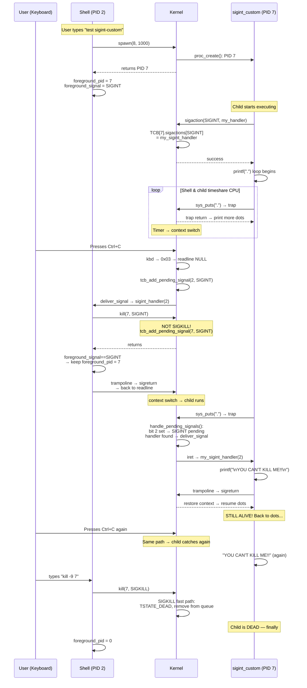
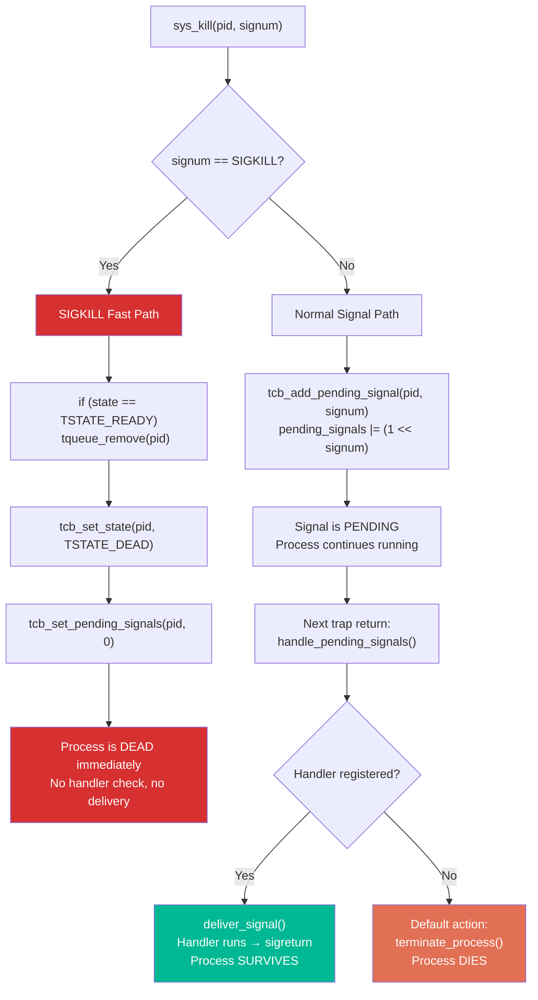

# Custom SIGINT Handler — The "Unkillable" Process Demo

## Table of Contents

- [Custom SIGINT Handler — The "Unkillable" Process Demo](#custom-sigint-handler--the-unkillable-process-demo)
  - [Table of Contents](#table-of-contents)
  - [Overview](#overview)
  - [Why This Test Exists](#why-this-test-exists)
  - [What This Demonstrates](#what-this-demonstrates)
  - [Design Goals](#design-goals)
  - [Architecture Overview](#architecture-overview)
  - [Implementation Details](#implementation-details)
    - [1. The Test Process: sigint\_custom\_test](#1-the-test-process-sigint_custom_test)
    - [2. User-Space Signal API Used](#2-user-space-signal-api-used)
    - [3. Shell Command: test sigint-custom](#3-shell-command-test-sigint-custom)
    - [4. Shell's Updated sigint\_handler](#4-shells-updated-sigint_handler)
    - [5. The foreground\_signal Variable](#5-the-foreground_signal-variable)
    - [6. Build System Integration](#6-build-system-integration)
  - [How It Works: End-to-End Flow](#how-it-works-end-to-end-flow)
    - [Phase 1: Process Startup and Handler Registration](#phase-1-process-startup-and-handler-registration)
    - [Phase 2: Ctrl+C Delivery — The Catchable Signal Path](#phase-2-ctrlc-delivery--the-catchable-signal-path)
    - [Phase 3: The Child Catches SIGINT](#phase-3-the-child-catches-sigint)
    - [Phase 4: Killing the "Unkillable" — SIGKILL](#phase-4-killing-the-unkillable--sigkill)
  - [Sequence Diagram: Complete Flow](#sequence-diagram-complete-flow)
  - [The Key Difference: SIGINT vs SIGKILL Path](#the-key-difference-sigint-vs-sigkill-path)
  - [Signal Delivery to the Child — Step by Step](#signal-delivery-to-the-child--step-by-step)
    - [Step 1: Shell Sends SIGINT to Child](#step-1-shell-sends-sigint-to-child)
    - [Step 2: Child is Scheduled and Traps](#step-2-child-is-scheduled-and-traps)
    - [Step 3: deliver\_signal Rewrites Child's Trapframe](#step-3-deliver_signal-rewrites-childs-trapframe)
    - [Step 4: Child's Handler Runs](#step-4-childs-handler-runs)
    - [Step 5: sigreturn Restores Child Context](#step-5-sigreturn-restores-child-context)
    - [Step 6: Child Resumes Printing Dots](#step-6-child-resumes-printing-dots)
  - [Comparison: test sigint vs test sigint-custom](#comparison-test-sigint-vs-test-sigint-custom)
  - [The POSIX Teaching Moment](#the-posix-teaching-moment)
  - [Demo Output](#demo-output)
  - [Files Created/Modified](#files-createdmodified)
  - [Edge Cases and Robustness](#edge-cases-and-robustness)
    - [What if Ctrl+C is pressed multiple times?](#what-if-ctrlc-is-pressed-multiple-times)
    - [How does the user actually kill this process?](#how-does-the-user-actually-kill-this-process)
    - [What if the child hasn't registered its handler yet when Ctrl+C arrives?](#what-if-the-child-hasnt-registered-its-handler-yet-when-ctrlc-arrives)
    - [Does the child's handler survive across multiple signal deliveries?](#does-the-childs-handler-survive-across-multiple-signal-deliveries)
    - [Can the child block SIGKILL too?](#can-the-child-block-sigkill-too)
  - [Summary of Key Constants and Definitions](#summary-of-key-constants-and-definitions)

---

## Overview

The `test sigint-custom` command demonstrates that **SIGINT is a catchable signal** — a user process can register its own handler via `sigaction()` and override the default termination behavior. When Ctrl+C is pressed, instead of dying, the process executes its custom handler and continues running.

This is a critical distinction from SIGKILL, which cannot be caught, blocked, or ignored under any circumstances.

The test process prints dots (`.`) in an infinite loop. When Ctrl+C is pressed, it prints `YOU CAN'T KILL ME!!` and resumes printing dots. The only way to stop it is `kill -9 <pid>` (SIGKILL).

---

## Why This Test Exists

In the [test_sigint.md](test_sigint.md) walkthrough, the shell sends SIGKILL to the foreground child. SIGKILL is uncatchable — it's a brute-force kill. But this raises a question: **can our signal infrastructure actually deliver signals to user-space handlers in child processes, not just the shell?**

The shell already proves it can catch SIGINT (it registers `sigint_handler()`). But the child process in `test sigint` never tries to catch anything — it just prints and dies.

`test sigint-custom` proves that the full signal pipeline works end-to-end for **any** process:
1. A child process registers a handler via `sigaction()`
2. A signal is sent to that child via `kill()`
3. The kernel's `handle_pending_signals()` / `deliver_signal()` rewrites the child's trapframe
4. The child's handler runs in user mode
5. `sigreturn` restores the child's context
6. The child resumes where it left off

This is the same mechanism the shell uses — proving it's a general-purpose signal delivery system, not a shell-specific hack.

---

## What This Demonstrates

| Concept | How It's Demonstrated |
|---------|----------------------|
| **Catchable signals** | Child catches SIGINT and continues running |
| **`sigaction()` works for any process** | Not just the shell — any user process can register handlers |
| **Signal delivery pipeline is general-purpose** | `deliver_signal()` → trampoline → `sigreturn` works for any target |
| **SIGKILL is truly uncatchable** | Only `kill -9` can stop the process — `sigaction(SIGKILL, ...)` would fail |
| **Handler can run multiple times** | Each Ctrl+C triggers the handler again — it's not one-shot |
| **Context restoration works** | After the handler runs, the child resumes its dot-printing loop seamlessly |

---

## Design Goals

1. **Child process registers its own SIGINT handler** via `sigaction()` — independent of the shell
2. **Shell sends SIGINT (not SIGKILL)** to the child on Ctrl+C — allowing the child to catch it
3. **Child's handler simply prints a message** and returns — proving it survived the signal
4. **Child resumes running after handling** — context restoration via `sigreturn` works correctly
5. **The process is "unkillable" by Ctrl+C** — only SIGKILL can stop it
6. **Reuse all existing signal infrastructure** — no new kernel code needed, only a new user process and shell command

---

## Architecture Overview

```mermaid
flowchart TD
    A["User types: test sigint-custom"] --> B["Shell spawns child (elf_id 8)\nforeground_signal = SIGINT"]
    B --> C["Child: sigaction(SIGINT, my_handler)\nRegisters custom handler in kernel TCB"]
    C --> D["Child: printf(\".\") in infinite loop"]

    E["User presses Ctrl+C"] --> F["Shell's sigint_handler runs"]
    F --> G["kill(child_pid, SIGINT)\n(NOT SIGKILL!)"]
    G --> H["Kernel: tcb_add_pending_signal(child, SIGINT)\nBit 2 set in child's bitmask"]
    H --> I["Child's next trap return:\nhandle_pending_signals()"]
    I --> J{"Child has SIGINT\nhandler registered?"}
    J -- Yes --> K["deliver_signal(tf, SIGINT)\nRewrite trapframe → my_handler"]
    J -- No --> L["Default: terminate\n(would never happen here)"]
    K --> M["Child's my_sigint_handler() runs:\nprints 'YOU CAN'T KILL ME!!'"]
    M --> N["trampoline → sigreturn\nRestore original context"]
    N --> D

    O["User types: kill -9 <pid>"] --> P["Shell: kill(pid, SIGKILL)"]
    P --> Q["Kernel: SIGKILL fast path\nTSTATE_DEAD, queue remove"]
    Q --> R["Child is dead — finally"]

    style A fill:#6c5ce7,color:#fff
    style E fill:#e17055,color:#fff
    style K fill:#00b894,color:#fff
    style M fill:#fdcb6e,color:#000
    style O fill:#d63031,color:#fff
    style R fill:#d63031,color:#fff
```

---

## Implementation Details

### 1. The Test Process: sigint_custom_test

**File**: `user/sigint_custom_test/sigint_custom_test.c`

```c
#include <proc.h>
#include <stdio.h>
#include <syscall.h>
#include <x86.h>

#include "signal.h"

void my_sigint_handler(int signum)
{
    printf("\nYOU CAN'T KILL ME!!\n");
}

int main(int argc, char **argv)
{
    /* Register custom SIGINT handler */
    struct sigaction sa;
    sa.sa_handler = my_sigint_handler;
    sa.sa_flags = 0;
    sa.sa_mask = 0;
    sigaction(SIGINT, &sa, 0);

    printf("[sigint_custom] Process started with custom SIGINT handler.\n");
    printf("[sigint_custom] Try Ctrl+C — I'll catch it!\n");
    printf("[sigint_custom] Use 'kill -9 <pid>' to actually kill me.\n");

    while (1) {
        printf(".");
    }

    /* Should never reach here */
    return 0;
}
```

**Key design decisions:**

- **`#include "signal.h"`**: Uses the user-space signal header (`user/include/signal.h`), which provides `struct sigaction`, `SIGINT`, `sigaction()`, and `kill()` declarations. This is different from `kern/lib/signal.h` (the kernel-side definitions).

- **`my_sigint_handler(int signum)`**: A minimal handler that proves the signal was caught. It takes `signum` as its single argument (passed by `deliver_signal()` on the stack) and prints a defiant message. After printing, it returns normally — the `ret` instruction pops the trampoline return address, which triggers `sigreturn`.

- **`sigaction(SIGINT, &sa, 0)`**: Registers the handler in the kernel TCB. The `0` (NULL) third argument means we don't need the old handler back. Under the hood:
  1. `sigaction()` in `user/lib/signal.c` calls `sys_sigaction(SIGINT, &sa, NULL)`
  2. `sys_sigaction()` in `user/include/syscall.h` does `int 0x30` with `eax = SYS_sigaction`
  3. Kernel's `sys_sigaction()` in `TSyscall.c` copies the `struct sigaction` from user space into `TCBPool[pid].sigstate.sigactions[SIGINT]`

- **`printf(".")` loop**: Each `printf(".")` call traps to the kernel via `sys_puts()`. This is important because **signals are checked at trap boundaries** — `handle_pending_signals()` runs in `trap()` before returning to user space. So every dot the child prints creates an opportunity for a pending SIGINT to be delivered.

- **No newline in the dot loop**: The dots print continuously on the same line (`.........`), making the handler's `\n` visually distinct when it fires.

### 2. User-Space Signal API Used

The child uses the **same user-space signal API** as the shell. This proves the API is general-purpose, not shell-specific.

**Header**: `user/include/signal.h`

```c
struct sigaction {
    sighandler_t sa_handler;          // Function pointer: void (*)(int)
    void (*sa_sigaction)(int, void*, void*);  // Not used (extended handler)
    int sa_flags;                     // SA_RESTART, etc. (not used here)
    void (*sa_restorer)(void);        // Not used
    uint32_t sa_mask;                 // Blocked signals during handler (not used here)
};

int sigaction(int signum, const struct sigaction *act, struct sigaction *oldact);
int kill(int pid, int signum);
```

**Library**: `user/lib/signal.c`

```c
int sigaction(int signum, const struct sigaction *act, struct sigaction *oldact)
{
    return sys_sigaction(signum, act, oldact);
}
```

**Syscall wrapper**: `user/include/syscall.h`

```c
static inline int sys_sigaction(int signum, const struct sigaction *act,
                                struct sigaction *oldact)
{
    int errno, ret;
    asm volatile("int %2"
        : "=a" (errno), "=b" (ret)
        : "i" (T_SYSCALL),
          "a" (SYS_sigaction),
          "b" (signum),
          "c" (act),
          "d" (oldact)
        : "cc", "memory");
    return errno ? -1 : 0;
}
```

The API chain: `sigaction()` → `sys_sigaction()` → `int 0x30` → kernel `sys_sigaction()` → `tcb_set_sigaction(pid, SIGINT, &sa)`.

### 3. Shell Command: test sigint-custom

**File**: `user/shell/shell.c` — `shell_test_signal()`

```c
if (strcmp(argv[1], "sigint-custom") == 0) {
    printf("=== SIGINT Custom Handler Test ===\n");
    printf("Spawning process with custom SIGINT handler...\n");
    printf("Press Ctrl+C — the process will catch it!\n");
    printf("Use 'kill -9 <pid>' (SIGKILL) to actually kill it.\n\n");

    pid_t pid = spawn(8, 1000);  /* elf_id 8 = sigint_custom_test */
    if (pid == -1) {
        printf("Failed to spawn sigint-custom test process\n");
        return -1;
    }
    printf("Test process spawned (PID %d).\n", pid);
    foreground_pid = pid;
    foreground_signal = SIGINT;  /* Catchable — child has a handler */
    return 0;
}
```

**Key difference from `test sigint`:**

| Aspect | `test sigint` | `test sigint-custom` |
|--------|--------------|---------------------|
| elf_id | 7 (sigint_test) | 8 (sigint_custom_test) |
| `foreground_signal` | `SIGKILL` | `SIGINT` |
| Child has handler? | No | Yes (`my_sigint_handler`) |
| Ctrl+C result | Child dies immediately | Child catches, prints message, continues |
| How to actually kill | Ctrl+C (SIGKILL) | `kill -9 <pid>` |

### 4. Shell's Updated sigint_handler

```c
static int foreground_pid = 0;
static int foreground_signal = SIGKILL;  /* default signal to send on Ctrl+C */

void sigint_handler(int signum)
{
    if (foreground_pid > 0) {
        printf("\n[SHELL] Ctrl+C: sending signal %d to process %d...\n",
               foreground_signal, foreground_pid);
        kill(foreground_pid, foreground_signal);
        if (foreground_signal == SIGKILL) {
            foreground_pid = 0;  /* SIGKILL guarantees death */
        }
        /* For catchable signals (SIGINT), keep foreground_pid set —
         * the child may survive if it has a handler */
    } else {
        printf("[SHELL] You pressed Ctrl+C!\n");
    }
}
```

**Why `foreground_pid` is NOT cleared for SIGINT:**

When the shell sends SIGINT to the child, the child might survive (if it has a handler). If we cleared `foreground_pid = 0`, the next Ctrl+C would think there's no foreground process and just print "You pressed Ctrl+C!" — the user would lose the ability to send more signals.

By keeping `foreground_pid` set, the shell can send SIGINT to the child repeatedly. Each Ctrl+C triggers the child's handler again.

### 5. The foreground_signal Variable

This variable was introduced specifically for the `test sigint-custom` feature. It controls what the `sigint_handler` sends:

```c
// At declaration (global scope in shell.c):
static int foreground_signal = SIGKILL;  // default: uncatchable

// Set by test sigint:
foreground_signal = SIGKILL;  // child has no handler → force kill

// Set by test sigint-custom:
foreground_signal = SIGINT;   // child has a handler → let it catch
```

This is a simple but effective design: the same `sigint_handler()` function handles both scenarios, just by changing which signal number it sends to the child.

### 6. Build System Integration

**Files created:**

| File | Purpose |
|------|---------|
| `user/sigint_custom_test/sigint_custom_test.c` | The test process source code |
| `user/sigint_custom_test/Makefile.inc` | Build rules — compiles, links, adds to `KERN_BINFILES` |

**Files modified:**

| File | Change |
|------|--------|
| `user/Makefile.inc` | Added `include $(USER_DIR)/sigint_custom_test/Makefile.inc` and `sigint_custom_test` to the `user` target |
| `kern/trap/TSyscall/TSyscall.c` | Added `extern uint8_t _binary___obj_user_sigint_custom_test_sigint_custom_test_start[];` and `elf_id == 8` mapping in `sys_spawn()` |
| `user/shell/shell.c` | Added `foreground_signal` variable, updated `sigint_handler()` to use it, added `test sigint-custom` command, updated `shell_spawn()` elf_id range to 1–8 |

**In TSyscall.c — the ELF mapping:**

```c
extern uint8_t _binary___obj_user_sigint_custom_test_sigint_custom_test_start[];

// In sys_spawn():
} else if (elf_id == 8) {
    elf_addr = _binary___obj_user_sigint_custom_test_sigint_custom_test_start;
}
```

Because CertiKOS has no filesystem, user binaries are statically linked into the kernel image. The linker generates symbols like `_binary___obj_user_sigint_custom_test_sigint_custom_test_start` that point to the embedded ELF data. `sys_spawn()` uses the `elf_id` parameter to select which binary to load.

---

## How It Works: End-to-End Flow

### Phase 1: Process Startup and Handler Registration

1. User types `test sigint-custom` in the shell
2. Shell calls `spawn(8, 1000)` → kernel's `sys_spawn()` → `proc_create()` with the `sigint_custom_test` ELF
3. Child process is created with a new PID (e.g., 7), added to the ready queue
4. Shell sets `foreground_pid = 7`, `foreground_signal = SIGINT`
5. Shell returns to its main loop → `readline()` → `getchar()` polling loop
6. Scheduler gives child CPU time → child's `main()` starts executing
7. Child calls `sigaction(SIGINT, &sa, 0)`:
   - Traps to kernel → `sys_sigaction()` stores `my_sigint_handler` in `TCBPool[7].sigstate.sigactions[SIGINT].sa_handler`
8. Child prints startup messages, then enters `printf(".")` infinite loop

### Phase 2: Ctrl+C Delivery — The Catchable Signal Path

9. User presses Ctrl+C on keyboard
10. Keyboard driver → scancode 0x2E with CTL modifier → `ctlmap[0x2E]` = `C('C')` = 0x03
11. Character 0x03 enters console ring buffer
12. Shell's `getchar()` → `cons_getc()` → returns 0x03
13. `readline()` detects 0x03 → prints `^C\n` → returns NULL
14. `sys_readline()` sees NULL → `tcb_add_pending_signal(shell_pid, SIGINT)` → sets bit 2 in shell's pending bitmask
15. `trap()` → `handle_pending_signals()` → shell has SIGINT handler → `deliver_signal()` → trapframe rewritten to shell's `sigint_handler()`
16. Shell's `sigint_handler(2)` executes:
    ```c
    kill(foreground_pid, foreground_signal);  // kill(7, SIGINT)  ← NOT SIGKILL!
    ```
17. `sys_kill()` in kernel: `signum == SIGINT` (not SIGKILL) → takes the **pending signal path**:
    ```c
    tcb_add_pending_signal(7, SIGINT);  // Set bit 2 in CHILD's pending bitmask
    ```
    **Note**: Unlike SIGKILL, this does NOT immediately terminate the child. The signal is just marked as pending.
18. Shell's handler returns → trampoline → `sigreturn` → shell back at `readline()`

### Phase 3: The Child Catches SIGINT

19. Scheduler gives child (PID 7) CPU time
20. Child was in its `printf(".")` loop → `sys_puts()` → trap to kernel
21. In `trap()`, before returning to user mode:
    ```c
    handle_pending_signals(tf);
    ```
22. `handle_pending_signals()` finds bit 2 set (SIGINT pending):
    - Clears the bit: `pending_signals &= ~(1 << 2)`
    - Not SIGKILL → checks for handler
    - `tcb_get_sigaction(7, SIGINT)` returns `my_sigint_handler` → handler exists!
    - Calls `deliver_signal(tf, SIGINT)`
23. `deliver_signal()` rewrites child's trapframe:
    - Saves child's original ESP and EIP on the user stack
    - Writes trampoline code on the user stack
    - Pushes signal number (2) and trampoline return address
    - Sets `tf->eip = my_sigint_handler`
    - Sets `tf->esp = new_esp`
24. `trap_return(tf)` → `iret` → CPU jumps to `my_sigint_handler(2)` in user mode
25. Handler prints: `\nYOU CAN'T KILL ME!!\n`
26. Handler returns (`ret`) → pops trampoline address → CPU executes trampoline
27. Trampoline: `mov eax, 152; int 0x30` → `sys_sigreturn()`
28. Kernel reads saved ESP/EIP from stack → restores child's trapframe
29. `trap_return` → child resumes at the `printf(".")` it was executing before the signal

### Phase 4: Killing the "Unkillable" — SIGKILL

30. User types `kill -9 7` in the shell (assuming child is PID 7)
31. Shell's `shell_kill()` calls `kill(7, SIGKILL)`
32. Kernel `sys_kill()`: `signum == SIGKILL` → **fast path**:
    - `tcb_get_state(7) == TSTATE_READY` → `tqueue_remove(NUM_IDS, 7)`
    - `tcb_set_state(7, TSTATE_DEAD)`
    - `tcb_set_pending_signals(7, 0)`
33. Child is dead. It will never be scheduled again.
34. Shell can safely set `foreground_pid = 0`

---

## Sequence Diagram: Complete Flow



---

## The Key Difference: SIGINT vs SIGKILL Path

When the shell calls `kill(child_pid, signal)`, the kernel takes one of two very different paths:



**For `test sigint-custom`**: The shell sends SIGINT (signal 2), which takes the **normal signal path**. The child has a registered handler, so it takes the green path — handler runs, process survives.

**For `test sigint`**: The shell sends SIGKILL (signal 9), which takes the **fast path**. No handler is checked, no signal is delivered — the process is immediately dead.

**For `kill -9 <pid>`**: Always takes the SIGKILL fast path, regardless of any handlers. This is why it's the only way to stop the "unkillable" process.

---

## Signal Delivery to the Child — Step by Step

This section details exactly what happens inside the kernel when the child's pending SIGINT is delivered.

### Step 1: Shell Sends SIGINT to Child

```c
// In the shell's sigint_handler():
kill(foreground_pid, foreground_signal);  // kill(7, SIGINT)
```

In the kernel's `sys_kill()`:

```c
// signum == 2 (SIGINT), not 9 (SIGKILL)
// → takes the pending signal path:
tcb_add_pending_signal(7, SIGINT);
// Sets pending_signals for PID 7: bit 2 → pending_signals |= 0x4
```

The child is not affected yet — it's just a bit flip in its TCB.

### Step 2: Child is Scheduled and Traps

The child continues its `printf(".")` loop. Each `printf` eventually calls `sys_puts()`, which does `int 0x30` → trap to kernel. Inside `trap()`:

```c
void trap(tf_t *tf) {
    // ... handle the syscall (sys_puts) ...

    kstack_switch(cur_pid);
    handle_pending_signals(tf);   // ← This is where SIGINT gets noticed
    set_pdir_base(cur_pid);
    trap_return(tf);
}
```

### Step 3: deliver_signal Rewrites Child's Trapframe

`handle_pending_signals()` scans the pending bitmask, finds bit 2 (SIGINT):

```c
void handle_pending_signals(tf_t *tf) {
    unsigned int cur_pid = get_curid();
    uint32_t pending = tcb_get_pending_signals(cur_pid);

    for (int signum = 1; signum < NSIG; signum++) {
        if (pending & (1 << signum)) {
            // Clear the pending bit
            tcb_set_pending_signals(cur_pid, pending & ~(1 << signum));

            // SIGKILL check: skip (signum == 2, not 9)

            // Check for registered handler
            struct sigaction sa = tcb_get_sigaction(cur_pid, signum);
            if (sa.sa_handler != NULL && sa.sa_handler != (sighandler_t)1) {
                deliver_signal(tf, signum);   // ← Rewrites the trapframe
                return;
            }

            // No handler → default action: terminate
            // (not reached — child registered a handler)
        }
    }
}
```

`deliver_signal()` builds a signal stack frame on the child's user stack:

```
Child's User Stack After deliver_signal():

Higher addresses
┌────────────────────────────────────┐
│ Original stack data                │ ← orig_esp
├────────────────────────────────────┤
│ saved EIP (4 bytes)                │ ← where child was in printf loop
├────────────────────────────────────┤
│ saved ESP (4 bytes)                │ ← original stack pointer
├────────────────────────────────────┤
│ Trampoline code (12 bytes)         │
│ B8 98 00 00 00  mov eax, 152       │
│ CD 30           int 0x30           │
│ EB FE           jmp $              │
│ 90 90 90        nop nop nop        │
├────────────────────────────────────┤
│ Signal number: 2 (SIGINT)          │ ← argument to handler
├────────────────────────────────────┤
│ Return address → trampoline        │ ← handler will `ret` here
├────────────────────────────────────┤
│                                    │ ← new ESP (tf->esp)
Lower addresses
```

And sets:
- `tf->eip = my_sigint_handler` (redirects execution)
- `tf->esp = new_esp` (points to the signal frame)

### Step 4: Child's Handler Runs

`trap_return(tf)` → `iret` → CPU is now executing `my_sigint_handler(2)` in user mode (ring 3):

```c
void my_sigint_handler(int signum)
{
    printf("\nYOU CAN'T KILL ME!!\n");
}
```

- `signum` is 2 (SIGINT), taken from `[ESP+4]` on the fabricated stack
- `printf()` calls `sys_puts()` → trap → kernel handles it → returns to handler
- Handler reaches its closing `}` → compiler emits `ret`

### Step 5: sigreturn Restores Child Context

- `ret` pops `[ESP]` = trampoline address → CPU jumps to trampoline
- Trampoline: `mov eax, 152; int 0x30` → trap → `sys_sigreturn()`
- Kernel reads `saved_esp` and `saved_eip` from the signal frame on the user stack
- Restores `tf->esp` and `tf->eip` to their original values
- `trap_return(tf)` → `iret` → child resumes exactly where it was

### Step 6: Child Resumes Printing Dots

The child is now back in its `printf(".")` loop, as if nothing happened. The signal was caught, handled, and the child survived.

The next Ctrl+C will repeat the entire process — the handler is persistent (not one-shot), so SIGINT can be caught indefinitely.

---

## Comparison: test sigint vs test sigint-custom

| Aspect | `test sigint` | `test sigint-custom` |
|--------|--------------|---------------------|
| **Child process** | `sigint_test` — prints "Hello World!" | `sigint_custom_test` — prints dots |
| **Child has SIGINT handler?** | No | Yes (`my_sigint_handler`) |
| **elf_id** | 7 | 8 |
| **`foreground_signal`** | `SIGKILL` | `SIGINT` |
| **What Ctrl+C does** | Child dies immediately (SIGKILL fast path) | Child catches SIGINT, prints message, continues |
| **`foreground_pid` after Ctrl+C** | Cleared to 0 | Stays set (child is alive) |
| **How to kill** | Ctrl+C (one press) | `kill -9 <pid>` (must use SIGKILL) |
| **Signal path in kernel** | `sys_kill` → SIGKILL fast path → `TSTATE_DEAD` | `sys_kill` → `tcb_add_pending_signal` → `deliver_signal` → handler |
| **Purpose** | Demonstrates basic Ctrl+C termination | Demonstrates catchable signals and handler override |

---

## The POSIX Teaching Moment

This test demonstrates several fundamental POSIX signal concepts:

### 1. Catchable vs Uncatchable Signals

| Signal | Catchable? | Blockable? | Ignorable? |
|--------|-----------|-----------|------------|
| SIGINT (2) | Yes | Yes | Yes |
| SIGKILL (9) | **No** | **No** | **No** |
| SIGSEGV (11) | Yes | Yes | Yes |
| SIGSTOP (19) | **No** | **No** | **No** |

POSIX mandates that SIGKILL and SIGSTOP can never be caught, blocked, or ignored. This is a security and reliability guarantee — the system administrator (or parent process) must always have a way to stop a runaway process.

### 2. Signal Handler Persistence

In our implementation, handlers are **persistent** — once registered, they stay registered across multiple signal deliveries. This matches modern POSIX behavior (the `sigaction()` interface). The older `signal()` interface on some systems was one-shot: the handler was reset to `SIG_DFL` after each delivery.

### 3. Signal vs Kill

The `kill()` system call doesn't necessarily kill — it sends a signal. The name is historical (from UNIX V7, where the primary use was `kill -9`). A more accurate name would be `sendsignal()`.

### 4. Defense in Depth

No matter what a user process does — registering handlers, blocking signals, ignoring them — SIGKILL always works. This test makes that viscerally clear: the process is "unkillable" by SIGINT, but `kill -9` ends it instantly.

---

## Demo Output

```
>:test sigint-custom
=== SIGINT Custom Handler Test ===
Spawning process with custom SIGINT handler...
Press Ctrl+C — the process will catch it!
Use 'kill -9 <pid>' (SIGKILL) to actually kill it.

Test process spawned (PID 7).
>:[sigint_custom] Process started with custom SIGINT handler.
[sigint_custom] Try Ctrl+C — I'll catch it!
[sigint_custom] Use 'kill -9 <pid>' to actually kill me.
........................................................................
........................................................................
^C

[SHELL] Ctrl+C: sending signal 2 to process 7...
YOU CAN'T KILL ME!!
........................................................................
........................................................................
^C

[SHELL] Ctrl+C: sending signal 2 to process 7...
YOU CAN'T KILL ME!!
........................................................................
>:kill -9 7
[SIGNAL] SIGKILL sent to process 7 - terminating immediately
[SIGNAL] Process 7 terminated by SIGKILL
>:
```

**Observations:**

- The dots print continuously, showing the child is alive and running.
- Each Ctrl+C (`^C`) triggers the shell's handler, which sends SIGINT to the child.
- The child catches SIGINT and prints `YOU CAN'T KILL ME!!`, then resumes printing dots.
- This can be repeated indefinitely — the handler is persistent.
- Only `kill -9 7` (SIGKILL) actually terminates the child.
- After the child is killed, the shell returns to the `>:` prompt normally.

---

## Files Created/Modified

### Files Created

| File | Lines | Purpose |
|------|-------|---------|
| `user/sigint_custom_test/sigint_custom_test.c` | ~33 | Test process with custom SIGINT handler |
| `user/sigint_custom_test/Makefile.inc` | ~28 | Build rules for the new binary |

### Files Modified

| File | Change |
|------|--------|
| `user/Makefile.inc` | Added `include $(USER_DIR)/sigint_custom_test/Makefile.inc` and `sigint_custom_test` to the `user` target |
| `kern/trap/TSyscall/TSyscall.c` | Added `extern` for linker symbol, `elf_id == 8` → `sigint_custom_test` mapping in `sys_spawn()` |
| `user/shell/shell.c` | Added `foreground_signal` variable, updated `sigint_handler()` to use it, added `test sigint-custom` command, updated `shell_spawn()` elf_id range to 1–8 |

---

## Edge Cases and Robustness

### What if Ctrl+C is pressed multiple times?

Each Ctrl+C follows the same path: shell sends SIGINT → child catches it → handler prints message → child resumes. The handler is persistent (not one-shot), so this works indefinitely. SIGINT is bit 2 in the bitmask — if the child hasn't processed the first SIGINT yet, the second one sets the same bit again (idempotent).

### How does the user actually kill this process?

The user must type `kill -9 <pid>` in the shell. The shell's `shell_kill()` command parses the `-9` flag and calls `kill(pid, SIGKILL)`. SIGKILL takes the kernel fast path — immediate `TSTATE_DEAD`, no handler check.

Alternatively, the user could use `kill <pid>` without `-9`, which sends SIGTERM (signal 15). But since our child only registers a handler for SIGINT, SIGTERM would use the default action (terminate). However, if the child also registered a SIGTERM handler, it could survive that too — only SIGKILL is guaranteed.

### What if the child hasn't registered its handler yet when Ctrl+C arrives?

This is a race condition. If the child is spawned but hasn't executed its `sigaction()` call yet:
1. Shell sends SIGINT to child → `tcb_add_pending_signal(child, SIGINT)`
2. Child gets scheduled → `handle_pending_signals()` runs
3. No handler registered yet → default action → `terminate_process()` → child dies

In practice, this is unlikely because the child executes `sigaction()` very early in `main()` (before any I/O), and the user would need to press Ctrl+C within microseconds of spawning.

### Does the child's handler survive across multiple signal deliveries?

Yes. Our `deliver_signal()` does not reset the handler after delivery. The `sigaction()` registration is permanent until explicitly changed by another `sigaction()` call. This matches modern POSIX behavior (`sigaction` semantics), unlike the older `signal()` interface which was one-shot on some systems.

### Can the child block SIGKILL too?

No. This is enforced at two levels:
1. **`sys_sigaction()`**: Could validate that `signum != SIGKILL` (though our implementation doesn't explicitly check this — SIGKILL is handled by the fast path in `sys_kill` before any handler lookup).
2. **`sys_kill()` fast path**: When `signum == SIGKILL`, the kernel immediately sets `TSTATE_DEAD` — it never calls `handle_pending_signals()` or checks for handlers. Even if a handler were somehow registered for signal 9, it would never be invoked.

This is a fundamental POSIX guarantee and a deliberate design decision in our kernel.

---

## Summary of Key Constants and Definitions

| Name | Value | Location | Purpose |
|------|-------|----------|---------|
| `SIGINT` | 2 | `kern/lib/signal.h`, `user/include/signal.h` | Interrupt signal — catchable |
| `SIGKILL` | 9 | `kern/lib/signal.h`, `user/include/signal.h` | Kill signal — uncatchable |
| `SYS_sigaction` | — | `kern/lib/syscall.h` | Syscall for registering signal handlers |
| `SYS_kill` | — | `kern/lib/syscall.h` | Syscall for sending signals |
| `SYS_sigreturn` | 152 | `kern/lib/syscall.h` | Syscall for signal context restore |
| `elf_id` | 8 | `TSyscall.c` | ELF identifier for sigint_custom_test binary |
| `foreground_pid` | variable | `user/shell/shell.c` | Tracks current foreground child PID |
| `foreground_signal` | variable | `user/shell/shell.c` | Signal to send on Ctrl+C (SIGKILL or SIGINT) |
| `TSTATE_DEAD` | 3 | `kern/lib/thread.h` | Thread is terminated |
| `NUM_IDS` | 64 | (config) | Max processes; queue-empty sentinel |
