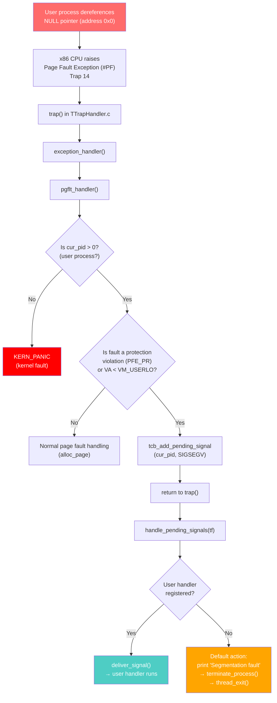
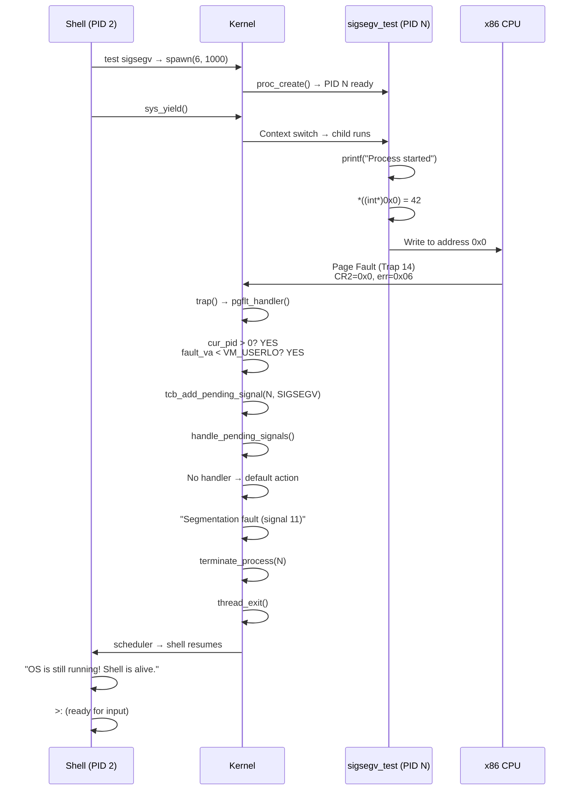
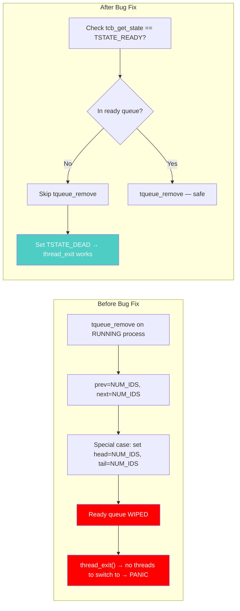
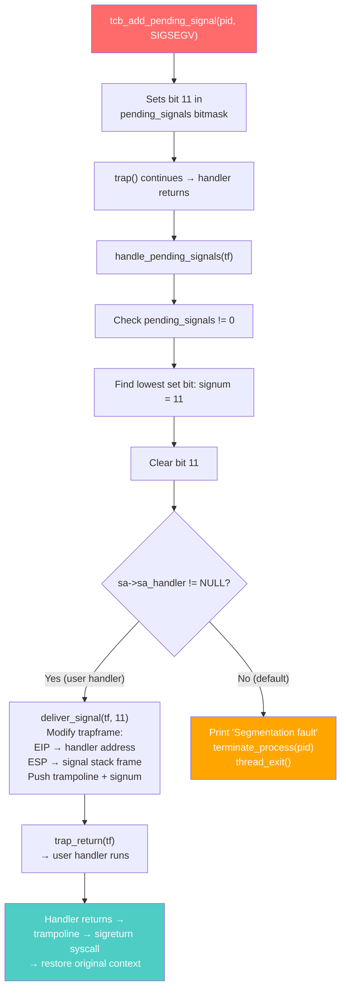

# SIGSEGV Implementation in CertiKOS

## Table of Contents

- [SIGSEGV Implementation in CertiKOS](#sigsegv-implementation-in-certikos)
  - [Table of Contents](#table-of-contents)
  - [Overview](#overview)
  - [What is SIGSEGV?](#what-is-sigsegv)
  - [Design Goals](#design-goals)
  - [Architecture Overview](#architecture-overview)
  - [Implementation Details](#implementation-details)
    - [1. Page Fault Handler Modification](#1-page-fault-handler-modification)
    - [2. Default Signal Action for SIGSEGV](#2-default-signal-action-for-sigsegv)
    - [3. Test Process: sigsegv\_test](#3-test-process-sigsegv_test)
    - [4. Build System Integration](#4-build-system-integration)
    - [5. Shell Command: test sigsegv](#5-shell-command-test-sigsegv)
  - [Files Modified/Created](#files-modifiedcreated)
  - [How It Works: End-to-End Flow](#how-it-works-end-to-end-flow)
  - [Bugs Encountered and Fixed](#bugs-encountered-and-fixed)
    - [Bug 1: Ready Queue Corruption](#bug-1-ready-queue-corruption)
    - [Bug 2: Child Process Never Runs](#bug-2-child-process-never-runs)
  - [Signal Delivery Mechanism](#signal-delivery-mechanism)
  - [Why This Approach?](#why-this-approach)
    - [Why not just print an error and kill the process directly in `pgflt_handler`?](#why-not-just-print-an-error-and-kill-the-process-directly-in-pgflt_handler)
    - [Why is PID 0 excluded?](#why-is-pid-0-excluded)
  - [Demo Output](#demo-output)
    - [Without SIGSEGV handling (before implementation):](#without-sigsegv-handling-before-implementation)
    - [With SIGSEGV handling (after implementation):](#with-sigsegv-handling-after-implementation)

---

## Overview

SIGSEGV (Signal 11 — Segmentation Fault) is one of the most critical signals in POSIX operating systems. It is raised when a process performs an illegal memory access, such as dereferencing a NULL pointer or writing to a read-only page. In production operating systems like Linux, SIGSEGV terminates the faulting process gracefully without crashing the entire system.

Before this implementation, **any** page fault in CertiKOS — whether from a kernel bug or a simple user-space NULL pointer dereference — triggered a `KERN_PANIC`, halting the entire OS. This made it impossible to isolate user-space faults from kernel stability.

This document details how SIGSEGV was implemented to bring CertiKOS closer to POSIX behavior.

---

## What is SIGSEGV?

| Property | Value |
|----------|-------|
| Signal Number | 11 |
| POSIX Name | `SIGSEGV` |
| Full Name | Segmentation Violation |
| Default Action | Terminate the process |
| Can Be Caught? | Yes (via `sigaction`) |
| Can Be Blocked? | Yes (but dangerous) |
| Common Triggers | NULL pointer dereference, stack overflow, writing to read-only memory |

---

## Design Goals

1. **Process isolation**: A user-space segfault must NOT crash the kernel
2. **Graceful termination**: The faulting process should be terminated with a descriptive message
3. **Signal infrastructure reuse**: Leverage the existing signal delivery pipeline (`tcb_add_pending_signal` → `handle_pending_signals` → `deliver_signal` / default action)
4. **User handler support**: Allow user processes to optionally register a SIGSEGV handler via `sigaction`
5. **Kernel faults untouched**: Kernel (PID 0) page faults still trigger `KERN_PANIC` as a safety measure

---

## Architecture Overview



---

## Implementation Details

### 1. Page Fault Handler Modification

**File**: `kern/trap/TTrapHandler/TTrapHandler.c` — `pgflt_handler()`

The page fault handler was the most critical change. The x86 CPU raises Trap 14 (Page Fault) whenever a memory access violation occurs. The error code pushed onto the stack by the CPU tells us *why* the fault happened:

| Bit | Name | Meaning |
|-----|------|---------|
| 0 | `PFE_PR` (Present) | 1 = protection violation on a present page; 0 = page not present |
| 1 | `PFE_WR` (Write) | 1 = write access; 0 = read access |
| 2 | `PFE_US` (User) | 1 = user-mode access; 0 = supervisor-mode |

**Decision logic for sending SIGSEGV:**

We send SIGSEGV when the faulting process is a user process (PID > 0) AND either:
- The error code has bit 0 set (`PFE_PR`) — meaning the page exists but the access is not permitted (e.g., writing to read-only memory), OR
- The fault address is below `VM_USERLO` — meaning the process tried to access kernel-reserved memory (including NULL / address 0)

**Code added:**

```c
void pgflt_handler(tf_t *tf)
{
    unsigned int cur_pid;
    unsigned int errno;
    unsigned int fault_va;

    cur_pid = get_curid();
    errno = tf->err;
    fault_va = rcr2();  // CR2 register holds the faulting virtual address

    // Check if this is a user-mode fault we can handle via SIGSEGV
    // User processes have pid > 0; kernel faults (pid 0) still panic
    if (cur_pid > 0) {
        if ((errno & PFE_PR) || fault_va < VM_USERLO) {
            KERN_INFO("[SIGSEGV] Page fault in process %d: "
                      "va=0x%08x errno=0x%08x eip=0x%08x\n",
                      cur_pid, fault_va, errno, tf->eip);
            tcb_add_pending_signal(cur_pid, SIGSEGV);
            return;
        }
    }

    // Original panic path for kernel faults or legitimate page-not-present
    if (errno & PFE_PR) {
        trap_dump(tf);
        KERN_PANIC("Permission denied: va = 0x%08x, errno = 0x%08x.\n",
                   fault_va, errno);
        return;
    }

    if (alloc_page(cur_pid, fault_va, PTE_W | PTE_U | PTE_P) == MagicNumber)
        KERN_PANIC("Page allocation failed: va = 0x%08x, errno = 0x%08x.\n",
                   fault_va, errno);
}
```

**Why `fault_va < VM_USERLO`?**

In CertiKOS, the virtual address space is divided:
- `0x00000000` to `VM_USERLO - 1` (typically `0x40000000`): Kernel-reserved space
- `VM_USERLO` to `VM_USERHI`: User-space process memory

Address `0x0` (NULL) falls squarely in the kernel-reserved region. User processes have no pages mapped there, so a NULL dereference causes a page-not-present fault (`PFE_PR = 0`). Without the `fault_va < VM_USERLO` check, it would fall through to `alloc_page()` — which would either panic or (worse) actually map a page at address 0. By catching this case, we send SIGSEGV instead.

**Why `cur_pid > 0`?**

PID 0 is the kernel/bootstrap context. If the kernel itself segfaults, we absolutely want a `KERN_PANIC` — there's no graceful recovery from a kernel memory corruption. Only user processes (PID ≥ 1) get the SIGSEGV treatment.

---

### 2. Default Signal Action for SIGSEGV

**File**: `kern/trap/TTrapHandler/TTrapHandler.c` — `handle_pending_signals()`

When a signal is pending and the process has **no registered handler** for it, the kernel applies the *default action*. For SIGSEGV, the default action is process termination with a diagnostic message.

```c
static void handle_pending_signals(tf_t *tf)
{
    unsigned int cur_pid = get_curid();
    uint32_t pending_signals = tcb_get_pending_signals(cur_pid);

    if (pending_signals != 0) {
        for (int signum = 1; signum < NSIG; signum++) {
            if (pending_signals & (1 << signum)) {
                tcb_clear_pending_signal(cur_pid, signum);

                // SIGKILL always terminates, cannot be caught
                if (signum == SIGKILL) {
                    terminate_process(cur_pid);
                    thread_exit();
                    return;
                }

                struct sigaction *sa = tcb_get_sigaction(cur_pid, signum);
                if (sa != NULL && sa->sa_handler != NULL) {
                    deliver_signal(tf, signum);  // User handler
                } else {
                    // Default action: terminate with descriptive message
                    const char *sig_name = "Unknown";
                    if (signum == SIGSEGV) sig_name = "Segmentation fault";
                    else if (signum == SIGINT) sig_name = "Interrupt";
                    else if (signum == SIGTERM) sig_name = "Terminated";
                    // ... other signals ...

                    KERN_INFO("\n[Process %d] %s (signal %d)\n",
                              cur_pid, sig_name, signum);
                    terminate_process(cur_pid);
                    thread_exit();
                    return;
                }
                break;
            }
        }
    }
}
```

**`terminate_process()` safeguards:**

```c
static void terminate_process(unsigned int pid)
{
    // Only remove from ready queue if actually queued
    // A RUNNING process is NOT in the queue!
    if (tcb_get_state(pid) == TSTATE_READY) {
        tqueue_remove(NUM_IDS, pid);
    }

    tcb_set_state(pid, TSTATE_DEAD);
    tcb_set_pending_signals(pid, 0);
}
```

The `TSTATE_READY` guard is critical — see [Bug 1](#bug-1-ready-queue-corruption) below.

---

### 3. Test Process: sigsegv_test

**File created**: `user/sigsegv_test/sigsegv_test.c`

A minimal user process that intentionally triggers a segmentation fault:

```c
#include <proc.h>
#include <stdio.h>
#include <syscall.h>
#include <x86.h>

int main(int argc, char **argv)
{
    printf("[sigsegv_test] Process started.\n");
    printf("[sigsegv_test] Attempting to dereference NULL pointer...\n");

    /* Intentionally trigger a segmentation fault */
    volatile int *bad_ptr = (volatile int *)0x0;
    *bad_ptr = 42;

    /* Should never reach here */
    printf("[sigsegv_test] ERROR: Should not reach this line!\n");
    return 0;
}
```

**Why `volatile`?** Without `volatile`, the compiler might optimize away the dead store (writing to an address whose result is never read). `volatile` forces the compiler to emit the actual memory write instruction.

**Why address `0x0`?** This is the classic NULL pointer dereference. Address 0 is in the kernel-reserved region (below `VM_USERLO`), so no user page is mapped there. The write triggers a page fault with `fault_va = 0x0`.

---

### 4. Build System Integration

**Files created/modified:**

| File | Change |
|------|--------|
| `user/sigsegv_test/Makefile.inc` | Created — defines build rules for sigsegv_test binary |
| `user/Makefile.inc` | Added `include $(USER_DIR)/sigsegv_test/Makefile.inc` and `sigsegv_test` to the user target |
| `kern/trap/TSyscall/TSyscall.c` | Added `extern uint8_t _binary___obj_user_sigsegv_test_sigsegv_test_start[];` and `elf_id == 6` case in `sys_spawn()` |

**How CertiKOS loads user binaries:**

CertiKOS doesn't have a filesystem-based program loader. Instead, user ELF binaries are linked directly into the kernel image at compile time. The linker creates symbols like `_binary___obj_user_sigsegv_test_sigsegv_test_start` pointing to the start of the embedded ELF. When `sys_spawn(elf_id)` is called, it maps `elf_id` to the corresponding linker symbol and passes it to `proc_create()`.

```c
// In sys_spawn():
} else if (elf_id == 6) {
    elf_addr = _binary___obj_user_sigsegv_test_sigsegv_test_start;
}
```

The `Makefile.inc` adds the binary to `KERN_BINFILES`, which tells the linker to embed it:

```makefile
KERN_BINFILES += $(USER_OBJDIR)/sigsegv_test/sigsegv_test
```

---

### 5. Shell Command: test sigsegv

**File**: `user/shell/shell.c` — `shell_test_signal()`

The shell provides a `test sigsegv` command that spawns the test process and demonstrates graceful handling:

```c
if (strcmp(argv[1], "sigsegv") == 0) {
    printf("=== SIGSEGV Test ===\n");
    printf("Spawning process that will dereference a NULL pointer...\n");
    printf("Expected: process terminates with 'Segmentation fault'"
           " instead of kernel panic.\n\n");

    pid_t pid = spawn(6, 1000);  /* elf_id 6 = sigsegv_test */
    if (pid == -1) {
        printf("Failed to spawn sigsegv test process\n");
        return -1;
    }
    printf("Test process spawned (PID %d). It should crash gracefully.\n", pid);

    /* Yield CPU to let the spawned process run and fault */
    sys_yield();

    printf("\n=== OS is still running! Shell is alive. ===\n");
    return 0;
}
```

**Why `sys_yield()`?** CertiKOS uses cooperative scheduling within a syscall context. After `spawn()` creates the child, the shell still holds the CPU. `sys_yield()` gives the child a chance to run (and fault). When the child terminates, the scheduler returns to the shell.

---

## Files Modified/Created

| File | Action | Purpose |
|------|--------|---------|
| `kern/trap/TTrapHandler/TTrapHandler.c` | Modified | Added SIGSEGV detection in `pgflt_handler()`, default actions in `handle_pending_signals()`, `terminate_process()` with queue guard |
| `kern/trap/TSyscall/TSyscall.c` | Modified | Added `elf_id == 6` for sigsegv_test in `sys_spawn()`, added `tqueue_remove` guard in SIGKILL path |
| `user/sigsegv_test/sigsegv_test.c` | Created | Test process that dereferences NULL |
| `user/sigsegv_test/Makefile.inc` | Created | Build rules for sigsegv_test |
| `user/Makefile.inc` | Modified | Include sigsegv_test in build |
| `user/shell/shell.c` | Modified | Added `test sigsegv` command |

---

## How It Works: End-to-End Flow



---

## Bugs Encountered and Fixed

### Bug 1: Ready Queue Corruption

**Symptom**: After the test process was terminated, the kernel panicked with `thread_exit: no threads to switch to!`

**Root Cause**: `terminate_process()` called `tqueue_remove(NUM_IDS, pid)` on the **currently RUNNING** process. A RUNNING process is NOT in the ready queue — it was dequeued by the scheduler when it started running. Its `prev` and `next` pointers are both `NUM_IDS`.

The `tqueue_remove` implementation has a special case: when both `prev == NUM_IDS && next == NUM_IDS`, it assumes the node is the **only element** in the queue and clears the queue head and tail pointers to `NUM_IDS`. This effectively wiped out the entire ready queue, making the scheduler think there were no runnable processes.



**Fix**: Guard `tqueue_remove` with a state check:
```c
if (tcb_get_state(pid) == TSTATE_READY) {
    tqueue_remove(NUM_IDS, pid);
}
```

### Bug 2: Child Process Never Runs

**Symptom**: After `spawn()`, the sigsegv_test process never printed anything. The shell returned to the prompt immediately.

**Root Cause**: The shell's original code used a busy-wait loop `for (i = 0; i < 500000; i++)` which never yielded the CPU. Since CertiKOS is non-preemptive within syscall handling, the child was starved.

**Fix**: Replaced with `sys_yield()` to explicitly give the child CPU time.

---

## Signal Delivery Mechanism

The full signal delivery pipeline, reused by SIGSEGV:



---

## Why This Approach?

### Why not just print an error and kill the process directly in `pgflt_handler`?

We *could* have terminated the process right in the page fault handler. However, by routing through the signal infrastructure:

1. **User handlers**: Processes can register a SIGSEGV handler via `sigaction()` to do custom cleanup (flush buffers, write a crash log, etc.) before termination
2. **Consistency**: All termination goes through the same `handle_pending_signals` → `terminate_process` → `thread_exit` pipeline
3. **POSIX compatibility**: Real operating systems deliver SIGSEGV as a signal, not a hard kill
4. **Debuggability**: The signal delivery path has comprehensive `KERN_INFO` logging that traces every step

### Why is PID 0 excluded?

PID 0 is the kernel's own process context. A page fault in the kernel indicates a serious bug — dereferencing a NULL pointer in kernel code, stack overflow, or corrupted page tables. In these cases, `KERN_PANIC` is the correct response because:
- There's no user-space handler to invoke
- The kernel's own data structures may be corrupted
- Continuing execution could cause data loss or further corruption

---

## Demo Output

### Without SIGSEGV handling (before implementation):
```
>:test sigsegv
=== SIGSEGV Test ===
[sigsegv_test] Process started.
[sigsegv_test] Attempting to dereference NULL pointer...
KERN_PANIC: Permission denied: va = 0x00000000, errno = 0x00000006.
*** SYSTEM HALTED ***
```
The entire OS stops. The shell is gone. Must hard-reboot.

### With SIGSEGV handling (after implementation):
```
>:test sigsegv
=== SIGSEGV Test ===
Spawning process that will dereference a NULL pointer...
Expected: process terminates with 'Segmentation fault' instead of kernel panic.

Test process spawned (PID 7). It should crash gracefully.
[sigsegv_test] Process started.
[sigsegv_test] Attempting to dereference NULL pointer...
[SIGSEGV] Page fault in process 7: va=0x00000000 errno=0x00000006 eip=0x4000009c

[Process 7] Segmentation fault (signal 11)

=== OS is still running! Shell is alive. ===
>:
```
The faulting process is terminated. The shell continues. The OS is alive.
