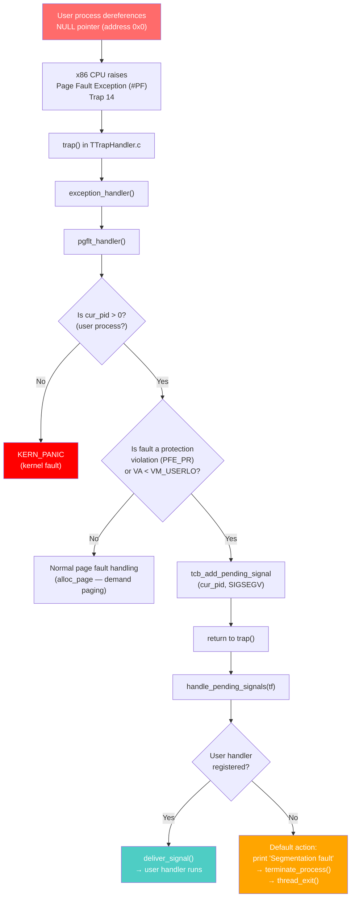
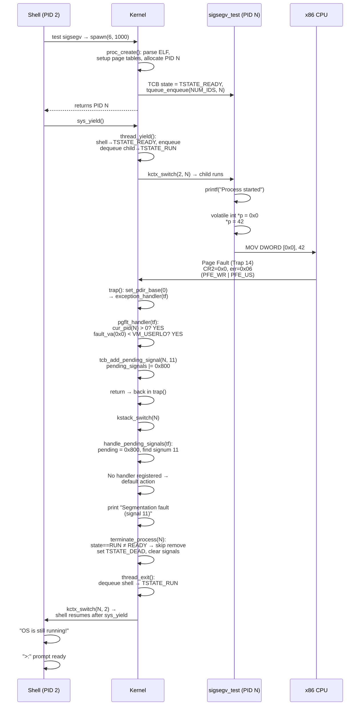

# SIGSEGV Implementation in CertiKOS — Complete Technical Reference

## Table of Contents

- [Overview](#overview)
- [What is SIGSEGV?](#what-is-sigsegv)
- [Design Goals](#design-goals)
- [Prerequisites: Understanding the CertiKOS Kernel](#prerequisites-understanding-the-certikos-kernel)
  - [CertiKOS Memory Layout](#certikos-memory-layout)
  - [Thread States and TCB](#thread-states-and-tcb)
  - [The Ready Queue (Doubly-Linked List)](#the-ready-queue-doubly-linked-list)
  - [The Scheduler: Cooperative + Timer-Based](#the-scheduler-cooperative--timer-based)
  - [How ELF Binaries Are Loaded (No Filesystem)](#how-elf-binaries-are-loaded-no-filesystem)
- [Architecture Overview](#architecture-overview)
- [Implementation Details](#implementation-details)
  - [1. Page Fault Handler Modification](#1-page-fault-handler-modification)
  - [2. Signal Pending Bitmask](#2-signal-pending-bitmask)
  - [3. handle\_pending\_signals() — The Dispatcher](#3-handle_pending_signals--the-dispatcher)
  - [4. deliver\_signal() — Trapframe Rewriting](#4-deliver_signal--trapframe-rewriting)
  - [5. terminate\_process() with Queue Guard](#5-terminate_process-with-queue-guard)
  - [6. thread\_exit() — Leave Without Re-Enqueueing](#6-thread_exit--leave-without-re-enqueueing)
  - [7. Test Process: sigsegv\_test](#7-test-process-sigsegv_test)
  - [8. Build System Integration](#8-build-system-integration)
  - [9. Shell Command: test sigsegv](#9-shell-command-test-sigsegv)
- [How It Works: End-to-End Flow](#how-it-works-end-to-end-flow)
- [Files Modified/Created](#files-modifiedcreated)
- [Bugs Encountered and Fixed](#bugs-encountered-and-fixed)
  - [Bug 1: Ready Queue Corruption (tqueue\_remove on RUNNING process)](#bug-1-ready-queue-corruption-tqueue_remove-on-running-process)
  - [Bug 2: Child Process Never Runs (No Yield in Kernel)](#bug-2-child-process-never-runs-no-yield-in-kernel)
- [Signal Delivery vs Direct Kill: Why Route Through Signals?](#signal-delivery-vs-direct-kill-why-route-through-signals)
- [The x86 Page Fault Mechanism in Detail](#the-x86-page-fault-mechanism-in-detail)
- [Demo Output](#demo-output)
- [Summary of Key Constants and Definitions](#summary-of-key-constants-and-definitions)

---

## Overview

SIGSEGV (Signal 11 — Segmentation Fault) is one of the most critical signals in POSIX operating systems. It is raised when a process performs an illegal memory access, such as dereferencing a NULL pointer or writing to a read-only page. In production operating systems like Linux, SIGSEGV terminates the faulting process gracefully without crashing the entire system.

**Before this implementation**, any page fault in CertiKOS — whether from a kernel bug or a simple user-space NULL pointer dereference — triggered a `KERN_PANIC`, halting the entire OS. A single buggy user program could bring down the whole system.

**After this implementation**, user-space segfaults are caught, converted to a SIGSEGV signal, and processed through the signal delivery pipeline. The faulting process is terminated cleanly, and the shell continues running.

---

## What is SIGSEGV?

| Property | Value |
|----------|-------|
| Signal Number | 11 |
| POSIX Name | `SIGSEGV` |
| Full Name | Segmentation Violation |
| Default Action | Terminate the process |
| Can Be Caught? | Yes (via `sigaction`) |
| Can Be Blocked? | Yes (but dangerous — redelivered immediately on return) |
| Common Triggers | NULL pointer dereference, stack overflow, writing to read-only memory |

---

## Design Goals

1. **Process isolation**: A user-space segfault must NOT crash the kernel
2. **Graceful termination**: The faulting process should be terminated with a descriptive message
3. **Signal infrastructure reuse**: Leverage the existing signal delivery pipeline (`tcb_add_pending_signal` → `handle_pending_signals` → `deliver_signal` / default action)
4. **User handler support**: Allow user processes to optionally register a SIGSEGV handler via `sigaction`
5. **Kernel faults untouched**: Kernel (PID 0) page faults still trigger `KERN_PANIC` as a safety measure

---

## Prerequisites: Understanding the CertiKOS Kernel

Before diving into the SIGSEGV implementation, it's essential to understand the kernel subsystems it interacts with.

### CertiKOS Memory Layout

CertiKOS uses a **split virtual address space** for x86 32-bit mode:

```
0xFFFFFFFF ┌─────────────────────────┐
           │                         │
           │   Kernel-mapped I/O     │
           │   (MMIO, LAPIC, etc.)   │
           │                         │
VM_USERHI  ├─────────────────────────┤  (typically 0xF0000000)
           │                         │
           │   User Process Memory   │
           │   - Code (.text)        │
           │   - Data (.data/.bss)   │
           │   - Heap                │
           │   - Stack (grows down)  │
           │                         │
VM_USERLO  ├─────────────────────────┤  (typically 0x40000000)
           │                         │
           │   Kernel-Reserved       │
           │   - Identity-mapped     │
           │   - Page tables         │
           │   - Kernel code/data    │
           │                         │
0x00000000 └─────────────────────────┘  ← NULL lives here
```

**Key insight**: Address `0x0` (NULL) is in the **kernel-reserved region** (below `VM_USERLO`). No user page table entries map there, so a NULL dereference by a user process triggers a page-not-present fault.

### Thread States and TCB

Every process/thread in CertiKOS has a **Thread Control Block (TCB)** stored in a global array `TCBPool[NUM_IDS]`. The TCB tracks the thread's state, queue linkage, open files, and signal state.

**File**: `kern/thread/PTCBIntro/PTCBIntro.c`

```c
struct TCB {
    t_state state;              // Current thread state
    unsigned int prev;          // Previous node in queue (doubly-linked list)
    unsigned int next;          // Next node in queue (doubly-linked list)
    void *channel;              // Sleep channel (for thread_sleep/wakeup)
    struct file *openfiles[NOFILE];  // Open file descriptors
    struct inode *cwd;          // Current working directory inode
    struct sig_state sigstate;  // Signal handling state
};

struct TCB TCBPool[NUM_IDS];    // Global array of all TCBs
```

**Thread states** (from `kern/lib/thread.h`):

```c
typedef enum {
    TSTATE_READY = 0,   // In the ready queue, waiting to be scheduled
    TSTATE_RUN   = 1,   // Currently executing on a CPU
    TSTATE_SLEEP = 2,   // Sleeping on a wait channel (IPC, I/O, etc.)
    TSTATE_DEAD  = 3    // Terminated — slot can be reused
} t_state;
```

**State transitions during SIGSEGV handling:**

```
TSTATE_RUN  ──(terminate_process)──▶  TSTATE_DEAD
                                         │
                                    thread_exit()
                                         │
                                         ▼
                               Scheduler picks next
                               TSTATE_READY process
                               from ready queue
```

The **signal state** embedded in each TCB (from `kern/lib/signal.h`):

```c
struct sig_state {
    struct sigaction sigactions[NSIG];   // Handler table (32 signals max)
    uint32_t pending_signals;           // Bitmask of pending signals
    int signal_block_mask;              // Blocked signal mask
    uint32_t saved_esp_addr;            // For sigreturn context restore
    uint32_t saved_eip_addr;            // For sigreturn context restore
    int in_signal_handler;              // Reentrancy guard
};
```

**TCB initialization** (at system boot, for every PID slot):

```c
void tcb_init_at_id(unsigned int cpu_idx, unsigned int pid)
{
    TCBPool[pid].state = TSTATE_DEAD;
    TCBPool[pid].prev = NUM_IDS;
    TCBPool[pid].next = NUM_IDS;
    TCBPool[pid].channel = NULL;
    memset(TCBPool[pid].openfiles, 0, sizeof(TCBPool[pid].openfiles));
    TCBPool[pid].cwd = NULL;
    memset(&TCBPool[pid].sigstate, 0, sizeof(struct sig_state));
}
```

All TCBs start as `TSTATE_DEAD`. When `proc_create()` is called for a new process, it picks a dead slot, initializes it, sets the state to `TSTATE_READY`, and enqueues it into the ready queue.

### The Ready Queue (Doubly-Linked List)

CertiKOS uses a **doubly-linked list** implemented *within* the TCB array for its ready queue. There is no separate linked-list node allocation — the `prev` and `next` fields in each TCB serve as pointers (by PID, not by memory address).

**File**: `kern/thread/PTQueueIntro/PTQueueIntro.c`

```c
struct TQueue {
    unsigned int head;   // PID of the first thread in queue
    unsigned int tail;   // PID of the last thread in queue
};

// NUM_IDS + 1 queues per CPU:
//   Indices 0..NUM_IDS-1: sleep queues (one per process, for IPC)
//   Index NUM_IDS: the ready queue
struct TQueue TQueuePool[NUM_CPUS][NUM_IDS + 1];
```

The ready queue is at index `NUM_IDS` (the last queue). `NUM_IDS` (typically 64) also serves as the "NULL pointer" sentinel — when `head == NUM_IDS`, the queue is empty.

**Visual example of a 3-element ready queue:**

```
TQueuePool[0][NUM_IDS]:
  head = 2
  tail = 4

TCBPool[2]: prev=NUM_IDS, next=3     ← head
TCBPool[3]: prev=2,       next=4
TCBPool[4]: prev=3,       next=NUM_IDS  ← tail
```

**Enqueue** (add to tail — `kern/thread/PTQueueInit/PTQueueInit.c`):

```c
void tqueue_enqueue(unsigned int chid, unsigned int pid)
{
    unsigned int tail = tqueue_get_tail(chid);
    if (tail == NUM_IDS) {
        // Queue was empty — this becomes both head AND tail
        tcb_set_prev(pid, NUM_IDS);
        tcb_set_next(pid, NUM_IDS);
        tqueue_set_head(chid, pid);
        tqueue_set_tail(chid, pid);
    } else {
        // Append after current tail
        tcb_set_next(tail, pid);    // old tail → new node
        tcb_set_prev(pid, tail);    // new node ← old tail
        tcb_set_next(pid, NUM_IDS); // new node → NULL
        tqueue_set_tail(chid, pid); // update tail pointer
    }
}
```

**Dequeue** (remove from head):

```c
unsigned int tqueue_dequeue(unsigned int chid)
{
    unsigned int head = tqueue_get_head(chid);
    if (head != NUM_IDS) {
        unsigned int next = tcb_get_next(head);
        if (next == NUM_IDS) {
            // Only one element — queue becomes empty
            tqueue_set_head(chid, NUM_IDS);
            tqueue_set_tail(chid, NUM_IDS);
        } else {
            // More elements — advance head
            tcb_set_prev(next, NUM_IDS);
            tqueue_set_head(chid, next);
        }
        // Clean up dequeued node's links
        tcb_set_prev(head, NUM_IDS);
        tcb_set_next(head, NUM_IDS);
    }
    return head;  // Returns NUM_IDS if queue was empty
}
```

**Remove** (remove arbitrary element by PID):

```c
void tqueue_remove(unsigned int chid, unsigned int pid)
{
    unsigned int prev = tcb_get_prev(pid);
    unsigned int next = tcb_get_next(pid);

    if (prev == NUM_IDS) {
        if (next == NUM_IDS) {
            // DANGEROUS CASE: assumes pid is the only element
            // If pid is NOT in the queue, this WIPES the entire queue!
            tqueue_set_head(chid, NUM_IDS);
            tqueue_set_tail(chid, NUM_IDS);
        } else {
            // pid is the head — advance head to next
            tcb_set_prev(next, NUM_IDS);
            tqueue_set_head(chid, next);
        }
    } else {
        if (next == NUM_IDS) {
            // pid is the tail — move tail back to prev
            tcb_set_next(prev, NUM_IDS);
            tqueue_set_tail(chid, prev);
        } else {
            // pid is in the middle — splice it out
            if (prev != next)
                tcb_set_next(prev, next);
            tcb_set_prev(next, prev);
        }
    }
    tcb_set_prev(pid, NUM_IDS);
    tcb_set_next(pid, NUM_IDS);
}
```

> **CRITICAL BUG POTENTIAL**: `tqueue_remove` does NOT check whether `pid` is actually in the queue. If called on a RUNNING process (which has `prev = NUM_IDS, next = NUM_IDS` because it was dequeued by the scheduler), the `prev == NUM_IDS && next == NUM_IDS` branch fires and **clears the entire queue head & tail to NUM_IDS**. This is the root cause of [Bug 1](#bug-1-ready-queue-corruption-tqueue_remove-on-running-process).

### The Scheduler: Cooperative + Timer-Based

CertiKOS uses a **round-robin scheduler** with two scheduling triggers:

1. **Voluntary yield** — `thread_yield()` (cooperative)
2. **Timer-forced yield** — `sched_update()` via LAPIC timer interrupt

**File**: `kern/thread/PThread/PThread.c`

```c
// thread_yield: voluntarily give up the CPU
void thread_yield(void)
{
    spinlock_acquire(&sched_lk);

    unsigned int old_cur_pid = get_curid();
    tcb_set_state(old_cur_pid, TSTATE_READY);   // Mark current as ready
    tqueue_enqueue(NUM_IDS, old_cur_pid);        // Put back in ready queue

    unsigned int new_cur_pid = tqueue_dequeue(NUM_IDS);  // Pick next process
    tcb_set_state(new_cur_pid, TSTATE_RUN);              // Mark it as running
    set_curid(new_cur_pid);                              // Update current PID

    if (old_cur_pid != new_cur_pid) {
        spinlock_release(&sched_lk);
        kctx_switch(old_cur_pid, new_cur_pid);   // Actual context switch
    } else {
        spinlock_release(&sched_lk);             // Only thread — no switch needed
    }
}

// sched_update: called from timer interrupt handler every tick
void sched_update(void)
{
    spinlock_acquire(&sched_lk);
    sched_ticks[get_pcpu_idx()] += (1000 / LAPIC_TIMER_INTR_FREQ);
    if (sched_ticks[get_pcpu_idx()] > SCHED_SLICE) {  // SCHED_SLICE = 5ms
        sched_ticks[get_pcpu_idx()] = 0;
        spinlock_release(&sched_lk);
        thread_yield();         // Force a context switch
    } else {
        spinlock_release(&sched_lk);
    }
}
```

**How timer-based scheduling works:**

1. The LAPIC timer fires periodically (configured at boot)
2. The interrupt handler in `TTrapHandler.c` calls `timer_intr_handler()` → `sched_update()`
3. `sched_update()` accumulates ticks; when `SCHED_SLICE` (5ms) is exceeded, it calls `thread_yield()`
4. `thread_yield()` saves the current process, picks the next one from the ready queue, and context-switches

**Critical detail for SIGSEGV**: When running inside a syscall handler (kernel mode), timer interrupts still fire, but the kernel doesn't preempt the current code path mid-execution. The `sched_update` → `thread_yield` occurs, but it only switches contexts at the `kctx_switch` boundary. This means **a busy loop in kernel-mode syscall handling can starve other processes** unless explicit `thread_yield()` calls are inserted.

### How ELF Binaries Are Loaded (No Filesystem)

CertiKOS does **not** load programs from a filesystem. Instead, user ELF binaries are **compiled and linked directly into the kernel image** at build time.

The linker creates symbols pointing to the embedded ELF data:

```c
// In TSyscall.c:
extern uint8_t _binary___obj_user_sigsegv_test_sigsegv_test_start[];
```

The naming convention is: `_binary___` + path with `/` and `.` replaced by `_` + `_start`.

In `sys_spawn()`, an `elf_id` integer maps to the corresponding linker symbol:

```c
if (elf_id == 6) {
    elf_addr = _binary___obj_user_sigsegv_test_sigsegv_test_start;
}
```

The `Makefile.inc` for each user program adds its binary to `KERN_BINFILES`:

```makefile
KERN_BINFILES += $(USER_OBJDIR)/sigsegv_test/sigsegv_test
```

This causes the linker to embed the raw ELF binary into the kernel image using `objcopy`, creating the `_binary_..._start` symbol.

`proc_create(elf_addr, quota)` then:
1. Allocates a new PID (finds a `TSTATE_DEAD` slot in `TCBPool`)
2. Creates a page directory for the new process
3. Parses the ELF header at `elf_addr` and maps code/data segments into user address space (above `VM_USERLO`)
4. Sets up an initial kernel stack and user stack
5. Sets the process state to `TSTATE_READY` and enqueues it into the ready queue

---

## Architecture Overview



---

## Implementation Details

### 1. Page Fault Handler Modification

**File**: `kern/trap/TTrapHandler/TTrapHandler.c` — `pgflt_handler()`

The page fault handler is the entry point for SIGSEGV. The x86 CPU raises Trap 14 (Page Fault) whenever a memory access violation occurs. Two pieces of information are available:

1. **Error code** (`tf->err`): Pushed by the CPU onto the trap stack. Encodes *why* the fault happened.
2. **Faulting virtual address** (`CR2` register): The address the process tried to access.

**x86 Page Fault Error Code bits:**

| Bit | Name | Meaning when set (1) | Meaning when clear (0) |
|-----|------|---------------------|----------------------|
| 0 | `PFE_PR` (Present) | Protection violation on a **present** page | Page **not present** (not mapped) |
| 1 | `PFE_WR` (Write) | Fault caused by a **write** | Fault caused by a **read** |
| 2 | `PFE_US` (User) | Fault occurred in **user mode** | Fault occurred in **supervisor mode** |

**The implementation:**

```c
void pgflt_handler(tf_t *tf)
{
    unsigned int cur_pid;
    unsigned int errno;
    unsigned int fault_va;

    cur_pid = get_curid();
    errno = tf->err;
    fault_va = rcr2();  // x86 instruction: read CR2 register

    // --- SIGSEGV detection for user processes ---
    if (cur_pid > 0) {
        if ((errno & PFE_PR) || fault_va < VM_USERLO) {
            KERN_INFO("[SIGSEGV] Page fault in process %d: "
                      "va=0x%08x errno=0x%08x eip=0x%08x\n",
                      cur_pid, fault_va, errno, tf->eip);
            tcb_add_pending_signal(cur_pid, SIGSEGV);
            return;  // Return to trap(), which calls handle_pending_signals
        }
    }

    // --- Original code path ---
    if (errno & PFE_PR) {
        trap_dump(tf);
        KERN_PANIC("Permission denied: va = 0x%08x, errno = 0x%08x.\n",
                   fault_va, errno);
        return;
    }

    // Demand paging: allocate a new page for the faulting address
    if (alloc_page(cur_pid, fault_va, PTE_W | PTE_U | PTE_P) == MagicNumber)
        KERN_PANIC("Page allocation failed: va = 0x%08x, errno = 0x%08x.\n",
                   fault_va, errno);
}
```

**Decision logic explained in detail:**

We send SIGSEGV when **all** of these are true:
- `cur_pid > 0` — The fault is in a user process (not the kernel bootstrap at PID 0)
- AND either:
  - `errno & PFE_PR` — The page **exists** but access is not permitted (e.g., writing to a read-only page, user accessing a kernel-only page). This is a true protection violation.
  - `fault_va < VM_USERLO` — The address is in kernel-reserved space (0x0 to 0x3FFFFFFF). This catches NULL dereferences and any access to low memory. These addresses have no user-space page mappings, so they produce a page-not-present fault (`PFE_PR = 0`), which is why we can't rely solely on the `PFE_PR` check.

**Why the function returns instead of calling terminate_process directly:**

After setting the pending signal, we `return` to `trap()`. The `trap()` function then calls `handle_pending_signals(tf)` which processes the SIGSEGV through the standard signal pipeline. This allows:
- User-registered handlers to intercept SIGSEGV if desired
- Consistent signal processing for all signal types
- Proper trapframe state for `deliver_signal()` if a handler is registered

### 2. Signal Pending Bitmask

Signals are tracked as a **32-bit bitmask** in the TCB's `sig_state.pending_signals` field:

```
Bit:  31 30 29 ... 15 14 13 12 11 10 9  8  7  6  5  4  3  2  1  0
      └──────────────────────────────────────────────────────────────┘
               Each bit corresponds to a signal number
               Bit 11 = SIGSEGV, Bit 9 = SIGKILL, Bit 2 = SIGINT
```

**Accessor functions** (from `kern/thread/PTCBIntro/PTCBIntro.c`):

```c
void tcb_add_pending_signal(unsigned int pid, int signum)
{
    TCBPool[pid].sigstate.pending_signals |= (1 << signum);
}

void tcb_clear_pending_signal(unsigned int pid, int signum)
{
    TCBPool[pid].sigstate.pending_signals &= ~(1 << signum);
}

uint32_t tcb_get_pending_signals(unsigned int pid)
{
    return TCBPool[pid].sigstate.pending_signals;
}
```

When `tcb_add_pending_signal(cur_pid, SIGSEGV)` is called:
- `1 << 11` = `0x00000800`
- `pending_signals |= 0x00000800` → sets bit 11

**Important**: The bitmask means each signal type can only be pending **once**. If SIGSEGV is already pending and another SIGSEGV arrives, the second one is silently dropped. This is the standard POSIX behavior for "standard" (non-realtime) signals.

### 3. handle_pending_signals() — The Dispatcher

**File**: `kern/trap/TTrapHandler/TTrapHandler.c`

This function is called from `trap()` **after** the handler for the original trap has returned and **before** switching back to the user's page table. This ordering is critical:

```c
void trap(tf_t *tf)
{
    unsigned int cur_pid = get_curid();
    set_pdir_base(0);              // Switch to kernel page table

    // ... dispatch to pgflt_handler, syscall handler, etc ...

    kstack_switch(cur_pid);
    handle_pending_signals(tf);    // ← Check signals HERE (kernel PT active)
    set_pdir_base(cur_pid);        // Switch to user page table
    trap_return(tf);               // Return to user space via iret
}
```

**Why must handle_pending_signals run BEFORE set_pdir_base(cur_pid)?**

`deliver_signal()` writes data (trampoline code, signal number, return address) onto the user stack using `pt_copyout()`. This function needs to walk the user's page tables, which are stored in physical memory and accessed via identity-mapped virtual addresses in the **kernel's** page directory (PD 0). If we switched to the user's page directory first, the kernel's identity-mapped addresses might not be accessible, and `pt_copyout` would fail or corrupt memory.

**The dispatcher logic:**

```c
static void handle_pending_signals(tf_t *tf)
{
    unsigned int cur_pid = get_curid();
    uint32_t pending_signals = tcb_get_pending_signals(cur_pid);

    if (pending_signals != 0) {
        // Scan from signal 1 to NSIG-1 (signal 0 is unused — POSIX convention)
        for (int signum = 1; signum < NSIG; signum++) {
            if (pending_signals & (1 << signum)) {
                // Clear the pending bit BEFORE processing
                tcb_clear_pending_signal(cur_pid, signum);

                // SIGKILL is special: uncatchable, always terminates
                if (signum == SIGKILL) {
                    terminate_process(cur_pid);
                    thread_exit();
                    return;  // Never reached — thread_exit doesn't return
                }

                // Check if user registered a handler via sigaction()
                struct sigaction *sa = tcb_get_sigaction(cur_pid, signum);
                if (sa != NULL && sa->sa_handler != NULL) {
                    deliver_signal(tf, signum);  // Redirect to user handler
                } else {
                    // Default action: terminate with descriptive message
                    const char *sig_name = "Unknown";
                    if (signum == SIGSEGV) sig_name = "Segmentation fault";
                    else if (signum == SIGINT) sig_name = "Interrupt";
                    else if (signum == SIGTERM) sig_name = "Terminated";
                    else if (signum == SIGABRT) sig_name = "Aborted";
                    else if (signum == SIGFPE) sig_name = "Floating point exception";
                    else if (signum == SIGILL) sig_name = "Illegal instruction";
                    else if (signum == SIGBUS) sig_name = "Bus error";

                    KERN_INFO("\n[Process %d] %s (signal %d)\n",
                              cur_pid, sig_name, signum);
                    terminate_process(cur_pid);
                    thread_exit();
                    return;  // Never reached
                }
                break;  // Process ONE signal at a time per trap return
            }
        }
    }
}
```

**For SIGSEGV with no user handler (the default case — our test scenario):**
1. Scans bitmask, finds bit 11 set
2. Clears bit 11 from `pending_signals`
3. Checks `tcb_get_sigaction(pid, 11)` → returns NULL (no handler registered)
4. Prints `[Process N] Segmentation fault (signal 11)`
5. Calls `terminate_process(cur_pid)` — marks process as `TSTATE_DEAD`
6. Calls `thread_exit()` — switches to the next runnable process
7. **Never returns** — execution continues in the next process

### 4. deliver_signal() — Trapframe Rewriting

If the user process had registered a SIGSEGV handler via `sigaction()`, `deliver_signal()` would modify the trapframe to redirect execution to that handler. This is NOT used in the default SIGSEGV case (where the process is terminated), but it's the path for user-caught signals.

**How it works:**

```c
static void deliver_signal(tf_t *tf, int signum)
{
    unsigned int cur_pid = get_curid();
    struct sigaction *sa = tcb_get_sigaction(cur_pid, signum);

    if (sa != NULL && sa->sa_handler != NULL) {
        uint32_t orig_esp = tf->esp;
        uint32_t orig_eip = tf->eip;
        uint32_t new_esp = orig_esp;

        // 1. Push saved_eip onto user stack (for sigreturn to restore)
        new_esp -= 4;
        pt_copyout(&orig_eip, cur_pid, new_esp, sizeof(uint32_t));
        uint32_t saved_eip_addr = new_esp;

        // 2. Push saved_esp onto user stack (for sigreturn to restore)
        new_esp -= 4;
        pt_copyout(&orig_esp, cur_pid, new_esp, sizeof(uint32_t));

        // 3. Push trampoline machine code (12 bytes)
        uint8_t trampoline[12] = {
            0xB8, SYS_sigreturn, 0x00, 0x00, 0x00,  // mov eax, SYS_sigreturn
            0xCD, 0x30,                              // int 0x30 (syscall)
            0xEB, 0xFE,                              // jmp $ (infinite loop safety)
            0x90, 0x90, 0x90                         // nop padding to 12 bytes
        };
        new_esp -= 12;
        pt_copyout(trampoline, cur_pid, new_esp, 12);
        uint32_t trampoline_addr = new_esp;

        // 4. Align stack to 4 bytes
        new_esp = new_esp & ~3;

        // 5. Push signal number as function argument
        new_esp -= 4;
        uint32_t sig_arg = signum;
        pt_copyout(&sig_arg, cur_pid, new_esp, sizeof(uint32_t));

        // 6. Push return address (→ trampoline code)
        new_esp -= 4;
        pt_copyout(&trampoline_addr, cur_pid, new_esp, sizeof(uint32_t));

        // 7. Rewrite trapframe to redirect execution
        tf->esp = new_esp;
        tf->eip = (uint32_t)sa->sa_handler;

        // 8. Save context addresses in TCB for sys_sigreturn
        tcb_set_signal_context(cur_pid, saved_eip_addr - 4, saved_eip_addr);
    }
}
```

**Stack layout after deliver_signal:**

```
Higher addresses (original stack)
┌────────────────────────────────┐
│       Original stack data      │ ← original ESP (saved for sigreturn)
├────────────────────────────────┤
│     saved EIP (4 bytes)        │ ← sigreturn reads this to restore EIP
├────────────────────────────────┤
│     saved ESP (4 bytes)        │ ← sigreturn reads this to restore ESP
├────────────────────────────────┤
│   Trampoline code (12 bytes)   │ ← address stored as return addr below
│   B8 98 00 00 00  mov eax,152 │
│   CD 30           int 0x30    │    (syscall: sigreturn)
│   EB FE           jmp $       │    (safety net — never reached)
│   90 90 90        nop nop nop │
├────────────────────────────────┤
│    Signal number (4 bytes)     │ ← argument to handler function
├────────────────────────────────┤
│   Return address (4 bytes)     │ ← points to trampoline above
├────────────────────────────────┤
│                                │ ← new ESP (handler starts executing here)
Lower addresses
```

When `trap_return(tf)` executes with the modified trapframe, the CPU:
1. Loads `tf->eip` → starts executing the user's signal handler
2. The handler sees signal number as its argument (pushed on stack)
3. When the handler returns (`ret` instruction), it pops the return address → jumps to trampoline
4. Trampoline does `int 0x30` with `eax = SYS_sigreturn`
5. `sys_sigreturn()` in the kernel reads the saved ESP and EIP from the user stack
6. Restores `tf->esp` and `tf->eip` to their original values
7. `trap_return(tf)` sends the process back to exactly where it was before the signal

### 5. terminate_process() with Queue Guard

```c
static void terminate_process(unsigned int pid)
{
    KERN_INFO("[SIGNAL] Terminating process %d\n", pid);

    // CRITICAL: Only remove from ready queue if actually queued
    // A RUNNING process is NOT in the queue — it was dequeued when scheduled
    if (tcb_get_state(pid) == TSTATE_READY) {
        tqueue_remove(NUM_IDS, pid);
    }

    // Mark process as dead — will never be scheduled again
    tcb_set_state(pid, TSTATE_DEAD);

    // Clear all pending signals — dead processes don't need them
    tcb_set_pending_signals(pid, 0);

    KERN_INFO("[SIGNAL] Process %d terminated\n", pid);
}
```

**Why the `TSTATE_READY` guard is essential:**

When SIGSEGV is processed for the **currently running** process (which is always the case — the process that faulted is the one running), its state is `TSTATE_RUN`. It was **dequeued** from the ready queue when the scheduler started it via `tqueue_dequeue(NUM_IDS)` in `thread_yield()`. After dequeue, its `prev` and `next` pointers are both set to `NUM_IDS`.

If we called `tqueue_remove(NUM_IDS, pid)` on this RUNNING process:
- `prev == NUM_IDS && next == NUM_IDS` → `tqueue_remove` assumes it's the **only element** in the queue
- Sets `head = NUM_IDS, tail = NUM_IDS` → **entire ready queue is wiped**
- `thread_exit()` tries to dequeue the next process → gets `NUM_IDS` → **KERN_PANIC**

See [Bug 1](#bug-1-ready-queue-corruption-tqueue_remove-on-running-process) for the full story with diagrams.

### 6. thread_exit() — Leave Without Re-Enqueueing

```c
void thread_exit(void)
{
    spinlock_acquire(&sched_lk);

    unsigned int old_cur_pid = get_curid();
    // NOTE: Do NOT set state to READY or enqueue — process is being killed

    unsigned int new_cur_pid = tqueue_dequeue(NUM_IDS);
    if (new_cur_pid == NUM_IDS) {
        // No other runnable threads — catastrophic
        KERN_PANIC("thread_exit: no threads to switch to!\n");
    }

    tcb_set_state(new_cur_pid, TSTATE_RUN);
    set_curid(new_cur_pid);

    spinlock_release(&sched_lk);
    kctx_switch(old_cur_pid, new_cur_pid);
    // Code NEVER reaches here — old_cur_pid is dead
}
```

**Contrast with `thread_yield()` — this is a one-way switch:**

| Step | `thread_yield()` | `thread_exit()` |
|------|------------------|-----------------|
| Set old state to READY | ✅ Yes | ❌ No — process is dead |
| Enqueue old into ready queue | ✅ Yes | ❌ No — never scheduled again |
| Dequeue new from ready queue | ✅ Yes | ✅ Yes |
| Set new state to RUN | ✅ Yes | ✅ Yes |
| Context switch via kctx_switch | ✅ Yes | ✅ Yes |
| Old process runs again later | ✅ Yes | ❌ **Never** — it's TSTATE_DEAD |

`thread_exit()` discards the old process entirely. The new process resumes from wherever it last called `kctx_switch` (typically in `thread_yield`), unaware that the old process is gone.

### 7. Test Process: sigsegv_test

**File**: `user/sigsegv_test/sigsegv_test.c`

```c
#include <proc.h>
#include <stdio.h>
#include <syscall.h>
#include <x86.h>

int main(int argc, char **argv)
{
    printf("[sigsegv_test] Process started.\n");
    printf("[sigsegv_test] Attempting to dereference NULL pointer...\n");

    /* Intentionally trigger a segmentation fault by writing to address 0 */
    volatile int *bad_ptr = (volatile int *)0x0;
    *bad_ptr = 42;

    /* Should never reach here */
    printf("[sigsegv_test] ERROR: Should not reach this line!\n");
    return 0;
}
```

**Why `volatile`?** Without `volatile`, GCC's optimizer might realize the write to address 0 has no observable side effect (the value is never read) and eliminate it entirely. With `-O2` or higher, the compiled code might skip the dereference, and SIGSEGV would never trigger. `volatile` forces the compiler to emit the actual memory write instruction.

**What happens at the CPU level:**

The compiler generates something like:
```nasm
mov eax, 0              ; bad_ptr = (volatile int *)0x0
mov dword [eax], 42     ; *bad_ptr = 42
```

1. CPU executes `mov dword [eax], 42` — a write to virtual address `0x0`
2. MMU walks the page table: PDE index = `0x0 >> 22 = 0`, checks PDE[0]
3. No valid PTE exists for address `0x0` (it's in kernel-reserved space below `VM_USERLO`)
4. CPU raises **Trap 14** (Page Fault) with:
   - `CR2 = 0x00000000` (faulting virtual address — stored in the CR2 register)
   - Error code = `0x06` = `PFE_WR | PFE_US` (write access from user mode, page not present)
   - Note: `PFE_PR` is NOT set because the page doesn't exist at all
5. CPU pushes error code, EIP, CS, EFLAGS onto the kernel stack
6. CPU loads the Trap 14 handler address from the IDT (Interrupt Descriptor Table)
7. Execution transfers to the kernel's `trap()` function

### 8. Build System Integration

**Files created/modified:**

| File | Change |
|------|--------|
| `user/sigsegv_test/Makefile.inc` | Created — build rules, adds binary to `KERN_BINFILES` |
| `user/Makefile.inc` | Added `include` directive and `sigsegv_test` target |
| `kern/trap/TSyscall/TSyscall.c` | Added `extern` for linker symbol, `elf_id == 6` case in `sys_spawn` |

The `Makefile.inc` adds the compiled binary to `KERN_BINFILES`:

```makefile
KERN_BINFILES += $(USER_OBJDIR)/sigsegv_test/sigsegv_test
```

This tells the linker to embed the raw ELF binary into the kernel image, creating the `_binary___obj_user_sigsegv_test_sigsegv_test_start` symbol.

### 9. Shell Command: test sigsegv

**File**: `user/shell/shell.c` — `shell_test_signal()`

```c
if (strcmp(argv[1], "sigsegv") == 0) {
    printf("=== SIGSEGV Test ===\n");
    printf("Spawning process that will dereference a NULL pointer...\n");
    printf("Expected: process terminates with 'Segmentation fault'"
           " instead of kernel panic.\n\n");

    pid_t pid = spawn(6, 1000);  /* elf_id 6 = sigsegv_test, quota = 1000 pages */
    if (pid == -1) {
        printf("Failed to spawn sigsegv test process\n");
        return -1;
    }
    printf("Test process spawned (PID %d). It should crash gracefully.\n", pid);

    /* Yield CPU to let the spawned process run and fault */
    sys_yield();

    printf("\n=== OS is still running! Shell is alive. ===\n");
    return 0;
}
```

**Why `sys_yield()` after spawn?**

`spawn()` creates the child and places it in the ready queue (`TSTATE_READY`), but the shell still holds the CPU (`TSTATE_RUN`). Without yielding:
- The shell continues executing: prints the "spawned" message, prints "OS is still running"
- Only when the shell reaches `readline()` → `getchar()` → `thread_yield()` does the child get a turn
- By that time, the test output would be interleaved with the shell's prompt

With `sys_yield()`:
1. Shell → `TSTATE_READY`, enqueued
2. Child dequeued → `TSTATE_RUN`
3. Child executes, hits NULL dereference, gets SIGSEGV'd, terminates via `thread_exit()`
4. `thread_exit()` dequeues shell → `TSTATE_RUN`
5. Shell resumes after `sys_yield()`, prints "OS is still running!"

The output appears in the correct order.

---

## How It Works: End-to-End Flow



---

## Files Modified/Created

| File | Action | Purpose |
|------|--------|---------|
| `kern/trap/TTrapHandler/TTrapHandler.c` | Modified | Added SIGSEGV detection in `pgflt_handler()`, `handle_pending_signals()` dispatcher, `deliver_signal()` trapframe rewriter, `terminate_process()` with queue guard |
| `kern/trap/TSyscall/TSyscall.c` | Modified | Added `extern` for embedded ELF, `elf_id == 6` mapping in `sys_spawn()` |
| `kern/thread/PThread/PThread.c` | Modified | Added `thread_exit()` function — one-way context switch for terminated processes |
| `user/sigsegv_test/sigsegv_test.c` | Created | Test process that deliberately dereferences NULL |
| `user/sigsegv_test/Makefile.inc` | Created | Build rules, adds binary to `KERN_BINFILES` |
| `user/Makefile.inc` | Modified | Include sigsegv_test in the build and user target |
| `user/shell/shell.c` | Modified | Added `test sigsegv` command in `shell_test_signal()` |

---

## Bugs Encountered and Fixed

### Bug 1: Ready Queue Corruption (tqueue_remove on RUNNING process)

**Symptom**: After the SIGSEGV test process was terminated, the kernel panicked:
```
KERN_PANIC: thread_exit: no threads to switch to!
```

**Root Cause — A deep dive into the queue data structure:**

The initial `terminate_process()` called `tqueue_remove(NUM_IDS, pid)` unconditionally. But the process being terminated was the **currently running** one — it was executing when the page fault occurred.

**How a RUNNING process's queue linkage looks:**

When the scheduler runs a process via `thread_yield()` or `sched_update()`, it calls `tqueue_dequeue(NUM_IDS)` to pick the next process. After dequeue, the dequeued process's TCB has:
- `prev = NUM_IDS` (set by dequeue cleanup)
- `next = NUM_IDS` (set by dequeue cleanup)
- `state = TSTATE_RUN` (set by scheduler)

These `NUM_IDS` values are the **same** sentinel used to indicate an empty queue.

**What `tqueue_remove` does with these values:**

```c
void tqueue_remove(unsigned int chid, unsigned int pid)
{
    unsigned int prev = tcb_get_prev(pid);  // → NUM_IDS (not in queue!)
    unsigned int next = tcb_get_next(pid);  // → NUM_IDS (not in queue!)

    if (prev == NUM_IDS) {       // YES
        if (next == NUM_IDS) {   // YES
            // Assumes pid is the ONLY element in the queue
            tqueue_set_head(chid, NUM_IDS);  // ← WIPES HEAD!
            tqueue_set_tail(chid, NUM_IDS);  // ← WIPES TAIL!
        }
    }
    // ...
}
```

**It thinks the process is the sole element and empties the queue.**

**Visual representation:**

```
BEFORE tqueue_remove on RUNNING process PID 7:

Ready Queue (head=2, tail=4):
  [PID 2] ←→ [PID 3] ←→ [PID 4]
    ↑head                    ↑tail

Currently running (NOT in queue):
  [PID 7] (prev=NUM_IDS, next=NUM_IDS, state=TSTATE_RUN)

After tqueue_remove(NUM_IDS, 7):
  tqueue_remove reads prev=NUM_IDS, next=NUM_IDS
  → Enters "only element" branch
  → Sets head=NUM_IDS, tail=NUM_IDS

Ready Queue (head=NUM_IDS, tail=NUM_IDS):
  EMPTY!  ← But PIDs 2, 3, 4 are still TSTATE_READY!

  [PID 2], [PID 3], [PID 4] are ORPHANED — still linked together
  but unreachable from the queue head/tail.

thread_exit() → tqueue_dequeue(NUM_IDS) → returns NUM_IDS → KERN_PANIC!
```

**The Fix**: Guard `tqueue_remove` with a state check:

```c
if (tcb_get_state(pid) == TSTATE_READY) {
    tqueue_remove(NUM_IDS, pid);
}
```

A `TSTATE_RUN` process is **never** in the ready queue (it was dequeued when it started running), so we skip the dangerous removal entirely. Only `TSTATE_READY` processes (which are genuinely in the queue) get removed.

### Bug 2: Child Process Never Runs (No Yield in Kernel)

**Symptom**: After `spawn()`, the sigsegv_test process never printed anything. The shell returned to the prompt immediately, then the child ran and crashed interleaved with the next prompt.

**Root Cause**: The shell's original code after `spawn()` used a busy-wait delay:
```c
for (int i = 0; i < 500000; i++) ;  // Attempt to "wait"
```

This spins in user mode, but on fast virtual machines (QEMU), the loop completes in microseconds — before a timer interrupt has a chance to preempt the shell. The child sits in the ready queue the whole time.

**Fix**: Replaced with `sys_yield()`:
```c
sys_yield();  // Yield to let child run and complete
```

`sys_yield()` traps into the kernel and calls `thread_yield()`, which:
1. Moves the shell to `TSTATE_READY` and enqueues it
2. Dequeues the child → `TSTATE_RUN`
3. Context-switches to the child immediately

The child runs, faults, gets terminated, and `thread_exit()` switches back to the shell.

---

## Signal Delivery vs Direct Kill: Why Route Through Signals?

### Why not just terminate the process directly in `pgflt_handler`?

We *could* have called `terminate_process()` and `thread_exit()` right in the page fault handler. However, routing through the signal infrastructure provides several advantages:

1. **User handlers**: Programs can register a SIGSEGV handler via `sigaction()` for custom behavior:
   - JVMs catch SIGSEGV for null-pointer checks (faster than bounds checking)
   - Chrome's sandbox uses SIGSEGV for memory-mapped I/O emulation
   - Programs can log diagnostics before terminating
   - `longjmp` can recover from the fault entirely

2. **Consistency**: All process termination follows the same pipeline:
   ```
   [signal source] → tcb_add_pending_signal → handle_pending_signals
                                                  ↓
                                          deliver_signal (user handler)
                                                  OR
                                          terminate_process + thread_exit (default)
   ```
   SIGSEGV, SIGINT, SIGKILL, SIGTERM all flow through this path.

3. **POSIX compatibility**: Real operating systems deliver SIGSEGV as a signal. This implementation matches the expected POSIX semantics.

4. **Debuggability**: Every step is logged via `KERN_INFO`:
   ```
   [SIGSEGV] Page fault in process 7: va=0x00000000 errno=0x06 eip=0x4000009c
   [SIGNAL] Process 7 has pending signals: 0x800
   [SIGNAL] Processing signal 11 for process 7
   [Process 7] Segmentation fault (signal 11)
   [SIGNAL] Terminating process 7
   ```

### Why is PID 0 excluded?

PID 0 is the kernel/bootstrap context. A page fault in PID 0 indicates a bug in the kernel itself:
- NULL pointer dereference in kernel code
- Corrupted kernel page tables
- Kernel stack overflow

There's no user-space handler to invoke, the kernel's own data structures may be corrupted, and `KERN_PANIC` halts the system immediately for post-mortem debugging via serial output or QEMU monitor.

---

## The x86 Page Fault Mechanism in Detail

When the CPU executes `mov [eax], 42` where `eax = 0x0`:

1. **TLB lookup**: CPU checks the Translation Lookaside Buffer for virtual address `0x0`. TLB miss.

2. **Page table walk**: CPU reads the current page directory base from `CR3` and performs a hardware page table walk:
   - **PDE index** = `VA >> 22` = `0x0 >> 22` = 0 → reads PDE[0] from the page directory
   - If PDE Present bit = 0 → page fault (page table doesn't exist)
   - If PDE Present bit = 1 → PTE index = `(VA >> 12) & 0x3FF` = 0 → reads PTE[0] from the page table
   - If PTE Present bit = 0 → page fault (page not mapped)
   - In CertiKOS, address 0x0 has **no mapping** in any user process's page tables

3. **Exception generation**: CPU automatically:
   - Saves current `CS`, `EIP`, `EFLAGS` on the **kernel stack** (using the TSS's `SS0:ESP0`)
   - Pushes an **error code** encoding why the fault occurred
   - Stores the **faulting VA** in the `CR2` register
   - Vectors through **IDT entry 14** to the kernel's trap handler

4. **Error code for our case**: `0x06` broken down:
   - Bit 0 (`PFE_PR`) = 0: Page **not present** (no mapping at all)
   - Bit 1 (`PFE_WR`) = 1: The access was a **write** (`*bad_ptr = 42`)
   - Bit 2 (`PFE_US`) = 1: The access was from **user mode** (ring 3)

5. **CR2 access**: The kernel reads `CR2` using inline assembly:
   ```c
   static inline uint32_t rcr2(void) {
       uint32_t val;
       asm volatile("mov %%cr2, %0" : "=r" (val));
       return val;
   }
   ```

---

## Demo Output

### Without SIGSEGV handling (before implementation):
```
>:test sigsegv
=== SIGSEGV Test ===
[sigsegv_test] Process started.
[sigsegv_test] Attempting to dereference NULL pointer...
KERN_PANIC: Permission denied: va = 0x00000000, errno = 0x00000006.
*** SYSTEM HALTED ***
```
The entire OS stops. The shell is gone. Must hard-reboot the VM.

### With SIGSEGV handling (after implementation):
```
>:test sigsegv
=== SIGSEGV Test ===
Spawning process that will dereference a NULL pointer...
Expected: process terminates with 'Segmentation fault' instead of kernel panic.

Test process spawned (PID 7). It should crash gracefully.
[sigsegv_test] Process started.
[sigsegv_test] Attempting to dereference NULL pointer...
[SIGSEGV] Page fault in process 7: va=0x00000000 errno=0x00000006 eip=0x4000009c

[Process 7] Segmentation fault (signal 11)

=== OS is still running! Shell is alive. ===
>:
```
The faulting process is terminated. The shell continues. The OS is alive and accepting commands.

---

## Summary of Key Constants and Definitions

| Name | Value | Location | Purpose |
|------|-------|----------|---------|
| `SIGSEGV` | 11 | `kern/lib/signal.h` | Signal number for segmentation fault |
| `SIGKILL` | 9 | `kern/lib/signal.h` | Uncatchable kill signal |
| `SIGINT` | 2 | `kern/lib/signal.h` | Interrupt signal (Ctrl+C) |
| `NSIG` | 32 | `kern/lib/signal.h` | Maximum number of signals |
| `PFE_PR` | `0x1` | `kern/lib/pmap.h` | Page fault error: protection violation |
| `PFE_WR` | `0x2` | `kern/lib/pmap.h` | Page fault error: write access |
| `PFE_US` | `0x4` | `kern/lib/pmap.h` | Page fault error: user mode |
| `VM_USERLO` | `0x40000000` | `kern/lib/pmap.h` | Start of user virtual address space |
| `VM_USERHI` | `0xF0000000` | `kern/lib/pmap.h` | End of user virtual address space |
| `NUM_IDS` | 64 | (config) | Max concurrent processes; also queue-empty sentinel |
| `TSTATE_READY` | 0 | `kern/lib/thread.h` | Thread is in the ready queue |
| `TSTATE_RUN` | 1 | `kern/lib/thread.h` | Thread is currently executing on a CPU |
| `TSTATE_SLEEP` | 2 | `kern/lib/thread.h` | Thread is sleeping on a wait channel |
| `TSTATE_DEAD` | 3 | `kern/lib/thread.h` | Thread is terminated (slot reusable) |
| `SCHED_SLICE` | 5 | `kern/lib/thread.h` | Scheduling quantum in milliseconds |
| `SYS_sigreturn` | 152 (0x98) | `kern/lib/syscall.h` | Syscall number for signal context restore |
| `T_PGFLT` | 14 | (x86 standard) | Trap number for page fault exception |
| `elf_id` | 6 | `TSyscall.c` | ELF identifier for sigsegv_test binary |
